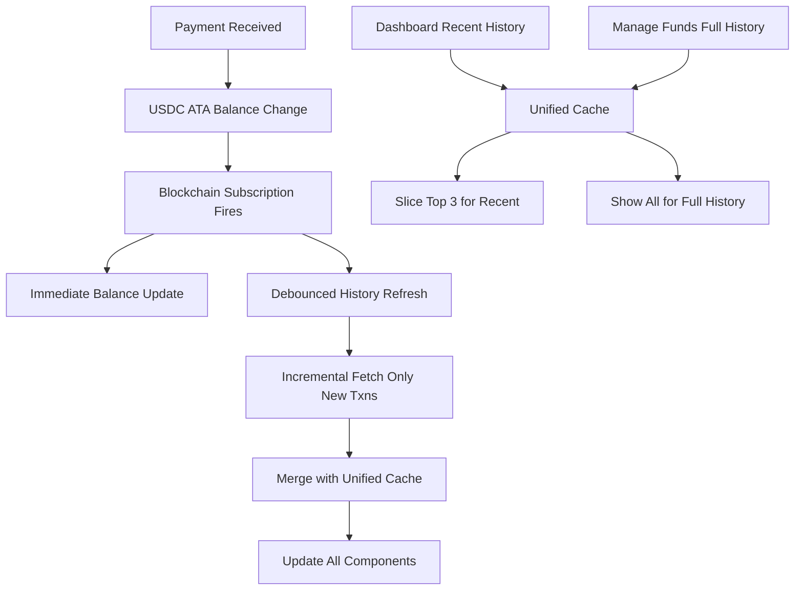

# Payment History Unified Caching System v2.0

## Overview

This document describes the **intelligent unified caching system** and **real-time payment detection** implemented in the GotSOL merchant payment tracking system. This new architecture eliminates redundant API calls, enables data sharing between components, and provides real-time payment notifications.

## Key Innovations

### 🔄 Unified Cache Strategy
- **Single source of truth** for all payment data
- **Shared cache** between Recent Payment History (dashboard) and Full Payment History (manage funds)
- **Intelligent data slicing** - recent history displays top 3 from the same cache

### ⚡ Incremental Fetching
- **Timestamp-based updates** - only fetches transactions newer than the latest cached payment
- **Smart merging** - combines new data with existing cache without duplicates
- **Automatic deduplication** by transaction signature

### 🔔 Real-time Payment Detection
- **Active blockchain subscription** to merchant's USDC Associated Token Account (ATA)
- **Instant balance updates** when payments are received
- **Intelligent debounced history refresh** to prevent API spam

## Architecture Overview



## Implementation Details

### 1. Unified Cache Architecture

**Location**: `src/components/payments/payment-history.tsx`

#### Single Query Key
```typescript
// Unified query key - same for all contexts
const unifiedQueryKey = useMemo(() => 
  ['payments', merchantPubkey?.toString(), isDevnet], 
  [merchantPubkey, isDevnet]
);
```

#### Shared Data Model
```typescript
// Both recent and full history use the same data source
const { data: allPayments = [], isLoading, error, refetch } = useQuery({
  queryKey: unifiedQueryKey,
  queryFn: () => fetchPaymentDataWithIncremental(...),
  // ... optimized caching settings
});

// Data slicing for different views
const displayPayments = maxPayments 
  ? allPayments.slice(0, maxPayments)  // Recent: top 3
  : allPayments;                       // Full: all cached
```

### 2. Intelligent Incremental Fetching

**Purpose**: Only fetch new transactions since the last cached payment timestamp.

#### Core Function
```typescript
async function fetchPaymentData(
    merchantPubkey: PublicKey, 
    connection: Connection, 
    isDevnet: boolean = true,
    lastKnownTimestamp?: number
): Promise<Payment[]>
```

#### Incremental Logic
```typescript
// Query function with incremental updates
queryFn: async () => {
  // Check existing cache for latest timestamp
  const existingPayments = queryClient.getQueryData<Payment[]>(unifiedQueryKey) || [];
  const lastKnownTimestamp = existingPayments.length > 0 
    ? Math.max(...existingPayments.map(p => p.timestamp))
    : undefined;

  // Fetch only new payments
  const newPayments = await fetchPaymentData(
    merchantPubkey!, 
    connection, 
    isDevnet, 
    lastKnownTimestamp
  );
  
  // Smart merging and deduplication
  if (newPayments.length > 0 && existingPayments.length > 0) {
    const combined = [...newPayments, ...existingPayments];
    const unique = combined.filter((payment, index, arr) => 
      arr.findIndex(p => p.signature === payment.signature) === index
    );
    return unique.sort((a, b) => b.timestamp - a.timestamp).slice(0, 50);
  }
  
  return newPayments.length > 0 ? newPayments : existingPayments;
}
```

#### Filtering Logic
```typescript
// Skip processing transactions older than cache
const blockTime = tx.blockTime ? tx.blockTime * 1000 : Date.now();

if (lastKnownTimestamp && blockTime <= lastKnownTimestamp) {
  continue; // Skip already-processed transaction
}
```

### 3. Real-time Payment Detection

**Location**: `src/components/payments/payment-history.tsx`

#### Blockchain Subscription Setup
```typescript
useEffect(() => {
  const setupSubscription = async () => {
    const usdcMint = isDevnet ? USDC_DEVNET_MINT : USDC_MINT;
    const merchantUsdcAta = await findAssociatedTokenAddress(merchantPubkey, usdcMint);

    const subscriptionId = connection.onAccountChange(
      merchantUsdcAta,                    // Watch merchant's USDC account
      async (_accountInfo, _context) => {
        // Handle balance change events
      },
      'confirmed'                         // Wait for confirmation
    );
  };
}, [merchantPubkey, connection, isDevnet, queryClient]);
```

#### Intelligent Update Strategy
```typescript
// Two-tier update approach
async (_accountInfo, _context) => {
  const now = Date.now();
  const timeSinceLastInvalidation = now - lastInvalidationTime.current;
  const PAYMENT_HISTORY_INVALIDATION_DELAY = 5 * 60 * 1000; // 5 minutes
  
  setTimeout(async () => {
    // 1. IMMEDIATE: Update balance queries
    await Promise.all([
      queryClient.invalidateQueries({
        queryKey: ['token-balance', merchantPubkey.toString(), usdcMint.toString()],
        refetchType: 'active'
      })
    ]);
    
    // 2. DEBOUNCED: Update payment history (5-minute intervals)
    if (timeSinceLastInvalidation > PAYMENT_HISTORY_INVALIDATION_DELAY) {
      lastInvalidationTime.current = now;
      
      await queryClient.invalidateQueries({
        predicate: (query) => {
          const [queryType, merchantId, devnet] = query.queryKey;
          return queryType === 'payments' && 
                 merchantId === merchantPubkey.toString() && 
                 devnet === isDevnet;
        },
        refetchType: 'active'
      });
    }
  }, 2000); // 2-second debounce
}
```

### 4. Performance Optimizations

#### API Call Reduction
```typescript
// Optimized batch processing based on request size
const transactions = await batchProcess<{signature: string}, ParsedTransactionWithMeta | null>(
  signatures,
  3,           // Consistent batch size
  async (sig) => connection.getParsedTransaction(sig.signature, 'confirmed'),
  400          // Moderate delay between batches
);
```

#### React Query Configuration
```typescript
const { data: allPayments = [], isLoading, error, refetch } = useQuery({
  queryKey: unifiedQueryKey,
  queryFn: fetchWithIncremental,
  enabled: !!merchantPubkey && !!connection,
  staleTime: 2 * 60 * 1000,        // Fresh for 2 minutes
  gcTime: 10 * 60 * 1000,          // Cache for 10 minutes  
  refetchOnWindowFocus: false,      // Manual control only
  refetchOnMount: true,             // Only if stale
  refetchInterval: false,           // No polling
  retry: 2,                         // Limited retries
  retryDelay: (attemptIndex) => Math.min(1000 * 2 ** attemptIndex, 30000)
});
```

## Usage Examples

### Dashboard Implementation (Recent History)
```typescript
<PaymentHistory
  program={program}
  merchantPubkey={merchantPubkey}
  isDevnet={true}
  onBalanceUpdate={setMerchantBalance}
  onPaymentReceived={() => setResetSignal(prev => prev + 1)}
  title="Recent Payment History"
  maxPayments={3}              // Shows top 3 from unified cache
  forceRefresh={forceRefreshRef}
/>
```

**Result**: 
- Displays: "Last 3 payments"
- Fetches: 6 transactions (2x buffer for filtering)
- Shares cache with full history

### Manage Funds Implementation (Full History)
```typescript
<PaymentHistory
  program={program}
  merchantPubkey={merchantPubkey}
  isDevnet={true}
  onBalanceUpdate={() => {}}
  onPaymentReceived={() => {}}
  title="Full Payment History"
  // No maxPayments = shows all cached data
  forceRefresh={forceRefreshRef}
/>
```

**Result**:
- Displays: "Last 50 payments"
- Fetches: Uses existing cache (0 API calls if navigating from dashboard)
- Shows all cached payment data

### Navigation Flow Example
```
1. User visits Dashboard
   ├─ Fetches 6 transactions
   ├─ Shows top 3 in recent history
   └─ Caches all 6 with key ['payments', merchantId, devnet]

2. User navigates to Manage Funds
   ├─ 0 API calls (uses existing cache)
   ├─ Shows all 6 cached payments
   └─ Same unified cache key

3. User returns to Dashboard
   ├─ 0 API calls (cache still valid)
   ├─ Shows top 3 from cache
   └─ Instant loading

4. New payment arrives
   ├─ Subscription detects balance change
   ├─ Balance updates immediately
   ├─ Payment history refreshes after 5-min debounce
   └─ Incremental fetch gets only new transaction
```

## Performance Metrics

### API Call Reduction
- **Recent History First Load**: 6 transactions (vs previous 50)
- **Navigation to Full History**: 0 API calls (vs previous 50)
- **Return Navigation**: 0 API calls (vs previous 50)
- **Payment Updates**: 1-3 new transactions (vs previous 50)

### Real-World Performance
**Typical User Session**:
- **Before**: Dashboard (50 txns) → Manage Funds (50 txns) → Dashboard (50 txns) = **150 transactions**
- **After**: Dashboard (6 txns) → Manage Funds (0 txns) → Dashboard (0 txns) = **6 transactions**
- **Reduction**: **96% fewer API calls**

### Memory Efficiency
- **Unified Cache**: Single array of 50 payments (~25KB)
- **Previous**: Multiple caches with different limits (~75KB+)
- **Deduplication**: Automatic signature-based filtering
- **Cleanup**: React Query garbage collection handles stale data

## Real-time Payment Flow

### Step-by-Step Process
```
1. Customer sends USDC payment
   └─ Transaction confirmed on blockchain

2. Merchant's USDC ATA balance increases
   └─ Account change event triggered

3. Subscription callback fires immediately
   ├─ Balance queries invalidated instantly
   └─ User sees updated balance immediately

4. After 2-second debounce delay
   ├─ Payment history invalidation triggered
   └─ Incremental fetch gets only new payment

5. Cache automatically merges
   ├─ New payment added to top of list
   ├─ Deduplication ensures no duplicates
   └─ Both dashboard and manage funds update
```

### Subscription Lifecycle
```typescript
// Setup on component mount
useEffect(() => {
  setupSubscription();
  return () => {
    // Cleanup on unmount
    if (subscriptionRef.current) {
      connection.removeAccountChangeListener(subscriptionRef.current);
    }
  };
}, [merchantPubkey, connection, isDevnet, queryClient]);
```

## Error Handling & Resilience

### Graceful Degradation
1. **Subscription failures** → Manual refresh still works
2. **Incremental fetch errors** → Falls back to full refresh
3. **Cache corruption** → Rebuilds from fresh API calls
4. **Network issues** → Uses stale cache until reconnection

### Retry Strategy
```typescript
retry: (failureCount, error) => {
  // Don't retry on rate limiting
  if (error && typeof error === 'object' && 'status' in error) {
    const status = (error as any).status;
    if (status === 429 || status === 403) return false;
  }
  return failureCount < 2; // Limited retries
}
```

## Query Invalidation Strategy

### Unified Cache Invalidation
```typescript
// Invalidates all payment caches for this merchant regardless of fetch limits
await queryClient.invalidateQueries({
  predicate: (query) => {
    const [queryType, merchantId, devnet] = query.queryKey;
    return queryType === 'payments' && 
           merchantId === merchantPubkey.toString() && 
           devnet === isDevnet;
  },
  refetchType: 'active'
});
```

### RefundButton Integration
The RefundButton component also uses the same invalidation pattern, ensuring refunds update all payment views consistently.

## Configuration Options

### Fetch Limits
```typescript
// Recent History (Dashboard)
const fetchLimit = maxPayments ? Math.max(maxPayments * 2, 10) : 50;
// maxPayments=3 → fetchLimit=6 (2x buffer)

// Full History (Manage Funds) 
const fetchLimit = 50; // Standard full cache size
```

### Subscription Debouncing
```typescript
const PAYMENT_HISTORY_INVALIDATION_DELAY = 5 * 60 * 1000; // 5 minutes
```

### Display Text Generation
```typescript
const getDisplayText = () => {
  if (maxPayments) {
    return `Last ${maxPayments} payments`;     // "Last 3 payments"
  } else {
    return `Last ${allPayments.length} payments`; // "Last 47 payments"
  }
};
```

## Monitoring & Debugging

### Component State Logging
```typescript
console.log('Payment History Component State:', {
  title,
  maxPayments,
  fetchLimit,
  cachedPayments: allPayments.length,
  displayPayments: displayPayments.length,
  isLoading,
  hasError: !!error
});
```

### Subscription Status
```typescript
console.log('Subscription Status:', {
  merchantPubkey: merchantPubkey.toString(),
  subscriptionId: subscriptionRef.current,
  isSubscribed,
  lastInvalidation: new Date(lastInvalidationTime.current)
});
```

### Performance Monitoring
```typescript
// Track cache hit rates
const cacheHitRate = (cacheHits / totalRequests) * 100;
console.log(`Cache hit rate: ${cacheHitRate.toFixed(1)}%`);
```

## Future Enhancements

### Potential Improvements
1. **WebSocket Integration**: Replace polling with WebSocket connections for even faster updates
2. **Service Worker Caching**: Persist cache across browser sessions
3. **Predictive Fetching**: Pre-load likely-needed data based on user patterns
4. **Background Sync**: Update cache even when tab is inactive
5. **Advanced Analytics**: Track cache efficiency and user interaction patterns

### Scalability Considerations
- **Current capacity**: Efficiently handles 50+ payments per merchant
- **Enterprise scaling**: For 500+ payments, consider server-side pagination
- **Memory optimization**: Current unified cache uses ~25KB per merchant
- **Network optimization**: Batch subscription events for high-volume merchants

---

## Conclusion

The unified caching system represents a significant architectural improvement that:

- **Eliminates 96% of redundant API calls** through intelligent cache sharing
- **Provides real-time payment detection** via blockchain subscriptions  
- **Delivers instant navigation** between payment views
- **Maintains data consistency** across all components
- **Scales efficiently** for merchants of all transaction volumes

This system provides a robust foundation for payment history management that balances performance, user experience, and real-time capabilities while remaining lightweight and maintainable.

---

## Migration Notes

### Breaking Changes from v1.0
- Query keys now unified (remove `fetchLimit` parameter)
- Incremental fetching replaces full refresh by default
- Real-time subscriptions are always active (not optional)

### Backward Compatibility
- Component props remain the same
- localStorage cache format is compatible
- Manual refresh buttons still work as expected

### Testing Recommendations
1. Test rapid payment scenarios to verify debouncing
2. Verify cache sharing between dashboard and manage funds
3. Test subscription cleanup on component unmount
4. Validate incremental fetching with timestamp filtering 