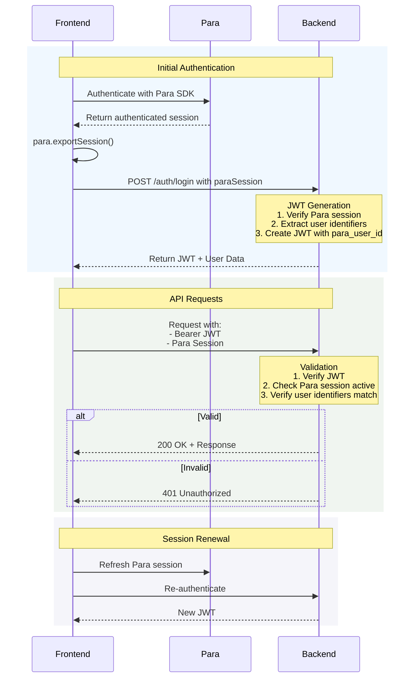

# Alchemy AccountKit
Source: https://docs.getpara.com/account-abstraction/alchemy-accountkit

Learn how to integrate Alchemy AccountKit with a Para Signer for smart account creation and UserOp management in your application.

export const CustomCard = ({imgUrl, iconUrl, fontAwesomeIcon, title, description, href, horizontal = false}) => {
  return <div className="relative group my-2" style={{
    padding: "1px",
    background: "#e5e7eb",
    borderRadius: "12px"
  }} onMouseOver={e => {
    e.currentTarget.style.background = "linear-gradient(45deg, #FF4E00, #874AE3)";
  }} onMouseOut={e => {
    e.currentTarget.style.background = "#e5e7eb";
  }}>
      <a href={href} className={`
          block not-prose font-normal h-full
          bg-white dark:bg-background-dark 
          overflow-hidden w-full cursor-pointer
          flex ${horizontal ? "flex-row" : "flex-col"}
        `} style={{
    borderRadius: "11px"
  }}>
        {(imgUrl || iconUrl) && <div className={`
              relative overflow-hidden flex-shrink-0
              ${horizontal ? "rounded-l" : ""}
              ${!imgUrl ? "bg-white dark:bg-background-dark p-4" : ""}
            `} style={{
    width: horizontal ? "30%" : "100%"
  }}>
            {imgUrl && }
            {(iconUrl || fontAwesomeIcon) && <div className={`
                ${imgUrl ? "absolute inset-0" : ""}
                flex items-center justify-center
              `}>
                <div className="relative w-8 h-8">
                  
                </div>
              </div>}
          </div>}
        <div className={`
            flex-grow px-6 py-5
            ${horizontal && (imgUrl || iconUrl) ? "flex flex-col justify-center" : ""}
          `} style={{
    width: horizontal ? "70%" : "100%"
  }}>
          {title && <h2 className="font-semibold text-base text-gray-800 dark:text-white">{title}</h2>}
          {description && <div className={`
              font-normal text-sm text-gray-600 dark:text-gray-400 leading-6
              ${horizontal || !imgUrl && !iconUrl ? "mt-0" : "mt-1"}
            `}>
              <p>{description}</p>
            </div>}
        </div>
      </a>
    </div>;
};

export const CustomLink = ({href, label}) => <a href={href} style={{
  display: "inline-block",
  position: "relative",
  color: "#000000",
  fontWeight: 600,
  cursor: "pointer",
  borderBottom: "none",
  textDecoration: "none"
}} onMouseEnter={e => {
  e.currentTarget.querySelector("#underline").style.height = "2px";
}} onMouseLeave={e => {
  e.currentTarget.querySelector("#underline").style.height = "1px";
}}>
    {label}
    <span id="underline" style={{
  position: "absolute",
  left: 0,
  bottom: 0,
  width: "100%",
  height: "1px",
  borderRadius: "2px",
  background: "linear-gradient(45deg, #FF4E00, #874AE3)",
  transition: "height 0.3s"
}}></span>

  </a>;

## Introduction

<CustomLink label="Account Kit" href="https://accountkit.alchemy.com/" /> enables smart account creation and management for every user in your application. Using Account Kit with Para, you can:

* Create and manage smart accounts directly in your app
* Submit gasless transactions using Alchemy's Gas Manager
* Execute batch transactions via UserOperations
* Handle transactions without requiring users to leave your application

## Prerequisites

Before you begin, ensure you have:

* A Para API key from the <CustomLink label="Para Developer Portal" href="https://developer.getpara.com" />
* An Alchemy API key from the <CustomLink label="Alchemy Dashboard" href="https://dashboard.alchemy.com" />
* Optional: An Alchemy Gas Policy ID for gasless transactions
* Already set up authentication with Para. See our
  <CustomLink label="Getting Started guides" href="/getting-started/initial-setup" /> for details.

<Info>
  For gasless transactions, you'll need to set up a Gas Manager Policy in your Alchemy Dashboard. This allows you to
  sponsor gas fees for your users' transactions.
</Info>

## Installation

<CodeGroup>
  ```bash npm
  npm install @alchemy/aa-alchemy @alchemy/aa-core viem
  ```

  ```bash yarn
  yarn add @alchemy/aa-alchemy @alchemy/aa-core viem
  ```

  ```bash pnpm
  pnpm add @alchemy/aa-alchemy @alchemy/aa-core viem
  ```

  ```bash bun
  bun add @alchemy/aa-alchemy @alchemy/aa-core viem
  ```
</CodeGroup>

## Setup

### 1. Create Para Viem Client

First, create a Viem client configured with your Para account:

```typescript
import { LocalAccount, WalletClient } from "viem";
import { sepolia } from "viem/chains";
import { http } from "viem";

const viemParaAccount: LocalAccount = createParaAccount(paraClient);
const viemClient: WalletClient = createParaViemClient(paraClient, {
  account: viemParaAccount,
  chain: sepolia,
  transport: http("https://ethereum-sepolia-rpc.publicnode.com"),
});
```

### 2. Implement Custom Sign Message

Due to MPC requirements, implement a custom sign message function to handle the signature's v value:

```typescript
async function customSignMessage(para: ParaServer, message: SignableMessage): Promise<Hash> {
  const hashedMessage = hashMessage(message);
  const res = await para.signMessage(Object.values(para.wallets!)[0]!.id, hexStringToBase64(hashedMessage));

  let signature = (res as SuccessfulSignatureRes).signature;

  // Fix the v value of the signature
  const lastByte = parseInt(signature.slice(-2), 16);
  if (lastByte < 27) {
    const adjustedV = (lastByte + 27).toString(16).padStart(2, "0");
    signature = signature.slice(0, -2) + adjustedV;
  }

  return `0x${signature}`;
}
```

### 3. Configure Viem Client with Custom Sign Message

Override the default signMessage method:

```typescript
viemClient.signMessage = async ({ message }: { message: SignableMessage }): Promise<Hash> => {
  return customSignMessage(paraClient, message);
};
```

### 4. Initialize Alchemy Client

Create the Alchemy client with your configuration:

```typescript
import { createModularAccountAlchemyClient } from "@alchemy/aa-alchemy";
import { WalletClientSigner } from "@alchemy/aa-core";

const walletClientSigner = new WalletClientSigner(viemClient, "para");

const alchemyClient = await createModularAccountAlchemyClient({
  apiKey: ALCHEMY_API_KEY,
  chain: arbitrumSepolia,
  signer: walletClientSigner,
  gasManagerConfig: {
    policyId: ALCHEMY_GAS_POLICY_ID, // Optional: for gasless transactions
  },
});
```

## Usage

### Creating UserOperations

UserOperations represent transaction intentions that will be executed by your smart account. Here's an example of
creating and executing a batch of UserOperations:

```typescript
import { encodeFunctionData } from "viem";
import { BatchUserOperationCallData, SendUserOperationResult } from "@alchemy/aa-core";

// Example contract ABI
const exampleAbi = [
  {
    inputs: [{ internalType: "uint256", name: "_x", type: "uint256" }],
    name: "changeX",
    outputs: [],
    stateMutability: "nonpayable",
    type: "function",
  },
];

// Create batch operations
const demoUserOperations: BatchUserOperationCallData = [1, 2, 3, 4, 5].map((x) => ({
  target: EXAMPLE_CONTRACT_ADDRESS,
  data: encodeFunctionData({
    abi: exampleAbi,
    functionName: "changeX",
    args: [x],
  }),
}));

// Execute the operations
const userOperationResult: SendUserOperationResult = await alchemyClient.sendUserOperation({
  uo: demoUserOperations,
});

// Optional: Wait for the operation to be included in a block
const txHash = await alchemyClient.waitForUserOperationTransaction({
  hash: userOperationResult.hash,
});
```

<Info>
  UserOperations are bundled together and executed in a single transaction, making them more gas-efficient than
  executing multiple separate transactions.
</Info>

### Handling Gas Management

When using Alchemy's Gas Manager, transactions can be executed without requiring users to have ETH in their account:

```typescript
// Configuration with gas management
const alchemyClientWithGas = await createModularAccountAlchemyClient({
  apiKey: ALCHEMY_API_KEY,
  chain: arbitrumSepolia,
  signer: walletClientSigner,
  gasManagerConfig: {
    policyId: ALCHEMY_GAS_POLICY_ID,
    entryPoint: "0x5FF137D4b0FDCD49DcA30c7CF57E578a026d2789", // Optional: custom entryPoint
  },
});

// Transactions will now be gasless for users
const gaslessOperation = await alchemyClientWithGas.sendUserOperation({
  uo: demoUserOperations,
});
```

## Error Handling

When working with UserOperations, handle potential errors appropriately:

```typescript
try {
  const result = await alchemyClient.sendUserOperation({
    uo: demoUserOperations,
  });

  // Wait for transaction confirmation
  const txHash = await alchemyClient.waitForUserOperationTransaction({
    hash: result.hash,
    timeout: 60000, // Optional: timeout in milliseconds
  });
} catch (error) {
  if (error.code === "USER_OPERATION_REVERTED") {
    console.error("UserOperation reverted:", error.message);
  } else if (error.code === "TIMEOUT") {
    console.error("Operation timed out:", error.message);
  } else {
    console.error("Unexpected error:", error);
  }
}
```

If you need access to Para or help getting set up, please refer to our quick start guide:

<CustomCard horizontal title="Getting Started" fontAwesomeIcon="https://mintlify.b-cdn.net/v6.6.0/regular/rocket.svg" imgUrl="/images/background-gradient.svg" href="/getting-started/initial-setup" description="Learn how to set up and use the Para SDK in your project" />


# Biconomy
Source: https://docs.getpara.com/account-abstraction/biconomy

Learn how to integrate Biconomy SDK with a Para Signer for Account Abstraction and smart account management in your application.

export const CustomCard = ({imgUrl, iconUrl, fontAwesomeIcon, title, description, href, horizontal = false}) => {
  return <div className="relative group my-2" style={{
    padding: "1px",
    background: "#e5e7eb",
    borderRadius: "12px"
  }} onMouseOver={e => {
    e.currentTarget.style.background = "linear-gradient(45deg, #FF4E00, #874AE3)";
  }} onMouseOut={e => {
    e.currentTarget.style.background = "#e5e7eb";
  }}>
      <a href={href} className={`
          block not-prose font-normal h-full
          bg-white dark:bg-background-dark 
          overflow-hidden w-full cursor-pointer
          flex ${horizontal ? "flex-row" : "flex-col"}
        `} style={{
    borderRadius: "11px"
  }}>
        {(imgUrl || iconUrl) && <div className={`
              relative overflow-hidden flex-shrink-0
              ${horizontal ? "rounded-l" : ""}
              ${!imgUrl ? "bg-white dark:bg-background-dark p-4" : ""}
            `} style={{
    width: horizontal ? "30%" : "100%"
  }}>
            {imgUrl && }
            {(iconUrl || fontAwesomeIcon) && <div className={`
                ${imgUrl ? "absolute inset-0" : ""}
                flex items-center justify-center
              `}>
                <div className="relative w-8 h-8">
                  
                </div>
              </div>}
          </div>}
        <div className={`
            flex-grow px-6 py-5
            ${horizontal && (imgUrl || iconUrl) ? "flex flex-col justify-center" : ""}
          `} style={{
    width: horizontal ? "70%" : "100%"
  }}>
          {title && <h2 className="font-semibold text-base text-gray-800 dark:text-white">{title}</h2>}
          {description && <div className={`
              font-normal text-sm text-gray-600 dark:text-gray-400 leading-6
              ${horizontal || !imgUrl && !iconUrl ? "mt-0" : "mt-1"}
            `}>
              <p>{description}</p>
            </div>}
        </div>
      </a>
    </div>;
};

export const CustomLink = ({href, label}) => <a href={href} style={{
  display: "inline-block",
  position: "relative",
  color: "#000000",
  fontWeight: 600,
  cursor: "pointer",
  borderBottom: "none",
  textDecoration: "none"
}} onMouseEnter={e => {
  e.currentTarget.querySelector("#underline").style.height = "2px";
}} onMouseLeave={e => {
  e.currentTarget.querySelector("#underline").style.height = "1px";
}}>
    {label}
    <span id="underline" style={{
  position: "absolute",
  left: 0,
  bottom: 0,
  width: "100%",
  height: "1px",
  borderRadius: "2px",
  background: "linear-gradient(45deg, #FF4E00, #874AE3)",
  transition: "height 0.3s"
}}></span>

  </a>;

## Introduction

The <CustomLink label="Biconomy" href="https://www.biconomy.io/" /> SDK is an Account Abstraction toolkit that enables
simple UX on your dApp, wallet or appchain. Built on top of the ERC 4337 solution for Account Abstraction, we offer a
full-stack solution for tapping into the power of our Smart Accounts Platform, Paymasters, and Bundlers.

## Getting Started

Get started with Biconomy at <CustomLink label="Biconomy Docs" href="https://docs.biconomy.io/" />

## Connecting Biconomy to a Para Signer

### Dependencies

You will need the following dependencies to create a Smart Account:

<CodeGroup>
  ```bash npm
  npm install @biconomy/account @biconomy/bundler @biconomy/common @biconomy/core-types @biconomy/modules @biconomy/paymaster @getpara/react-sdk ethers@5.7.2
  ```

  ```bash yarn
  yarn add @biconomy/account @biconomy/bundler @biconomy/common @biconomy/core-types @biconomy/modules @biconomy/paymaster @getpara/react-sdk ethers@5.7.2
  ```
</CodeGroup>

### Connecting Biconomy with Para

```tsx Biconomy Integration
// Biconomy Imports
import { IPaymaster, BiconomyPaymaster } from "@biconomy/paymaster";
import { IBundler, Bundler } from "@biconomy/bundler";
import { BiconomySmartAccountV2, DEFAULT_ENTRYPOINT_ADDRESS } from "@biconomy/account";
import { Wallet, providers, ethers } from "ethers";
import { ChainId } from "@biconomy/core-types";
import { ECDSAOwnershipValidationModule, DEFAULT_ECDSA_OWNERSHIP_MODULE } from "@biconomy/modules";

CHAIN = ChainId.POLYGON_MUMBAI; // or any supported chain of your choice

// Set up instances of Bundler and Paymaster.
// Alternatively you can also use the Multi chain Module this way.
const bundler: IBundler = new Bundler({
  // get from biconomy dashboard https://dashboard.biconomy.io/
  bundlerUrl: "",
  chainId: CHAIN,
  entryPointAddress: DEFAULT_ENTRYPOINT_ADDRESS,
});

const paymaster: IPaymaster = new BiconomyPaymaster({
  // get from biconomy dashboard https://dashboard.biconomy.io/
  paymasterUrl: "",
});

// create para ethers signer
const provider = new ethers.JsonRpcProvider(CHAIN_PROVIDER, CHAIN);

const signer = new ParaEthersSigner(para, provider);

// create the biconomy smart account with a para ethers signer
const connect = async () => {
  try {
    const module = await ECDSAOwnershipValidationModule.create({
      signer: signer,
      moduleAddress: DEFAULT_ECDSA_OWNERSHIP_MODULE,
    });

    let biconomySmartAccount = await BiconomySmartAccountV2.create({
      chainId: ChainId.POLYGON_MUMBAI,
      bundler: bundler,
      paymaster: paymaster,
      entryPointAddress: DEFAULT_ENTRYPOINT_ADDRESS,
      defaultValidationModule: module,
      activeValidationModule: module,
    });

    const address = await biconomySmartAccount.getAccountAddress();
  } catch (error) {
    console.error(error);
  }
};
```

<Note>
  For simplicity, Para imports are not included in the above example. It is assumed that the Para object has been
  instantiated and the user has created a wallet.
</Note>

If you need access to Para or help getting set up, please refer to our quick start guide:

<CustomCard horizontal title="Getting Started" fontAwesomeIcon="https://mintlify.b-cdn.net/v6.6.0/regular/rocket.svg" imgUrl="/images/background-gradient.svg" href="/getting-started/initial-setup" description="Learn how to set up and use the Para SDK in your project" />


# Overview
Source: https://docs.getpara.com/account-abstraction/overview

An introduction to account abstraction and available integrations with Para

export const CustomCard = ({imgUrl, iconUrl, fontAwesomeIcon, title, description, href, horizontal = false}) => {
  return <div className="relative group my-2" style={{
    padding: "1px",
    background: "#e5e7eb",
    borderRadius: "12px"
  }} onMouseOver={e => {
    e.currentTarget.style.background = "linear-gradient(45deg, #FF4E00, #874AE3)";
  }} onMouseOut={e => {
    e.currentTarget.style.background = "#e5e7eb";
  }}>
      <a href={href} className={`
          block not-prose font-normal h-full
          bg-white dark:bg-background-dark 
          overflow-hidden w-full cursor-pointer
          flex ${horizontal ? "flex-row" : "flex-col"}
        `} style={{
    borderRadius: "11px"
  }}>
        {(imgUrl || iconUrl) && <div className={`
              relative overflow-hidden flex-shrink-0
              ${horizontal ? "rounded-l" : ""}
              ${!imgUrl ? "bg-white dark:bg-background-dark p-4" : ""}
            `} style={{
    width: horizontal ? "30%" : "100%"
  }}>
            {imgUrl && }
            {(iconUrl || fontAwesomeIcon) && <div className={`
                ${imgUrl ? "absolute inset-0" : ""}
                flex items-center justify-center
              `}>
                <div className="relative w-8 h-8">
                  
                </div>
              </div>}
          </div>}
        <div className={`
            flex-grow px-6 py-5
            ${horizontal && (imgUrl || iconUrl) ? "flex flex-col justify-center" : ""}
          `} style={{
    width: horizontal ? "70%" : "100%"
  }}>
          {title && <h2 className="font-semibold text-base text-gray-800 dark:text-white">{title}</h2>}
          {description && <div className={`
              font-normal text-sm text-gray-600 dark:text-gray-400 leading-6
              ${horizontal || !imgUrl && !iconUrl ? "mt-0" : "mt-1"}
            `}>
              <p>{description}</p>
            </div>}
        </div>
      </a>
    </div>;
};

Account Abstraction (AA) is a groundbreaking technology in the blockchain space that aims to improve user experience and
enhance the functionality of blockchain applications. It allows for more flexible account types and transaction
handling, enabling features like gasless transactions, multi-signature wallets, transaction batching, and more.

Para supports integration with several leading Account Abstraction providers, allowing you to leverage the power of AA
in your applications using your provider of choice, all while maintaining the security and ease of use that Para offers.

## Available Integrations

Explore our guides for integrating Para with various Account Abstraction providers:

<CardGroup cols={2}>
  <CustomCard title="Alchemy AccountKit" imgUrl="/images/para-aa-alchemy-account-kit.png" href="/account-abstraction/alchemy-accountkit" description="Create smart accounts and enable gasless transactions with Alchemy's AccountKit." />

  <CustomCard title="Biconomy" imgUrl="/images/para-aa-biconomy.png" href="/account-abstraction/biconomy" description="Leverage Biconomy's Account Abstraction toolkit for enhanced UX in your dApp." />

  <CustomCard title="Stackup" imgUrl="/images/para-aa-stackup.png" href="/account-abstraction/stackup" description="Use Stackup's ERC-4337 transaction infrastructure for powerful account abstraction." />

  <CustomCard title="ZeroDev" imgUrl="/images/para-aa-zero-dev.png" href="/account-abstraction/zerodev" description="Implement ZeroDev's embedded AA wallet with features like gas sponsoring and session keys." />

  <CustomCard title="Pimlico" imgUrl="/images/para-aa-pimlico.png" href="/account-abstraction/pimlico" description="Integrate Pimlico's account abstraction infrastructure using permissionless.js." />

  <CustomCard title="SAFE" imgUrl="/images/para-initial-setup.png" href="/account-abstraction/safe" description="Create and manage multi-signature smart contract wallets with SAFE integration." />
</CardGroup>

## Why Use Account Abstraction?

Account Abstraction offers several benefits for both developers and end-users:

1. **Improved User Experience**: Simplify onboarding and transactions for users who may not be familiar with blockchain
   complexities.
2. **Gasless Transactions**: Allow users to interact with dApps without needing to hold native tokens for gas fees.
3. **Enhanced Security**: Implement features like multi-factor authentication and account recovery directly at the smart
   contract level.
4. **Flexible Transaction Logic**: Customize how transactions are initiated, signed, and executed to fit your
   application's needs.
5. **Programmable Accounts**: Create accounts with built-in rules and limitations, perfect for corporate or multi-user
   scenarios.

By integrating Account Abstraction with Para, you can offer these advanced features while maintaining the robust
security and key management that Para provides.

## Getting Started

To get started with Account Abstraction using Para, choose one of the integrations above and follow the guide. Each
integration offers unique features and capabilities, so consider your project's specific needs when selecting a
provider.

<Info>
  Regardless of which AA provider you choose, Para ensures that your users' private keys remain secure and under their
  control.
</Info>


# Pimlico
Source: https://docs.getpara.com/account-abstraction/pimlico

Learn how to integrate Pimlico's account abstraction infrastructure with a Para Signer using permissionless.js

export const CustomCard = ({imgUrl, iconUrl, fontAwesomeIcon, title, description, href, horizontal = false}) => {
  return <div className="relative group my-2" style={{
    padding: "1px",
    background: "#e5e7eb",
    borderRadius: "12px"
  }} onMouseOver={e => {
    e.currentTarget.style.background = "linear-gradient(45deg, #FF4E00, #874AE3)";
  }} onMouseOut={e => {
    e.currentTarget.style.background = "#e5e7eb";
  }}>
      <a href={href} className={`
          block not-prose font-normal h-full
          bg-white dark:bg-background-dark 
          overflow-hidden w-full cursor-pointer
          flex ${horizontal ? "flex-row" : "flex-col"}
        `} style={{
    borderRadius: "11px"
  }}>
        {(imgUrl || iconUrl) && <div className={`
              relative overflow-hidden flex-shrink-0
              ${horizontal ? "rounded-l" : ""}
              ${!imgUrl ? "bg-white dark:bg-background-dark p-4" : ""}
            `} style={{
    width: horizontal ? "30%" : "100%"
  }}>
            {imgUrl && }
            {(iconUrl || fontAwesomeIcon) && <div className={`
                ${imgUrl ? "absolute inset-0" : ""}
                flex items-center justify-center
              `}>
                <div className="relative w-8 h-8">
                  
                </div>
              </div>}
          </div>}
        <div className={`
            flex-grow px-6 py-5
            ${horizontal && (imgUrl || iconUrl) ? "flex flex-col justify-center" : ""}
          `} style={{
    width: horizontal ? "70%" : "100%"
  }}>
          {title && <h2 className="font-semibold text-base text-gray-800 dark:text-white">{title}</h2>}
          {description && <div className={`
              font-normal text-sm text-gray-600 dark:text-gray-400 leading-6
              ${horizontal || !imgUrl && !iconUrl ? "mt-0" : "mt-1"}
            `}>
              <p>{description}</p>
            </div>}
        </div>
      </a>
    </div>;
};

export const CustomLink = ({href, label}) => <a href={href} style={{
  display: "inline-block",
  position: "relative",
  color: "#000000",
  fontWeight: 600,
  cursor: "pointer",
  borderBottom: "none",
  textDecoration: "none"
}} onMouseEnter={e => {
  e.currentTarget.querySelector("#underline").style.height = "2px";
}} onMouseLeave={e => {
  e.currentTarget.querySelector("#underline").style.height = "1px";
}}>
    {label}
    <span id="underline" style={{
  position: "absolute",
  left: 0,
  bottom: 0,
  width: "100%",
  height: "1px",
  borderRadius: "2px",
  background: "linear-gradient(45deg, #FF4E00, #874AE3)",
  transition: "height 0.3s"
}}></span>

  </a>;

## Introduction

<CustomLink label="Pimlico" href="https://www.pimlico.io/" /> is an account abstraction infrastructure platform. Leverage Pimlico's paymasters and bundlers to create smart accounts
for your application. Pimlico's core product is permissionless.js which is a TypeScript library built on viem for building
with ERC-4337 smart accounts, bundlers, paymasters, and user operations. Permissionless.js focuses on having no dependencies,
maximum viem compatibility and a small bundle size. Permissionless.js also supports the major ERC-4337 smart accounts including
Safe, Kernel, Biconomy, and SimpleAccount.

## Getting Started

Get started with Permissionless.js by following

<CustomLink label="these steps" href="https://docs.pimlico.io/permissionless/tutorial/tutorial-1" />

. Follow these steps to create a <CustomLink label="Para signer" href="https://docs.getpara.com/integration-guide/signing-transactions" />
.

## Connecting Pimlico to a Para

After creating a Para signer, you will have access to a `ParaWeb3Provider` object that you can use to create a
`SmartAccountSigner` object

```tsx Pimlico Integration
import Para from "@getpara/web-sdk";
import { createParaViemClient } from "@getpara/viem-v2-integration";
import { walletClientToSmartAccountSigner } from "permissionless";
import { http } from "viem";
import { sepolia } from "viem/chains";

// Param options here will be specific to your project.  See the Para docs for more info.
const para = new Para(env, apiKey);

// Convert a Para viem client to a SmartAccountSigner
// Follow the Para docs for more instructions on creating the Viem client https://docs.getpara.com/integration-guide/signing-transactions
const viemClient = createParaViemClient(para, {
  chain: sepolia,
  transport: http("https://rpc.ankr.com/eth_sepolia"),
});

const smartAccountSigner = walletClientToSmartAccountSigner(viemClient);
```

## Use with permissionless.js

<Tabs>
  <Tab title="Simple Account">
    <CodeGroup>
      ```tsx Simple Account
      import { signerToSimpleSmartAccount } from "permissionless/accounts"
      import { createPublicClient, http } from "viem"
      import { generatePrivateKey, privateKeyToAccount } from "viem/accounts"
      import { sepolia } from "viem/chains"
       
      export const publicClient = createPublicClient({
      	transport: http("https://rpc.ankr.com/eth_sepolia"),
      	chain: sepolia,
      })
       
      const smartAccount = await signerToSimpleSmartAccount(publicClient, {
      	signer: smartAccountSigner,
      	factoryAddress: "0x9406Cc6185a346906296840746125a0E44976454",
      	entryPoint: ENTRYPOINT_ADDRESS_V06,
      })
      ```
    </CodeGroup>
  </Tab>

  <Tab title="Safe Account">
    <CodeGroup>
      ```tsx Safe Account
      import { signerToSafeSmartAccount } from "permissionless/accounts"
      import { createPublicClient, http } from "viem"
      import { generatePrivateKey, privateKeyToAccount } from "viem/accounts"
      import { sepolia } from "viem/chains"
       
      export const publicClient = createPublicClient({
      	transport: http("https://rpc.ankr.com/eth_sepolia"),
      	chain: sepolia,
      })
       
      const smartAccount = await signerToSafeSmartAccount(publicClient, {
      	signer: smartAccountSigner,
      	safeVersion: "1.4.1",
      	entryPoint: ENTRYPOINT_ADDRESS_V06,
      })
      ```
    </CodeGroup>
  </Tab>

  <Tab title="Kernel Account">
    <CodeGroup>
      ```tsx Kernel Account
      import { signerToEcdsaKernelSmartAccount } from "permissionless/accounts"
      import { createPublicClient, http } from "viem"
      import { generatePrivateKey, privateKeyToAccount } from "viem/accounts"
      import { sepolia } from "viem/chains"
       
      export const publicClient = createPublicClient({
      	transport: http("https://rpc.ankr.com/eth_sepolia"),
      	chain: sepolia,
      })
       
      const smartAccount = await signerToEcdsaKernelSmartAccount(publicClient, {
      	signer: smartAccountSigner,
      	entryPoint: ENTRYPOINT_ADDRESS_V06,
      })
      ```
    </CodeGroup>
  </Tab>

  <Tab title="Biconomy Account">
    <CodeGroup>
      ```tsx Biconomy Account
      import { signerToBiconomySmartAccount } from "permissionless/accounts"
      import { createPublicClient, http } from "viem"
      import { generatePrivateKey, privateKeyToAccount } from "viem/accounts"
      import { sepolia } from "viem/chains"
       
      export const publicClient = createPublicClient({
      	transport: http("https://rpc.ankr.com/eth_sepolia"),
      	chain: sepolia,
      })
       
      const smartAccount = await signerToBiconomySmartAccount(publicClient, {
      	signer: smartAccountSigner,
      	entryPoint: ENTRYPOINT_ADDRESS_V06,
      })
      ```
    </CodeGroup>
  </Tab>
</Tabs>

If you need access to Para or help getting set up, please refer to our quick start guide:

<CustomCard horizontal title="Getting Started" fontAwesomeIcon="https://mintlify.b-cdn.net/v6.6.0/regular/rocket.svg" imgUrl="/images/background-gradient.svg" href="/getting-started/initial-setup" description="Learn how to set up and use the Para SDK in your project" />


# Safe
Source: https://docs.getpara.com/account-abstraction/safe

Integrate Safe Smart Accounts with Para for enhanced wallet functionality

export const CustomLink = ({href, label}) => <a href={href} style={{
  display: "inline-block",
  position: "relative",
  color: "#000000",
  fontWeight: 600,
  cursor: "pointer",
  borderBottom: "none",
  textDecoration: "none"
}} onMouseEnter={e => {
  e.currentTarget.querySelector("#underline").style.height = "2px";
}} onMouseLeave={e => {
  e.currentTarget.querySelector("#underline").style.height = "1px";
}}>
    {label}
    <span id="underline" style={{
  position: "absolute",
  left: 0,
  bottom: 0,
  width: "100%",
  height: "1px",
  borderRadius: "2px",
  background: "linear-gradient(45deg, #FF4E00, #874AE3)",
  transition: "height 0.3s"
}}></span>

  </a>;

## Introduction

Safe Smart Accounts is a product by Safe (formerly Gnosis Safe) that enables the creation of ERC-4337-compatible smart
accounts for your users. This integration allows you to leverage the power of Account Abstraction and other Safe
features within your Para-powered application.

<Info>
  Safe Smart Accounts use the user's Externally Owned Account (EOA) as the smart account's signer. This builds upon the
  robust smart contract infrastructure that powers the widely-used Safe wallet.
</Info>

## Understanding EOAs and Smart Accounts

<Accordion title="What is an EOA?">
  An EOA (Externally Owned Account) is an Ethereum account controlled by a private key. Para's embedded wallets and most external wallets (like MetaMask or Coinbase Wallet) are EOAs.

  EOAs differ from contract accounts, which are controlled by smart contract code and don't have their own private key.
  Safe's smart wallet is a contract account, offering enhanced capabilities such as gas sponsorship and batched
  transactions.
</Accordion>

In this integration:

* The user's EOA (from Para) serves as the signer for their smart wallet (from Safe).
* The smart wallet (Safe) holds all assets and submits transactions to the network.
* The signer (Para) is responsible for producing signatures and initiating transaction flows.

## Integration Steps

To create Safe smart accounts for your users with Para, follow these steps:

<Steps>
  <Step title="Install Dependencies">
    First, install the necessary dependencies:

    <CodeGroup>
      ```bash npm
      npm install @getpara/viem-v2-integration viem @safe-global/protocol-kit @safe-global/api-kit @safe-global/safe-core-sdk-types
      ```

      ```bash yarn
      yarn add @getpara/viem-v2-integration viem @safe-global/protocol-kit @safe-global/api-kit @safe-global/safe-core-sdk-types
      ```
    </CodeGroup>
  </Step>

  <Step title="Import Required Modules">
    Import the necessary modules in your project:

    ```typescript
    import { createParaViemClient } from '@getpara/viem-v2-integration';
    import { http, createPublicClient } from 'viem';
    import { sepolia } from 'viem/chains';
    import Safe, { EthersAdapter } from '@safe-global/protocol-kit';
    import { SafeAccountConfig } from '@safe-global/safe-core-sdk-types';
    ```
  </Step>

  <Step title="Initialize Para VIEM Client">
    Set up the Para VIEM client:

    ```typescript
    const paraViemClient = createParaViemClient(para, {
      chain: sepolia, // Replace with your desired chain
      transport: http('https://rpc.sepolia.org'), // Replace with your RPC URL
    });
    ```
  </Step>

  <Step title="Create Safe Account Configuration">
    Define the configuration for the Safe account:

    ```typescript
    const safeAccountConfig: SafeAccountConfig = {
      owners: [await paraViemClient.account.address],
      threshold: 1,
    };
    ```
  </Step>

  <Step title="Initialize Safe SDK">
    Create an instance of the Safe SDK:

    ```typescript
    const ethAdapter = new EthersAdapter({
      ethers: paraViemClient,
      signerOrProvider: paraViemClient.account,
    });

    const safeSdk = await Safe.create({ ethAdapter, safeAccountConfig });
    ```
  </Step>

  <Step title="Deploy Safe Smart Account">
    Deploy the Safe smart account:

    ```typescript
    const safeAddress = await safeSdk.getAddress();
    const safeTransaction = await safeSdk.createTransaction({ safeTransactionData: [] });
    const safeTxHash = await safeSdk.getTransactionHash(safeTransaction);
    const senderSignature = await safeSdk.signTransactionHash(safeTxHash);
    await safeSdk.executeTransaction(safeTransaction, senderSignature);
    ```
  </Step>

  <Step title="Interact with the Safe Smart Account">
    Now you can interact with the Safe smart account using the Para VIEM client:

    ```typescript
    // Example: Send a transaction through the Safe smart account
    const transaction = await paraViemClient.sendTransaction({
      account: safeAddress,
      to: '0x...',  // Recipient address
      value: 1000000000000000000n,  // 1 ETH in wei
    });

    console.log('Transaction hash:', transaction);
    ```
  </Step>
</Steps>

## Conclusion

By integrating Safe Smart Accounts with Para, you've enhanced your application with Account Abstraction capabilities.
This setup allows for more flexible transaction handling, improved security, and advanced features like batched
transactions and gas sponsorship.

<Tip>
  Consider storing the user's smart account address in your application's state or database for easy access in future
  sessions.
</Tip>

For more advanced usage and detailed API references, refer to the

<CustomLink label="Safe Documentation" href="https://docs.safe.global/" />

.


# ZeroDev
Source: https://docs.getpara.com/account-abstraction/zerodev

Learn how to integrate ZeroDev's embedded AA wallet with Para Signer

export const CustomCard = ({imgUrl, iconUrl, fontAwesomeIcon, title, description, href, horizontal = false}) => {
  return <div className="relative group my-2" style={{
    padding: "1px",
    background: "#e5e7eb",
    borderRadius: "12px"
  }} onMouseOver={e => {
    e.currentTarget.style.background = "linear-gradient(45deg, #FF4E00, #874AE3)";
  }} onMouseOut={e => {
    e.currentTarget.style.background = "#e5e7eb";
  }}>
      <a href={href} className={`
          block not-prose font-normal h-full
          bg-white dark:bg-background-dark 
          overflow-hidden w-full cursor-pointer
          flex ${horizontal ? "flex-row" : "flex-col"}
        `} style={{
    borderRadius: "11px"
  }}>
        {(imgUrl || iconUrl) && <div className={`
              relative overflow-hidden flex-shrink-0
              ${horizontal ? "rounded-l" : ""}
              ${!imgUrl ? "bg-white dark:bg-background-dark p-4" : ""}
            `} style={{
    width: horizontal ? "30%" : "100%"
  }}>
            {imgUrl && }
            {(iconUrl || fontAwesomeIcon) && <div className={`
                ${imgUrl ? "absolute inset-0" : ""}
                flex items-center justify-center
              `}>
                <div className="relative w-8 h-8">
                  
                </div>
              </div>}
          </div>}
        <div className={`
            flex-grow px-6 py-5
            ${horizontal && (imgUrl || iconUrl) ? "flex flex-col justify-center" : ""}
          `} style={{
    width: horizontal ? "70%" : "100%"
  }}>
          {title && <h2 className="font-semibold text-base text-gray-800 dark:text-white">{title}</h2>}
          {description && <div className={`
              font-normal text-sm text-gray-600 dark:text-gray-400 leading-6
              ${horizontal || !imgUrl && !iconUrl ? "mt-0" : "mt-1"}
            `}>
              <p>{description}</p>
            </div>}
        </div>
      </a>
    </div>;
};

export const CustomLink = ({href, label}) => <a href={href} style={{
  display: "inline-block",
  position: "relative",
  color: "#000000",
  fontWeight: 600,
  cursor: "pointer",
  borderBottom: "none",
  textDecoration: "none"
}} onMouseEnter={e => {
  e.currentTarget.querySelector("#underline").style.height = "2px";
}} onMouseLeave={e => {
  e.currentTarget.querySelector("#underline").style.height = "1px";
}}>
    {label}
    <span id="underline" style={{
  position: "absolute",
  left: 0,
  bottom: 0,
  width: "100%",
  height: "1px",
  borderRadius: "2px",
  background: "linear-gradient(45deg, #FF4E00, #874AE3)",
  transition: "height 0.3s"
}}></span>

  </a>;

## Introduction

<CustomLink label="ZeroDev" href="https://docs.zerodev.app" /> is an embedded AA wallet, currently powering many AA wallets deployed on EVM chains. ZeroDev is known for its large AA feature set, including not just gas sponsoring, but also session keys, recovery, multisig, <CustomLink label="and more" href="https://docs.zerodev.app/sdk/advanced/chain-abstraction" />.

## Installation

Install the required packages:

<CodeGroup>
  ```bash npm
  npm install @zerodev/sdk @zerodev/sdk/paymaster para-xyz viem
  ```

  ```bash yarn
  yarn add @zerodev/sdk @zerodev/sdk/paymaster para-xyz viem
  ```

  ```bash bun
  bun add @zerodev/sdk @zerodev/sdk/paymaster para-xyz viem
  ```
</CodeGroup>

## Connecting ZeroDev to a Para Signer

<Steps>
  <Step title="Required Imports">
    Start by importing all the necessary packages:

    ```typescript
    // ZeroDev imports
    import { signerToEcdsaValidator } from "@zerodev/ecdsa-validator";
    import { createKernelAccount, createKernelAccountClient, createZeroDevPaymasterClient } from "@zerodev/sdk";
    import { getEntryPoint, KERNEL_V3_1 } from "@zerodev/sdk/constants";

    // Para imports
    // NOTE: These imports are available on web via the @getpara/web-sdk and or @getpara/react-sdk, but for Node.js or server-side environments, use the @getpara/server-sdk.
    import { Para as ParaServer, Environment, hexStringToBase64, SuccessfulSignatureRes } from "@getpara/server-sdk";
    import { createParaAccount, createParaViemClient } from "@getpara/viem-v2-integration";

    // Viem imports
    import { http, encodeFunctionData, hashMessage, SignableMessage, Hash, LocalAccount, WalletClient } from "viem";
    import { arbitrumSepolia } from "viem/chains";
    ```
  </Step>

  <Step title="Create a custom sign message function">
    When working with Para MPC and AA providers, we need a function to handle the V value in signatures so that transactions can be validated correctly. This is due to the way Para handles signatures in its multi-party computation (MPC) setup. Below is the implementation of the `customSignMessage` function:

    ```typescript
    // Helper function to convert hex to base64
    function hexStringToBase64(hexString: string): string {
      const bytes = new Uint8Array(hexString.length / 2);
      for (let i = 0; i < hexString.length; i += 2) {
        bytes[i / 2] = parseInt(hexString.substring(i, i + 2), 16);
      }
      return btoa(String.fromCharCode.apply(null, Array.from(bytes)));
    }

    // Custom sign message function for Para MPC
    async function customSignMessage(para: ParaServer, message: SignableMessage): Promise<Hash> {
      const wallet = para.wallets ? Object.values(para.wallets)[0] : null;
      
      const hashedMessage = hashMessage(message);
      const messagePayload = hashedMessage.startsWith("0x") ? hashedMessage.substring(2) : hashedMessage;
      const messageBase64 = hexStringToBase64(messagePayload);

      const res = await para.signMessage({
        walletId: wallet.id,
        messageBase64: messageBase64,
      });

      let signature = res.signature;

      // Adjust the last byte for the correct V value
      const vHex = signature.slice(-2);
      const v = parseInt(vHex, 16);
      if (!isNaN(v) && v < 27) {
        const adjustedVHex = (v + 27).toString(16).padStart(2, "0");
        signature = signature.slice(0, -2) + adjustedVHex;
      }

      return `0x${signature}`;
    }
    ```
  </Step>

  <Step title="Set up Para with Viem">
    Set up your Para account and Viem client:

    ```typescript
    // Create a Para Viem account
    const viemParaAccount: LocalAccount = createParaAccount(para);

    // Override the sign message function with our custom implementation
    viemParaAccount.signMessage = async ({ message }) => customSignMessage(para, message);

    // Create a Viem client with the Para account
    const viemClient: WalletClient = createParaViemClient(para, {
      account: viemParaAccount,
      chain: arbitrumSepolia,
      transport: http("https://sepolia-rollup.arbitrum.io/rpc"), // Replace with your RPC URL
    });
    ```

    <Warning>
      Ensure you override the `signMessage` method of the `LocalAccount` instance with the `customSignMessage` function. This is crucial for ensuring that the V value in the signature is handled correctly when sending transactions through ZeroDev.
    </Warning>
  </Step>

  <Step title="Set up ZeroDev kernel and validator">
    Configure the ZeroDev kernel account with the ECDSA validator:

    ```typescript
    // Set up kernel and validator configurations
    const entryPoint = getEntryPoint("0.7");
    const kernelVersion = KERNEL_V3_1;

    // Create ECDSA validator using your Para account
    const ecdsaValidator = await signerToEcdsaValidator(viemClient, {
      signer: viemParaAccount,
      entryPoint,
      kernelVersion,
    });

    // Create kernel account with the validator
    const account = await createKernelAccount(viemClient, {
      plugins: { sudo: ecdsaValidator },
      entryPoint,
      kernelVersion,
    });
    ```
  </Step>

  <Step title="Set up ZeroDev paymaster and kernel client">
    Create the paymaster and kernel client to handle transactions:

    <Note>
      For more information on setting up RPCs and managing your ZeroDev project, refer to the <CustomLink label="ZeroDev documentation" href="https://docs.zerodev.app/meta-infra/rpcs" />.
    </Note>

    ```typescript
    // Replace these with your ZeroDev RPC URLs from the ZeroDev Dashboard
    const bundlerRpc = "https://your-bundler-rpc-url.zerodev.app";
    const paymasterRpc = "https://your-paymaster-rpc-url.zerodev.app";

    // Set up ZeroDev paymaster
    const zerodevPaymaster = createZeroDevPaymasterClient({
      chain: arbitrumSepolia,
      transport: http(paymasterRpc),
    });

    // Create kernel account client with the paymaster
    const kernelClient = createKernelAccountClient({
      account,
      chain: arbitrumSepolia,
      bundlerTransport: http(bundlerRpc),
      paymaster: {
        getPaymasterData: (userOperation) => 
          zerodevPaymaster.sponsorUserOperation({ userOperation }),
      },
    });
    ```
  </Step>

  <Step title="Send transactions with the kernel client">
    Now you can use the kernel client to send user operations:

    ```typescript
    // Example of sending a transaction
    const hash = await kernelClient.sendUserOperation({
      userOperation: {
        callData: account.encodeCallData({
          to: "0xYourTargetAddress",  // Replace with your target address
          data: "0xYourFunctionData", // Replace with your function data
          value: 0n                   // Replace with your value if needed
        })
      }
    });

    // Wait for the transaction to be mined
    const transactionHash = await kernelClient.waitForUserOperationReceipt({ hash });
    console.log("Transaction mined:", transactionHash);
    ```
  </Step>
</Steps>

<Note>
  The examples above assume that you have already initialized the Para object and created a wallet. For more details on Para initialization, refer to the <CustomLink label="Para SDK documentation" href="/getting-started/initial-setup" />.
</Note>

## Example

For an example of using ZeroDev with Para Signer, you can refer to the following GitHub repository:

<CustomCard horizontal title="ZeroDev Example with Para Signer" fontAwesomeIcon="https://mintlify.b-cdn.net/v6.6.0/brands/github.svg" imgUrl="/images/background-gradient.svg" href="https://github.com/getpara/examples-hub/tree/main/server/with-node/examples/zerodev" description="NodeJS example of using ZeroDev with Para Signer" />


# Flutter
Source: https://docs.getpara.com/apis/flutter


## Para Class

The `Para` class provides a Flutter interface for the Para SDK, managing wallet operations, authentication, and
transactions.

### Properties

<ResponseField name="environment" type="Environment">
  The environment configuration for the Para SDK.
</ResponseField>

<ResponseField name="apiKey" type="String">
  The API key used for authentication with Para services.
</ResponseField>

<ResponseField name="jsBridgeUri" type="Uri?">
  Optional URI to override the default JavaScript bridge.
</ResponseField>

<ResponseField name="relyingPartyId" type="String?">
  The relying party ID for WebAuthn operations.
</ResponseField>

### Methods

<ResponseField name="Para()" type="Constructor">
  Constructs a new Para instance.

  <Expandable title="Parameters" defaultOpen="true">
    <ResponseField name="environment" type="Environment">
      The environment to use for the Para SDK.
    </ResponseField>

    <ResponseField name="apiKey" type="String">
      The API key for authentication.
    </ResponseField>

    <ResponseField name="jsBridgeUri" type="Uri?" optional>
      Optional URI to override the default JavaScript bridge.
    </ResponseField>

    <ResponseField name="relyingPartyId" type="String?" optional>
      The relying party ID for WebAuthn operations.
    </ResponseField>
  </Expandable>
</ResponseField>

<ResponseField name="init()" type="Function">
  Initializes the Para SDK. Call this method immediately after constructing an instance.
</ResponseField>

<ResponseField name="clearStorage()" type="Future<void>">
  Clears storage associated with the Para SDK.

  <Expandable title="Parameters" defaultOpen="true">
    <ResponseField name="keepSecretKey" type="bool">
      Whether to retain the Paillier secret key.
    </ResponseField>
  </Expandable>
</ResponseField>

<ResponseField name="setEmail()" type="Future<void>">
  Sets the email of the currently logged in user.

  <Expandable title="Parameters" defaultOpen="true">
    <ResponseField name="email" type="String">
      The email to set.
    </ResponseField>
  </Expandable>
</ResponseField>

<ResponseField name="getEmail()" type="Future<String?>">
  Gets the email of the currently logged in user, if one exists.
</ResponseField>

<ResponseField name="login()" type="Future<dynamic>">
  Logs in a user using passkeys.
</ResponseField>

<ResponseField name="generatePasskey()" type="Future<void>">
  Generates a passkey for the user.

  <Expandable title="Parameters" defaultOpen="true">
    <ResponseField name="email" type="String">
      The user's email.
    </ResponseField>

    <ResponseField name="biometricsId" type="String">
      The biometrics ID obtained from verification.
    </ResponseField>
  </Expandable>
</ResponseField>

<ResponseField name="checkIfUserExists()" type="Future<bool>">
  Determines if a user exists with the given email address.

  <Expandable title="Parameters" defaultOpen="true">
    <ResponseField name="email" type="String">
      The email to check.
    </ResponseField>
  </Expandable>
</ResponseField>

<ResponseField name="createUser()" type="Future<void>">
  Creates a new user with the given email address.

  <Expandable title="Parameters" defaultOpen="true">
    <ResponseField name="email" type="String">
      The email for the new user.
    </ResponseField>
  </Expandable>
</ResponseField>

<ResponseField name="verifyEmail()" type="Future<String>">
  Supplies email verification code obtained from prompting the user.

  <Expandable title="Parameters" defaultOpen="true">
    <ResponseField name="verificationCode" type="String">
      The verification code to verify.
    </ResponseField>
  </Expandable>
</ResponseField>

<ResponseField name="setup2FA()" type="Future<String>">
  Sets up two-factor authentication for the user.

  <Expandable title="Returns" defaultOpen="true">
    <ResponseField name="uri" type="String">
      The URI for setting up 2FA in an authenticator app.
    </ResponseField>
  </Expandable>
</ResponseField>

<ResponseField name="enable2FA()" type="Future<void>">
  Turns on two-factor authentication for the user.

  <Expandable title="Parameters" defaultOpen="true">
    <ResponseField name="verificationCode" type="String">
      The verification code for enabling 2FA.
    </ResponseField>
  </Expandable>
</ResponseField>

<ResponseField name="check2FAStatus()" type="Future<bool>">
  Checks if 2FA is enabled for the user.
</ResponseField>

<ResponseField name="createWallet()" type="Future<CreateWalletResult>">
  Creates a wallet for the user.

  <Expandable title="Parameters" defaultOpen="true">
    <ResponseField name="skipDistribute" type="bool">
      Whether to skip distributable wallet creation.
    </ResponseField>
  </Expandable>
</ResponseField>

<ResponseField name="signMessage()" type="Future<FullSignatureResult>">
  Signs a message using the specified wallet.

  <Expandable title="Parameters" defaultOpen="true">
    <ResponseField name="walletId" type="String">
      The ID of the wallet to use for signing.
    </ResponseField>

    <ResponseField name="messageBase64" type="String">
      The base64-encoded message to sign.
    </ResponseField>
  </Expandable>
</ResponseField>

<ResponseField name="signTransaction()" type="Future<FullSignatureResult>">
  Signs a transaction using the specified wallet.

  <Expandable title="Parameters" defaultOpen="true">
    <ResponseField name="walletId" type="String">
      The ID of the wallet to use for signing.
    </ResponseField>

    <ResponseField name="rlpEncodedTxBase64" type="String">
      The RLP encoded transaction in base64.
    </ResponseField>

    <ResponseField name="chainId" type="String">
      The chain ID of the network.
    </ResponseField>
  </Expandable>
</ResponseField>

<ResponseField name="sendTransaction()" type="Future<FullSignatureResult>">
  Sends a transaction using the specified wallet.

  <Expandable title="Parameters" defaultOpen="true">
    <ResponseField name="walletId" type="String">
      The ID of the wallet to use for sending.
    </ResponseField>

    <ResponseField name="rlpEncodedTxBase64" type="String">
      The RLP encoded transaction in base64.
    </ResponseField>

    <ResponseField name="chainId" type="String">
      The chain ID of the network.
    </ResponseField>
  </Expandable>
</ResponseField>

<ResponseField name="logout()" type="Future<void>">
  Logs the user out.
</ResponseField>

<ResponseField name="dispose()" type="void">
  Instructs the SDK to dispose of any resources that require explicit disposal.
</ResponseField>


# React Native & Expo
Source: https://docs.getpara.com/apis/react-native


## ParaMobile Class

The `ParaMobile` class represents a mobile implementation of the Para SDK, extending the `CorePara` class.

### Methods

<ResponseField name="constructor()" type="Function">
  Creates an instance of ParaMobile.

  <Expandable title="Parameters" defaultOpen="true">
    <ResponseField name="env" type="Environment">
      The environment to use (BETA or PROD).
    </ResponseField>

    <ResponseField name="apiKey" type="string" optional>
      The API key for authentication.
    </ResponseField>

    <ResponseField name="relyingPartyId" type="string" optional>
      The relying party ID for WebAuthn.
    </ResponseField>

    <ResponseField name="opts" type="ConstructorOpts" optional>
      Additional constructor options.
    </ResponseField>
  </Expandable>
</ResponseField>

<ResponseField name="verifyEmailBiometricsId()" type="Function">
  Verifies an email and returns the biometrics ID.

  <Expandable title="Parameters" defaultOpen="true">
    <ResponseField name="verificationCode" type="string">
      The verification code sent to the email.
    </ResponseField>
  </Expandable>

  <Expandable title="Returns" defaultOpen="true">
    <ResponseField name="biometricsId" type="Promise<string>">
      The biometrics ID.
    </ResponseField>
  </Expandable>
</ResponseField>

<ResponseField name="verifyPhoneBiometricsId()" type="Function">
  Verifies a phone number and returns the biometrics ID.

  <Expandable title="Parameters" defaultOpen="true">
    <ResponseField name="verificationCode" type="string">
      The verification code sent to the phone.
    </ResponseField>
  </Expandable>

  <Expandable title="Returns" defaultOpen="true">
    <ResponseField name="biometricsId" type="Promise<string>">
      The biometrics ID.
    </ResponseField>
  </Expandable>
</ResponseField>

<ResponseField name="registerPasskey()" type="Function">
  Registers a passkey for the user.

  <Expandable title="Parameters" defaultOpen="true">
    <ResponseField name="identifier" type="string">
      The user's email or phone number.
    </ResponseField>

    <ResponseField name="biometricsId" type="string">
      The biometrics ID obtained from verification.
    </ResponseField>

    <ResponseField name="crypto" type="webcrypto.Crypto">
      The Web Crypto API instance.
    </ResponseField>

    <ResponseField name="identifierType" type="'email' | 'phone'" default="'email'">
      The type of identifier used.
    </ResponseField>

    <ResponseField name="countryCode" type="CountryCallingCode" optional>
      The country calling code for phone numbers.
    </ResponseField>
  </Expandable>

  <Expandable title="Returns" defaultOpen="true">
    <ResponseField name="result" type="Promise<void>">
      A promise that resolves when the passkey is registered.
    </ResponseField>
  </Expandable>
</ResponseField>

<ResponseField name="login()" type="Function">
  Logs in the user using either email or phone number.

  <Expandable title="Parameters" defaultOpen="true">
    <ResponseField name="email" type="string" optional>
      The user's email address.
    </ResponseField>

    <ResponseField name="phone" type="string" optional>
      The user's phone number.
    </ResponseField>

    <ResponseField name="countryCode" type="CountryCallingCode" optional>
      The country calling code for phone numbers.
    </ResponseField>
  </Expandable>

  <Expandable title="Returns" defaultOpen="true">
    <ResponseField name="wallets" type="Promise<Wallet[]>">
      An array of user wallets.
    </ResponseField>
  </Expandable>

  <Expandable title="Throws" defaultOpen="true">
    <ResponseField name="error" type="Error">
      If neither email nor both phone and countryCode are provided.
    </ResponseField>
  </Expandable>
</ResponseField>


# Swift
Source: https://docs.getpara.com/apis/swift


## ParaManager Class

The `ParaManager` class provides a Swift interface for the Para SDK, managing wallet operations, authentication, and
transactions.

### Properties

<ResponseField name="wallet" type="Wallet?">
  The current wallet associated with the ParaManager.
</ResponseField>

<ResponseField name="sessionState" type="ParaSessionState">
  The current session state of the Para SDK.
</ResponseField>

<ResponseField name="environment" type="ParaEnvironment">
  The environment configuration for the Para SDK.
</ResponseField>

<ResponseField name="apiKey" type="String">
  The API key used for authentication with Para services.
</ResponseField>

<ResponseField name="webView" type="WKWebView">
  The WebKit view used for handling web-based operations.
</ResponseField>

### Methods

<ResponseField name="init(environment:apiKey:)" type="Function">
  Initializes a new ParaManager instance.

  <Expandable title="Parameters" defaultOpen="true">
    <ResponseField name="environment" type="ParaEnvironment">
      The environment to use for the Para SDK.
    </ResponseField>

    <ResponseField name="apiKey" type="String">
      The API key for authentication.
    </ResponseField>
  </Expandable>
</ResponseField>

<ResponseField name="initPara()" type="Function">
  Initializes the Para SDK within the WebView.
</ResponseField>

<ResponseField name="checkIfUserExists(email:)" type="Function">
  Checks if a user exists with the given email.

  <Expandable title="Parameters" defaultOpen="true">
    <ResponseField name="email" type="String">
      The email to check.
    </ResponseField>
  </Expandable>

  <Expandable title="Returns" defaultOpen="true">
    <ResponseField name="exists" type="Bool">
      Whether the user exists.
    </ResponseField>
  </Expandable>
</ResponseField>

<ResponseField name="createUser(email:)" type="Function">
  Creates a new user with the given email.

  <Expandable title="Parameters" defaultOpen="true">
    <ResponseField name="email" type="String">
      The email for the new user.
    </ResponseField>
  </Expandable>
</ResponseField>

<ResponseField name="login(authorizationController:)" type="Function">
  Logs in a user using passkeys.

  <Expandable title="Parameters" defaultOpen="true">
    <ResponseField name="authorizationController" type="AuthorizationController">
      The authorization controller for handling passkey operations.
    </ResponseField>
  </Expandable>
</ResponseField>

<ResponseField name="verify(verificationCode:)" type="Function">
  Verifies an email using a verification code.

  <Expandable title="Parameters" defaultOpen="true">
    <ResponseField name="verificationCode" type="String">
      The verification code sent to the user's email.
    </ResponseField>
  </Expandable>

  <Expandable title="Returns" defaultOpen="true">
    <ResponseField name="biometricsId" type="String">
      The biometrics ID associated with the verification.
    </ResponseField>
  </Expandable>
</ResponseField>

<ResponseField name="generatePasskey(email:biometricsId:authorizationController:)" type="Function">
  Generates a passkey for the user.

  <Expandable title="Parameters" defaultOpen="true">
    <ResponseField name="email" type="String">
      The user's email.
    </ResponseField>

    <ResponseField name="biometricsId" type="String">
      The biometrics ID obtained from verification.
    </ResponseField>

    <ResponseField name="authorizationController" type="AuthorizationController">
      The authorization controller for handling passkey operations.
    </ResponseField>
  </Expandable>
</ResponseField>

<ResponseField name="setup2FA()" type="Function">
  Sets up two-factor authentication for the user.

  <Expandable title="Returns" defaultOpen="true">
    <ResponseField name="uri" type="String">
      The URI for setting up 2FA in an authenticator app.
    </ResponseField>
  </Expandable>
</ResponseField>

<ResponseField name="enable2FA()" type="Function">
  Enables two-factor authentication for the user.
</ResponseField>

<ResponseField name="is2FASetup()" type="Function">
  Checks if 2FA is set up for the user.

  <Expandable title="Returns" defaultOpen="true">
    <ResponseField name="isSetup" type="Bool">
      Whether 2FA is set up.
    </ResponseField>
  </Expandable>
</ResponseField>

<ResponseField name="createWallet(skipDistributable:)" type="Function">
  Creates a new wallet for the user.

  <Expandable title="Parameters" defaultOpen="true">
    <ResponseField name="skipDistributable" type="Bool">
      Whether to skip distributable wallet creation.
    </ResponseField>
  </Expandable>
</ResponseField>

<ResponseField name="fetchWallets()" type="Function">
  Fetches all wallets associated with the user.

  <Expandable title="Returns" defaultOpen="true">
    <ResponseField name="wallets" type="[Wallet]">
      An array of user wallets.
    </ResponseField>
  </Expandable>
</ResponseField>

<ResponseField name="signMessage(walletId:message:)" type="Function">
  Signs a message using the specified wallet.

  <Expandable title="Parameters" defaultOpen="true">
    <ResponseField name="walletId" type="String">
      The ID of the wallet to use for signing.
    </ResponseField>

    <ResponseField name="message" type="String">
      The message to sign.
    </ResponseField>
  </Expandable>

  <Expandable title="Returns" defaultOpen="true">
    <ResponseField name="signature" type="String">
      The signed message.
    </ResponseField>
  </Expandable>
</ResponseField>

<ResponseField name="signTransaction(walletId:rlpEncodedTx:chainId:)" type="Function">
  Signs a transaction using the specified wallet.

  <Expandable title="Parameters" defaultOpen="true">
    <ResponseField name="walletId" type="String">
      The ID of the wallet to use for signing.
    </ResponseField>

    <ResponseField name="rlpEncodedTx" type="String">
      The RLP encoded transaction.
    </ResponseField>

    <ResponseField name="chainId" type="String">
      The chain ID of the network.
    </ResponseField>
  </Expandable>

  <Expandable title="Returns" defaultOpen="true">
    <ResponseField name="signature" type="String">
      The signed transaction.
    </ResponseField>
  </Expandable>
</ResponseField>

<ResponseField name="sendTransaction(walletId:rlpEncodedTx:chainId:)" type="Function">
  Sends a transaction using the specified wallet.

  <Expandable title="Parameters" defaultOpen="true">
    <ResponseField name="walletId" type="String">
      The ID of the wallet to use for sending.
    </ResponseField>

    <ResponseField name="rlpEncodedTx" type="String">
      The RLP encoded transaction.
    </ResponseField>

    <ResponseField name="chainId" type="String">
      The chain ID of the network.
    </ResponseField>
  </Expandable>

  <Expandable title="Returns" defaultOpen="true">
    <ResponseField name="signature" type="String">
      The transaction signature.
    </ResponseField>
  </Expandable>
</ResponseField>


# Web & React SDK APIs
Source: https://docs.getpara.com/apis/web-sdk


## CorePara Class

The `ParaCore` class provides the core Javascript implementation of the Para SDK, managing wallet operations,
authentication, and transactions.

### Properties

<ResponseField name="version" type="string | undefined">
  Static version of the CorePara class.
</ResponseField>

<ResponseField name="ctx" type="Ctx">
  Context object for the CorePara instance.
</ResponseField>

<ResponseField name="currentWalletIds" type="CurrentWalletIds">
  The IDs of the currently active wallets, for each supported wallet type.
</ResponseField>

<ResponseField name="wallets" type="Record<string, Wallet>">
  Wallets associated with the CorePara instance.
</ResponseField>

<ResponseField name="currentExternalWalletAddresses" type="string[] | undefined">
  The addresses of the currently active external wallets.
</ResponseField>

<ResponseField name="externalWallets" type="Record<string, Wallet>">
  External wallets associated with the CorePara instance.
</ResponseField>

<ResponseField name="isMultiWallet" type="boolean">
  Whether the instance has multiple wallets connected.
</ResponseField>

<ResponseField name="emailTheme" type="EmailTheme | undefined">
  Base theme for the emails sent from this Para instance.
</ResponseField>

<ResponseField name="emailPrimaryColor" type="string | undefined">
  Hex color to use as the primary color in the emails.
</ResponseField>

<ResponseField name="linkedinUrl" type="string | undefined">
  Linkedin URL to link to in the emails.
</ResponseField>

<ResponseField name="githubUrl" type="string | undefined">
  Github URL to link to in the emails.
</ResponseField>

<ResponseField name="xUrl" type="string | undefined">
  X (Twitter) URL to link to in the emails.
</ResponseField>

<ResponseField name="supportUrl" type="string | undefined">
  Support URL to link to in the emails.
</ResponseField>

<ResponseField name="homepageUrl" type="string | undefined">
  URL for your home landing page.
</ResponseField>

<ResponseField name="loginEncryptionKeyPair" type="pkiType.rsa.KeyPair | undefined">
  Encryption key pair generated from loginEncryptionKey.
</ResponseField>

<ResponseField name="portalTheme" type="Theme | undefined">
  Theme to use for the portal.
</ResponseField>

<ResponseField name="supportedWalletTypes" type="SupportedWalletTypes">
  Types of wallets supported by this CorePara instance.
</ResponseField>

### Methods

<ResponseField name="constructor()" type="Function">
  Constructs a new CorePara instance.

  <Expandable title="Parameters" defaultOpen="true">
    <ResponseField name="env" type="Environment">
      Environment to use.
    </ResponseField>

    <ResponseField name="apiKey" type="string">
      API key to use.
    </ResponseField>

    <ResponseField name="opts" type="ConstructorOpts">
      Additional constructor options.
    </ResponseField>
  </Expandable>
</ResponseField>

<ResponseField name="init()" type="Function">
  Initialize storage relating to a CorePara instance.
</ResponseField>

<ResponseField name="setEmail()" type="Function">
  Sets the email associated with the CorePara instance.

  <Expandable title="Parameters" defaultOpen="true">
    <ResponseField name="email" type="string">
      Email to set.
    </ResponseField>
  </Expandable>
</ResponseField>

<ResponseField name="setPhoneNumber()" type="Function">
  Sets the phone number associated with the CorePara instance.

  <Expandable title="Parameters" defaultOpen="true">
    <ResponseField name="phone" type="string">
      Phone number to set.
    </ResponseField>

    <ResponseField name="countryCode" type="CountryCallingCode">
      Country Code to set.
    </ResponseField>
  </Expandable>
</ResponseField>

<ResponseField name="createUser()" type="Function">
  Creates a new user.

  <Expandable title="Parameters" defaultOpen="true">
    <ResponseField name="email" type="string">
      Email to use for creating the user.
    </ResponseField>
  </Expandable>
</ResponseField>

<ResponseField name="verifyEmail()" type="Function">
  Passes the email code obtained from the user for verification.

  <Expandable title="Parameters" defaultOpen="true">
    <ResponseField name="verificationCode" type="string">
      Verification code to verify.
    </ResponseField>
  </Expandable>
</ResponseField>

<ResponseField name="isFullyLoggedIn()" type="Function">
  Checks if a session is active and a wallet exists.
</ResponseField>

<ResponseField name="createWalletPerType()" type="Function">
  Creates several new wallets with the desired types.

  <Expandable title="Parameters" defaultOpen="true">
    <ResponseField name="skipDistribute" type="boolean">
      If true, the wallets' recovery share will not be distributed.
    </ResponseField>

    <ResponseField name="types" type="WalletType[]">
      The types of wallets to create.
    </ResponseField>
  </Expandable>
</ResponseField>

<ResponseField name="signMessage()" type="Function">
  Signs a message.

  <Expandable title="Parameters" defaultOpen="true">
    <ResponseField name="walletId" type="string">
      ID of the wallet to sign with.
    </ResponseField>

    <ResponseField name="messageBase64" type="string">
      Base64 encoding of exact message that should be signed.
    </ResponseField>
  </Expandable>
</ResponseField>

<ResponseField name="signTransaction()" type="Function">
  Signs a transaction.

  <Expandable title="Parameters" defaultOpen="true">
    <ResponseField name="walletId" type="string">
      ID of the wallet to sign the transaction from.
    </ResponseField>

    <ResponseField name="rlpEncodedTxBase64" type="string">
      RLP encoded tx as base64 string.
    </ResponseField>

    <ResponseField name="chainId" type="string">
      Chain ID of the chain the transaction is being sent on.
    </ResponseField>
  </Expandable>
</ResponseField>

<ResponseField name="logout()" type="Function">
  Logs the user out.

  <Expandable title="Parameters" defaultOpen="true">
    <ResponseField name="preservePregenWallets" type="boolean">
      Preserves the stored pregen wallets in memory after the logout.
    </ResponseField>
  </Expandable>
</ResponseField>


# Cosmos Wallets
Source: https://docs.getpara.com/customize-para/external-wallets/cosmos-wallets

Learn how to combine the Para Modal with Cosmos wallets.

export const CustomCard = ({imgUrl, iconUrl, fontAwesomeIcon, title, description, href, horizontal = false}) => {
  return <div className="relative group my-2" style={{
    padding: "1px",
    background: "#e5e7eb",
    borderRadius: "12px"
  }} onMouseOver={e => {
    e.currentTarget.style.background = "linear-gradient(45deg, #FF4E00, #874AE3)";
  }} onMouseOut={e => {
    e.currentTarget.style.background = "#e5e7eb";
  }}>
      <a href={href} className={`
          block not-prose font-normal h-full
          bg-white dark:bg-background-dark 
          overflow-hidden w-full cursor-pointer
          flex ${horizontal ? "flex-row" : "flex-col"}
        `} style={{
    borderRadius: "11px"
  }}>
        {(imgUrl || iconUrl) && <div className={`
              relative overflow-hidden flex-shrink-0
              ${horizontal ? "rounded-l" : ""}
              ${!imgUrl ? "bg-white dark:bg-background-dark p-4" : ""}
            `} style={{
    width: horizontal ? "30%" : "100%"
  }}>
            {imgUrl && }
            {(iconUrl || fontAwesomeIcon) && <div className={`
                ${imgUrl ? "absolute inset-0" : ""}
                flex items-center justify-center
              `}>
                <div className="relative w-8 h-8">
                  
                </div>
              </div>}
          </div>}
        <div className={`
            flex-grow px-6 py-5
            ${horizontal && (imgUrl || iconUrl) ? "flex flex-col justify-center" : ""}
          `} style={{
    width: horizontal ? "70%" : "100%"
  }}>
          {title && <h2 className="font-semibold text-base text-gray-800 dark:text-white">{title}</h2>}
          {description && <div className={`
              font-normal text-sm text-gray-600 dark:text-gray-400 leading-6
              ${horizontal || !imgUrl && !iconUrl ? "mt-0" : "mt-1"}
            `}>
              <p>{description}</p>
            </div>}
        </div>
      </a>
    </div>;
};

export const CustomLink = ({href, label}) => <a href={href} style={{
  display: "inline-block",
  position: "relative",
  color: "#000000",
  fontWeight: 600,
  cursor: "pointer",
  borderBottom: "none",
  textDecoration: "none"
}} onMouseEnter={e => {
  e.currentTarget.querySelector("#underline").style.height = "2px";
}} onMouseLeave={e => {
  e.currentTarget.querySelector("#underline").style.height = "1px";
}}>
    {label}
    <span id="underline" style={{
  position: "absolute",
  left: 0,
  bottom: 0,
  width: "100%",
  height: "1px",
  borderRadius: "2px",
  background: "linear-gradient(45deg, #FF4E00, #874AE3)",
  transition: "height 0.3s"
}}></span>

  </a>;

<Frame>
  
</Frame>

This guide will walk you through the process of integrating Cosmos Wallets into your Para Modal and Para-enabled
application, allowing you to onboard new users and connect with existing users who may already have external wallets
like Keplr, Leap and more.

## Prerequisites

<Note>
  Before integrating wallet connections, ensure you have an existing Para project with the Para Modal set up. If you
  haven't set up Para yet, follow one of our Framework Setup guides like this <CustomLink label="React + Vite" href=" getting-started/initial-setup/react-vite" /> guide.
</Note>

### Setting up Cosmos Wallets

Para integrates with leading Cosmos wallets including <CustomLink label="Keplr" href="https://www.keplr.app/" /> and <CustomLink label="Leap" href="https://www.leapwallet.io" />. Our integration leverages a modified fork of the
<CustomLink label="graz" href="https://graz.sh" /> React library.

<Steps>
  <Step title="Install dependencies">
    Install the required packages alongside your existing Para dependencies:

    <CodeGroup>
      ```bash npm
      npm install @getpara/core-sdk @getpara/cosmos-wallet-connectors @getpara/graz @getpara/react-sdk @getpara/user-management-client @cosmjs/cosmwasm-stargate @cosmjs/launchpad @cosmjs/proto-signing @cosmjs/stargate @cosmjs/tendermint-rpc @leapwallet/cosmos-social-login-capsule-provider long starknet
      ```

      ```bash yarn
      yarn add @getpara/core-sdk @getpara/cosmos-wallet-connectors @getpara/graz @getpara/react-sdk @getpara/user-management-client @cosmjs/cosmwasm-stargate @cosmjs/launchpad @cosmjs/proto-signing @cosmjs/stargate @cosmjs/tendermint-rpc @leapwallet/cosmos-social-login-capsule-provider long starknet
      ```

      ```bash pnpm
      pnpm add @getpara/core-sdk @getpara/cosmos-wallet-connectors @getpara/graz @getpara/react-sdk @getpara/user-management-client @cosmjs/cosmwasm-stargate @cosmjs/launchpad @cosmjs/proto-signing @cosmjs/stargate @cosmjs/tendermint-rpc @leapwallet/cosmos-social-login-capsule-provider long starknet
      ```

      ```bash bun
      bun add @getpara/core-sdk @getpara/cosmos-wallet-connectors @getpara/graz @getpara/react-sdk @getpara/user-management-client @cosmjs/cosmwasm-stargate @cosmjs/launchpad @cosmjs/proto-signing @cosmjs/stargate @cosmjs/tendermint-rpc @leapwallet/cosmos-social-login-capsule-provider long starknet
      ```
    </CodeGroup>
  </Step>

  <Step title="Import components">
    Import the necessary wallet connectors and chain configurations:

    ```typescript main.tsx
    import { useState } from "react";
    import { ParaCosmosProvider, keplrWallet, leapWallet } from "@getpara/cosmos-wallet-connectors";
    import { cosmoshub, osmosis } from "@getpara/graz/chains";
    import { type ChainInfo } from "keplr-wallet/types";
    ```

    <Warning>
      If you encounter type issues with `@getpara/graz/chains`, you'll need to generate the chain files. You can:

      1. Add a postinstall script to your package.json:

      ```json
      {
        "scripts": {
          "postinstall": "graz --generate"
        }
      }
      ```

      2. Or run `npx graz --generate` manually after installation
    </Warning>
  </Step>

  <Step title="Configure chains">
    Set up your Cosmos chain configurations with the necessary RPC and REST endpoints. You can extend the existing chain configurations with your custom endpoints:

    ```typescript main.tsx
    const cosmosChains: ChainInfo[] = [
      {
        ...cosmoshub,
        rpc: "https://rpc.cosmos.directory/cosmoshub", // Replace with your RPC endpoint
        rest: "https://rest.cosmos.directory/cosmoshub", // Replace with your REST endpoint
      },
      {
        ...osmosis,
        rpc: "https://rpc.cosmos.directory/osmosis",
        rest: "https://rest.cosmos.directory/osmosis",
      },
    ];
    ```
  </Step>

  <Step title="Configure the provider">
    Similar to the Cosmos and Solana providers, configure the `ParaCosmosProvider` component by wrapping your application content in the `ParaCosmosProvider` component. Pass in the required configuration props:

    ```typescript main.tsx
    export const App = () => {
      const [chainId, setChainId] = useState<string>(cosmoshub.chainId);

      return (
        <ParaCosmosProvider
          chains={cosmosChains}
          wallets={[keplrWallet, leapWallet]}
          selectedChainId={chainId}
          onSwitchChain={(chainId) => {
            setChainId(chainId);
          }}
          multiChain
          walletConnect={{ options: { projectId: "..." } }}>
          {/* Your app content and existing ParaModal */}
        </ParaCosmosProvider>
      );
    };
    ```

    <Note>
      For the ParaCosmosProvider wrapping you don't need to include a QueryClientProvider as the provider already includes
      one.
    </Note>

    #### Provider Configuration

    <ResponseField name="ParaCosmosProvider" type="component" required>
      <Expandable title="props">
        <ResponseField name="chains" type="ChainInfo[]" required>
          Array of Cosmos chain configurations
        </ResponseField>

        <ResponseField name="wallets" type="WalletConnector[]" required>
          Array of wallet connectors to enable
        </ResponseField>

        <ResponseField name="selectedChainId" type="string" required>
          The currently selected chain ID
        </ResponseField>

        <ResponseField name="onSwitchChain" type="(chainId: string) => void" required>
          Callback function when user switches chains
        </ResponseField>

        <ResponseField name="multiChain" type="boolean">
          Enable multi-chain support. Defaults to false
        </ResponseField>

        <ResponseField name="walletConnect" type="object">
          <Expandable title="properties">
            <ResponseField name="options" type="object">
              <ResponseField name="projectId" type="string">
                Your WalletConnect project ID for additional connectivity options
              </ResponseField>
            </ResponseField>
          </Expandable>
        </ResponseField>
      </Expandable>
    </ResponseField>

    <Tip>
      The `ParaCosmosProvider` is built on top of

      <CustomLink label="graz's GrazProvider" href="https://graz.sh/docs/provider/grazProvider" />

      and supports all of its configuration options.
    </Tip>
  </Step>
</Steps>

## Advanced Provider Pattern

Setting up a dedicated provider component that encapsulates all the necessary providers and modal state management is
considered a best practice. This pattern makes it easier to manage the modal state globally and handle session
management throughout your application.

### Creating a Custom Provider

To create a custom provider, you can follow the example below. This provider will manage the modal state and handle
chain switching.

```tsx CosmosProvider.tsx
import { createContext, useContext, useState } from "react";
import { ParaCosmosProvider, keplrWallet, leapWallet } from "@getpara/cosmos-wallet-connectors";
import { cosmoshub, osmosis } from "@getpara/graz/chains";
import { ParaModal } from "@getpara/modal";
import { type ChainInfo } from "keplr-wallet/types";

const CosmosContext = createContext({
  openModal: () => {},
  closeModal: () => {},
  isOpen: false,
  chainId: "",
  setChainId: (chainId: string) => {},
});

export const useWeb3Modal = () => useContext(CosmosContext);

export const CosmosProvider = ({ children }) => {
  const [isOpen, setIsOpen] = useState(false);
  const [chainId, setChainId] = useState(cosmoshub.chainId);

  const openModal = () => setIsOpen(true);
  const closeModal = () => setIsOpen(false);

  const cosmosChains: ChainInfo[] = [
    {
      ...cosmoshub,
      rpc: "https://rpc.cosmos.directory/cosmoshub",
      rest: "https://rest.cosmos.directory/cosmoshub",
    },
    {
      ...osmosis,
      rpc: "https://rpc.cosmos.directory/osmosis",
      rest: "https://rest.cosmos.directory/osmosis",
    },
  ];

  return (
    <CosmosContext.Provider value={{ openModal, closeModal, isOpen, chainId, setChainId }}>
      <ParaCosmosProvider
        chains={cosmosChains}
        wallets={[keplrWallet, leapWallet]}
        selectedChainId={chainId}
        onSwitchChain={setChainId}
        multiChain>
        <ParaModal
          isOpen={isOpen}
          onClose={closeModal}
        />
        {children}
      </ParaCosmosProvider>
    </CosmosContext.Provider>
  );
};
```

### Server-Side Rendering Considerations

When using Next.js or other SSR frameworks, proper client-side initialization is crucial since web3 functionality relies
on browser APIs. There are two main approaches:

1. Using the `'use client'` directive in Next.js 13+:

   * Add the directive at the component level where browser APIs are needed
   * Ensures the CosmosProvider component and its dependencies only run on the client
   * Maintains better code splitting and page performance

2. Using dynamic imports:
   * Lazily loads the provider component
   * Automatically handles client-side only code
   * Provides fallback options during loading

## Configuring the Para Modal

After setting up your providers you need to configure the ParaModal component to display the external wallets and
authentication options to your users. You need to pass in the `externalWallets` and `authLayout` configuration options
to the ParaModal component to control which of the wallets show in the modal that were specified in the provider
configuration.

<Steps>
  <Step title="Set the modal props">
    ```typescript
    <ParaModal
     externalWallets={["KEPLR", "LEAP",...]}
     authLayout={["AUTH_FULL","EXTERNAL_FULL"]}
     theme={{
       mode: "light",
       foregroundColor: "#000000",
       backgroundColor: "#FFFFFF",
       accentColor: "#007AFF"
     }}
     logo={yourLogoUrl}
     appName="Your App Name"
      para={para}
    />
    ```

    #### Modal Props Config

    Modal prop options for customizing the Para Modal are included below. For advanced customization options, refer to <CustomLink label="Customization Guide" href="/customize-para/required-customization" />.

    <ResponseField name="ParaModalProps" type="component" required>
      <Expandable title="props">
        <ResponseField name="externalWallets" type="ExternalWallet[]" required>
          Array of supported external wallets to display in the modal
        </ResponseField>

        <ResponseField name="authLayout" type="AuthLayout[]" required>
          Defines the authentication layout style for social login and external wallets. Options are `AUTH_FULL`, `EXTERNAL_FULL`, `AUTH_CONDENSED`, and `EXTERNAL_CONDENSED`. Test the layout options in our <CustomLink label="Modal Designer" href="https://demo.getpara.com/" />
        </ResponseField>

        <ResponseField name="theme" type="object">
          <Expandable title="properties">
            <ResponseField name="mode" type="'light' | 'dark'">
              Color mode for the modal
            </ResponseField>

            <ResponseField name="foregroundColor" type="string">
              Primary text and content color (hex format)
            </ResponseField>

            <ResponseField name="backgroundColor" type="string">
              Modal background color (hex format)
            </ResponseField>

            <ResponseField name="accentColor" type="string">
              Highlight and button colors (hex format)
            </ResponseField>
          </Expandable>
        </ResponseField>

        <ResponseField name="logo" type="string">
          URL for your application logo
        </ResponseField>

        <ResponseField name="appName" type="string">
          Your application name displayed in the modal
        </ResponseField>

        <ResponseField name="para" type="ParaClient" required>
          Your initialized Para client instance
        </ResponseField>

        <ResponseField name="oAuthMethods" type="OAuthMethod[]">
          Array of supported OAuth authentication methods
        </ResponseField>

        <ResponseField name="disableEmailLogin" type="boolean">
          Disable email-based authentication
        </ResponseField>

        <ResponseField name="disablePhoneLogin" type="boolean">
          Disable phone-based authentication
        </ResponseField>

        <ResponseField name="recoverySecretStepEnabled" type="boolean">
          Enable the recovery secret step in the flow
        </ResponseField>

        <ResponseField name="onRampTestMode" type="boolean">
          Enable test mode for on-ramp features
        </ResponseField>
      </Expandable>
    </ResponseField>
  </Step>
</Steps>

## Examples

For an example of what the Para External Wallets Modal might look like in your application, check out our live demo:

<CustomCard horizontal title="Modal Designer" fontAwesomeIcon="https://mintlify.b-cdn.net/v6.6.0/regular/palette.svg" imgUrl="/images/background-gradient.svg" href="https://demo.getpara.com/" description="View a live demo of the Para External Wallets Modal in action." />

For an example code implementation using Cosmos Wallets, check out our GitHub repository:

<CustomCard horizontal title="GitHub Repository" fontAwesomeIcon="https://mintlify.b-cdn.net/v6.6.0/brands/github.svg" imgUrl="/images/background-gradient.svg" href="https://github.com/getpara/examples-hub" description="View the code implementation of the Para Modal with Cosmos Wallets." />

## Next Steps

Now that you have integrated Cosmos wallets into your Para Modal, you can explore more advanced features like signing
using the Para SDK with popular libraries like `CosmJS`.

<CustomCard horizontal title="Cosmos Integrations" fontAwesomeIcon="https://mintlify.b-cdn.net/v6.6.0/regular/empty-set.svg" imgUrl="/images/background-gradient.svg" href="/integration-guides/overview-cosmos" description="Learn how to integrate the Para SDK with popular Cosmos libraries like CosmJS." />


# EVM Wallets
Source: https://docs.getpara.com/customize-para/external-wallets/evm-wallets

Learn how to combine the Para Modal with EVM wallets.

export const CustomCard = ({imgUrl, iconUrl, fontAwesomeIcon, title, description, href, horizontal = false}) => {
  return <div className="relative group my-2" style={{
    padding: "1px",
    background: "#e5e7eb",
    borderRadius: "12px"
  }} onMouseOver={e => {
    e.currentTarget.style.background = "linear-gradient(45deg, #FF4E00, #874AE3)";
  }} onMouseOut={e => {
    e.currentTarget.style.background = "#e5e7eb";
  }}>
      <a href={href} className={`
          block not-prose font-normal h-full
          bg-white dark:bg-background-dark 
          overflow-hidden w-full cursor-pointer
          flex ${horizontal ? "flex-row" : "flex-col"}
        `} style={{
    borderRadius: "11px"
  }}>
        {(imgUrl || iconUrl) && <div className={`
              relative overflow-hidden flex-shrink-0
              ${horizontal ? "rounded-l" : ""}
              ${!imgUrl ? "bg-white dark:bg-background-dark p-4" : ""}
            `} style={{
    width: horizontal ? "30%" : "100%"
  }}>
            {imgUrl && }
            {(iconUrl || fontAwesomeIcon) && <div className={`
                ${imgUrl ? "absolute inset-0" : ""}
                flex items-center justify-center
              `}>
                <div className="relative w-8 h-8">
                  
                </div>
              </div>}
          </div>}
        <div className={`
            flex-grow px-6 py-5
            ${horizontal && (imgUrl || iconUrl) ? "flex flex-col justify-center" : ""}
          `} style={{
    width: horizontal ? "70%" : "100%"
  }}>
          {title && <h2 className="font-semibold text-base text-gray-800 dark:text-white">{title}</h2>}
          {description && <div className={`
              font-normal text-sm text-gray-600 dark:text-gray-400 leading-6
              ${horizontal || !imgUrl && !iconUrl ? "mt-0" : "mt-1"}
            `}>
              <p>{description}</p>
            </div>}
        </div>
      </a>
    </div>;
};

export const CustomLink = ({href, label}) => <a href={href} style={{
  display: "inline-block",
  position: "relative",
  color: "#000000",
  fontWeight: 600,
  cursor: "pointer",
  borderBottom: "none",
  textDecoration: "none"
}} onMouseEnter={e => {
  e.currentTarget.querySelector("#underline").style.height = "2px";
}} onMouseLeave={e => {
  e.currentTarget.querySelector("#underline").style.height = "1px";
}}>
    {label}
    <span id="underline" style={{
  position: "absolute",
  left: 0,
  bottom: 0,
  width: "100%",
  height: "1px",
  borderRadius: "2px",
  background: "linear-gradient(45deg, #FF4E00, #874AE3)",
  transition: "height 0.3s"
}}></span>

  </a>;

<Frame>
  
</Frame>

This guide will walk you through the process of integrating EVM Wallets into your Para Modal and Para-enabled
application, allowing you to onboard new users and connect with existing users who may already have external wallets
like MetaMask, Coinbase Wallet and more.

## Prerequisites

<Note>
  Before integrating wallet connections, ensure you have an existing Para project with the Para Modal set up. If you
  haven't set up Para yet, follow one of our Framework Setup guides like this <CustomLink label="React + Vite" href=" getting-started/initial-setup/react-vite" /> guide.
</Note>

## Setting up EVM Wallets

Setup is simple - just wrap your app in a provider and pass the appropriate props and configuration options to the
provider. Once configured, the Para modal and wallet options will automatically appear in the modal when opened.

Para provides seamless integration with popular EVM wallets including <CustomLink label="MetaMask" href="https://metamask.io" />, <CustomLink label="Rainbow" href="https://rainbow.me" />, <CustomLink label="Coinbase Wallet" href="https://www.coinbase.com/wallet" />, <CustomLink label="WalletConnect" href="https://walletconnect.network" />,
<CustomLink label="Zerion" href="https://zerion.io" />, and <CustomLink label="Rabby" href="https://rabby.io" />.

<Steps>
  <Step title="Install dependencies">
    Install the required packages alongside your existing Para dependencies:

    <CodeGroup>
      ```bash npm
      npm install @getpara/evm-wallet-connectors @tanstack/react-query wagmi
      ```

      ```bash yarn
      yarn add @getpara/evm-wallet-connectors @tanstack/react-query wagmi
      ```

      ```bash pnpm
      pnpm add @getpara/evm-wallet-connectors @tanstack/react-query wagmi
      ```

      ```bash bun
      bun add @getpara/evm-wallet-connectors @tanstack/react-query wagmi
      ```
    </CodeGroup>
  </Step>

  <Step title="Import components">
    Import the wallet connectors and supporting components you need. Adjust the imports based on which wallets you want to support:

    ```typescript main.tsx
    import {
      ParaEvmProvider,
      coinbaseWallet,
      metaMaskWallet,
      rabbyWallet,
      rainbowWallet,
      walletConnectWallet,
      zerionWallet,
    } from "@getpara/evm-wallet-connectors";
    import { QueryClient, QueryClientProvider } from "@tanstack/react-query";
    import { sepolia, celo, mainnet, polygon } from "wagmi/chains";
    ```
  </Step>

  <Step title="Configure the providers">
    Configure the `ParaEvmProvider` component by wrapping your application content in the `QueryClientProvider` and `ParaEvmProvider` components. Pass in the required configuration props:

    ```typescript main.tsx
    const queryClient = new QueryClient();

    export const App = () => {
      return (
        <QueryClientProvider client={queryClient}>
          <ParaEvmProvider
            config={{
              projectId: "your_wallet_connect_project_id",
              appName: "your_app_name",
              chains: [mainnet, polygon, sepolia, celo],
              wallets: [metaMaskWallet, rainbowWallet, walletConnectWallet, zerionWallet, coinbaseWallet],
              para: para, // Your para client instance
            }}>
            {/* Your app content and existing ParaModal */}
          </ParaEvmProvider>
        </QueryClientProvider>
      );
    };
    ```

    ### Provider Configuration

    <ResponseField name="config" type="object" required>
      <Expandable title="properties">
        <ResponseField name="projectId" type="string" required>
          Your WalletConnect project ID for wallet connections. If not using WalletConnect, you can use an empty string.
        </ResponseField>

        <ResponseField name="appName" type="string" required>
          The name of your application displayed in wallet connection prompts
        </ResponseField>

        <ResponseField name="chains" type="Chain[]" required>
          Array of supported EVM chains from wagmi/chains (e.g., mainnet, polygon, sepolia)
        </ResponseField>

        <ResponseField name="wallets" type="WalletConnector[]" required>
          Array of enabled wallet connectors from @getpara/evm-wallet-connectors
        </ResponseField>

        <ResponseField name="para" type="ParaClient" required>
          Your initialized Para client instance
        </ResponseField>
      </Expandable>
    </ResponseField>

    <Note>
      **WalletConnect (Reown) Setup:** You'll need a WalletConnect project ID if you're using their connector. Get one from
      the <CustomLink label="WalletConnect (Reown) Developer Portal" href="https://cloud.reown.com/sign-up" />. You can use an empty string for testing, but this isn't recommended for production.
    </Note>

    <Tip>
      The `ParaEvmProvider` extends Wagmi's provider functionality, giving you access to all <CustomLink label="Wagmi Hooks" href="https://wagmi.sh/react/getting-started" />in your application. Place the provider near the root of your component tree for optimal performance.
    </Tip>
  </Step>
</Steps>

## Advanced Provider Pattern

Setting up a dedicated provider component that encapsulates all the necessary providers and modal state management is
considered a best practice. This pattern makes it easier to manage the modal state globally and handle session
management throughout your application.

### Creating a Custom Provider

A custom provider component can be created to encapsulate the ParaEvmProvider and ParaModal, allowing for easier
management of the modal state and wallet connections. An example implementation is shown below:

```tsx Web3Provider.tsx

const Web3Context = createContext({
  openModal: () => {},
  closeModal: () => {},
  isOpen: false
});

export const useWeb3Modal = () => useContext(Web3Context);

export const Web3Provider = ({ children, config }) => {
  const [isOpen, setIsOpen] = useState(false);
  const queryClient = new QueryClient();

  const openModal = () => setIsOpen(true);
  const closeModal = () => setIsOpen(false);

  return (
    <Web3Context.Provider value={{ openModal, closeModal, isOpen }}>
      <QueryClientProvider client={queryClient}>
        <ParaEvmProvider config={
          {
            projectId: "your_wallet_connect_project_id",
            appName: "your_app_name",
            chains: [mainnet, polygon],
            wallets: [metaMaskWallet, rainbowWallet],
            para: para,
          };
        }>
          <ParaModal isOpen={isOpen} onClose={closeModal} />
          {children}
        </ParaEvmProvider>
      </QueryClientProvider>
    </Web3Context.Provider>
  );
};
```

### Server-Side Rendering Considerations

When using Next.js or other SSR frameworks, proper client-side initialization is crucial since web3 functionality relies
on browser APIs. There are two main approaches:

1. Using the `'use client'` directive in Next.js 13+:

   * Add the directive at the component level where browser APIs are needed. If using a custom provider, add the
     directive to the top of the provider file.
   * Ensures the Web3Provider component and its dependencies only run on the client side

2. Using dynamic imports:
   * In Next.js, use the `dynamic` function to import the provider component with `{ ssr: false }`.
   * Lazily loads the provider component
   * Automatically handles client-side only code
   * Provides fallback options during loading

## Configuring the Para Modal

After setting up your providers you need to configure the ParaModal component to display the external wallets and
authentication options to your users. You need to pass in the `externalWallets` and `authLayout` configuration options
to the ParaModal component to control which of the wallets show in the modal that were specified in the provider
configuration.

<Steps>
  <Step title="Set the modal props">
    ```typescript
    <ParaModal
     externalWallets={["METAMASK","ZERION",...]}
     authLayout={["AUTH_FULL","EXTERNAL_FULL"]}
     theme={{
       mode: "light",
       foregroundColor: "#000000",
       backgroundColor: "#FFFFFF",
       accentColor: "#007AFF"
     }}
     logo={yourLogoUrl}
     appName="Your App Name"
     para={para}
    />
    ```

    #### Modal Props Config

    Modal prop options for customizing the Para Modal are included below. For advanced customization options, refer to <CustomLink label="Customization Guide" href="/customize-para/required-customization" />.

    <ResponseField name="ParaModalProps" type="component" required>
      <Expandable title="props">
        <ResponseField name="externalWallets" type="ExternalWallet[]" required>
          Array of supported external wallets to display in the modal
        </ResponseField>

        <ResponseField name="authLayout" type="AuthLayout[]" required>
          Defines the authentication layout style for social login and external wallets. Options are `AUTH_FULL`, `EXTERNAL_FULL`, `AUTH_CONDENSED`, and `EXTERNAL_CONDENSED`. Test the layout options in our <CustomLink label="Modal Designer" href="https://demo.getpara.com/" />
        </ResponseField>

        <ResponseField name="theme" type="object">
          <Expandable title="properties">
            <ResponseField name="mode" type="'light' | 'dark'">
              Color mode for the modal
            </ResponseField>

            <ResponseField name="foregroundColor" type="string">
              Primary text and content color (hex format)
            </ResponseField>

            <ResponseField name="backgroundColor" type="string">
              Modal background color (hex format)
            </ResponseField>

            <ResponseField name="accentColor" type="string">
              Highlight and button colors (hex format)
            </ResponseField>
          </Expandable>
        </ResponseField>

        <ResponseField name="logo" type="string">
          URL for your application logo
        </ResponseField>

        <ResponseField name="appName" type="string">
          Your application name displayed in the modal
        </ResponseField>

        <ResponseField name="para" type="ParaClient" required>
          Your initialized Para client instance
        </ResponseField>

        <ResponseField name="oAuthMethods" type="OAuthMethod[]">
          Array of supported OAuth authentication methods
        </ResponseField>

        <ResponseField name="disableEmailLogin" type="boolean">
          Disable email-based authentication
        </ResponseField>

        <ResponseField name="disablePhoneLogin" type="boolean">
          Disable phone-based authentication
        </ResponseField>

        <ResponseField name="recoverySecretStepEnabled" type="boolean">
          Enable the recovery secret step in the flow
        </ResponseField>

        <ResponseField name="onRampTestMode" type="boolean">
          Enable test mode for on-ramp features
        </ResponseField>
      </Expandable>
    </ResponseField>
  </Step>
</Steps>

## Examples

For an example of what the Para External Wallets Modal might look like in your application, check out our live demo:

<CustomCard horizontal title="Modal Designer" fontAwesomeIcon="https://mintlify.b-cdn.net/v6.6.0/regular/palette.svg" imgUrl="/images/background-gradient.svg" href="https://demo.getpara.com/" description="View a live demo of the Para External Wallets Modal in action." />

For an example code implementation using EVM Wallets, check out our GitHub repository:

<CustomCard horizontal title="GitHub Repository" fontAwesomeIcon="https://mintlify.b-cdn.net/v6.6.0/brands/github.svg" imgUrl="/images/background-gradient.svg" href="https://github.com/getpara/examples-hub" description="View the code implementation of the Para Modal with EVM Wallets." />

## Next Steps

Now that you have integrated EVM wallets into your Para Modal, you can explore more advanced features like signing using
the Para SDK with popular libraries like `Ethers.js`.

<CustomCard horizontal title="EVM Integrations" fontAwesomeIcon="https://mintlify.b-cdn.net/v6.6.0/brands/ethereum.svg" imgUrl="/images/background-gradient.svg" href="/integration-guides/overview-evm" description="Learn how to integrate the Para SDK with popular EVM libraries like Ethers.js and Wagmi." />


# Multichain Wallets
Source: https://docs.getpara.com/customize-para/external-wallets/multichain-wallets

Learn how to combine EVM, Solana, and Cosmos wallets with the Para Modal.

export const CustomCard = ({imgUrl, iconUrl, fontAwesomeIcon, title, description, href, horizontal = false}) => {
  return <div className="relative group my-2" style={{
    padding: "1px",
    background: "#e5e7eb",
    borderRadius: "12px"
  }} onMouseOver={e => {
    e.currentTarget.style.background = "linear-gradient(45deg, #FF4E00, #874AE3)";
  }} onMouseOut={e => {
    e.currentTarget.style.background = "#e5e7eb";
  }}>
      <a href={href} className={`
          block not-prose font-normal h-full
          bg-white dark:bg-background-dark 
          overflow-hidden w-full cursor-pointer
          flex ${horizontal ? "flex-row" : "flex-col"}
        `} style={{
    borderRadius: "11px"
  }}>
        {(imgUrl || iconUrl) && <div className={`
              relative overflow-hidden flex-shrink-0
              ${horizontal ? "rounded-l" : ""}
              ${!imgUrl ? "bg-white dark:bg-background-dark p-4" : ""}
            `} style={{
    width: horizontal ? "30%" : "100%"
  }}>
            {imgUrl && }
            {(iconUrl || fontAwesomeIcon) && <div className={`
                ${imgUrl ? "absolute inset-0" : ""}
                flex items-center justify-center
              `}>
                <div className="relative w-8 h-8">
                  
                </div>
              </div>}
          </div>}
        <div className={`
            flex-grow px-6 py-5
            ${horizontal && (imgUrl || iconUrl) ? "flex flex-col justify-center" : ""}
          `} style={{
    width: horizontal ? "70%" : "100%"
  }}>
          {title && <h2 className="font-semibold text-base text-gray-800 dark:text-white">{title}</h2>}
          {description && <div className={`
              font-normal text-sm text-gray-600 dark:text-gray-400 leading-6
              ${horizontal || !imgUrl && !iconUrl ? "mt-0" : "mt-1"}
            `}>
              <p>{description}</p>
            </div>}
        </div>
      </a>
    </div>;
};

export const CustomLink = ({href, label}) => <a href={href} style={{
  display: "inline-block",
  position: "relative",
  color: "#000000",
  fontWeight: 600,
  cursor: "pointer",
  borderBottom: "none",
  textDecoration: "none"
}} onMouseEnter={e => {
  e.currentTarget.querySelector("#underline").style.height = "2px";
}} onMouseLeave={e => {
  e.currentTarget.querySelector("#underline").style.height = "1px";
}}>
    {label}
    <span id="underline" style={{
  position: "absolute",
  left: 0,
  bottom: 0,
  width: "100%",
  height: "1px",
  borderRadius: "2px",
  background: "linear-gradient(45deg, #FF4E00, #874AE3)",
  transition: "height 0.3s"
}}></span>

  </a>;

This guide will walk you through the process of integrating multiple blockchain wallets into your Para Modal and
Para-enabled application. By combining EVM, Solana, and Cosmos wallet support, you can provide users with a seamless
multi-chain experience.

## Prerequisites

<Note>
  Before integrating wallet connections, ensure you have an existing Para project with the Para Modal set up. If you
  haven't set up Para yet, follow one of our Framework Setup guides like this <CustomLink label="React + Vite" href="/getting-started/initial-setup/react-vite" /> guide.
</Note>

## Setting up Multichain Support

To support multiple blockchain ecosystems, you'll need to install and configure providers for each chain type you want
to support. This setup allows users to connect wallets from different ecosystems and interact with various blockchain
networks.

<Steps>
  <Step title="Install dependencies">
    Install the required packages for all supported chains:

    <CodeGroup>
      ```bash npm
      npm install @getpara/core-sdk @getpara/evm-wallet-connectors @getpara/solana-wallet-connectors @getpara/cosmos-wallet-connectors @getpara/graz @getpara/react-sdk @tanstack/react-query wagmi @solana/web3.js @solana/wallet-adapter-base @solana/wallet-adapter-react @cosmjs/stargate @cosmjs/proto-signing
      ```

      ```bash yarn
      yarn add @getpara/core-sdk @getpara/evm-wallet-connectors @getpara/solana-wallet-connectors @getpara/cosmos-wallet-connectors @getpara/graz @getpara/react-sdk @tanstack/react-query wagmi @solana/web3.js @solana/wallet-adapter-base @solana/wallet-adapter-react @cosmjs/stargate @cosmjs/proto-signing
      ```

      ```bash pnpm
      pnpm add @getpara/core-sdk @getpara/evm-wallet-connectors @getpara/solana-wallet-connectors @getpara/cosmos-wallet-connectors @getpara/graz @getpara/react-sdk @tanstack/react-query wagmi @solana/web3.js @solana/wallet-adapter-base @solana/wallet-adapter-react @cosmjs/stargate @cosmjs/proto-signing
      ```

      ```bash bun
      bun add @getpara/core-sdk @getpara/evm-wallet-connectors @getpara/solana-wallet-connectors @getpara/cosmos-wallet-connectors @getpara/graz @getpara/react-sdk @tanstack/react-query wagmi @solana/web3.js @solana/wallet-adapter-base @solana/wallet-adapter-react @cosmjs/stargate @cosmjs/proto-signing
      ```
    </CodeGroup>
  </Step>

  <Step title="Import components">
    Import the necessary components and wallet connectors for each chain:

    ```typescript
    // Chain-specific providers
    import { ParaEvmProvider, metaMaskWallet, coinbaseWallet } from "@getpara/evm-wallet-connectors";
    import { ParaSolanaProvider, phantomWallet, backpackWallet } from "@getpara/solana-wallet-connectors";
    import { ParaCosmosProvider, keplrWallet, leapWallet } from "@getpara/cosmos-wallet-connectors";

    // Chain configurations
    import { mainnet, polygon } from "wagmi/chains";
    import { WalletAdapterNetwork } from "@solana/wallet-adapter-base";
    import { clusterApiUrl } from "@solana/web3.js";
    import { cosmoshub, osmosis } from "@getpara/graz/chains";

    // Support packages
    import { QueryClient, QueryClientProvider } from "@tanstack/react-query";
    ```
  </Step>

  <Step title="Configure chain-specific settings">
    Set up the configuration for each blockchain network:

    ```typescript
    // EVM Configuration
    const evmConfig = {
      projectId: "your_wallet_connect_project_id",
      appName: "Your App Name",
      chains: [mainnet, polygon],
      wallets: [metaMaskWallet, coinbaseWallet],
    };

    // Solana Configuration
    const solanaNetwork = WalletAdapterNetwork.Mainnet;
    const solanaConfig = {
      endpoint: clusterApiUrl(solanaNetwork),
      wallets: [phantomWallet, backpackWallet],
      chain: solanaNetwork,
      appIdentity: {
        name: "Your App Name",
        uri: `${location.protocol}//${location.host}`,
      },
    };

    // Cosmos Configuration
    const cosmosConfig = {
      chains: [
        {
          ...cosmoshub,
          rpc: "https://rpc.cosmos.directory/cosmoshub",
          rest: "https://rest.cosmos.directory/cosmoshub",
        },
        {
          ...osmosis,
          rpc: "https://rpc.cosmos.directory/osmosis",
          rest: "https://rest.cosmos.directory/osmosis",
        },
      ],
      wallets: [keplrWallet, leapWallet],
      selectedChainId: cosmoshub.chainId,
      multiChain: true,
    };
    ```
  </Step>

  <Step title="Create the multichain provider">
    Combine all providers to create a unified multichain experience:

    ```typescript MultichainProvider.tsx
    import { createContext, useContext, useState } from "react";
    import { ParaModal } from "@getpara/modal";

    const MultichainContext = createContext({
      openModal: () => {},
      closeModal: () => {},
      isOpen: false,
    });

    export const useMultichainModal = () => useContext(MultichainContext);

    export const MultichainProvider = ({ children }) => {
      const [isOpen, setIsOpen] = useState(false);

      const openModal = () => setIsOpen(true);
      const closeModal = () => setIsOpen(false);

      return (
        <MultichainContext.Provider value={{ openModal, closeModal, isOpen }}>
          <ParaCosmosProvider {...cosmosConfig}>
            <ParaEvmProvider config={evmConfig}>
              <ParaSolanaProvider {...solanaConfig}>
                <ParaModal
                  isOpen={isOpen}
                  onClose={closeModal}
                  externalWallets={[
                    // EVM wallets
                    "METAMASK",
                    "COINBASE",
                    // Solana wallets
                    "PHANTOM",
                    "BACKPACK",
                    // Cosmos wallets
                    "KEPLR",
                    "LEAP",
                  ]}
                  authLayout={["AUTH_FULL", "EXTERNAL_FULL"]}
                  para={para}
                />
                {children}
              </ParaSolanaProvider>
            </ParaEvmProvider>
          </ParaCosmosProvider>
        </MultichainContext.Provider>
      );
    };
    ```

    <Warning>
      Due to graz implementation requirements, the `ParaCosmosProvider` must be the outermost provider component. It will
      handle the `QueryClientProvider` internally, so you don't need to add it separately when using Cosmos support.
    </Warning>
  </Step>

  <Step title="Handle SSR considerations">
    For Next.js or other SSR frameworks, implement proper client-side initialization:

    ```typescript
    // Using the 'use client' directive (Next.js 13+)
    "use client";

    // Or using dynamic imports
    import dynamic from "next/dynamic";

    const MultichainProvider = dynamic(() => import("./MultichainProvider"), { ssr: false });
    ```
  </Step>
</Steps>

## Usage Example

Here's how to use the multichain provider in your application:

```typescript
function App() {
  const { openModal } = useMultichainModal();

  return (
    <div>
      <button onClick={openModal}>Connect Wallet</button>
      {/* Rest of your application */}
    </div>
  );
}

// Wrap your app with the provider
function Root() {
  return (
    <MultichainProvider>
      <App />
    </MultichainProvider>
  );
}
```

## Examples

Check out our live demo of the Para Modal to configure all wallets:

<CustomCard horizontal title="Modal Designer" fontAwesomeIcon="https://mintlify.b-cdn.net/v6.6.0/regular/palette.svg" imgUrl="/images/background-gradient.svg" href="https://demo.getpara.com/" description="View a live demo of the Para External Wallets Modal in action." />

For a code implementation, check out our GitHub repository:

<CustomCard horizontal title="GitHub Repository" fontAwesomeIcon="https://mintlify.b-cdn.net/v6.6.0/brands/github.svg" imgUrl="/images/background-gradient.svg" href="https://github.com/getpara/examples-hub" description="View the code implementation of the Para Modal with multichain support." />

## Next Steps

Now that you have integrated multichain wallet support, explore chain-specific features and integrations:

<CardGroup cols={3}>
  <CustomCard title="EVM Integrations" fontAwesomeIcon="https://mintlify.b-cdn.net/v6.6.0/brands/ethereum.svg" imgUrl="/images/background-gradient.svg" href="/integration-guides/overview-evm" description="Learn how to integrate with Ethers.js and other EVM tools." />

  <CustomCard title="Solana Integrations" fontAwesomeIcon="https://mintlify.b-cdn.net/v6.6.0/regular/sun-bright.svg" imgUrl="/images/background-gradient.svg" href="/integration-guides/overview-solana" description="Explore Solana-specific features and tools." />

  <CustomCard title="Cosmos Integrations" fontAwesomeIcon="https://mintlify.b-cdn.net/v6.6.0/regular/empty-set.svg" imgUrl="/images/background-gradient.svg" href="/integration-guides/overview-cosmos" description="Discover Cosmos SDK integrations and features." />
</CardGroup>


# Solana Wallets
Source: https://docs.getpara.com/customize-para/external-wallets/solana-wallets

Learn how to combine the Para Modal with Solana wallets.

export const CustomCard = ({imgUrl, iconUrl, fontAwesomeIcon, title, description, href, horizontal = false}) => {
  return <div className="relative group my-2" style={{
    padding: "1px",
    background: "#e5e7eb",
    borderRadius: "12px"
  }} onMouseOver={e => {
    e.currentTarget.style.background = "linear-gradient(45deg, #FF4E00, #874AE3)";
  }} onMouseOut={e => {
    e.currentTarget.style.background = "#e5e7eb";
  }}>
      <a href={href} className={`
          block not-prose font-normal h-full
          bg-white dark:bg-background-dark 
          overflow-hidden w-full cursor-pointer
          flex ${horizontal ? "flex-row" : "flex-col"}
        `} style={{
    borderRadius: "11px"
  }}>
        {(imgUrl || iconUrl) && <div className={`
              relative overflow-hidden flex-shrink-0
              ${horizontal ? "rounded-l" : ""}
              ${!imgUrl ? "bg-white dark:bg-background-dark p-4" : ""}
            `} style={{
    width: horizontal ? "30%" : "100%"
  }}>
            {imgUrl && }
            {(iconUrl || fontAwesomeIcon) && <div className={`
                ${imgUrl ? "absolute inset-0" : ""}
                flex items-center justify-center
              `}>
                <div className="relative w-8 h-8">
                  
                </div>
              </div>}
          </div>}
        <div className={`
            flex-grow px-6 py-5
            ${horizontal && (imgUrl || iconUrl) ? "flex flex-col justify-center" : ""}
          `} style={{
    width: horizontal ? "70%" : "100%"
  }}>
          {title && <h2 className="font-semibold text-base text-gray-800 dark:text-white">{title}</h2>}
          {description && <div className={`
              font-normal text-sm text-gray-600 dark:text-gray-400 leading-6
              ${horizontal || !imgUrl && !iconUrl ? "mt-0" : "mt-1"}
            `}>
              <p>{description}</p>
            </div>}
        </div>
      </a>
    </div>;
};

export const CustomLink = ({href, label}) => <a href={href} style={{
  display: "inline-block",
  position: "relative",
  color: "#000000",
  fontWeight: 600,
  cursor: "pointer",
  borderBottom: "none",
  textDecoration: "none"
}} onMouseEnter={e => {
  e.currentTarget.querySelector("#underline").style.height = "2px";
}} onMouseLeave={e => {
  e.currentTarget.querySelector("#underline").style.height = "1px";
}}>
    {label}
    <span id="underline" style={{
  position: "absolute",
  left: 0,
  bottom: 0,
  width: "100%",
  height: "1px",
  borderRadius: "2px",
  background: "linear-gradient(45deg, #FF4E00, #874AE3)",
  transition: "height 0.3s"
}}></span>

  </a>;

<Frame>
  
</Frame>

This guide will walk you through the process of integrating Solana Wallets into your Para Modal and Para-enabled
application, allowing you to onboard new users and connect with existing users who may already have external wallets
like Phantom, Backpack and more.

## Prerequisites

<Note>
  Before integrating wallet connections, ensure you have an existing Para project with the Para Modal set up. If you
  haven't set up Para yet, follow one of our Framework Setup guides like this <CustomLink label="React + Vite" href="/getting-started/initial-setup/react-vite" />guide.
</Note>

## Setting up Solana Wallets

Setup is simple - just wrap your app in a provider and pass the appropriate props and configuration options to the
provider. Once configured, the Para modal and wallet options will automatically appear in the modal when opened.

Para provides seamless integration with popular Solana wallets including <CustomLink label="Phantom" href="https://www.phantom.com/" />, <CustomLink label="Glow" href="https://glow.app/" />, and <CustomLink label="Backpack" href="https://backpack.app/" />.

<Steps>
  <Step title="Install dependencies">
    Install the required packages alongside your existing Para dependencies:

    <CodeGroup>
      ```bash npm
      npm install @getpara/react-sdk @getpara/solana-wallet-connectors @solana-mobile/wallet-adapter-mobile @solana/wallet-adapter-base @solana/wallet-adapter-react @solana/wallet-adapter-walletconnect @solana/web3.js @tanstack/react-query
      ```

      ```bash yarn
      yarn add @getpara/react-sdk @getpara/solana-wallet-connectors @solana-mobile/wallet-adapter-mobile @solana/wallet-adapter-base @solana/wallet-adapter-react @solana/wallet-adapter-walletconnect @solana/web3.js @tanstack/react-query
      ```

      ```bash pnpm
      pnpm add @getpara/react-sdk @getpara/solana-wallet-connectors @solana-mobile/wallet-adapter-mobile @solana/wallet-adapter-base @solana/wallet-adapter-react @solana/wallet-adapter-walletconnect @solana/web3.js @tanstack/react-query
      ```

      ```bash bun
      bun add @getpara/react-sdk @getpara/solana-wallet-connectors @solana-mobile/wallet-adapter-mobile @solana/wallet-adapter-base @solana/wallet-adapter-react @solana/wallet-adapter-walletconnect @solana/web3.js @tanstack/react-query
      ```
    </CodeGroup>
  </Step>

  <Step title="Import components">
    Import the wallet connectors and supporting components you need. Adjust the imports based on which wallets you want to support:

    ```typescript main.tsx
    import { ParaSolanaProvider, backpackWallet, glowWallet, phantomWallet } from "@getpara/solana-wallet-connectors";
    import { WalletAdapterNetwork } from "@solana/wallet-adapter-base";
    import { clusterApiUrl } from "@solana/web3.js";
    ```
  </Step>

  <Step title="Configure the Solana network">
    Set up your Solana network configuration. Choose the appropriate network for your deployment environment:

    ```typescript main.tsx
    const solanaNetwork = WalletAdapterNetwork.Devnet;
    const endpoint = clusterApiUrl(solanaNetwork);
    ```
  </Step>

  <Step title="Configure the providers">
    Configure the `ParaSolanaProvider` component by wrapping your application content in the `QueryClientProvider` and `ParaSolanaProvider` components. Pass in the required configuration props:

    ```typescript main.tsx
    export const App = () => {
      return (
        <QueryClientProvider client={queryClient}>
          <ParaSolanaProvider
            endpoint={endpoint}
            wallets={[glowWallet, phantomWallet, backpackWallet]}
            chain={solanaNetwork}
            appIdentity={{
              name: "your_app_name",
              uri: `${location.protocol}//${location.host}`,
            }}>
            {/* Your app content and existing ParaModal */}
          </ParaSolanaProvider>
        </QueryClientProvider>
      );
    };
    ```

    ### Provider Configuration

    <ResponseField name="ParaSolanaProvider" type="component" required>
      <Expandable title="props">
        <ResponseField name="endpoint" type="string" required>
          The RPC endpoint URL for your Solana network
        </ResponseField>

        <ResponseField name="wallets" type="WalletConnector[]" required>
          Array of Solana wallet connectors to enable
        </ResponseField>

        <ResponseField name="chain" type="WalletAdapterNetwork" required>
          The Solana network to connect to (Mainnet, Devnet, or Testnet)
        </ResponseField>

        <ResponseField name="appIdentity" type="object" required>
          <Expandable title="properties">
            <ResponseField name="name" type="string" required>
              Your application name displayed in wallet prompts
            </ResponseField>

            <ResponseField name="uri" type="string" required>
              Your application's URI (e.g., [https://yourdomain.com](https://yourdomain.com))
            </ResponseField>
          </Expandable>
        </ResponseField>
      </Expandable>
    </ResponseField>
  </Step>
</Steps>

## Advanced Provider Pattern

Setting up a dedicated provider component that encapsulates all the necessary providers and modal state management is
considered a best practice. This pattern makes it easier to manage the modal state globally and handle session
management throughout your application.

### Creating a Custom Provider

A custom provider component can be created to encapsulate the ParaSolanaProvider and ParaModal, allowing for easier
management of the modal state and wallet connections. An example implementation is shown below:

```tsx Web3Provider.tsx
import { createContext, useContext, useState } from "react";
import { ParaSolanaProvider, phantomWallet, backpackWallet } from "@getpara/solana-wallet-connectors";
import { ParaModal } from "@getpara/react-sdk";
import { QueryClient, QueryClientProvider } from "@tanstack/react-query";
import { WalletAdapterNetwork } from "@solana/wallet-adapter-base";
import { clusterApiUrl } from "@solana/web3.js";

const SolanaContext = createContext({
  openModal: () => {},
  closeModal: () => {},
  isOpen: false,
});

export const useSolanaModal = () => useContext(SolanaContext);

export const SolanaProvider = ({ children }) => {
  const [isOpen, setIsOpen] = useState(false);
  const queryClient = new QueryClient();

  const openModal = () => setIsOpen(true);
  const closeModal = () => setIsOpen(false);

  const solanaNetwork = WalletAdapterNetwork.Devnet;
  const endpoint = clusterApiUrl(solanaNetwork);

  return (
    <SolanaContext.Provider value={{ openModal, closeModal, isOpen }}>
      <QueryClientProvider client={queryClient}>
        <ParaSolanaProvider
          endpoint={endpoint}
          wallets={[phantomWallet, backpackWallet]}
          chain={solanaNetwork}
          appIdentity={{
            name: "your_app_name",
            uri: `${location.protocol}//${location.host}`,
          }}>
          <ParaModal
            isOpen={isOpen}
            onClose={closeModal}
          />
          {children}
        </ParaSolanaProvider>
      </QueryClientProvider>
    </SolanaContext.Provider>
  );
};
```

### Server-Side Rendering Considerations

When using Next.js or other SSR frameworks, proper client-side initialization is crucial since web3 functionality relies
on browser APIs. There are two main approaches:

1. Using the `'use client'` directive in Next.js 13+:

   * Add the directive at the component level where browser APIs are needed. If using a custom provider, add the
     directive to the top of the provider file.
   * Ensures the Web3Provider component and its dependencies only run on the client side

2. Using dynamic imports:
   * In Next.js, use the `dynamic` function to import the provider component with `{ ssr: false }`.
   * Lazily loads the provider component
   * Automatically handles client-side only code
   * Provides fallback options during loading

## Configuring the Para Modal

After setting up your providers you need to configure the ParaModal component to display the external wallets and
authentication options to your users. You need to pass in the `externalWallets` and `authLayout` configuration options
to the ParaModal component to control which of the wallets show in the modal that were specified in the provider
configuration.

<Steps>
  <Step title="Set the modal props">
    ```typescript
    <ParaModal
     externalWallets={["PHANTOM", "BACKPACK",...]}
     authLayout={["AUTH_FULL","EXTERNAL_FULL"]}
     theme={{
       mode: "light",
       foregroundColor: "#000000",
       backgroundColor: "#FFFFFF",
       accentColor: "#007AFF"
     }}
     logo={yourLogoUrl}
     appName="Your App Name"
      para={para}
    />
    ```

    #### Modal Props Config

    Modal prop options for customizing the Para Modal are included below. For advanced customization options, refer to

    <CustomLink label="Customization Guide" href="/customize-para/required-customization" />

    .

    <ResponseField name="ParaModalProps" type="component" required>
      <Expandable title="props">
        <ResponseField name="externalWallets" type="ExternalWallet[]" required>
          Array of supported external wallets to display in the modal
        </ResponseField>

        <ResponseField name="authLayout" type="AuthLayout[]" required>
          Defines the authentication layout style for social login and external wallets. Options are `AUTH_FULL`, `EXTERNAL_FULL`, `AUTH_CONDENSED`, and `EXTERNAL_CONDENSED`. Test the layout options in our <CustomLink label="Modal Designer" href="https://demo.getpara.com/" />
        </ResponseField>

        <ResponseField name="theme" type="object">
          <Expandable title="properties">
            <ResponseField name="mode" type="'light' | 'dark'">
              Color mode for the modal
            </ResponseField>

            <ResponseField name="foregroundColor" type="string">
              Primary text and content color (hex format)
            </ResponseField>

            <ResponseField name="backgroundColor" type="string">
              Modal background color (hex format)
            </ResponseField>

            <ResponseField name="accentColor" type="string">
              Highlight and button colors (hex format)
            </ResponseField>
          </Expandable>
        </ResponseField>

        <ResponseField name="logo" type="string">
          URL for your application logo
        </ResponseField>

        <ResponseField name="appName" type="string">
          Your application name displayed in the modal
        </ResponseField>

        <ResponseField name="para" type="ParaClient" required>
          Your initialized Para client instance
        </ResponseField>

        <ResponseField name="oAuthMethods" type="OAuthMethod[]">
          Array of supported OAuth authentication methods
        </ResponseField>

        <ResponseField name="disableEmailLogin" type="boolean">
          Disable email-based authentication
        </ResponseField>

        <ResponseField name="disablePhoneLogin" type="boolean">
          Disable phone-based authentication
        </ResponseField>

        <ResponseField name="recoverySecretStepEnabled" type="boolean">
          Enable the recovery secret step in the flow
        </ResponseField>

        <ResponseField name="onRampTestMode" type="boolean">
          Enable test mode for on-ramp features
        </ResponseField>
      </Expandable>
    </ResponseField>
  </Step>
</Steps>

## Examples

For an example of what the Para External Wallets Modal might look like in your application, check out our live demo:

<CustomCard horizontal title="Modal Designer" fontAwesomeIcon="https://mintlify.b-cdn.net/v6.6.0/regular/palette.svg" imgUrl="/images/background-gradient.svg" href="https://demo.getapara.com/" description="View a live demo of the Para External Wallets Modal in action." />

For an example code implementation using Solana Wallets, check out our GitHub repository:

<CustomCard horizontal title="GitHub Repository" fontAwesomeIcon="https://mintlify.b-cdn.net/v6.6.0/brands/github.svg" imgUrl="/images/background-gradient.svg" href="https://github.com/getpara/examples-hub" description="View the code implementation of the Para Modal with Solana Wallets." />

## Next Steps

Now that you have integrated Solana wallets into your Para Modal, you can explore more advanced features like signing
using the Para SDK with popular libraries like `CosmJS`.

<CustomCard horizontal title="Solana Integrations" fontAwesomeIcon="https://mintlify.b-cdn.net/v6.6.0/regular/sun-bright.svg" imgUrl="/images/background-gradient.svg" href="/integration-guides/overview-solana" description="Learn how to integrate the Para SDK with popular Solana libraries like CosmJS." />


# Fiat On and Off-Ramps
Source: https://docs.getpara.com/customize-para/fiat-onramps

Enable crypto purchase and selling flows in your Para Modal implementation

export const CustomLink = ({href, label}) => <a href={href} style={{
  display: "inline-block",
  position: "relative",
  color: "#000000",
  fontWeight: 600,
  cursor: "pointer",
  borderBottom: "none",
  textDecoration: "none"
}} onMouseEnter={e => {
  e.currentTarget.querySelector("#underline").style.height = "2px";
}} onMouseLeave={e => {
  e.currentTarget.querySelector("#underline").style.height = "1px";
}}>
    {label}
    <span id="underline" style={{
  position: "absolute",
  left: 0,
  bottom: 0,
  width: "100%",
  height: "1px",
  borderRadius: "2px",
  background: "linear-gradient(45deg, #FF4E00, #874AE3)",
  transition: "height 0.3s"
}}></span>

  </a>;

<Frame>
  
</Frame>

Configure fiat on-ramp (buying crypto) and off-ramp (selling crypto) functionality in your Para Modal implementation
using <CustomLink label="Stripe" href="https://docs.stripe.com/crypto" />, <CustomLink label="MoonPay" href="https://www.moonpay.com/" />, and <CustomLink label="Ramp" href="https://docs.ramp.network" /> providers. Enable seamless crypto transactions within your application.

## Setup On-Ramps

### Developer Portal Settings

To start configure your on-ramp and off-ramp settings in the <CustomLink label="Para Developer Portal" href="https://developer.para.com" />. You can find the configuration settings under **Projects → API Key → Configuration**.

### On-Ramp Flows

Configure what options your users will see for on- or off-ramping of funds.

<Frame>
  
</Frame>

### On-Ramp Configuration

#### On-Ramp Providers

Configure which providers to display in your modal. Providers are displayed in the order set, subject to asset
availability and wallet compatibility.

<Frame>
  
</Frame>

#### On-Ramp Assets

Specify which assets to offer in your modal. Users will be limited to purchasing or selling only the configured assets
through enabled providers.

<Frame>
  
</Frame>

#### Default Values

Set the default asset and amount that will be pre-populated when users initiate crypto purchases or sales.

<Frame>
  
</Frame>

### Modal Configuration

While in development or beta you can enable test mode for your on-ramp configuration. This will allow you to test the
on-ramp flow without making actual purchases.

<CodeGroup>
  ```tsx App.tsx
  function App() {
  return ( <ParaModal {...otherProps} onRampTestMode={isDev} /> ); }
  ```
</CodeGroup>

## Provider Setup

Lastly Ramp and Strip require additional setup to enable on-ramp and off-ramp functionality.

### Ramp Integration

Obtain a production Ramp API key and configure it in the Para Developer Portal. For detailed instructions, see the
[Ramp API Key Documentation](https://docs.ramp.network/api-keys).

### Stripe Integration

Add the required Stripe scripts to your application's HTML head:

```html index.html
<head>
  <title>Your Application</title>
  <script src="https://js.stripe.com/v3/"></script>
  <script src="https://crypto-js.stripe.com/crypto-onramp-outer.js"></script>
</head>
```

## Additional Resources

For more information, refer to the following resources:

* <CustomLink label="Stripe Documentation" href="https://docs.stripe.com/crypto/" />
* <CustomLink label="MoonPay Documentation" href="https://dev.moonpay.com/" />
* <CustomLink label="Ramp Documentation" href="https://docs.ramp.network/" />
* <CustomLink label="Para Developer Portal" href="https://developer.para.com" />


# Modal Customization
Source: https://docs.getpara.com/customize-para/modal-customization

Learn how to customize the appearance of the Para modal to match your application's design.

export const CustomLink = ({href, label}) => <a href={href} style={{
  display: "inline-block",
  position: "relative",
  color: "#000000",
  fontWeight: 600,
  cursor: "pointer",
  borderBottom: "none",
  textDecoration: "none"
}} onMouseEnter={e => {
  e.currentTarget.querySelector("#underline").style.height = "2px";
}} onMouseLeave={e => {
  e.currentTarget.querySelector("#underline").style.height = "1px";
}}>
    {label}
    <span id="underline" style={{
  position: "absolute",
  left: 0,
  bottom: 0,
  width: "100%",
  height: "1px",
  borderRadius: "2px",
  background: "linear-gradient(45deg, #FF4E00, #874AE3)",
  transition: "height 0.3s"
}}></span>

  </a>;

export const CustomCard = ({imgUrl, iconUrl, fontAwesomeIcon, title, description, href, horizontal = false}) => {
  return <div className="relative group my-2" style={{
    padding: "1px",
    background: "#e5e7eb",
    borderRadius: "12px"
  }} onMouseOver={e => {
    e.currentTarget.style.background = "linear-gradient(45deg, #FF4E00, #874AE3)";
  }} onMouseOut={e => {
    e.currentTarget.style.background = "#e5e7eb";
  }}>
      <a href={href} className={`
          block not-prose font-normal h-full
          bg-white dark:bg-background-dark 
          overflow-hidden w-full cursor-pointer
          flex ${horizontal ? "flex-row" : "flex-col"}
        `} style={{
    borderRadius: "11px"
  }}>
        {(imgUrl || iconUrl) && <div className={`
              relative overflow-hidden flex-shrink-0
              ${horizontal ? "rounded-l" : ""}
              ${!imgUrl ? "bg-white dark:bg-background-dark p-4" : ""}
            `} style={{
    width: horizontal ? "30%" : "100%"
  }}>
            {imgUrl && }
            {(iconUrl || fontAwesomeIcon) && <div className={`
                ${imgUrl ? "absolute inset-0" : ""}
                flex items-center justify-center
              `}>
                <div className="relative w-8 h-8">
                  
                </div>
              </div>}
          </div>}
        <div className={`
            flex-grow px-6 py-5
            ${horizontal && (imgUrl || iconUrl) ? "flex flex-col justify-center" : ""}
          `} style={{
    width: horizontal ? "70%" : "100%"
  }}>
          {title && <h2 className="font-semibold text-base text-gray-800 dark:text-white">{title}</h2>}
          {description && <div className={`
              font-normal text-sm text-gray-600 dark:text-gray-400 leading-6
              ${horizontal || !imgUrl && !iconUrl ? "mt-0" : "mt-1"}
            `}>
              <p>{description}</p>
            </div>}
        </div>
      </a>
    </div>;
};

The Para Modal is designed to be easily customizable, allowing you to adapt its appearance to fit your application's
design. UI and theming options are props that can be passed to the `ParaModal` component. These props allow you to
configure the modal's appearance, authentication options, and security features.

<Frame>
  
</Frame>

## Modal Configuration

### Required Props

A few props are required to ensure the modal displays correctly. These include the `appName` and `logo` props, which are
essential for branding and user recognition.

```tsx
<ParaModal
  appName="Your App Name"
  logo="https://yourdomain.com/logo.png"
  // ... other props
/>
```

<Tip>For optimal display, use a logo image with dimensions of 372px X 160px.</Tip>

I'll add a section about the `currentStepOverride` prop in the Modal Configuration section, after the Required Props
section. Here's how I would add it:

### Wallet Balance

This prop allow the passing of an RPC URL from which the balance will be fetched and displayed for the selected wallet.

<ParamField body="rpcUrl" type="string">
  Specify the RPL URL where the wallet balance should be fetched from.
</ParamField>

```tsx
<ParaModal
  rpcUrl='https://sepolia.drpc.org'
  // ... other props
/>
```

<Note>
  Balance display is currently only available for EVM wallets.
</Note>

### Step Override

The `currentStepOverride` prop allows you to control which step of the modal flow is displayed when the modal opens.
This is useful when you want to skip directly to a specific step rather than starting from the beginning of the flow.

<ParamField body="currentStepOverride" type="ModalStepProp">
  Override the initial step shown in the modal. Accepts either uppercase or lowercase step names.
</ParamField>

```tsx
<ParaModal
  currentStepOverride="ACCOUNT_MAIN" // or "account_main"
  // ... other props
/>
```

Available steps include:

<Accordion title="Modal Steps">
  * `AUTH_MAIN` - Main authentication options
  * `AUTH_MORE` - Additional authentication methods
  * `EX_WALLET_MORE` - External wallet options
  * `EX_WALLET_SELECTED` - Selected external wallet
  * `VERIFICATIONS` - Verification steps
  * `BIOMETRIC_CREATION` - Biometric setup
  * `PASSWORD_CREATION` - Password creation
  * `SECRET` - Recovery secret display
  * `ACCOUNT_MAIN` - Main account view
  * `ADD_FUNDS_BUY` - Buy crypto view
  * `ADD_FUNDS_RECEIVE` - Receive crypto view
  * `CHAIN_SWITCH` - Chain selection view

  And many more steps for specific flows like OAuth, 2FA setup, and funds management.
</Accordion>

<Note>
  Setting an invalid step or a step that requires previous steps to be completed may cause unexpected behavior. Ensure
  the step override makes sense in your authentication flow.
</Note>

### Authentication Options

The authentication options allow you to control the authentication methods available to users. You can enable or disable
email and phone login, as well as specify the order of OAuth methods.

<ParamField body="oAuthMethods" type="OAuthMethod[]">
  Specify OAuth methods to display. The order of methods in the array determines their display order in the modal.
</ParamField>

<ParamField body="disableEmailLogin" type="boolean" default="false">
  Disable email login if set to true
</ParamField>

<ParamField body="disablePhoneLogin" type="boolean" default="false">
  Disable phone login if set to true
</ParamField>

```tsx
<ParaModal
  oAuthMethods={[OAuthMethod.GOOGLE, OAuthMethod.TWITTER, OAuthMethod.DISCORD]}
  disableEmailLogin={false}
  disablePhoneLogin={true}
  // ... other props
/>
```

### Security Features

Configure additional security steps in the Para modal by setting `twoFactorAuthEnabled` and `recoverySecretStepEnabled`
flags. When enabled, these flags add their respective authentication steps to the modal's UI flow. Two-factor
authentication adds a verification code step, while the recovery secret step allows users to download and store their
account recovery credentials.

<ParamField body="twoFactorAuthEnabled" type="boolean" default="false">
  Enable two-factor authentication steps
</ParamField>

<ParamField body="recoverySecretStepEnabled" type="boolean" default="false">
  Show wallet recovery option to users
</ParamField>

```tsx
<ParaModal
  twoFactorAuthEnabled={true}
  recoverySecretStepEnabled={true}
  // ... other props
/>
```

### External Wallets

This prop allows you to specify which external wallets are supported for login. The order of wallets in the array
determines their display order in the modal.

<ParamField body="externalWallets" type="TExternalWallet[]">
  Specify external wallets to support. The order of wallets in the array determines their display order.
</ParamField>

```tsx
<ParaModal
  externalWallets={[ExternalWallet.METAMASK, ExternalWallet.PHANTOM]}
  // ... other props
/>
```

<Note>
  For more details on external wallet integration in the Para modal, refer to the <CustomLink label="External Wallets" href="/customize-para/external-wallets" />
</Note>

### Auth Layout

The `authLayout` prop can expand or collapse the view of OAuth methods and external wallets. Only one of `Auth:` or
`External:` can be passed into the array, either `CONDENSED` or `FULL` UI versions of each. The order of the array
determines the order that the components will be displayed in the modal.

<ParamField body="authLayout" type="TAuthLayout[]" default="[AuthLayout.AUTH_FULL, AuthLayout.EXTERNAL_FULL]">
  Configure the layout of auth components
</ParamField>

```tsx
<ParaModal
  authLayout={[AuthLayout.AUTH_CONDENSED, AuthLayout.EXTERNAL_FULL]}
  // ... other props
/>
```

<Tip>
  Use our <CustomLink label="Modal Designer" href="https://demo.getpara.com/" /> to visualize different layout configurations before implementing them in your project.
</Tip>

## Theming

You can customize the overall look of the Para modal by providing a theme object with the following properties all of
which are optional:

```typescript
interface ParaTheme {
  foregroundColor?: string; // Primary text and icon color
  backgroundColor?: string; // Background color of the modal
  accentColor?: string; // Color for interactive elements and highlights
  darkForegroundColor?: string; // Foreground color for dark mode
  darkBackgroundColor?: string; // Background color for dark mode
  darkAccentColor?: string; // Accent color for dark mode
  mode?: "light" | "dark"; // Set the overall theme mode
  borderRadius?: BorderRadius; // Set the border radius for UI elements
  font?: string; // Specify the font family to use
}
```

<Warning>
  It's crucial to set the `mode` correctly based on your background color to ensure all components remain visible.
</Warning>

An example of a basic theme object is as follows:

```tsx
<ParaModal
  theme={{
    foregroundColor: "#333333",
    backgroundColor: "#FFFFFF",
    accentColor: "#007AFF",
    mode: "light",
    borderRadius: "md",
    font: "Arial, sans-serif",
  }}
  // ... other props
/>
```

<Tip>
  You can use custom fonts by importing them in your global CSS and specifying the font face in the `font` variable of
  the theme.
</Tip>

### Advanced Theme Customization

The para modal also offers more granular control over specific UI elements through the `customPalette` property. This
allows you to define colors for various components, ensuring that the modal aligns perfectly with your application's
design language.

```tsx
<ParaModal
  theme={{
    // ... basic theme properties
    customPalette: {
      text: {
        primary: "#333333",
        secondary: "#666666",
        subtle: "#999999",
        inverted: "#FFFFFF",
        error: "#FF3B30",
      },
      modal: {
        surface: {
          main: "#FFFFFF",
          footer: "#F2F2F7",
        },
        border: "#E5E5EA",
      },
      // ... other customPalette properties
    },
  }}
/>
```

By leveraging these theming options, you can ensure that the Para modal seamlessly integrates with your application's
design language, providing a cohesive user experience.

## Examples

To see what all of these props look like in practice, check out our live demo:

<CustomCard horizontal title="Modal Designer" fontAwesomeIcon="https://mintlify.b-cdn.net/v6.6.0/regular/palette.svg" imgUrl="/images/background-gradient.svg" href="https://demo.getpara.com/" description="View a live demo of the Para External Wallets Modal in action." />

For an example code implementation of Para Modal with all the props mentioned in this guide, check out our GitHub
repository:

<CustomCard horizontal title="GitHub Repository" fontAwesomeIcon="https://mintlify.b-cdn.net/v6.6.0/brands/github.svg" imgUrl="/images/background-gradient.svg" href="https://github.com/getpara/examples-hub" description="View the code implementation of the Para Modal with Cosmos Wallets." />

## Next Steps

Now that you have customized the Para modal to fit your application's design, you can explore other features and
integrations to enhance your Para experience. Here are some resources to help you get started:

### Ecosystems

Learn how to use Para with popular Web3 clients and wallet connectors. We'll cover integration with key libraries for
EVM, Solana, and Cosmos ecosystems.

<CardGroup cols={3}>
  <CustomCard title="EVM Integration" imgUrl="/images/background-gradient.svg" iconUrl="/images/icon-logo-ethereum.svg" href="/integration-guides/overview-evm" description="Learn how to use Para with EVM-compatible libraries like ethers.js, viem, and wagmi." />

  <CustomCard title="Solana Integration" imgUrl="/images/background-gradient.svg" iconUrl="/images/icon-logo-solana.svg" href="/integration-guides/overview-solana" description="Discover how to integrate Para with solana-web3.js." />

  <CustomCard title="Cosmos Integration" imgUrl="/images/background-gradient.svg" iconUrl="/images/icon-logo-cosmos.svg" href="/integration-guides/overview-cosmos" description="Explore Para integration with Cosmos ecosystem using CosmJS, Cosmos Kit, and Leap Social Login." />
</CardGroup>


# OAuth Social Logins
Source: https://docs.getpara.com/customize-para/oauth-social-logins

Add social login options to your Para integration

export const CustomCard = ({imgUrl, iconUrl, fontAwesomeIcon, title, description, href, horizontal = false}) => {
  return <div className="relative group my-2" style={{
    padding: "1px",
    background: "#e5e7eb",
    borderRadius: "12px"
  }} onMouseOver={e => {
    e.currentTarget.style.background = "linear-gradient(45deg, #FF4E00, #874AE3)";
  }} onMouseOut={e => {
    e.currentTarget.style.background = "#e5e7eb";
  }}>
      <a href={href} className={`
          block not-prose font-normal h-full
          bg-white dark:bg-background-dark 
          overflow-hidden w-full cursor-pointer
          flex ${horizontal ? "flex-row" : "flex-col"}
        `} style={{
    borderRadius: "11px"
  }}>
        {(imgUrl || iconUrl) && <div className={`
              relative overflow-hidden flex-shrink-0
              ${horizontal ? "rounded-l" : ""}
              ${!imgUrl ? "bg-white dark:bg-background-dark p-4" : ""}
            `} style={{
    width: horizontal ? "30%" : "100%"
  }}>
            {imgUrl && }
            {(iconUrl || fontAwesomeIcon) && <div className={`
                ${imgUrl ? "absolute inset-0" : ""}
                flex items-center justify-center
              `}>
                <div className="relative w-8 h-8">
                  
                </div>
              </div>}
          </div>}
        <div className={`
            flex-grow px-6 py-5
            ${horizontal && (imgUrl || iconUrl) ? "flex flex-col justify-center" : ""}
          `} style={{
    width: horizontal ? "70%" : "100%"
  }}>
          {title && <h2 className="font-semibold text-base text-gray-800 dark:text-white">{title}</h2>}
          {description && <div className={`
              font-normal text-sm text-gray-600 dark:text-gray-400 leading-6
              ${horizontal || !imgUrl && !iconUrl ? "mt-0" : "mt-1"}
            `}>
              <p>{description}</p>
            </div>}
        </div>
      </a>
    </div>;
};

<Frame>
  
</Frame>

Para supports various OAuth methods to authenticate users across different platforms. Currently supported platforms
include Google, Facebook, Discord, Twitter, Telegram, Farcaster, and Apple.

<Info>
  Para automatically links wallets with a common email identifier to avoid creating duplicate wallets if users choose
  different methods in different sessions. Because of this, **users must have an email associated with their login
  account of choice**. Without an email linked to the account, authentication will fail and the user will see a prompt
  to either add email to their social account or try a different method.
</Info>

## Integrating Social Logins

You have two options when for using social logins with Para. You can use the Para Modal and simply pass in your desired
OAuth methods, or you can use the SDK to manually control the OAuth process and create your own custom UI.

### Para Modal

Social Logins can be easily integrated via the `ParaModal` component by passing the desired options as an array to the
`oAuthMethods` property:

<Steps>
  <Step title="Configure OAuth Methods">
    ```tsx
    import { ParaModal, OAuthMethod } from "@getpara/web-sdk";

    const para = new Para(Environment.BETA, YOUR_API_KEY);

    <ParaModal
      para={para}
      appName="YourAppName"
      oAuthMethods={[
        OAuthMethod.GOOGLE,
        OAuthMethod.FACEBOOK,
        OAuthMethod.APPLE,
        OAuthMethod.TWITTER,
        OAuthMethod.DISCORD,
        OAuthMethod.FARCASTER,
      ]}
    />;
    ```

    <Tip> You can just use `[Object.values(OAuthMethod)]` to get all the available OAuth methods as an array. </Tip>
  </Step>
</Steps>

### Custom OAuth Implementation

For developers implementing their own authentication UI, Para provides methods to handle OAuth authentication and
subsequent wallet creation.

<Steps>
  <Step title="Handle OAuth Authentication">
    ```typescript
    import { OAuthMethod } from "@getpara/web-sdk";

    const handleOAuthAuthentication = async (method: OAuthMethod) => {
      const oAuthURL = await para.getOAuthURL(method);
      window.open(oAuthURL, "oAuthPopup", "popup=true");

      const { email, userExists } = await para.waitForOAuth();

      const authUrl = userExists
        ? await para.initiateUserLogin({ email, useShortUrl: false })
        : await para.getSetUpBiometricsURL({ authType: "email", isForNewDevice: false });

      const popupWindow = window.open(authUrl, userExists ? "loginPopup" : "signUpPopup", "popup=true");

      const result = await (userExists ? para.waitForLoginAndSetup({ popupWindow }) : para.waitForPasskeyAndCreateWallet());

      if ("needsWallet" in result && result.needsWallet) {
        await para.createWallet({ skipDistribute: false });
      }
      if ("recoverySecret" in result) {
        const recoverySecret = result.recoverySecret;
        // Store or handle recovery secret as needed
      }
    };
    ```

    This implementation provides a complete OAuth flow, from initial authentication through wallet creation and recovery
    secret generation. For best practice and ease of use, you can split the code into separate functions for each new user
    creation flow, login flow, and wallet creation flow.

    <Info>
      **Beta Testing Email** In the `BETA` Environment, you can use any unused email ending in `@test.getpara.com` (like
      [myapp+xyz@test.getpara.com](mailto:myapp+xyz@test.getpara.com)). Any OTP code will work for verification with these test emails. These credentials are for beta
      testing only. You can delete test users anytime in the beta developer console to free up user slots.
    </Info>
  </Step>

  <Step title="Farcaster Authentication">
    Farcaster authentication follows a similar pattern but uses Farcaster-specific methods. Here's how to implement a complete Farcaster authentication flow:

    ```typescript
    const handleFarcasterAuthentication = async () => {
      const connectUri = await para.getFarcasterConnectURL();
      window.open(connectUri, "farcasterConnectPopup", "popup=true");

      const { userExists, username } = await para.waitForFarcasterStatus();

      const authUrl = userExists
        ? await para.initiateUserLogin({ email: username, useShortUrl: false })
        : await para.getSetUpBiometricsURL({ authType: "farcaster", isForNewDevice: false });

      const popupWindow = window.open(authUrl, userExists ? "loginPopup" : "signUpPopup", "popup=true");

      await (userExists ? para.waitForLoginAndSetup({ popupWindow }) : para.waitForPasskeyAndCreateWallet());
    };
    ```
  </Step>
</Steps>

### Telegram OAuth Login

To implement your own Telegram authentication flow, please refer to the
[official documentation](https://core.telegram.org/widgets/login). Para uses the following bots to handle authentication
requests:

| Environment | Username                                                    | Bot ID     |
| ----------- | ----------------------------------------------------------- | ---------- |
| `BETA`      | [@para\_oauth\_beta\_bot](https://t.me/para_oauth_beta_bot) | 7788006052 |
| `PROD`      | [@para\_oauth\_bot](https://t.me/para_oauth_bot)            | 7643995807 |

When you receive an authentication payload, you can use `para.verifyTelegram()` to validate the payload hash and either
find or create the Para user for that Telegram user ID, all in one step. As with Farcaster, these users will not have an
associated email or phone number and will thereafter need to use Telegram to sign in to your app.

```javascript
//  Example payload:
// {
//   id: 123456789,
//   first_name: 'John',
//   last_name: 'Doe',
//   username: 'johndoe',
//   photo_url: 'https://example.com/photo.jpg',
//   auth_date: Date.now(),
//   hash: '...',
// }

// Wait for the user to be authenticated via the OAuth method through Para.
const result = await para.verifyTelegram(payload);

if (!result.isValid) {
  // Handle auth failure
} else {
  const { telegramUserId, userId: paraUserId, isNewUser, supportedAuthMethods, biometricHints } = result;

  if (isNewUser || supportedAuthMethods.length === 0) {
    // Create sign-in methods for user if they don't have any
    const createPasskeyUrl = await para.getSetUpBiometricsURL({ authType: "telegram", isForNewDevice: false });
  } else if (supportedAuthMethods.includes(AuthMethod.PASSKEY)) {
    // Log in previously created user
    const loginUrl = await para.initiateUserLogin({ useShortUrl: false, email: telegramUserId });
  }
}
```

With these implementations, you can seamlessly integrate OAuth social logins into your application with your own custom
UI.

## Account Metadata

To fetch account metadata for a particular user from their most recent OAuth login on your app - for example, their Google profile image or their Discord clan information - use the `getAccountMetadata` method. This returns an object, indexed by the third-party service name, containing the date of the login and the metadata returned from the service at that time.

```ts
type AccountMetadataKey = 'google' | 'x' | 'discord' | 'apple' | 'facebook' | 'telegram' | 'farcaster';

type AccountMetadata = Partial<
  Record<AccountMetadataKey, {
    date: string;
    metadata: any;
  }>
>;

const para = new Para(Environment.BETA, YOUR_API_KEY);

async function fetchAccountMetadata(): Promise<AccountMetadata> {
  const accountMetadata: AccountMetadata = await para.getAccountMetadata();

  return accountMetadata;
}
```

Metadata will only be returned for services that the user authenticated with your app specifically. The particular structure of the metadata will depend on the service in question. A sample response might resemble:

```json
{
  "discord": {
    "date": "2022-01-01T00:00:00Z",
    "metadata": {
      "id": "80351110224678912",
      "username": "User",
      "discriminator": "1337",
      "avatar": "8342729096ea3675442027381ff50dfe",
      "verified": true,
      "email": "user@email.com",
      "flags": 64,
      "banner": "06c16474723fe537c283b8efa61a30c8",
      "accent_color": 16711680,
      "premium_type": 1,
      "public_flags": 64,
      "avatar_decoration_data": {
        "sku_id": "1144058844004233369",
        "asset": "a_fed43ab12698df65902ba06727e20c0e"
      }
    },
  },
  "google": {
    "date": "2024-11-01T00:00:00Z",
    "metadata": {
      "id": "000000000000000000000",
      "emails": [
        {
          "value": "test@email.com",
          "verified": true
        }
      ],
      "photos": [
        {
          "value": "https://.../photo.jpg"
        }
      ],
      "provider": "google"
    }
  },
  "x": {
    "date": "2025-01-06T12:34:56Z",
    "metadata": {
      "id": 171290000000000500,
      "url": null,
      "lang": null,
      "name": "Test User",
      "email": "user@email.com",
      "id_str": "171290000000000500",
      "entities": {
        "description": {
          "urls": []
        }
      },
      "location": "",
      "verified": false,
      "following": false,
      "protected": false,
      "suspended": false,
      "time_zone": null,
      "created_at": "Fri Oct 13 19:11:38 +0000 2023",
      "utc_offset": null,
      "description": "",
      "geo_enabled": false,
      "screen_name": "TheirXUsername",
      "listed_count": 0,
      "friends_count": 0,
      "is_translator": false,
      "notifications": false,
      "statuses_count": 0,
      "default_profile": true,
      "followers_count": 0,
      "translator_type": "none",
      "favourites_count": 0,
      "profile_image_url": "http://pbs.twimg.com/profile_images/171290000000000500/hbDmgt_J_normal.png",
      "profile_link_color": "1DA1F2",
      "profile_text_color": "333333",
      "follow_request_sent": false,
      "contributors_enabled": false,
      "has_extended_profile": true,
      "default_profile_image": false,
      "withheld_in_countries": [],
      "is_translation_enabled": false,
      "profile_background_tile": false,
      "profile_image_url_https": "https://pbs.twimg.com/profile_images/171290000000000500/hbDmgt_J_normal.png",
      "needs_phone_verification": false,
      "profile_background_color": "F5F8FA",
      "profile_sidebar_fill_color": "DDEEF6",
      "profile_background_image_url": null,
      "profile_sidebar_border_color": "C0DEED",
      "profile_use_background_image": true,
      "profile_background_image_url_https": null
    }
  }
}
```

## Examples

For an example code implementation of the above custom OAuth methods check out this simple **React + Next.js**
application:

<CustomCard horizontal title="GitHub Repository" fontAwesomeIcon="https://mintlify.b-cdn.net/v6.6.0/brands/github.svg" imgUrl="/images/background-gradient.svg" href="https://github.com/getpara/examples-hub" description="View the code implementation of the Para Modal with Cosmos Wallets." />

You'll also find custom Phone and Email authentication examples in the same repository.

## Next Steps

If you're building your own custom UI you can also add a custom phone authentication and email authentication flow to
your Para integration. Check out the guides below to learn more:

<CardGroup cols={2}>
  <CustomCard title="Phone Authentication" description="Learn how to authenticate users via phone number using the Para SDK." imgUrl="/images/background-gradient.svg" fontAwesomeIcon="https://mintlify.b-cdn.net/v6.6.0/regular/phone.svg" href="/customize-para/phone-login" />

  <CustomCard title="Email Authentication" description="Learn how to authenticate users via email using the Para SDK." imgUrl="/images/background-gradient.svg" fontAwesomeIcon="https://mintlify.b-cdn.net/v6.6.0/regular/envelope.svg" href="/customize-para/email-login" />
</CardGroup>


# Overview
Source: https://docs.getpara.com/customize-para/overview

Learn how to customize Para to match your brand and user needs.

export const CustomCard = ({imgUrl, iconUrl, fontAwesomeIcon, title, description, href, horizontal = false}) => {
  return <div className="relative group my-2" style={{
    padding: "1px",
    background: "#e5e7eb",
    borderRadius: "12px"
  }} onMouseOver={e => {
    e.currentTarget.style.background = "linear-gradient(45deg, #FF4E00, #874AE3)";
  }} onMouseOut={e => {
    e.currentTarget.style.background = "#e5e7eb";
  }}>
      <a href={href} className={`
          block not-prose font-normal h-full
          bg-white dark:bg-background-dark 
          overflow-hidden w-full cursor-pointer
          flex ${horizontal ? "flex-row" : "flex-col"}
        `} style={{
    borderRadius: "11px"
  }}>
        {(imgUrl || iconUrl) && <div className={`
              relative overflow-hidden flex-shrink-0
              ${horizontal ? "rounded-l" : ""}
              ${!imgUrl ? "bg-white dark:bg-background-dark p-4" : ""}
            `} style={{
    width: horizontal ? "30%" : "100%"
  }}>
            {imgUrl && }
            {(iconUrl || fontAwesomeIcon) && <div className={`
                ${imgUrl ? "absolute inset-0" : ""}
                flex items-center justify-center
              `}>
                <div className="relative w-8 h-8">
                  
                </div>
              </div>}
          </div>}
        <div className={`
            flex-grow px-6 py-5
            ${horizontal && (imgUrl || iconUrl) ? "flex flex-col justify-center" : ""}
          `} style={{
    width: horizontal ? "70%" : "100%"
  }}>
          {title && <h2 className="font-semibold text-base text-gray-800 dark:text-white">{title}</h2>}
          {description && <div className={`
              font-normal text-sm text-gray-600 dark:text-gray-400 leading-6
              ${horizontal || !imgUrl && !iconUrl ? "mt-0" : "mt-1"}
            `}>
              <p>{description}</p>
            </div>}
        </div>
      </a>
    </div>;
};

export const CustomLink = ({href, label}) => <a href={href} style={{
  display: "inline-block",
  position: "relative",
  color: "#000000",
  fontWeight: 600,
  cursor: "pointer",
  borderBottom: "none",
  textDecoration: "none"
}} onMouseEnter={e => {
  e.currentTarget.querySelector("#underline").style.height = "2px";
}} onMouseLeave={e => {
  e.currentTarget.querySelector("#underline").style.height = "1px";
}}>
    {label}
    <span id="underline" style={{
  position: "absolute",
  left: 0,
  bottom: 0,
  width: "100%",
  height: "1px",
  borderRadius: "2px",
  background: "linear-gradient(45deg, #FF4E00, #874AE3)",
  transition: "height 0.3s"
}}></span>

  </a>;

Para offers extensive customization options to help you create a seamless, branded authentication experience for your
users. These customizations are managed through two main interfaces - the Para Developer Portal for core platform
settings, and the Para Modal for frontend customization. Together, these enable you to control everything from the
visual appearance to authentication methods, security features, and third-party integrations.

## Dev Portal Customization

The <CustomLink label="Para Developer Portal" href="https://developer.getpara.com" /> is the best place to configure
properties of your Para API keys. There, you can control emails, passkeys, prompts, and more! Check out the
**Configuration** section under your API key to see all the options available.

## Modal Customization

Several configs are set via properties passed into the Para Modal. These mostly govern styling and theming features, and
can be specified programmatically

<Note>
  The

  <CustomLink label="Modal Designer" href="https://demo.getpara.com" />

  is the easiest way to visualize your preferred modal configuration. You can then export the configuration directly
  into your app.
</Note>

<CardGroup cols={2}>
  <CustomCard title="Modal Customization" icon="palette" href="/customize-para/modal-customization" description="Customize the look and feel of your ParaModal integration" />

  <CustomCard title="Two-Factor Auth" icon="shield" href="/customize-para/two-factor-auth" description="Add an extra layer of security with 2FA" />
</CardGroup>

## Custom UI Authentication Options

<CardGroup cols={2}>
  <CustomCard title="Social Logins" icon="at" href="/customize-para/oauth-social-logins" description="Enable authentication via popular social platforms" />

  <CustomCard title="Phone Number Logins" icon="mobile" href="/customize-para/phone-login" description="Allow users to login with their phone numbers" />
</CardGroup>

## External Wallet Support

<CardGroup cols={3}>
  <CustomCard title="EVM Wallets" imgUrl="/images/background-gradient.svg" iconUrl="/images/icon-logo-ethereum.svg" href="/customize-para/external-wallets/evm-wallets" description="Connect and authenticate with MetaMask, WalletConnect, and other EVM wallets" />

  <CustomCard title="Solana Wallets" imgUrl="/images/background-gradient.svg" iconUrl="/images/icon-logo-solana.svg" href="/customize-para/external-wallets/solana-wallets" description="Integrate with Phantom, Backpack, and other Solana wallets" />

  <CustomCard title="Cosmos Wallets" imgUrl="/images/background-gradient.svg" iconUrl="/images/icon-logo-cosmos.svg" href="/customize-para/external-wallets/cosmos-wallets" description="Support Keplr, Leap, and other Cosmos ecosystem wallets" />
</CardGroup>

## Partner Add-Ons

Extend Para even further with Third Party Integrations!

<CardGroup cols={2}>
  <CustomCard title="On & Off Ramps" icon="credit-card" href="/customize-para/fiat-onramps" description="Enable fiat currency conversions for your users" />

  <CustomCard title="Account Abstraction" icon="user" href="/account-abstraction/overview" description="Implement smart account features for your users" />
</CardGroup>


# Phone Number Logins
Source: https://docs.getpara.com/customize-para/phone-login

Learn how to integrate phone number logins with Para SDK.

## Overview

Para SDK provides support for phone number-based authentication, leveraging the Twilio API to enable a seamless login
experience for your users. This feature allows you to implement a robust authentication system that links user wallets
with unique phone number identifiers, preventing duplicate wallet creation across different login sessions.

<Note>
  To use phone number logins, ensure you're using `@getpara-web-sdk@1.13.0+` and `@getpara/react-sdk@3.7.0+` or later
  versions.
</Note>

## Integration Methods

Para SDK offers two primary methods for integrating phone number logins:

1. Using the pre-built Para Modal
2. Implementing a custom UI with manual control

### Method 1: Para Modal

For a quick and easy integration, you can use the `ParaModal` component. This pre-built solution handles the entire
login flow, including phone number input and verification.

<CodeGroup>
  ```tsx React Web
  import { ParaModal, Environment } from "@getpara/web-sdk";

  const para = new Para(Environment.BETA, YOUR_API_KEY);

  <ParaModal
    para={para}
    appName="YourAppName"
    disablePhoneLogin={false} // Set to true if you want to exclude phone authentication
  />;
  ```
</CodeGroup>

<Info>
  The `disablePhoneLogin` prop is `false` by default, enabling phone authentication. Set it to `true` if you wish to
  exclude this feature from the modal.
</Info>

### Method 2: Custom UI Implementation

For developers who prefer more control over the authentication process or need to implement a custom UI, you can use the
following guide to create your own phone number login and setup flows.

<Info>
  **Beta Testing Phone Numbers**
  In the `BETA` Environment, you can use any US phone number (+1) in the format `(area code)-555-xxxx` (like (425)-555-1234). Any OTP code will work for verification with these test phone numbers.
  These credentials are for beta testing only. You can delete test users anytime in the beta developer console to free up user slots.
</Info>

```tsx
// Function to handle phone number submission
const handleSubmitPhone = async (phone, countryCode) => {
  await para.logout({ clearPregenWallets: false });

  let userExists = false;

  userExists = await para.checkIfUserExistsByPhone({ phone, countryCode });

  if (userExists) {
    const webAuthUrlForLogin = await para.initiateUserLoginForPhone({ phone, countryCode, useShortUrl: false });
    setWebAuthURLForLogin(webAuthUrlForLogin);
    return;
  }

  await para.createUserByPhone({ phone, countryCode });
};

// Function to verify phone number with the received code
const handleVerifyPhone = async (code) => {
  const url = await para.verifyPhone(code);
  // Proceed with biometric creation/login as usual
};
```

This implementation provides granular control over the login process:

1. The `handleSubmitPhone` function manages phone number submission, checking if the user exists, and initiating the
   appropriate login or user creation flow.
2. The `handleVerifyPhone` function handles the verification of the phone number using the received code.

<Card title="Need Assistance?" icon="life-ring">
  If you encounter any issues or need further clarification, don't hesitate to reach out to our support team at
  [support@getpara.com](mailto:support@getpara.com). We're here to help you integrate Para SDK successfully into your application.
</Card>


# Two-Factor Authentication
Source: https://docs.getpara.com/customize-para/two-factor-auth

Implementing secure wallet recovery with Two-Factor Authentication in Para

export const CustomLink = ({href, label}) => <a href={href} style={{
  display: "inline-block",
  position: "relative",
  color: "#000000",
  fontWeight: 600,
  cursor: "pointer",
  borderBottom: "none",
  textDecoration: "none"
}} onMouseEnter={e => {
  e.currentTarget.querySelector("#underline").style.height = "2px";
}} onMouseLeave={e => {
  e.currentTarget.querySelector("#underline").style.height = "1px";
}}>
    {label}
    <span id="underline" style={{
  position: "absolute",
  left: 0,
  bottom: 0,
  width: "100%",
  height: "1px",
  borderRadius: "2px",
  background: "linear-gradient(45deg, #FF4E00, #874AE3)",
  transition: "height 0.3s"
}}></span>

  </a>;

Para supports Two-Factor Authentication (2FA) for secure wallet recovery, adding an extra layer of security to your
users' accounts. This guide will walk you through the process of implementing 2FA in your application using Para.

## Overview

Two-Factor Authentication is a security measure that requires users to provide two different authentication factors to
verify their identity. In the context of Para, 2FA is used primarily for secure wallet recovery.

If you're using the `ParaModal`, 2FA is enabled by default. To disable this feature, refer to the <CustomLink label="Customize Para section" href="customize-para" />.

For developers using the Web and Mobile SDKs directly, Para provides several methods to implement 2FA. This guide will
cover how to use these methods effectively.

## Implementing 2FA

Here's a step-by-step guide to implement 2FA in your application:

### 1. Check 2FA Status

Before setting up 2FA, you should check if it's already enabled for the user:

```typescript
const checkTwoFactorStatus = async () => {
  const { isSetup } = await para.check2FAStatus();
  if (isSetup) {
    // Proceed to verification if needed
  } else {
    // Proceed to 2FA setup
  }
};
```

### 2. Set Up 2FA

If 2FA isn't set up, you can initiate the setup process:

```typescript
const setupTwoFactor = async () => {
  const { uri } = await para.setup2FA();
  if (uri) {
    // Display the QR code to the user or provide the secret for manual entry
  } else {
    // Handle case where no URI is returned
  }
};
```

<Tip>
  The `uri` returned by `setup2FA()` can be used to generate a QR code or extracted to provide the secret key to the
  user.
</Tip>

### 3. Enable 2FA

After the user has added the 2FA secret to their authenticator app, you need to verify and enable 2FA:

```typescript
const enableTwoFactor = async (verificationCode: string) => {
  await para.enable2FA({ verificationCode });
  // Notify the user of successful 2FA setup
};
```

### 4. Verify 2FA

When authenticating, you'll need to verify the user's 2FA code:

```typescript
const verifyTwoFactor = async (email: string, verificationCode: string) => {
  await para.verify2FA({ email, verificationCode });
  // Proceed with the authentication process
};
```

## Conclusion

Implementing Two-Factor Authentication with Para adds an essential layer of security to your application's wallet
recovery process. By following this guide and best practices, you can provide your users with a secure and user-friendly
2FA experience.


# Examples Hub
Source: https://docs.getpara.com/getting-started/examples

Explore Para's examples hub for integration patterns across web, mobile, and specific use cases.

export const CustomLink = ({href, label}) => <a href={href} style={{
  display: "inline-block",
  position: "relative",
  color: "#000000",
  fontWeight: 600,
  cursor: "pointer",
  borderBottom: "none",
  textDecoration: "none"
}} onMouseEnter={e => {
  e.currentTarget.querySelector("#underline").style.height = "2px";
}} onMouseLeave={e => {
  e.currentTarget.querySelector("#underline").style.height = "1px";
}}>
    {label}
    <span id="underline" style={{
  position: "absolute",
  left: 0,
  bottom: 0,
  width: "100%",
  height: "1px",
  borderRadius: "2px",
  background: "linear-gradient(45deg, #FF4E00, #874AE3)",
  transition: "height 0.3s"
}}></span>

  </a>;

export const CustomCard = ({imgUrl, iconUrl, fontAwesomeIcon, title, description, href, horizontal = false}) => {
  return <div className="relative group my-2" style={{
    padding: "1px",
    background: "#e5e7eb",
    borderRadius: "12px"
  }} onMouseOver={e => {
    e.currentTarget.style.background = "linear-gradient(45deg, #FF4E00, #874AE3)";
  }} onMouseOut={e => {
    e.currentTarget.style.background = "#e5e7eb";
  }}>
      <a href={href} className={`
          block not-prose font-normal h-full
          bg-white dark:bg-background-dark 
          overflow-hidden w-full cursor-pointer
          flex ${horizontal ? "flex-row" : "flex-col"}
        `} style={{
    borderRadius: "11px"
  }}>
        {(imgUrl || iconUrl) && <div className={`
              relative overflow-hidden flex-shrink-0
              ${horizontal ? "rounded-l" : ""}
              ${!imgUrl ? "bg-white dark:bg-background-dark p-4" : ""}
            `} style={{
    width: horizontal ? "30%" : "100%"
  }}>
            {imgUrl && }
            {(iconUrl || fontAwesomeIcon) && <div className={`
                ${imgUrl ? "absolute inset-0" : ""}
                flex items-center justify-center
              `}>
                <div className="relative w-8 h-8">
                  
                </div>
              </div>}
          </div>}
        <div className={`
            flex-grow px-6 py-5
            ${horizontal && (imgUrl || iconUrl) ? "flex flex-col justify-center" : ""}
          `} style={{
    width: horizontal ? "70%" : "100%"
  }}>
          {title && <h2 className="font-semibold text-base text-gray-800 dark:text-white">{title}</h2>}
          {description && <div className={`
              font-normal text-sm text-gray-600 dark:text-gray-400 leading-6
              ${horizontal || !imgUrl && !iconUrl ? "mt-0" : "mt-1"}
            `}>
              <p>{description}</p>
            </div>}
        </div>
      </a>
    </div>;
};

Para offers a range of examples to help developers integrate our technology across various platforms and frameworks.
These examples cover web, mobile, and specific use cases, providing clear starting points for developers regardless of
their preferred tech stack.

## Para Web Examples

Our web examples demonstrate Para integration across popular web development frameworks:

<CardGroup cols={2}>
  <CustomCard title="Next.js App" imgUrl="/images/para-example-next.png" href="https://github.com/getpara/examples-hub/tree/main/web" description="Next.js app with Server-Side Rendering and Tailwind CSS" />

  <CustomCard title="React Vite App" imgUrl="/images/para-example-vite.png" href="https://github.com/getpara/examples-hub/tree/main/web/with-react-vite" description="React app with Vite for faster development" />

  <CustomCard title="Vue Example" imgUrl="/images/para-example-vue.png" href="https://github.com/getpara/" description="Vue.js example with custom UI" />

  <CustomCard title="PWA App" imgUrl="/images/para-example-pwa.png" href="https://github.com/getpara/examples-hub" description="Progressive Web App built with Create React App and CRACO" />
</CardGroup>

## Mobile Examples

Para SDK supports React Native, Flutter, and Swift for native mobile experiences:

<CardGroup cols={2}>
  <CustomCard title="React Native - Expo" imgUrl="/images/para-example-expo.png" href="https://github.com/getpara/examples-hub/tree/main/mobile" description="Examples for Ethers, Viem, and React Native versions" />

  <CustomCard title="React Native" imgUrl="/images/para-example-react-native.png" href="https://github.com/getpara/examples-hub/tree/main/mobile" description="Examples for Ethers, Viem, and React Native versions" />

  <CustomCard title="Flutter" imgUrl="/images/para-example-flutter.png" href="https://github.com/getpara/examples-hub/tree/main/mobile" description="Includes Native Passkeys" />

  <CustomCard title="Swift SDK" imgUrl="/images/para-example-swift.png" href="https://github.com/getpara/swift-sdk-example" description="Example for iOS integration" />
</CardGroup>

## Server Examples

<CardGroup cols={2}>
  <CustomCard title="Node.JS (Express)" imgUrl="/images/para-examples-hub.png" href="https://github.com/getpara/examples-hub/tree/main/server" description="Example using Parar Server-SDK and signing libraries in Node.JS with Express." />

  <CustomCard title="Bun.JS" imgUrl="/images/para-examples-hub.png" href="https://github.com/getpara/examples-hub/tree/main/server" description="Example using Parar Server-SDK and signing libraries in Bun runtime." />

  <CustomCard title="Deno.JS" imgUrl="/images/para-examples-hub.png" href="https://github.com/getpara/examples-hub/tree/main/server" description="Example using Parar Server-SDK and signing libraries in Deno runtime." />
</CardGroup>

## Wallet Pregeneration

Wallet pregeneration allows creation of app-specific wallets using any string identifier:

<CustomCard horizontal title="Wallet Pregeneration (Server)" imgUrl="/images/para-example-pregeneration.png" href="https://github.com/getpara/examples-hub/tree/main/server" description="No-UI example of registering and claiming pregenerated wallets" />

For framework-specific configurations, refer to each framework's folder in the examples monorepo.

## Telegram Mini-Apps

Telegram Mini-Apps are a fast-growing category of apps native to telegram. Check out an example mini-app using Para
Pregenerated Wallets

<CustomCard horizontal title="Telegram Mini-Apps" imgUrl="/images/para-example-telegram.png" href="https://github.com/getpara/examples-hub/tree/main/specialized/with-telegram-web-app" description="Telegram Mini-App using Para Pregenerated Wallets" />


# Framework Support
Source: https://docs.getpara.com/getting-started/framework-support

Supported Features Across Para's Frameworks

export const CustomLink = ({href, label}) => <a href={href} style={{
  display: "inline-block",
  position: "relative",
  color: "#000000",
  fontWeight: 600,
  cursor: "pointer",
  borderBottom: "none",
  textDecoration: "none"
}} onMouseEnter={e => {
  e.currentTarget.querySelector("#underline").style.height = "2px";
}} onMouseLeave={e => {
  e.currentTarget.querySelector("#underline").style.height = "1px";
}}>
    {label}
    <span id="underline" style={{
  position: "absolute",
  left: 0,
  bottom: 0,
  width: "100%",
  height: "1px",
  borderRadius: "2px",
  background: "linear-gradient(45deg, #FF4E00, #874AE3)",
  transition: "height 0.3s"
}}></span>

  </a>;

This table outlines the current, quickly changing status of feature support across Para's SDKs.

We release new frameworks, then iteratively add features based on customer needs. If you don't see a feature you're looking for here, <CustomLink label="Ask Us" href="mailto:support@getpara.com?subject=[DEV SUPPORT]" /> - we may already be working on it!

|                    |     **React/Web**    |    **Node/Server**   |   **React Native**   |       **Swift**      |      **Flutter**     | **Android<br />(Coming Soon!)** |
| :----------------- | :------------------: | :------------------: | :------------------: | :------------------: | :------------------: | :-----------------------------: |
| **Signing**        |                      |                      |                      |                      |                      |                                 |
| EVM                |           ✅          |           ✅          |           ✅          |           ✅          |           ✅          |                                 |
| Solana             |           ✅          |           ✅          |           ✅          |          🔜          |           ✅          |                                 |
| Cosmos             |           ✅          |           ✅          |           ✅          |          🔜          |          🔜          |                                 |
| Server-Side        |           ✅          |           ✅          |           ✅          |           ✅          |           ✅          |                                 |
| **Wallet Types**   |                      |                      |                      |                      |                      |                                 |
| Embedded           |           ✅          |           ✅          |           ✅          |           ✅          |           ✅          |                                 |
| External Wallets   |           ✅          |          N/A         |           ✅          |     Limited \[1]     |     Limited \[1]     |                                 |
| Pregen Wallets     |           ✅          |           ✅          |           ✅          |           ✅          |           ✅          |                                 |
| Smart Accounts     | EVM ✅<br />Solana 🔜 | EVM ✅<br />Solana 🔜 | EVM ✅<br />Solana 🔜 | EVM ✅<br />Solana 🔜 | EVM ✅<br />Solana 🔜 |                                 |
| Gas Sponsorship    | EVM ✅<br />Solana 🔜 | EVM ✅<br />Solana 🔜 | EVM ✅<br />Solana 🔜 | EVM ✅<br />Solana 🔜 | EVM ✅<br />Solana 🔜 |                                 |
| **Authentication** |                      |                      |                      |                      |                      |                                 |
| Email + Phone      |           ✅          |          N/A         |           ✅          |           ✅          |           ✅          |                                 |
| Social Logins      |           ✅          |          N/A         |           ✅          |           ✅          |           ✅          |                                 |
| Passkeys           |           ✅          |           ✅          |          N/A         |           ✅          |           ✅          |                                 |
| Password           |           ✅          |          🔜          |          N/A         |          🔜          |          🔜          |                                 |
| **On/Off Ramps**   |                      |                      |                      |                      |                      |                                 |
| Stripe             |           ✅          |          N/A         |         \[2]         |         \[2]         |         \[2]         |                                 |
| Ramp               |           ✅          |          N/A         |         \[2]         |         \[2]         |         \[2]         |                                 |
| Moonpay            |           ✅          |          N/A         |         \[2]         |         \[2]         |         \[2]         |                                 |
| **Permissions**    | EVM ✅<br />Solana 🔜 | EVM ✅<br />Solana 🔜 | EVM ✅<br />Solana 🔜 |          🔜          |          🔜          |                                 |

\[1] *Flutter SDK currently supports MetaMask and Phantom Wallet Auth. Swift SDK currently supports MetaMask Wallet Auth.*

\[2] *While it’s possible to launch the para-wrapped provider UIs with Native Mobile experiences, we have observed that onramp experiences are much smoother via direct integrations*


# Expo
Source: https://docs.getpara.com/getting-started/initial-setup/expo

Learn how to integrate the Para SDK with Expo projects.

export const CustomCard = ({imgUrl, iconUrl, fontAwesomeIcon, title, description, href, horizontal = false}) => {
  return <div className="relative group my-2" style={{
    padding: "1px",
    background: "#e5e7eb",
    borderRadius: "12px"
  }} onMouseOver={e => {
    e.currentTarget.style.background = "linear-gradient(45deg, #FF4E00, #874AE3)";
  }} onMouseOut={e => {
    e.currentTarget.style.background = "#e5e7eb";
  }}>
      <a href={href} className={`
          block not-prose font-normal h-full
          bg-white dark:bg-background-dark 
          overflow-hidden w-full cursor-pointer
          flex ${horizontal ? "flex-row" : "flex-col"}
        `} style={{
    borderRadius: "11px"
  }}>
        {(imgUrl || iconUrl) && <div className={`
              relative overflow-hidden flex-shrink-0
              ${horizontal ? "rounded-l" : ""}
              ${!imgUrl ? "bg-white dark:bg-background-dark p-4" : ""}
            `} style={{
    width: horizontal ? "30%" : "100%"
  }}>
            {imgUrl && }
            {(iconUrl || fontAwesomeIcon) && <div className={`
                ${imgUrl ? "absolute inset-0" : ""}
                flex items-center justify-center
              `}>
                <div className="relative w-8 h-8">
                  
                </div>
              </div>}
          </div>}
        <div className={`
            flex-grow px-6 py-5
            ${horizontal && (imgUrl || iconUrl) ? "flex flex-col justify-center" : ""}
          `} style={{
    width: horizontal ? "70%" : "100%"
  }}>
          {title && <h2 className="font-semibold text-base text-gray-800 dark:text-white">{title}</h2>}
          {description && <div className={`
              font-normal text-sm text-gray-600 dark:text-gray-400 leading-6
              ${horizontal || !imgUrl && !iconUrl ? "mt-0" : "mt-1"}
            `}>
              <p>{description}</p>
            </div>}
        </div>
      </a>
    </div>;
};

export const CustomLink = ({href, label}) => <a href={href} style={{
  display: "inline-block",
  position: "relative",
  color: "#000000",
  fontWeight: 600,
  cursor: "pointer",
  borderBottom: "none",
  textDecoration: "none"
}} onMouseEnter={e => {
  e.currentTarget.querySelector("#underline").style.height = "2px";
}} onMouseLeave={e => {
  e.currentTarget.querySelector("#underline").style.height = "1px";
}}>
    {label}
    <span id="underline" style={{
  position: "absolute",
  left: 0,
  bottom: 0,
  width: "100%",
  height: "1px",
  borderRadius: "2px",
  background: "linear-gradient(45deg, #FF4E00, #874AE3)",
  transition: "height 0.3s"
}}></span>

  </a>;

<CustomLink label="Expo" href="https://expo.dev/" /> is a framework built on React Native that provides many out-of-the-box features, similar to NextJS for web but designed for mobile development. Para provides a `@getpara/react-native-wallet` package that works seamlessly in both React Native bare and Expo workflows, utilizing the device's Native Passkeys for secure wallet management.

## Prerequisites

To use Para, you need an API key. This key authenticates your requests to Para services and is essential for
integration.

<Note>
  Don't have an API key yet? Request access to the <CustomLink label="Developer Portal" href="https://developer.getpara.com" /> to create API keys, manage billing, teams, and more.
</Note>

<Warning>
  To ensure passkey functionality works correctly:

  * Enable biometric or device unlock settings (fingerprint, face unlock, or PIN)
  * On Android sign in to a Google account on the device (required for Google Play Services passkey management)
</Warning>

## Dependency Installation

Install the required dependencies:

<CodeGroup>
  ```bash npm
  npm install @getpara/react-native-wallet @react-native-async-storage/async-storage react-native-keychain react-native-modpow react-native-passkey react-native-quick-base64 @craftzdog/react-native-buffer react-native-quick-crypto
  ```

  ```bash yarn
  yarn add @getpara/react-native-wallet @react-native-async-storage/async-storage react-native-keychain react-native-modpow react-native-passkey react-native-quick-base64 @craftzdog/react-native-buffer react-native-quick-crypto
  ```

  ```bash pnpm
  pnpm add @getpara/react-native-wallet @react-native-async-storage/async-storage react-native-keychain react-native-modpow react-native-passkey react-native-quick-base64 @craftzdog/react-native-buffer react-native-quick-crypto
  ```

  ```bash bun
  bun add @getpara/react-native-wallet @react-native-async-storage/async-storage react-native-keychain react-native-modpow react-native-passkey react-native-quick-base64 @craftzdog/react-native-buffer react-native-quick-crypto
  ```
</CodeGroup>

## Project Setup

To use the `@getpara/react-native-wallet` package in your Expo project, you will need to do some initial project setup.

For passkeys to work correctly we have to setup the <CustomLink label="Relying Party ID" href="https://www.w3.org/TR/webauthn-2/#relying-party-identifier" /> for both iOS and Android. This ensures passkeys are bound to the domains they were created for.

<Note> Your apps must be registered with Para to link the passkey to the correct domain. You can find this configuration options your <CustomLink label="Developer Portal" href="https://developer.getpara.com/" /> under the 'Configuration' tab of the API key label as Native Passkey Configuration.</Note>

<Steps>
  <Step title="Set Up Associated Domains">
    <Tabs>
      <Tab title="iOS">
        Configure your `app.json` file to enable passkey functionality and secure communication:

        ```json app.json
        {
          "expo": {
            "ios": {
              "bundleIdentifier": "your.app.bundleIdentifier",
              "associatedDomains": [
                "webcredentials:app.beta.usecapsule.com?mode=developer",
                "webcredentials:app.usecapsule.com"
              ]
            }
          }
        }
        ```

        <Warning>**Important**: Your `teamId + bundleIdentifier` must be registered with the Para team to set up associated domains. For example, if your Team ID is `A1B2C3D4E5` and Bundle Identifier is `com.yourdomain.yourapp`, provide `A1B2C3D4E5.com.yourdomain.yourapp` to Para. This is required by Apple for passkey security. Allow up to 24 hours for domain propagation. You can find this setting in the Developer Portal under the 'Configuration' tab of the API key label as Native Passkey Configuration.</Warning>
      </Tab>

      <Tab title="Android">
        For Android setup in Expo, you'll need to configure your package name and provide your SHA-256 certificate fingerprint.

        <Info>**Quick Testing Option**: You can use `com.getpara.example.expo` as your package name in `app.json` for immediate testing. This package name is pre-registered but only works with the default debug.keystore generated by Expo.</Info>

        Configure your `app.json`:

        ```json app.json
        {
          "expo": {
            "android": {
              "package": "com.getpara.example.expo" // For testing
              // or your actual package name for production
            }
          }
        }
        ```

        <Warning>**Important**: Your SHA-256 certificate fingerprint must be registered with the Para team to set up associated domains. This is required by Google for passkey security. Allow up to 24 hours for domain propagation. You can find this setting in the Developer Portal under the 'Configuration' tab of the API key label as Native Passkey Configuration.</Warning>
      </Tab>
    </Tabs>
  </Step>

  <Step title="Configure Metro Bundler">
    Create or update `metro.config.js` in your project with the following node module resolutions. This will ensure that any library that depends on global modules like `crypto` or `buffer` will be properly resolved in the Expo environment.

    ```javascript metro.config.js
    const { getDefaultConfig } = require("expo/metro-config");

    const config = getDefaultConfig(__dirname);

    config.resolver.extraNodeModules = {
      crypto: require.resolve("react-native-quick-crypto"),
      buffer: require.resolve("@craftzdog/react-native-buffer"),
    };

    module.exports = config;
    ```
  </Step>

  <Step title="Import Required Shims">
    Import the Para Wallet shim in your root layout file to ensure proper global module shimming. This ensures that the necessary modules are available globally in your application. Ensure this is the very first import in your root layout file.

    ```typescript app/_layout.tsx
    import "@getpara/react-native-wallet/dist/shim";
    // ... rest of your imports and layout code
    ```

    <Note>
      Alternatively, you can create a custom entry point to handle the shimming. This will ensure that the shim occurs before the Expo Router entry point.

      <Accordion title="Custom Entry Point">
        Create `index.js` in your project root and add the following imports:

        ```javascript index.js
        import "@getpara/react-native-wallet/dist/shim";
        import "expo-router/entry";
        ```

        Update `package.json` to point to your new entry file:

        ```json package.json
        {
          "main": "index.js"
        }
        ```
      </Accordion>
    </Note>
  </Step>

  <Step title="Prebuild and Run">
    Since native modules are required, you'll need to use Expo Development Build to ensure that linking is successful. This means using the `expo prebuild` command to generate the necessary native code and then run your app using `expo run:ios` or `expo run:android`.

    ```bash
    npx expo prebuild
    npx expo run:ios
    npx expo run:android
    ```

    <Warning>You **cannot** use Expo Go as it doesn't support native module linking. When running via `yarn start`, switch to development mode by pressing `s`, then `i` for iOS or `a` for Android.</Warning>
  </Step>
</Steps>

## Using the Para SDK

The `@getpara/react-native-wallet`provides two main authentication flows: creating a new user and logging in an existing user. Both flows utilize Native Passkeys for secure and seamless authentication.

<Info> On mobile Para doesn't provide a modal component. Instead you can create your own auth screens with either email, phone number, or oauth using the available methods in the Para SDK.</Info>

### Setup the Para Client

<Steps>
  <Step title="Initialize Para Client">
    First, set up the Para client singleton and initialize it in your app:

    ```typescript para.ts
    import { ParaMobile, Environment } from "@getpara/react-native-wallet";

    export const para = new ParaMobile(Environment.BETA, YOUR_API_KEY);
    ```

    Then initialize it in your app entry point:

    ```typescript app/_layout.tsx
    import { para } from '../para';
    import { useEffect } from 'react';

    export default function Layout() {
      useEffect(() => {
        const initPara = async () => {
          await para.init();
        };
        
        initPara();
      }, []);
      // ... rest of your layout code
    }
    ```

    <Note>
      Para offers two hosted environments: `Environment.BETA` (alias `Environment.DEVELOPMENT`) for testing, and
      `Environment.PROD` (alias `Environment.PRODUCTION`) for live use. Select the environment that matches your current
      development phase.
    </Note>
  </Step>
</Steps>

<Info>
  **Beta Testing Credentials** In the `BETA` Environment, you can use any unused email ending in `@test.getpara.com` (like
  [myapp+xyz@test.getpara.com](mailto:myapp+xyz@test.getpara.com)) or US phone numbers (+1) in the format `(area code)-555-xxxx` (like (425)-555-1234). Any OTP
  code will work for verification with these test credentials. These credentials are for beta testing only. You can
  delete test users anytime in the beta developer console to free up user slots.
</Info>

### Create a New User

You have three options to create a new user:

#### Create a user with Email

<Steps>
  <Step title="Implement User Registration Flow">
    ```typescript
    const handleUserRegistration = async (email: string) => {
      const userExists = await para.checkIfUserExists({ email });
      if (userExists) {
        await para.login({ email });
        return true; // User logged in
      }
      await para.createUser({ email });
      return false; // Verification needed
    };

    const handleVerification = async (email: string, verificationCode: string) => {
      const biometricsId = await para.verifyEmailBiometricsId({ verificationCode });
      
      if (biometricsId) {
        await para.registerPasskey({ email, biometricsId });
        return true;
      }
      
      return false;
    };

    // Usage example:
    const needsVerification = await handleUserRegistration("user@example.com");

    if (!needsVerification) {
      await handleVerification("user@example.com", "123456");
    }
    ```
  </Step>
</Steps>

#### Create a user with Phone Number

#### Create a user with OAuth

### Login Existing User

This flow demonstrates how to authenticate an existing user using their email and passkey.

<Steps>
  <Step title="Initialize Para Client">
    Ensure the Para client is set up (if not already done):

    ```typescript
    import { ParaMobile, Environment } from "@getpara/react-native-wallet";

    const para = new ParaMobile(Environment.BETA, YOUR_API_KEY);
    ```
  </Step>

  <Step title="Check User Existence and Login">
    Verify if the user exists and log them in using their passkey:

    ```typescript
    const handleLogin = async (email: string): Promise<void> => {
      try {
        const userExists = await para.checkIfUserExists({ email });
        if (userExists) {
          await para.login();
          console.log("User logged in successfully");
        } else {
          console.log("User does not exist. Please create a new account.");
        }
      } catch (error) {
        console.error("Login error:", error);
      }
    };
    ```
  </Step>
</Steps>

By following these steps, you can implement a secure and user-friendly authentication system in your Expo application
using the Para SDK.

## Examples

For practical implementations of the Para SDK in Expo environments, check out our GitHub repository:

<CustomCard horizontal title="Para Expo Integration Examples" imgUrl="/images/para-example-expo.png" href="https://github.com/getpara/examples-hub/tree/main/mobile/with-expo" description="Explore our repository containing Expo implementations, along with shared UI components demonstrating Para integration." />

## Next Steps

After integrating Para, you can explore other features and integrations to enhance your Para experience. Here are some
resources to help you get started:

### Ecosystems

Learn how to use Para with popular Web3 clients and wallet connectors. We'll cover integration with key libraries for
EVM, Solana, and Cosmos ecosystems.

<CardGroup cols={3}>
  <CustomCard title="EVM Integration" imgUrl="/images/background-gradient.svg" iconUrl="/images/icon-logo-ethereum.svg" href="/integration-guides/overview-evm" description="Learn how to use Para with EVM-compatible libraries like ethers.js, viem, and wagmi." />

  <CustomCard title="Solana Integration" imgUrl="/images/background-gradient.svg" iconUrl="/images/icon-logo-solana.svg" href="/integration-guides/overview-solana" description="Discover how to integrate Para with solana-web3.js." />

  <CustomCard title="Cosmos Integration" imgUrl="/images/background-gradient.svg" iconUrl="/images/icon-logo-cosmos.svg" href="/integration-guides/overview-cosmos" description="Explore Para integration with Cosmos ecosystem using CosmJS, Cosmos Kit, and Leap Social Login." />
</CardGroup>

If you're ready to go live with your Para integration, make sure to review our go-live checklist:

<CustomCard
  horizontal
  title="Go-Live Checklist"
  imgUrl="/images/background-gradient.svg"
  fontAwesomeIcon="https://mintlify.b-cdn.net/v6.6.0/regular/list-check.svg"
  href="/integration-guides/integration-checklist"
  description=" Review our go-live checklist to ensure you've configured all necessary settings before launching
your Para integration."
/>

## Troubleshooting

If you encounter issues during the integration or usage of the Para SDK in your Expo application, here are some common
problems and their solutions:

<AccordionGroup>
  <Accordion title="Para SDK initialization fails">
    If you're having trouble initializing the Para SDK:

    * Ensure that you've called `para.init()` after creating the Para instance.
    * Verify that you're using the correct API key and environment.
    * Check that all necessary dependencies are installed and linked properly.
    * Look for any JavaScript errors in your Expo bundler console.
  </Accordion>

  <Accordion title="Native modules are not found or linked">
    If you're seeing errors about missing native modules: - Ensure you've run `expo prebuild` to generate native code. -
    Run `expo run:ios` and `expo run:android` to rebuild your app after adding new native dependencies. - Verify that your
    `app.json` file includes the necessary configurations for native modules.
  </Accordion>

  <Accordion title="Passkey operations fail or throw errors">
    If passkey creation, retrieval, or usage isn't working: - Verify that you've set up associated domains correctly in
    your `app.json` file for both iOS and Android. - Check that you've provided the correct SHA-256 fingerprint to the
    Para team for Android. - Ensure your Expo SDK version is compatible with the Para SDK.
  </Accordion>

  <Accordion title="Crypto-related errors or undefined functions">
    If you're seeing errors related to crypto functions: - Ensure you've properly set up the `expo-crypto` and
    `react-native-quick-crypto` polyfills. - Verify that your `metro.config.js` file is configured correctly to include
    the necessary Node.js core modules. - Check that you've imported the shim file at the top of your root `index.js` or
    `App.js` file. - Make sure you're using the latest version of Expo SDK that's compatible with the Para SDK.
  </Accordion>

  <Accordion title="Authentication fails or API requests are rejected">
    If you're experiencing authentication issues: - Double-check that your API key is correct and properly set in your
    environment variables. - Verify you're using the correct environment (`BETA` or `PRODUCTION`) that matches your API
    key. - Ensure your account has the necessary permissions for the operations you're attempting. - Check your network
    requests for any failed API calls and examine the error messages. - If using Expo Go, remember that some native
    features might not work; consider using a development build or EAS.
  </Accordion>

  <Accordion title="Expo-specific build issues">
    If you're encountering problems during the Expo build process:

    * Ensure you're using a compatible Expo SDK version with all your dependencies.
    * Run `expo doctor` to check for any configuration issues in your project.
    * If using managed workflow, consider switching to bare workflow for full native module support.
    * For EAS builds, check your `eas.json` configuration and ensure it's set up correctly for both iOS and Android.
  </Accordion>
</AccordionGroup>

For a more comprehensive list of solutions, including Expo-specific issues, visit our troubleshooting guide:

<CustomCard horizontal title="Troubleshooting" fontAwesomeIcon="https://mintlify.b-cdn.net/v6.6.0/regular/wrench.svg" imgUrl="/images/background-gradient.svg" href="/troubleshooting/react-native-expo" description="Our troubleshooting guide provides solutions to common integration and usage problems." />

### Integration Support

If you're experiencing issues that aren't resolved by our troubleshooting resources, please contact our team for
assistance. To help us resolve your issue quickly, please include the following information in your request:

<ol className="space-y-4 list-none pl-0">
  <li className="flex items-start">
    <span className="w-7 h-7 shrink-0 rounded-lg bg-gray-100 mr-2 mt-0.5 dark:text-white dark:bg-[#26292E] text-sm text-gray-800 font-semibold flex items-center justify-center">
      1
    </span>

    <p className="flex-1 my-0">A detailed description of the problem you're encountering.</p>
  </li>

  <li className="flex items-start">
    <span className="w-7 h-7 shrink-0 rounded-lg bg-gray-100 mr-2 mt-0.5 dark:text-white dark:bg-[#26292E] text-sm text-gray-800 font-semibold flex items-center justify-center">
      2
    </span>

    <p className="flex-1 my-0">Any relevant error messages or logs.</p>
  </li>

  <li className="flex items-start">
    <span className="w-7 h-7 shrink-0 rounded-lg bg-gray-100 mr-2 mt-0.5 dark:text-white dark:bg-[#26292E] text-sm text-gray-800 font-semibold flex items-center justify-center">
      3
    </span>

    <p className="flex-1 my-0">Steps to reproduce the issue.</p>
  </li>

  <li className="flex items-start">
    <span className="w-7 h-7 shrink-0 rounded-lg bg-gray-100 mr-2 mt-0.5 dark:text-white dark:bg-[#26292E] text-sm text-gray-800 font-semibold flex items-center justify-center">
      4
    </span>

    <p className="flex-1 my-0">Details about your system or environment (e.g., device, operating system, software version).</p>
  </li>
</ol>

Providing this information will enable our team to address your concerns more efficiently.


# Flutter (Mobile)
Source: https://docs.getpara.com/getting-started/initial-setup/flutter-setup

Step-by-step instructions for integrating the Para Flutter SDK into your mobile app.

export const CustomCard = ({imgUrl, iconUrl, fontAwesomeIcon, title, description, href, horizontal = false}) => {
  return <div className="relative group my-2" style={{
    padding: "1px",
    background: "#e5e7eb",
    borderRadius: "12px"
  }} onMouseOver={e => {
    e.currentTarget.style.background = "linear-gradient(45deg, #FF4E00, #874AE3)";
  }} onMouseOut={e => {
    e.currentTarget.style.background = "#e5e7eb";
  }}>
      <a href={href} className={`
          block not-prose font-normal h-full
          bg-white dark:bg-background-dark 
          overflow-hidden w-full cursor-pointer
          flex ${horizontal ? "flex-row" : "flex-col"}
        `} style={{
    borderRadius: "11px"
  }}>
        {(imgUrl || iconUrl) && <div className={`
              relative overflow-hidden flex-shrink-0
              ${horizontal ? "rounded-l" : ""}
              ${!imgUrl ? "bg-white dark:bg-background-dark p-4" : ""}
            `} style={{
    width: horizontal ? "30%" : "100%"
  }}>
            {imgUrl && }
            {(iconUrl || fontAwesomeIcon) && <div className={`
                ${imgUrl ? "absolute inset-0" : ""}
                flex items-center justify-center
              `}>
                <div className="relative w-8 h-8">
                  
                </div>
              </div>}
          </div>}
        <div className={`
            flex-grow px-6 py-5
            ${horizontal && (imgUrl || iconUrl) ? "flex flex-col justify-center" : ""}
          `} style={{
    width: horizontal ? "70%" : "100%"
  }}>
          {title && <h2 className="font-semibold text-base text-gray-800 dark:text-white">{title}</h2>}
          {description && <div className={`
              font-normal text-sm text-gray-600 dark:text-gray-400 leading-6
              ${horizontal || !imgUrl && !iconUrl ? "mt-0" : "mt-1"}
            `}>
              <p>{description}</p>
            </div>}
        </div>
      </a>
    </div>;
};

export const CustomLink = ({href, label}) => <a href={href} style={{
  display: "inline-block",
  position: "relative",
  color: "#000000",
  fontWeight: 600,
  cursor: "pointer",
  borderBottom: "none",
  textDecoration: "none"
}} onMouseEnter={e => {
  e.currentTarget.querySelector("#underline").style.height = "2px";
}} onMouseLeave={e => {
  e.currentTarget.querySelector("#underline").style.height = "1px";
}}>
    {label}
    <span id="underline" style={{
  position: "absolute",
  left: 0,
  bottom: 0,
  width: "100%",
  height: "1px",
  borderRadius: "2px",
  background: "linear-gradient(45deg, #FF4E00, #874AE3)",
  transition: "height 0.3s"
}}></span>

  </a>;

This guide walks you through the setup of Para in a Flutter application. You'll learn how to install the SDK and
configure iOS/Android for passkey-based logins , implement user flows for email, phone, or OAuth, and generate wallets
and sign transactions.

If you haven't already created your Flutter app, follow <CustomLink label="the official Flutter docs" href="https://docs.flutter.dev/get-started/test-drive" /> to set up a new project.

## Prerequisites

To use Para, you need an API key. This key authenticates your requests to Para services and is essential for
integration.

<Note>
  Don't have an API key yet? Request access to the <CustomLink label="Developer Portal" href="https://developer.getpara.com" /> to create API keys, manage billing, teams, and more.
</Note>

## Installation

Start by installing the Para SDK:

```bash
flutter pub add para
```

## Project Setup

To set up associated domains for passkey functionality in your Flutter project, you need to configure both iOS and
Android platforms:

<Tabs>
  <Tab title="iOS">
    <Frame>
      
    </Frame>

    To enable passkeys on iOS, you need to set up associated domains in your Xcode project:

    1. Open your Flutter project's iOS folder in Xcode
    2. Select your target and go to "Signing & Capabilities"
    3. Click "+ Capability" and add "Associated Domains"
    4. Add the following domains:
       * `webcredentials:app.beta.usecapsule.com`
       * `webcredentials:app.usecapsule.com`

    For more details, see the <CustomLink label="Apple Developer documentation" href="https://developer.apple.com/documentation/xcode/supporting-associated-domains#Add-the-associated-domains-entitlement-to-your-app" />.

    <Warning>**Important**: You must register your `teamId + bundleIdentifier` with the Para team to set up associated domains. For example, if your Team ID is `A1B2C3D4E5` and Bundle Identifier is `com.yourdomain.yourapp`, provide `A1B2C3D4E5.com.yourdomain.yourapp` to Para. This is required by Apple for passkey security. Allow up to 24 hours for domain propagation.</Warning>
  </Tab>

  <Tab title="Android">
    For Android setup, you need to provide your app's SHA-256 certificate fingerprint to Para.

    <Info>**Quick Testing Option**: You can use `com.getpara.example.flutter` as your package name for immediate testing. This package name is pre-registered and works with the SHA-256 certificate from the default debug.keystore, making it testable in debug mode for newly scaffolded Flutter apps.</Info>

    ### Fix Namespace Issue

    For newer versions of Flutter, you need to add the following configuration block to your `android/build.gradle` file to resolve a namespace issue with the passkey dependency:

    ```gradle
    subprojects {
        afterEvaluate { project ->
            if (project.hasProperty('android')) {
                project.android {
                    if (namespace == null) {
                        namespace project.group
                    }
                }
            }
        }
    }
    ```

    ### Get SHA-256 Fingerprint

    To get your SHA-256 fingerprint:

    * For debug builds: `keytool -list -v -keystore ~/.android/debug.keystore`
    * For release builds: `keytool -list -v -keystore <your_keystore_path>`

    <Warning>For production apps, you'll need to: 1. Upgrade your plan in the Developer Portal 2. Register your actual package name 3. Provide your app's SHA-256 fingerprint 4. Wait up to 24 hours for the Digital Asset Links to propagate</Warning>

    <Note>
      To ensure passkey functionality works correctly:

      * Enable biometric or device unlock settings (fingerprint, face unlock, or PIN)
      * Sign in to a Google account on the device (required for Google Play Services passkey management)
    </Note>
  </Tab>
</Tabs>

## Initializing Para

To use Para's features, you'll need to initialize a Para client instance that can be accessed throughout your app. This
client handles all interactions with Para's services, including authentication, wallet management, and transaction
signing.

First, create a file (e.g., `lib/services/para_client.dart`) to initialize your Para client:

```dart
import 'package:para/para.dart';

// Initialize a global Para client instance
final para = Para(
  environment: Environment.beta, // Use Environment.prod for production
  apiKey: 'YOUR_PARA_API_KEY',
);
```

<Tip>
  You can access `para` from anywhere in your app by importing the file where you initialized it. This singleton pattern
  ensures consistent state management across your application.
</Tip>

## Authentication

Para provides multiple authentication methods including email, phone, and OAuth. The email and phone flows follow a
similar pattern but with slightly different method calls. Here's a detailed breakdown of each step in the authentication
process:

### User Creation

<Info>
  **Beta Testing Credentials** In the `BETA` Environment, you can use any unused email ending in `@test.getpara.com` (like
  [myapp+xyz@test.getpara.com](mailto:myapp+xyz@test.getpara.com)) or US phone numbers (+1) in the format `(area code)-555-xxxx` (like (425)-555-1234). Any OTP
  code will work for verification with these test credentials. These credentials are for beta testing only. You can
  delete test users anytime in the beta developer console to free up user slots.
</Info>

<Tabs>
  <Tab title="Email">
    ```dart
    // First, check if a user account exists with this email
    if (await para.checkIfUserExists({ email })) {
      // If the user exists, direct them to the login flow
      await handleExistingUser();
    } else {
      // Create a new user account - this automatically sends a verification code
      await para.createUser({ email });
      
      // Collect the verification code sent to their email
      // This step requires UI to input the code
      final otpCode = await collectOTPFromUser();
      
      // Verify the code - on success this returns a biometricsId 
      // needed for passkey generation
      final biometricsId = await para.verifyEmail(otpCode);

      // Generate a passkey for this device using the biometricsId
      // This triggers the platform's native passkey UI
      await para.generatePasskey({ email, biometricsId });

      // Create a wallet for the user
      // By default this creates a wallet of the type configured in your developer portal
      final result = await para.createWallet({ skipDistribute: false });
    }
    ```
  </Tab>

  <Tab title="Phone">
    ```dart
    // Check if a user account exists with this phone number
    if (await para.checkIfUserExistsByPhone({ phone, countryCode })) {
      // If the user exists, direct them to the login flow
      await handleExistingUser();
    } else {
      // Create a new user account - this automatically sends an SMS verification code
      await para.createUserByPhone({ phone, countryCode });
      
      // Collect the verification code sent via SMS
      // This step requires UI to input the code
      final otpCode = await collectOTPFromUser();
      
      // Verify the code - on success this returns a biometricsId 
      // needed for passkey generation
      final biometricsId = await para.verifyPhone(otpCode);

      // Generate a passkey for this device using the biometricsId
      // This triggers the platform's native passkey UI
      await para.generatePasskey({
        identifier: "$countryCode$phone", // Format: +1234567890
        biometricsId
      });

      // Create a wallet for the user
      // By default this creates a wallet of the type configured in your developer portal
      final result = await para.createWallet({ skipDistribute: false });
    }
    ```

    <Note>Phone codes need to be in the format `+1234567890` with the country code included. For country code ensure a + is included.</Note>
  </Tab>
</Tabs>

<Note>
  The verification code (OTP) is automatically sent when calling `createUser` or `createUserByPhone`. You'll need to
  implement UI to collect this code from the user before proceeding with verification.
</Note>

<Info>
  When `createWallet` is called with `skipDistribute: false`, Para automatically handles the distribution of backup
  shares. Seucrely show this information to the user in your app.
</Info>

### User Login

Logging in with Para is straightforward using the `login()` method. When called, this triggers the platform's native
passkey selection UI, allowing users to authenticate with any passkeys associated with your app on their device:

```dart
try {
  final wallet = await para.login();
  print('Logged in with wallet address: ${wallet.address}');
} catch (e) {
  print('Login failed: ${e.toString()}');
}
```

<Note>
  The login method returns the user's primary wallet. If you need access to additional wallets, you can fetch them using
  `para.getWallets()`.
</Note>

## Transaction Signing

Once a user is authenticated, Para provides three methods for signing operations:

1. `signMessage` - Signs arbitrary data
2. `signTransaction` - Signs EVM-specific transactions (requires RLP encoding)
3. `sendTransaction` - Signs and broadcasts RLP-encoded transactions directly

Here's how to use each method:

### General Message Signing

`signMessage` works with raw bytes in base64 format and will sign ANY provided data without validation. Always ensure
your transaction construction is correct before signing.

```dart
final messageBytes = utf8.encode('Hello World');
final base64Message = base64Encode(messageBytes);

final signatureResult = await para.signMessage({
  walletId: wallet.id,
  messageBase64: base64Message
});
```

### Transaction Signing

For blockchain transactions, you'll typically:

1. Construct the transaction using a chain-specific library
2. Serialize it to bytes
3. Convert to base64
4. Sign using Para

```dart
// Example using Solana
final transaction = Transaction();
// ... configure transaction

final messageBytes = transaction.serializeMessage();
final base64Transaction = base64Encode(messageBytes);

final signatureResult = await para.signMessage({
  walletId: wallet.id,
  messageBase64: base64Transaction
});
```

### Direct Transaction Submission

For EVM chains, you can use `sendTransaction` to sign and submit in one call:

```dart
final signatureResult = await para.sendTransaction({
  walletId: wallet.id,
  rlpEncodedTxBase64: base64EncodedTransaction,
  chainId: '1' // Mainnet
});
```

<Tip>
  For EVM transactions, consider using `signTransaction` instead of `signMessage` as it provides additional validation
  specific to EVM chains.
</Tip>

### Integration Support

If you're experiencing issues that aren't resolved by our troubleshooting resources, please contact our team for
assistance. To help us resolve your issue quickly, please include the following information in your request:

<ol className="space-y-4 list-none pl-0">
  <li className="flex items-start">
    <span className="w-7 h-7 shrink-0 rounded-lg bg-gray-100 mr-2 mt-0.5 dark:text-white dark:bg-[#26292E] text-sm text-gray-800 font-semibold flex items-center justify-center">
      1
    </span>

    <p className="flex-1 my-0">A detailed description of the problem you're encountering.</p>
  </li>

  <li className="flex items-start">
    <span className="w-7 h-7 shrink-0 rounded-lg bg-gray-100 mr-2 mt-0.5 dark:text-white dark:bg-[#26292E] text-sm text-gray-800 font-semibold flex items-center justify-center">
      2
    </span>

    <p className="flex-1 my-0">Any relevant error messages or logs.</p>
  </li>

  <li className="flex items-start">
    <span className="w-7 h-7 shrink-0 rounded-lg bg-gray-100 mr-2 mt-0.5 dark:text-white dark:bg-[#26292E] text-sm text-gray-800 font-semibold flex items-center justify-center">
      3
    </span>

    <p className="flex-1 my-0">Steps to reproduce the issue.</p>
  </li>

  <li className="flex items-start">
    <span className="w-7 h-7 shrink-0 rounded-lg bg-gray-100 mr-2 mt-0.5 dark:text-white dark:bg-[#26292E] text-sm text-gray-800 font-semibold flex items-center justify-center">
      4
    </span>

    <p className="flex-1 my-0">Details about your system or environment (e.g., device, operating system, software version).</p>
  </li>
</ol>

Providing this information will enable our team to address your concerns more efficiently.


# Create React App (CRACO)
Source: https://docs.getpara.com/getting-started/initial-setup/react-cra-craco

A user-friendly guide to quickly integrate the Para Modal into a Create React App (CRA) setup using CRACO.

export const CustomCard = ({imgUrl, iconUrl, fontAwesomeIcon, title, description, href, horizontal = false}) => {
  return <div className="relative group my-2" style={{
    padding: "1px",
    background: "#e5e7eb",
    borderRadius: "12px"
  }} onMouseOver={e => {
    e.currentTarget.style.background = "linear-gradient(45deg, #FF4E00, #874AE3)";
  }} onMouseOut={e => {
    e.currentTarget.style.background = "#e5e7eb";
  }}>
      <a href={href} className={`
          block not-prose font-normal h-full
          bg-white dark:bg-background-dark 
          overflow-hidden w-full cursor-pointer
          flex ${horizontal ? "flex-row" : "flex-col"}
        `} style={{
    borderRadius: "11px"
  }}>
        {(imgUrl || iconUrl) && <div className={`
              relative overflow-hidden flex-shrink-0
              ${horizontal ? "rounded-l" : ""}
              ${!imgUrl ? "bg-white dark:bg-background-dark p-4" : ""}
            `} style={{
    width: horizontal ? "30%" : "100%"
  }}>
            {imgUrl && }
            {(iconUrl || fontAwesomeIcon) && <div className={`
                ${imgUrl ? "absolute inset-0" : ""}
                flex items-center justify-center
              `}>
                <div className="relative w-8 h-8">
                  
                </div>
              </div>}
          </div>}
        <div className={`
            flex-grow px-6 py-5
            ${horizontal && (imgUrl || iconUrl) ? "flex flex-col justify-center" : ""}
          `} style={{
    width: horizontal ? "70%" : "100%"
  }}>
          {title && <h2 className="font-semibold text-base text-gray-800 dark:text-white">{title}</h2>}
          {description && <div className={`
              font-normal text-sm text-gray-600 dark:text-gray-400 leading-6
              ${horizontal || !imgUrl && !iconUrl ? "mt-0" : "mt-1"}
            `}>
              <p>{description}</p>
            </div>}
        </div>
      </a>
    </div>;
};

export const CustomLink = ({href, label}) => <a href={href} style={{
  display: "inline-block",
  position: "relative",
  color: "#000000",
  fontWeight: 600,
  cursor: "pointer",
  borderBottom: "none",
  textDecoration: "none"
}} onMouseEnter={e => {
  e.currentTarget.querySelector("#underline").style.height = "2px";
}} onMouseLeave={e => {
  e.currentTarget.querySelector("#underline").style.height = "1px";
}}>
    {label}
    <span id="underline" style={{
  position: "absolute",
  left: 0,
  bottom: 0,
  width: "100%",
  height: "1px",
  borderRadius: "2px",
  background: "linear-gradient(45deg, #FF4E00, #874AE3)",
  transition: "height 0.3s"
}}></span>

  </a>;

<Warning>**WARNING**: Create React App (CRA) has been  officially deprecated by Meta. We recommend using Vite or Next.js for new projects. For more details on the deprecation, refer to the <CustomLink label="CRA deprecation notice" href="https://github.com/facebook/create-react-app?tab=readme-ov-file#create-react-app--" /></Warning>

This guide will walk you through the process of integrating the Para Modal into a Create React App (CRA) project that
uses **CRACO**, ensuring a seamless way to manage user authentication and wallets.

If you haven't already created your React app with CRA, follow <CustomLink label="the official CRA docs" href="https://create-react-app.dev/docs/getting-started" /> to scaffold a new project. Once you've set up CRA, you can install and configure CRACO: <CustomLink label="CRACO docs" href="https://craco.js.org/docs/getting-started/" />.

## Prerequisites

To use Para, you need an API key. This key authenticates your requests to Para services and is essential for
integration.

<Note>
  Don't have an API key yet? Request access to the <CustomLink label="Developer Portal" href="https://developer.getpara.com" /> to create API keys, manage billing, teams, and more.
</Note>

## Installing Dependencies

First, install the Para React SDK using your preferred package manager:

<CodeGroup>
  ```bash npm
  npm install @getpara/react-sdk
  ```

  ```bash yarn
  yarn add @getpara/react-sdk
  ```

  ```bash pnpm
  pnpm add @getpara/react-sdk
  ```

  ```bash bun
  bun add @getpara/react-sdk
  ```
</CodeGroup>

## Setting Up Polyfills in CRACO

Para relies on certain Node.js modules that are not available in the browser by default (e.g., `crypto`, `buffer`,
`stream`). You'll need to configure polyfills via CRACO's config to ensure those modules work properly.

Install the necessary polyfill packages before updating your configuration:

<CodeGroup>
  ```bash npm
  npm install crypto-browserify buffer stream-browserify
  ```

  ```bash yarn
  yarn add crypto-browserify buffer stream-browserify
  ```

  ```bash pnpm
  pnpm add crypto-browserify buffer stream-browserify
  ```

  ```bash bun
  bun add crypto-browserify buffer stream-browserify
  ```
</CodeGroup>

Then, modify your `craco.config.js`:

```js craco.config.js
const webpack = require("webpack");

module.exports = {
  webpack: {
    configure: (webpackConfig) => {
      webpackConfig.resolve.fallback = {
        ...webpackConfig.resolve.fallback,
        crypto: require.resolve("crypto-browserify"),
        buffer: require.resolve("buffer/"),
        stream: require.resolve("stream-browserify"),
      };
      webpackConfig.plugins = [
        ...webpackConfig.plugins,
        new webpack.ProvidePlugin({
          process: "process/browser",
          Buffer: ["buffer", "Buffer"],
        }),
      ];
      return webpackConfig;
    },
  },
};
```

This configuration ensures that the Para SDK can properly utilize the necessary Node.js modules in your CRA environment.

<Info>
  You can adjust the polyfill configuration based on your specific needs and the requirements of your project. You're
  welcome to use different polyfill packages or modify the fallback settings as needed.
</Info>

## Setting Up the Para SDK

Now that you've installed the necessary dependencies, let's set up the Para SDK in your CRA project. This involves
creating a client instance.

### Creating a Para Client Instance

You can create the Para client instance in a dedicated file, such as `clients/para.tsx`, or as part of your state
management logic. Below is a basic example:

```jsx clients/para.tsx
import Para, { Environment } from "@getpara/react-sdk";

const para = new Para(Environment.BETA, process.env.NEXT_PUBLIC_PARA_API_KEY);

export default para;
```

This step initializes the Para SDK with your API key and the chosen environment. If successful, you should see the Para
instance logged in your console (if you choose to `console.log` it).

<Note>
  Para offers two hosted environments: `Environment.BETA` (alias `Environment.DEVELOPMENT`) for testing, and
  `Environment.PROD` (alias `Environment.PRODUCTION`) for live use. Select the environment that matches your current
  development phase.
</Note>

## Integrating the Para Modal

Next, integrate the Para Modal into your React component by importing the `ParaModal` component from the Para SDK,
adding a button to trigger the modal, and managing the modal's state.

```jsx
import React, { useState } from "react";
import { ParaModal } from "@getpara/react-sdk";
import para from "./clients/para"; // Adjust the path to where your para instance is located
import "@getpara/react-sdk/styles.css";

function App() {
  const [isOpen, setIsOpen] = useState(false);

  return (
    <div>
      <button onClick={() => setIsOpen(true)}>Sign in with Para</button>
      <ParaModal
        para={para}
        isOpen={isOpen}
        onClose={() => setIsOpen(false)}
      />
    </div>
  );
}

export default App;
```

This creates a button that, when clicked, opens the Para Modal for user authentication. The Para Modal handles all
aspects of user authentication and wallet management.

<Info>
  **Beta Testing Credentials** In the `BETA` Environment, you can use any unused email ending in `@test.getpara.com` (like
  [myapp+xyz@test.getpara.com](mailto:myapp+xyz@test.getpara.com)) or US phone numbers (+1) in the format `(area code)-555-xxxx` (like (425)-555-1234). Any OTP
  code will work for verification with these test credentials. These credentials are for beta testing only. You can
  delete test users anytime in the beta developer console to free up user slots.
</Info>

### Customizing the Para Modal

To provide the best experience for your users, you can customize the appearance and behavior of the Para Modal to match
your application's branding.

When rendering the ParaModal component, you can pass props to customize its appearance and behavior:

```jsx
<ParaModal
  para={para}
  isOpen={isOpen}
  onClose={() => setIsOpen(false)}
  appName="Your App Name"
  logo="https://yourapp.com/logo.png"
  theme={{ backgroundColor: "#ffffff", foregroundColor: "#000000" }}
  oAuthMethods={["GOOGLE", "TWITTER", "DISCORD"]}
/>
```

For a full list of available `ParaModalProps`, refer to the customization guide:

<CustomCard horizontal title="Detailed Customization Guide" imgUrl="/images/background-gradient.svg" fontAwesomeIcon="https://mintlify.b-cdn.net/v6.6.0/regular/paintbrush.svg" href="/customize-para/required-customization" description="Customizing the Para Modal and SDK, including advanced theming options, branding configurations, and more." />

## Examples

For practical implementation of the Para SDK in **CRACO** applications, explore our example repository. This repository
contains real-world examples to help you get started.

<CustomCard horizontal title="Para React Integration Examples" imgUrl="/images/para-examples-hub.png" href="https://github.com/getpara/examples-hub/tree/main/web/" description="Explore our repository containing React and CRACO implementations, along with shared UI components demonstrating Para integration." />

## Next Steps

After integrating Para, you can explore other features and integrations to enhance your Para experience. Here are some
resources to help you get started:

### Ecosystems

Learn how to use Para with popular Web3 clients and wallet connectors. We'll cover integration with key libraries for
EVM, Solana, and Cosmos ecosystems.

<CardGroup cols={3}>
  <CustomCard title="EVM Integration" imgUrl="/images/background-gradient.svg" iconUrl="/images/icon-logo-ethereum.svg" href="/integration-guides/overview-evm" description="Learn how to use Para with EVM-compatible libraries like ethers.js, viem, and wagmi." />

  <CustomCard title="Solana Integration" imgUrl="/images/background-gradient.svg" iconUrl="/images/icon-logo-solana.svg" href="/integration-guides/overview-solana" description="Discover how to integrate Para with solana-web3.js." />

  <CustomCard title="Cosmos Integration" imgUrl="/images/background-gradient.svg" iconUrl="/images/icon-logo-cosmos.svg" href="/integration-guides/overview-cosmos" description="Explore Para integration with Cosmos ecosystem using CosmJS, Cosmos Kit, and Leap Social Login." />
</CardGroup>

If you're ready to go live with your Para integration, make sure to review our go-live checklist:

<CustomCard
  horizontal
  title="Go-Live Checklist"
  imgUrl="/images/background-gradient.svg"
  fontAwesomeIcon="https://mintlify.b-cdn.net/v6.6.0/regular/list-check.svg"
  href="/integration-guides/integration-checklist"
  description=" Review our go-live checklist to ensure you've configured all necessary settings before launching
your Para integration."
/>

## Troubleshooting

If you encounter issues during the integration or usage of the Para Modal in a CRACO-based app, here are some common
problems and their solutions:

<AccordionGroup>
  <Accordion title="ParaModal Not Rendering or Not Visible">
    If the modal isn't appearing, make sure:

    * The `isOpen` state is correctly toggled.
    * The `ParaModal` component is imported from `@getpara/react-sdk`.
    * There are no JavaScript errors in your browser console.
    * All necessary polyfills (crypto, buffer, stream) are configured in `craco.config.js`.
  </Accordion>

  <Accordion title="Modal Appears but Styles Are Missing or Incorrect">
    If the modal's styling looks off: - Make sure you've imported the Para CSS file: `import
                              "@getpara/react-sdk/styles.css"`. - If you're using a CSS-in-JS solution, adjust how styles are imported or override
    conflicting styles. - Check for any CSS conflicts with your application's global styles.
  </Accordion>

  <Accordion title="Authentication Fails or API Requests Are Rejected">
    If you're experiencing authentication issues: - Double-check that your API key is correct and properly set in your
    environment variables. - Verify you're using the correct environment (`BETA` or `PRODUCTION`) that matches your API
    key. - Ensure your account has the necessary permissions for the operations you're attempting. - Check your network
    tab for any failed API requests and examine the error messages.
  </Accordion>

  <Accordion title="Polyfill-Related Errors or Undefined Functions">
    If you're seeing errors related to missing functions or objects:

    * Confirm your CRACO config includes the necessary fallback settings for `crypto`, `buffer`, and `stream`.
    * Install the required npm packages for polyfills (crypto-browserify, buffer, stream-browserify).
    * Check the browser console for error messages pointing to additional missing modules.
  </Accordion>
</AccordionGroup>

For a more comprehensive list of solutions, visit our troubleshooting guide:

<CustomCard horizontal title="Troubleshooting" fontAwesomeIcon="https://mintlify.b-cdn.net/v6.6.0/regular/wrench.svg" imgUrl="/images/background-gradient.svg" href="/troubleshooting/" description="Our troubleshooting guide provides solutions to common integration and usage problems." />

### Integration Support

If you're experiencing issues that aren't resolved by our troubleshooting resources, please contact our team for
assistance. To help us resolve your issue quickly, please include the following information in your request:

<ol className="space-y-4 list-none pl-0">
  <li className="flex items-start">
    <span className="w-7 h-7 shrink-0 rounded-lg bg-gray-100 mr-2 mt-0.5 dark:text-white dark:bg-[#26292E] text-sm text-gray-800 font-semibold flex items-center justify-center">
      1
    </span>

    <p className="flex-1 my-0">A detailed description of the problem you're encountering.</p>
  </li>

  <li className="flex items-start">
    <span className="w-7 h-7 shrink-0 rounded-lg bg-gray-100 mr-2 mt-0.5 dark:text-white dark:bg-[#26292E] text-sm text-gray-800 font-semibold flex items-center justify-center">
      2
    </span>

    <p className="flex-1 my-0">Any relevant error messages or logs.</p>
  </li>

  <li className="flex items-start">
    <span className="w-7 h-7 shrink-0 rounded-lg bg-gray-100 mr-2 mt-0.5 dark:text-white dark:bg-[#26292E] text-sm text-gray-800 font-semibold flex items-center justify-center">
      3
    </span>

    <p className="flex-1 my-0">Steps to reproduce the issue.</p>
  </li>

  <li className="flex items-start">
    <span className="w-7 h-7 shrink-0 rounded-lg bg-gray-100 mr-2 mt-0.5 dark:text-white dark:bg-[#26292E] text-sm text-gray-800 font-semibold flex items-center justify-center">
      4
    </span>

    <p className="flex-1 my-0">Details about your system or environment (e.g., device, operating system, software version).</p>
  </li>
</ol>

Providing this information will enable our team to address your concerns more efficiently.


# Bare Workflow
Source: https://docs.getpara.com/getting-started/initial-setup/react-native

Learn how to integrate the Para SDK with React Native projects.

export const CustomCard = ({imgUrl, iconUrl, fontAwesomeIcon, title, description, href, horizontal = false}) => {
  return <div className="relative group my-2" style={{
    padding: "1px",
    background: "#e5e7eb",
    borderRadius: "12px"
  }} onMouseOver={e => {
    e.currentTarget.style.background = "linear-gradient(45deg, #FF4E00, #874AE3)";
  }} onMouseOut={e => {
    e.currentTarget.style.background = "#e5e7eb";
  }}>
      <a href={href} className={`
          block not-prose font-normal h-full
          bg-white dark:bg-background-dark 
          overflow-hidden w-full cursor-pointer
          flex ${horizontal ? "flex-row" : "flex-col"}
        `} style={{
    borderRadius: "11px"
  }}>
        {(imgUrl || iconUrl) && <div className={`
              relative overflow-hidden flex-shrink-0
              ${horizontal ? "rounded-l" : ""}
              ${!imgUrl ? "bg-white dark:bg-background-dark p-4" : ""}
            `} style={{
    width: horizontal ? "30%" : "100%"
  }}>
            {imgUrl && }
            {(iconUrl || fontAwesomeIcon) && <div className={`
                ${imgUrl ? "absolute inset-0" : ""}
                flex items-center justify-center
              `}>
                <div className="relative w-8 h-8">
                  
                </div>
              </div>}
          </div>}
        <div className={`
            flex-grow px-6 py-5
            ${horizontal && (imgUrl || iconUrl) ? "flex flex-col justify-center" : ""}
          `} style={{
    width: horizontal ? "70%" : "100%"
  }}>
          {title && <h2 className="font-semibold text-base text-gray-800 dark:text-white">{title}</h2>}
          {description && <div className={`
              font-normal text-sm text-gray-600 dark:text-gray-400 leading-6
              ${horizontal || !imgUrl && !iconUrl ? "mt-0" : "mt-1"}
            `}>
              <p>{description}</p>
            </div>}
        </div>
      </a>
    </div>;
};

export const CustomLink = ({href, label}) => <a href={href} style={{
  display: "inline-block",
  position: "relative",
  color: "#000000",
  fontWeight: 600,
  cursor: "pointer",
  borderBottom: "none",
  textDecoration: "none"
}} onMouseEnter={e => {
  e.currentTarget.querySelector("#underline").style.height = "2px";
}} onMouseLeave={e => {
  e.currentTarget.querySelector("#underline").style.height = "1px";
}}>
    {label}
    <span id="underline" style={{
  position: "absolute",
  left: 0,
  bottom: 0,
  width: "100%",
  height: "1px",
  borderRadius: "2px",
  background: "linear-gradient(45deg, #FF4E00, #874AE3)",
  transition: "height 0.3s"
}}></span>

  </a>;

The Para SDK for React Native allows you to easily integrate secure and scalable wallet functionalities into your mobile
applications, utilizing the device's Native Passkeys for secure wallet management. This guide covers the installation,
setup, and usage of the Para SDK.

## Prerequisites

To use Para, you need an API key. This key authenticates your requests to Para services and is essential for
integration.

<Note>
  Don't have an API key yet? Request access to the <CustomLink label="Developer Portal" href="https://developer.getpara.com" /> to create API keys, manage billing, teams, and more.
</Note>

## Dependency Installation

Install the required packages for Para SDK integration:

<CodeGroup>
  ```bash npm
  npm install @getpara/react-native-wallet @react-native-async-storage/async-storage react-native-keychain react-native-modpow react-native-passkey react-native-quick-base64 @craftzdog/react-native-buffer react-native-quick-crypto readable-stream
  ```

  ```bash yarn
  yarn add @getpara/react-native-wallet @react-native-async-storage/async-storage react-native-keychain react-native-modpow react-native-passkey react-native-quick-base64 @craftzdog/react-native-buffer react-native-quick-crypto readable-stream
  ```

  ```bash pnpm
  pnpm add @getpara/react-native-wallet @react-native-async-storage/async-storage react-native-keychain react-native-modpow react-native-passkey react-native-quick-base64 @craftzdog/react-native-buffer react-native-quick-crypto readable-stream
  ```

  ```bash bun
  bun add @getpara/react-native-wallet @react-native-async-storage/async-storage react-native-keychain react-native-modpow react-native-passkey react-native-quick-base64 @craftzdog/react-native-buffer react-native-quick-crypto readable-stream
  ```
</CodeGroup>

## Project Setup

<Steps>
  <Step title="Set Up Associated Domains">
    <Tabs>
      <Tab title="iOS">
        <Frame>
          
        </Frame>

        In order for passkeys to work, you need to set up associated domains in your Xcode project linked to the Para domain.

        1. Open your project in Xcode
        2. Select your target and go to "Signing & Capabilities"
        3. Click "+ Capability" and add "Associated Domains"
        4. Add the following domains:
           * webcredentials:app.beta.usecapsule.com
           * webcredentials:app.usecapsule.com

        For additional information on associated domains, refer to the <CustomLink label="Apple Developer documentation" href="https://developer.apple.com/documentation/xcode/supporting-associated-domains#Add-the-associated-domains-entitlement-to-your-app" />.

        <Warning>**Important**: Your `teamId + bundleIdentifier` must be registered with the Para team to set up associated domains. For example, if your Team ID is `A1B2C3D4E5` and Bundle Identifier is `com.yourdomain.yourapp`, provide `A1B2C3D4E5.com.yourdomain.yourapp` to Para. This is required by Apple for passkey security. **Note:** Allow up to 24 hours for domain propagation.</Warning>
      </Tab>

      <Tab title="Android">
        For Android setup, you need to provide your app's SHA-256 certificate fingerprint to Para.

        <Info>**Quick Testing Option**: You can use `com.getpara.example.reactnative` as your package name for immediate testing. This package name is pre-registered and works with the SHA-256 certificate from the default debug.keystore.</Info>

        To get your SHA-256 fingerprint:

        * For debug builds: `keytool -list -v -keystore ~/.android/debug.keystore`
        * For release builds: `keytool -list -v -keystore <your_keystore_path>`

        <Warning>For production apps, you'll need to: 1. Upgrade your plan in the Developer Portal 2. Register your actual package name 3. Provide your app's SHA-256 fingerprint 4. Wait up to 24 hours for the Digital Asset Links to propagate</Warning>

        <Note>
          To ensure passkey functionality works correctly:

          * Enable biometric or device unlock settings (fingerprint, face unlock, or PIN)
          * Sign in to a Google account on the device (required for Google Play Services passkey management)
        </Note>
      </Tab>
    </Tabs>
  </Step>

  <Step title="iOS Additional Setup">
    Install CocoaPods for native dependencies:

    ```bash
    cd ios
    bundle install
    bundle exec pod install
    cd ..
    ```

    <Note>Remember to run `pod install` after adding new dependencies to your project.</Note>
  </Step>

  <Step title="Configure Metro Bundler">
    Create or update `metro.config.js` in your project root:

    ```javascript metro.config.js
    const { getDefaultConfig, mergeConfig } = require("@react-native/metro-config");

    const config = {
      resolver: {
        extraNodeModules: {
          crypto: require.resolve("react-native-quick-crypto"),
          buffer: require.resolve("@craftzdog/react-native-buffer"),
          stream: require.resolve("readable-stream"),
        },
      },
    };

    module.exports = mergeConfig(getDefaultConfig(__dirname), config);
    ```
  </Step>

  <Step title="Add Para Shim">
    Import the Para shim as the FIRST import in your application's entry file (typically `index.js`):

    ```javascript
    import "@getpara/react-native-wallet/dist/shim";
    // Other imports...
    ```

    <Warning>**Important**: The shim import must come before any other imports to ensure required modules are available.</Warning>
  </Step>
</Steps>

## Using the Para SDK

The Para SDK provides two main authentication flows: creating a new user and logging in an existing user. Both flows
utilize Native Passkeys for secure and seamless authentication. Follow the steps below to implement these flows in your
React Native application.

<Info>
  **Beta Testing Credentials** In the `BETA` Environment, you can use any unused email ending in `@test.getpara.com` (like
  [myapp+xyz@test.getpara.com](mailto:myapp+xyz@test.getpara.com)) or US phone numbers (+1) in the format `(area code)-555-xxxx` (like (425)-555-1234). Any OTP
  code will work for verification with these test credentials. These credentials are for beta testing only. You can
  delete test users anytime in the beta developer console to free up user slots.
</Info>

### Create New User

This flow guides you through the process of registering a new user, verifying their email, and setting up their wallet.

<Steps>
  <Step title="Initialize Para Client">
    First, set up the Para client to enable SDK interactions:

    ```typescript
    import { ParaMobile, Environment } from "@getpara/react-native-wallet";

    const para = new ParaMobile(Environment.BETA, YOUR_API_KEY);
    ```

    <Note>
      Para offers two hosted environments: `Environment.BETA` (alias `Environment.DEVELOPMENT`) for testing, and
      `Environment.PROD` (alias `Environment.PRODUCTION`) for live use. Select the environment that matches your current
      development phase.
    </Note>
  </Step>

  <Step title="Register New User">
    Create a new user account by calling the `createUser` method. This will automatically send a verification email to the user:

    ```typescript
    const handleCreateUser = async (email: string): Promise<void> => {
      try {
        await para.createUser({ email });
        console.log("User created. Verification email sent.");
      } catch (error) {
        console.error("Error creating user:", error);
      }
    };
    ```
  </Step>

  <Step title="Verify Email">
    Once the user receives the verification code, call the `verifyEmailBiometricsId` method to confirm their email:

    ```typescript
    const handleVerifyEmail = async (code: string): Promise<string | undefined> => {
      try {
        const biometricsId = await para.verifyEmailBiometricsId(code);
        console.log("Email verified successfully");
        return biometricsId;
      } catch (error) {
        console.error("Error verifying email:", error);
      }
    };
    ```
  </Step>

  <Step title="Register Passkey and Create Wallet">
    Use the returned biometricsId to register the user's passkey and create their wallet:

    ```typescript
    import { webcrypto } from "crypto";

    const handleRegisterPasskeyAndCreateWallet = async (
      email: string,
      biometricsId: string
    ): Promise<{ wallets: any; recoverySecret: string } | undefined> => {
      try {
        await para.registerPasskey({ email, biometricsId, webcrypto });
        console.log("Passkey registered successfully");
        const { wallets, recoverySecret } = await para.createWalletPerMissingType({ skipDistribute: false });
        console.log("User wallet created");
        return { wallets, recoverySecret };
      } catch (error) {
        console.error("Error registering passkey or creating wallet:", error);
      }
    };
    ```
  </Step>

  <Step title="Complete New User Flow">
    Implement the full flow by combining all the previous steps:

    ```typescript
    const handleNewUserFlow = async (email: string, verificationCode: string): Promise<void> => {
      await handleCreateUser(email);
      const biometricsId = await handleVerifyEmail(verificationCode);
      if (biometricsId) {
        const result = await handleRegisterPasskeyAndCreateWallet(email, biometricsId);
        if (result) {
          console.log("Wallet created:", result.wallets);
          console.log("Recovery Secret:", result.recoverySecret);
          // Securely display or store the recovery secret for the user
        }
      }
    };
    ```

    <Note>It's crucial to securely share the `recoverySecret` with the user. This secret is necessary for account recovery in case the user loses access to their device. Ensure you have a secure method to display or store this secret for the user.</Note>
  </Step>
</Steps>

### Login Existing User

This flow demonstrates how to authenticate an existing user using their email and passkey.

<Steps>
  <Step title="Initialize Para Client">
    Ensure the Para client is set up (if not already done):

    ```typescript
    import { ParaMobile, Environment } from "@getpara/react-native-wallet";

    const para = new ParaMobile(Environment.BETA, YOUR_API_KEY);
    ```
  </Step>

  <Step title="Check User Existence and Login">
    Verify if the user exists and log them in using their passkey:

    ```typescript
    const handleLogin = async (email: string): Promise<void> => {
      try {
        const userExists = await para.checkIfUserExists({ email });
        if (userExists) {
          await para.login();
          console.log("User logged in successfully");
        } else {
          console.log("User does not exist. Please create a new account.");
        }
      } catch (error) {
        console.error("Login error:", error);
      }
    };
    ```

    <Note>The `login` method allows passing in an email if you want to specifically select a passkey for that email. If no email is provided, the user will be prompted to select a passkey from the available options.</Note>
  </Step>
</Steps>

By following these steps, you can implement a secure and user-friendly authentication system in your React Native
application using the Para SDK.

## Examples

For practical implementation of the Para SDK in React Native environments, check out our GitHub repository:

<CustomCard horizontal title="Para React Native Integration Examples" imgUrl="/images/para-example-react-native.png" href="https://github.com/getpara/examples-hub/tree/main/mobile/with-react-native" description="Explore our repository containing React Native implementations, along with shared UI components demonstrating Para integration." />

## Next Steps

After integrating Para, you can explore other features and integrations to enhance your Para experience. Here are some
resources to help you get started:

### Ecosystems

Learn how to use Para with popular Web3 clients and wallet connectors. We'll cover integration with key libraries for
EVM, Solana, and Cosmos ecosystems.

<CardGroup cols={3}>
  <CustomCard title="EVM Integration" imgUrl="/images/background-gradient.svg" iconUrl="/images/icon-logo-ethereum.svg" href="/integration-guides/overview-evm" description="Learn how to use Para with EVM-compatible libraries like ethers.js, viem, and wagmi." />

  <CustomCard title="Solana Integration" imgUrl="/images/background-gradient.svg" iconUrl="/images/icon-logo-solana.svg" href="/integration-guides/overview-solana" description="Discover how to integrate Para with solana-web3.js." />

  <CustomCard title="Cosmos Integration" imgUrl="/images/background-gradient.svg" iconUrl="/images/icon-logo-cosmos.svg" href="/integration-guides/overview-cosmos" description="Explore Para integration with Cosmos ecosystem using CosmJS, Cosmos Kit, and Leap Social Login." />
</CardGroup>

If you're ready to go live with your Para integration, make sure to review our go-live checklist:

<CustomCard
  horizontal
  title="Go-Live Checklist"
  imgUrl="/images/background-gradient.svg"
  fontAwesomeIcon="https://mintlify.b-cdn.net/v6.6.0/regular/list-check.svg"
  href="/integration-guides/integration-checklist"
  description=" Review our go-live checklist to ensure you've configured all necessary settings before launching
your Para integration."
/>

## Troubleshooting

If you encounter issues during the integration or usage of the Para SDK in your React Native application, here are some
common problems and their solutions:

<AccordionGroup>
  <Accordion title="Para SDK initialization fails">
    If you're having trouble initializing the Para SDK:

    * Ensure that you've called `para.init()` after creating the Para instance.
    * Verify that you're using the correct API key and environment.
    * Check that all necessary dependencies are installed and linked properly.
    * Look for any JavaScript errors in your Metro bundler console.
  </Accordion>

  <Accordion title="Native modules are not found or linked">
    If you're seeing errors about missing native modules: - Run `pod install` in the `ios` directory to ensure all
    CocoaPods dependencies are installed. - For Android, make sure your `android/app/build.gradle` file includes the
    necessary dependencies. - Rebuild your app after adding new native dependencies. - If using Expo, ensure you've run
    `expo prebuild` to generate native code.
  </Accordion>

  <Accordion title="Passkey operations fail or throw errors">
    If passkey creation, retrieval, or usage isn't working: - Verify that you've set up associated domains correctly for
    both iOS and Android. - For iOS, check that your `entitlements` file includes the necessary associated domains. - For
    Android, ensure your `asset_statements` are correctly configured in your `AndroidManifest.xml`. - Make sure you've
    provided the correct SHA-256 fingerprint to the Para team for Android. - Check for any permission-related errors in
    your logs.
  </Accordion>

  <Accordion title="Crypto-related errors or undefined functions">
    If you're seeing errors related to crypto functions: - Ensure you've properly set up the
    `react-native-get-random-values` and `react-native-quick-crypto` polyfills. - Verify that your `metro.config.js` file
    is configured correctly to include the necessary Node.js core modules. - Check that you've imported the shim file at
    the top of your root `index.js` file.
  </Accordion>

  <Accordion title="Authentication fails or API requests are rejected">
    If you're experiencing authentication issues:

    * Double-check that your API key is correct and properly set in your environment variables.
    * Verify you're using the correct environment (`BETA` or `PRODUCTION`) that matches your API key.
    * Ensure your account has the necessary permissions for the operations you're attempting.
    * Check your network requests for any failed API calls and examine the error messages.
  </Accordion>
</AccordionGroup>

For a more comprehensive list of solutions, visit our troubleshooting guide:

<CustomCard horizontal title="Troubleshooting" fontAwesomeIcon="https://mintlify.b-cdn.net/v6.6.0/regular/wrench.svg" imgUrl="/images/background-gradient.svg" href="/troubleshooting/react-native-expo" description="Our troubleshooting guide provides solutions to common integration and usage problems." />

### Integration Support

If you're experiencing issues that aren't resolved by our troubleshooting resources, please contact our team for
assistance. To help us resolve your issue quickly, please include the following information in your request:

<ol className="space-y-4 list-none pl-0">
  <li className="flex items-start">
    <span className="w-7 h-7 shrink-0 rounded-lg bg-gray-100 mr-2 mt-0.5 dark:text-white dark:bg-[#26292E] text-sm text-gray-800 font-semibold flex items-center justify-center">
      1
    </span>

    <p className="flex-1 my-0">A detailed description of the problem you're encountering.</p>
  </li>

  <li className="flex items-start">
    <span className="w-7 h-7 shrink-0 rounded-lg bg-gray-100 mr-2 mt-0.5 dark:text-white dark:bg-[#26292E] text-sm text-gray-800 font-semibold flex items-center justify-center">
      2
    </span>

    <p className="flex-1 my-0">Any relevant error messages or logs.</p>
  </li>

  <li className="flex items-start">
    <span className="w-7 h-7 shrink-0 rounded-lg bg-gray-100 mr-2 mt-0.5 dark:text-white dark:bg-[#26292E] text-sm text-gray-800 font-semibold flex items-center justify-center">
      3
    </span>

    <p className="flex-1 my-0">Steps to reproduce the issue.</p>
  </li>

  <li className="flex items-start">
    <span className="w-7 h-7 shrink-0 rounded-lg bg-gray-100 mr-2 mt-0.5 dark:text-white dark:bg-[#26292E] text-sm text-gray-800 font-semibold flex items-center justify-center">
      4
    </span>

    <p className="flex-1 my-0">Details about your system or environment (e.g., device, operating system, software version).</p>
  </li>
</ol>

Providing this information will enable our team to address your concerns more efficiently.


# Next.js
Source: https://docs.getpara.com/getting-started/initial-setup/react-nextjs

A guide to quickly integrate Para into your Next.js applicaiton.

export const CustomCard = ({imgUrl, iconUrl, fontAwesomeIcon, title, description, href, horizontal = false}) => {
  return <div className="relative group my-2" style={{
    padding: "1px",
    background: "#e5e7eb",
    borderRadius: "12px"
  }} onMouseOver={e => {
    e.currentTarget.style.background = "linear-gradient(45deg, #FF4E00, #874AE3)";
  }} onMouseOut={e => {
    e.currentTarget.style.background = "#e5e7eb";
  }}>
      <a href={href} className={`
          block not-prose font-normal h-full
          bg-white dark:bg-background-dark 
          overflow-hidden w-full cursor-pointer
          flex ${horizontal ? "flex-row" : "flex-col"}
        `} style={{
    borderRadius: "11px"
  }}>
        {(imgUrl || iconUrl) && <div className={`
              relative overflow-hidden flex-shrink-0
              ${horizontal ? "rounded-l" : ""}
              ${!imgUrl ? "bg-white dark:bg-background-dark p-4" : ""}
            `} style={{
    width: horizontal ? "30%" : "100%"
  }}>
            {imgUrl && }
            {(iconUrl || fontAwesomeIcon) && <div className={`
                ${imgUrl ? "absolute inset-0" : ""}
                flex items-center justify-center
              `}>
                <div className="relative w-8 h-8">
                  
                </div>
              </div>}
          </div>}
        <div className={`
            flex-grow px-6 py-5
            ${horizontal && (imgUrl || iconUrl) ? "flex flex-col justify-center" : ""}
          `} style={{
    width: horizontal ? "70%" : "100%"
  }}>
          {title && <h2 className="font-semibold text-base text-gray-800 dark:text-white">{title}</h2>}
          {description && <div className={`
              font-normal text-sm text-gray-600 dark:text-gray-400 leading-6
              ${horizontal || !imgUrl && !iconUrl ? "mt-0" : "mt-1"}
            `}>
              <p>{description}</p>
            </div>}
        </div>
      </a>
    </div>;
};

export const CustomLink = ({href, label}) => <a href={href} style={{
  display: "inline-block",
  position: "relative",
  color: "#000000",
  fontWeight: 600,
  cursor: "pointer",
  borderBottom: "none",
  textDecoration: "none"
}} onMouseEnter={e => {
  e.currentTarget.querySelector("#underline").style.height = "2px";
}} onMouseLeave={e => {
  e.currentTarget.querySelector("#underline").style.height = "1px";
}}>
    {label}
    <span id="underline" style={{
  position: "absolute",
  left: 0,
  bottom: 0,
  width: "100%",
  height: "1px",
  borderRadius: "2px",
  background: "linear-gradient(45deg, #FF4E00, #874AE3)",
  transition: "height 0.3s"
}}></span>

  </a>;

This guide will walk you through the process of integrating the **Para Modal** into your **Next.js** application,
providing a seamless way to manage user authentication and wallets.

If you haven't already set up your Next.js app, you can get started by creating a new project via the <CustomLink label="Next.js official docs" href="https://nextjs.org/docs/app/getting-started/installation" />.

## Prerequisites

To use Para, you need an API key. This key authenticates your requests to Para services and is essential for
integration.

<Note>
  Don't have an API key yet? Request access to the <CustomLink label="Developer Portal" href="https://developer.getpara.com" /> to create API keys, manage billing, teams, and more.
</Note>

## Installing Dependencies

In this section, you'll install the Para React SDK, which is the core dependency needed to integrate Para into your
**Next.js** application.

First, install the Para React SDK using your preferred package manager:

<CodeGroup>
  ```bash npm
  npm install @getpara/react-sdk
  ```

  ```bash yarn
  yarn add @getpara/react-sdk
  ```

  ```bash pnpm
  pnpm add @getpara/react-sdk
  ```

  ```bash bun
  bun add @getpara/react-sdk
  ```
</CodeGroup>

### (Optional) Adding Transpile Configuration

Depending on your Next.js version or your build/TypeScript settings, you may want or need to transpile external modules
(like `@getpara/*`).

In your `next.config.js`, enable the transpilation:

```js next.config.js
/** @type {import('next').NextConfig} */
const nextConfig = {
  transpilePackages: ["@getpara/react-sdk", "@getpara/*"],
};

module.exports = nextConfig;
```

## Setting Up the Para SDK

Now that you've installed the necessary dependencies, let's set up the Para SDK in your Next.js project. This involves
creating a client instance and optionally configuring Next.js to transpile external modules if needed.

### Creating a Para Client Instance

You can create the Para client instance in a dedicated file, such as `clients/para.tsx`, or as part of your state
management logic. Below is a basic example:

```jsx clients/para.tsx
import Para, { Environment } from "@getpara/react-sdk";

const para = new Para(Environment.BETA, process.env.NEXT_PUBLIC_PARA_API_KEY);

export default para;
```

This step initializes the Para SDK with your API key and the chosen environment. If successful, you should see the Para
instance logged in your console (if you choose to `console.log` it).

<Note>
  Para offers two hosted environments: `Environment.BETA` (alias `Environment.DEVELOPMENT`) for testing, and
  `Environment.PROD` (alias `Environment.PRODUCTION`) for live use. Select the environment that matches your current
  development phase.
</Note>

### Integrating the Para Modal (SSR Considerations)

Because Next.js supports server-side rendering (SSR), you have **two** options to ensure the modal runs on the client
side:

1. **Dynamic Import** — dynamically import the `ParaModal` so that it's only rendered client-side.
2. **`"use client"` Directive** — on newer versions of Next.js, you can add `"use client"` at the top of a component
   file to mark the entire component as client-only.

#### Option 1: Dynamic Import

```jsx index.tsx
import React, { useState } from "react";
import dynamic from "next/dynamic";
import para from "../clients/para"; // or wherever your para instance is exported
import "@getpara/react-sdk/styles.css";

// Dynamically import the ParaModal to avoid SSR issues
const ParaModal = dynamic(() => import("@getpara/react-sdk").then((mod) => mod.ParaModal), { ssr: false });

function HomePage() {
  const [isOpen, setIsOpen] = useState(false);

  return (
    <div>
      <button onClick={() => setIsOpen(true)}>Sign in with Para</button>
      <ParaModal
        para={para}
        isOpen={isOpen}
        onClose={() => setIsOpen(false)}
      />
    </div>
  );
}

export default HomePage;
```

#### Option 2: `"use client"`

```jsx index.tsx
"use client";
import React, { useState } from "react";
import { ParaModal } from "@getpara/react-sdk";
import para from "../clients/para";
import "@getpara/react-sdk/styles.css";

export default function HomePage() {
  const [isOpen, setIsOpen] = useState(false);

  return (
    <div>
      <button onClick={() => setIsOpen(true)}>Sign in with Para</button>
      <ParaModal
        para={para}
        isOpen={isOpen}
        onClose={() => setIsOpen(false)}
      />
    </div>
  );
}
```

Using the `"use client"` directive at the top of your file tells Next.js that this component should render purely on the
client side, making dynamic imports unnecessary.

<Info>
  **Beta Testing Credentials** In the `BETA` Environment, you can use any unused email ending in `@test.getpara.com` (like
  [myapp+xyz@test.getpara.com](mailto:myapp+xyz@test.getpara.com)) or US phone numbers (+1) in the format `(area code)-555-xxxx` (like (425)-555-1234). Any OTP
  code will work for verification with these test credentials. These credentials are for beta testing only. You can
  delete test users anytime in the beta developer console to free up user slots.
</Info>

### Customizing the Para Modal

To provide the best experience for your users, you can customize the appearance and behavior of the Para Modal to match
your application's branding.

When rendering the ParaModal component, you can pass props to customize its appearance and behavior:

```jsx
<ParaModal
  para={para}
  isOpen={isOpen}
  onClose={() => setIsOpen(false)}
  appName="Your App Name"
  logo="https://yourapp.com/logo.png"
  theme={{ backgroundColor: "#ffffff", foregroundColor: "#000000" }}
  oAuthMethods={["GOOGLE", "TWITTER", "DISCORD"]}
/>
```

For a full list of available `ParaModalProps`, refer to the customization guide:

<CustomCard horizontal title="Detailed Customization Guide" imgUrl="/images/background-gradient.svg" fontAwesomeIcon="https://mintlify.b-cdn.net/v6.6.0/regular/paintbrush.svg" href="/customize-para/required-customization" description="Customizing the Para Modal and SDK, including advanced theming options, branding configurations, and more." />

## Examples

For practical implementation of the Para SDK in **Next.js** applications, explore our example repository. This
repository contains a walkthrough application demonstrating usage of all Para features, including the Para Modal. Use
the `Readme.md` file to get started:

<CustomCard horizontal title="Para React Integration Examples" imgUrl="/images/para-examples-hub.png" href="https://github.com/getpara/examples-hub/tree/main/web" description="Explore our repository containing React and Next.js implementations, along with shared UI components demonstrating Para integration." />

## Next Steps

After integrating Para, you can explore other features and integrations to enhance your Para experience. Here are some
resources to help you get started:

### Ecosystems

Learn how to use Para with popular Web3 clients and wallet connectors. We'll cover integration with key libraries for
EVM, Solana, and Cosmos ecosystems.

<CardGroup cols={3}>
  <CustomCard title="EVM Integration" imgUrl="/images/background-gradient.svg" iconUrl="/images/icon-logo-ethereum.svg" href="/integration-guides/overview-evm" description="Learn how to use Para with EVM-compatible libraries like ethers.js, viem, and wagmi." />

  <CustomCard title="Solana Integration" imgUrl="/images/background-gradient.svg" iconUrl="/images/icon-logo-solana.svg" href="/integration-guides/overview-solana" description="Discover how to integrate Para with solana-web3.js." />

  <CustomCard title="Cosmos Integration" imgUrl="/images/background-gradient.svg" iconUrl="/images/icon-logo-cosmos.svg" href="/integration-guides/overview-cosmos" description="Explore Para integration with Cosmos ecosystem using CosmJS, Cosmos Kit, and Leap Social Login." />
</CardGroup>

If you're ready to go live with your Para integration, make sure to review our go-live checklist:

<CustomCard
  horizontal
  title="Go-Live Checklist"
  imgUrl="/images/background-gradient.svg"
  fontAwesomeIcon="https://mintlify.b-cdn.net/v6.6.0/regular/list-check.svg"
  href="/integration-guides/integration-checklist"
  description=" Review our go-live checklist to ensure you've configured all necessary settings before launching
your Para integration."
/>

## Troubleshooting

If you encounter issues during the integration or usage of the Para Modal in Next.js, here are some common problems and
their solutions:

<AccordionGroup>
  <Accordion title="ParaModal Not Rendering or Not Visible">
    If the modal isn't appearing, make sure:

    * The `isOpen` state is correctly toggled.
    * You're either using dynamic imports (`ssr: false`) or `"use client"` at the top of your component.
    * There are no JavaScript errors in your browser console.
    * You have configured transpilation if you see module resolution errors (optional, but safe to add).
  </Accordion>

  <Accordion title="Modal Appears but Styles Are Missing or Incorrect">
    If the modal's styling looks off: - Make sure you've imported the Para CSS file: `import
                              "@getpara/react-sdk/styles.css"`. - If you're using a CSS-in-JS solution, adjust how styles are imported or override
    conflicting styles. - Check for any CSS conflicts with your application's global styles.
  </Accordion>

  <Accordion title="Authentication Fails or API Requests Are Rejected">
    If you're experiencing authentication issues: - Double-check that your API key is correct and properly set in your
    environment variables (e.g., `NEXT_PUBLIC_PARA_API_KEY`). - Verify you're using the correct environment (`BETA` or
    `PRODUCTION`) that matches your API key. - Ensure your account has the necessary permissions for the operations you're
    attempting. - Check your network tab for any failed API requests and examine the error messages.
  </Accordion>

  <Accordion title="Polyfill-Related Errors or Undefined Functions">
    Para generally handles most polyfills internally, but if you see missing functions:

    * Add any necessary polyfills in a custom `_app.js` or `_document.js` if your usage demands it.
    * Next.js may require specific modules to be polyfilled depending on your usage; check your logs for missing modules.
    * Consult the Next.js documentation and our <CustomLink label="troubleshooting guide" href="/troubleshooting/react-vite" /> for more info.
  </Accordion>
</AccordionGroup>

For a more comprehensive list of solutions, visit our troubleshooting guide:

<CustomCard horizontal title="Troubleshooting" fontAwesomeIcon="https://mintlify.b-cdn.net/v6.6.0/regular/wrench.svg" imgUrl="/images/background-gradient.svg" href="/troubleshooting/" description="Our troubleshooting guide provides solutions to common integration and usage problems." />

### Integration Support

If you're experiencing issues that aren't resolved by our troubleshooting resources, please contact our team for
assistance. To help us resolve your issue quickly, please include the following information in your request:

<ol className="space-y-4 list-none pl-0">
  <li className="flex items-start">
    <span className="w-7 h-7 shrink-0 rounded-lg bg-gray-100 mr-2 mt-0.5 dark:text-white dark:bg-[#26292E] text-sm text-gray-800 font-semibold flex items-center justify-center">
      1
    </span>

    <p className="flex-1 my-0">A detailed description of the problem you're encountering.</p>
  </li>

  <li className="flex items-start">
    <span className="w-7 h-7 shrink-0 rounded-lg bg-gray-100 mr-2 mt-0.5 dark:text-white dark:bg-[#26292E] text-sm text-gray-800 font-semibold flex items-center justify-center">
      2
    </span>

    <p className="flex-1 my-0">Any relevant error messages or logs.</p>
  </li>

  <li className="flex items-start">
    <span className="w-7 h-7 shrink-0 rounded-lg bg-gray-100 mr-2 mt-0.5 dark:text-white dark:bg-[#26292E] text-sm text-gray-800 font-semibold flex items-center justify-center">
      3
    </span>

    <p className="flex-1 my-0">Steps to reproduce the issue.</p>
  </li>

  <li className="flex items-start">
    <span className="w-7 h-7 shrink-0 rounded-lg bg-gray-100 mr-2 mt-0.5 dark:text-white dark:bg-[#26292E] text-sm text-gray-800 font-semibold flex items-center justify-center">
      4
    </span>

    <p className="flex-1 my-0">Details about your system or environment (e.g., device, operating system, software version).</p>
  </li>
</ol>

Providing this information will enable our team to address your concerns more efficiently.


# React + Vite
Source: https://docs.getpara.com/getting-started/initial-setup/react-vite

A guide to quickly integrate the Para Modal into your Vite-powered React application.

export const CustomCard = ({imgUrl, iconUrl, fontAwesomeIcon, title, description, href, horizontal = false}) => {
  return <div className="relative group my-2" style={{
    padding: "1px",
    background: "#e5e7eb",
    borderRadius: "12px"
  }} onMouseOver={e => {
    e.currentTarget.style.background = "linear-gradient(45deg, #FF4E00, #874AE3)";
  }} onMouseOut={e => {
    e.currentTarget.style.background = "#e5e7eb";
  }}>
      <a href={href} className={`
          block not-prose font-normal h-full
          bg-white dark:bg-background-dark 
          overflow-hidden w-full cursor-pointer
          flex ${horizontal ? "flex-row" : "flex-col"}
        `} style={{
    borderRadius: "11px"
  }}>
        {(imgUrl || iconUrl) && <div className={`
              relative overflow-hidden flex-shrink-0
              ${horizontal ? "rounded-l" : ""}
              ${!imgUrl ? "bg-white dark:bg-background-dark p-4" : ""}
            `} style={{
    width: horizontal ? "30%" : "100%"
  }}>
            {imgUrl && }
            {(iconUrl || fontAwesomeIcon) && <div className={`
                ${imgUrl ? "absolute inset-0" : ""}
                flex items-center justify-center
              `}>
                <div className="relative w-8 h-8">
                  
                </div>
              </div>}
          </div>}
        <div className={`
            flex-grow px-6 py-5
            ${horizontal && (imgUrl || iconUrl) ? "flex flex-col justify-center" : ""}
          `} style={{
    width: horizontal ? "70%" : "100%"
  }}>
          {title && <h2 className="font-semibold text-base text-gray-800 dark:text-white">{title}</h2>}
          {description && <div className={`
              font-normal text-sm text-gray-600 dark:text-gray-400 leading-6
              ${horizontal || !imgUrl && !iconUrl ? "mt-0" : "mt-1"}
            `}>
              <p>{description}</p>
            </div>}
        </div>
      </a>
    </div>;
};

export const CustomLink = ({href, label}) => <a href={href} style={{
  display: "inline-block",
  position: "relative",
  color: "#000000",
  fontWeight: 600,
  cursor: "pointer",
  borderBottom: "none",
  textDecoration: "none"
}} onMouseEnter={e => {
  e.currentTarget.querySelector("#underline").style.height = "2px";
}} onMouseLeave={e => {
  e.currentTarget.querySelector("#underline").style.height = "1px";
}}>
    {label}
    <span id="underline" style={{
  position: "absolute",
  left: 0,
  bottom: 0,
  width: "100%",
  height: "1px",
  borderRadius: "2px",
  background: "linear-gradient(45deg, #FF4E00, #874AE3)",
  transition: "height 0.3s"
}}></span>

  </a>;

This guide will walk you through the process of integrating the Para Modal into a **Vite**-powered React application,
providing a seamless way to manage user authentication and wallets.

If you haven't already created a new Vite project, you can follow <CustomLink label="the official Vite docs" href="https://vite.dev/guide" /> to get started.

## Prerequisites

To use Para, you need an API key. This key authenticates your requests to Para services and is essential for
integration.

<Note>
  Don't have an API key yet? Request access to the <CustomLink label="Developer Portal" href="https://developer.getpara.com" /> to create API keys, manage billing, teams, and more.
</Note>

## Installing Dependencies

First, install the Para React SDK using your preferred package manager:

<CodeGroup>
  ```bash npm
  npm install @getpara/react-sdk
  ```

  ```bash yarn
  yarn add @getpara/react-sdk
  ```

  ```bash pnpm
  pnpm add @getpara/react-sdk
  ```

  ```bash bun
  bun add @getpara/react-sdk
  ```
</CodeGroup>

## Setting Up Polyfills with Vite

Some Node.js modules that Para relies on (e.g., `crypto`, `buffer`, `stream`) may need to be polyfilled in a Vite
environment. One easy option is to use `vite-plugin-node-polyfills`:

<CodeGroup>
  ```bash npm
  npm install vite-plugin-node-polyfills --save-dev
  ```

  ```bash yarn
  yarn add vite-plugin-node-polyfills -D
  ```

  ```bash pnpm
  pnpm add vite-plugin-node-polyfills -D
  ```

  ```bash bun
  bun add -d vite-plugin-node-polyfills
  ```
</CodeGroup>

```js vite.config.js
import { defineConfig } from "vite";
import react from "@vitejs/plugin-react";
import { nodePolyfills } from "vite-plugin-node-polyfills";

export default defineConfig({
  plugins: [
    react(),
    nodePolyfills({
      // Whether to polyfill `global`, `process`, and `Buffer`.
      // By default, all are true.
      protocolImports: true,
    }),
  ],
  // Additional Vite configurations if needed
});
```

This ensures Node-specific modules are properly polyfilled in the browser environment.

## Setting Up the Para SDK

Now that you've installed the necessary dependencies, let's set up the Para SDK in your Vite project. This involves
creating a client instance.

### Creating a Para Client Instance

You can create the Para client instance in a dedicated file, such as `clients/para.tsx`, or as part of your state
management logic. Below is a basic example:

```jsx clients/para.tsx
import Para, { Environment } from "@getpara/react-sdk";

const para = new Para(Environment.BETA, process.env.NEXT_PUBLIC_PARA_API_KEY);

export default para;
```

This step initializes the Para SDK with your API key and the chosen environment. If successful, you should see the Para
instance logged in your console (if you choose to `console.log` it).

<Note>
  Para offers two hosted environments: `Environment.BETA` (alias `Environment.DEVELOPMENT`) for testing, and
  `Environment.PROD` (alias `Environment.PRODUCTION`) for live use. Select the environment that matches your current
  development phase.
</Note>

## Integrating the Para Modal

Integrate the Para Modal into your React component by importing the `ParaModal` component from the Para SDK, adding a
button to trigger the modal, and managing the modal's state.

```jsx App.tsx
import React, { useState } from "react";
import { ParaModal } from "@getpara/react-sdk";
import para from "./clients/para"; // or the path to where you created your para instance
import "@getpara/react-sdk/styles.css";

function App() {
  const [isOpen, setIsOpen] = useState(false);

  return (
    <div>
      <button onClick={() => setIsOpen(true)}>Sign in with Para</button>
      <ParaModal
        para={para}
        isOpen={isOpen}
        onClose={() => setIsOpen(false)}
      />
    </div>
  );
}

export default App;
```

This creates a button that, when clicked, opens the Para Modal for user authentication. The Para Modal handles all
aspects of user authentication and wallet management.

<Info>
  **Beta Testing Credentials** In the `BETA` Environment, you can use any unused email ending in `@test.getpara.com` (like
  [myapp+xyz@test.getpara.com](mailto:myapp+xyz@test.getpara.com)) or US phone numbers (+1) in the format `(area code)-555-xxxx` (like (425)-555-1234). Any OTP
  code will work for verification with these test credentials. These credentials are for beta testing only. You can
  delete test users anytime in the beta developer console to free up user slots.
</Info>

### Customizing the Para Modal

To provide the best experience for your users, you can customize the appearance and behavior of the Para Modal to match
your application's branding.

When rendering the ParaModal component, you can pass props to customize its appearance and behavior:

```jsx App.tsx
<ParaModal
  para={para}
  isOpen={isOpen}
  onClose={() => setIsOpen(false)}
  appName="Your App Name"
  logo="https://yourapp.com/logo.png"
  theme={{ backgroundColor: "#ffffff", foregroundColor: "#000000" }}
  oAuthMethods={["GOOGLE", "TWITTER", "DISCORD"]}
/>
```

For a full list of available `ParaModalProps`, refer to the customization guide:

<CustomCard horizontal title="Detailed Customization Guide" imgUrl="/images/background-gradient.svg" fontAwesomeIcon="https://mintlify.b-cdn.net/v6.6.0/regular/paintbrush.svg" href="/customize-para/required-customization" description="Customizing the Para Modal and SDK, including advanced theming options, branding configurations, and more." />

## Examples

For practical implementation of the Para SDK in **Vite**-based React applications, explore our example repository. This
repository contains real-world examples to help you get started.

<CustomCard horizontal title="Para React Integration Examples" imgUrl="/images/para-examples-hub.png" href="https://github.com/getpara/examples-hub/tree/main/web/" description="Explore our repository containing React and Vite implementations, along with shared UI components demonstrating Para integration." />

## Next Steps

After integrating Para, you can explore other features and integrations to enhance your Para experience. Here are some
resources to help you get started:

### Ecosystems

Learn how to use Para with popular Web3 clients and wallet connectors. We'll cover integration with key libraries for
EVM, Solana, and Cosmos ecosystems.

<CardGroup cols={3}>
  <CustomCard title="EVM Integration" imgUrl="/images/background-gradient.svg" iconUrl="/images/icon-logo-ethereum.svg" href="/integration-guides/overview-evm" description="Learn how to use Para with EVM-compatible libraries like ethers.js, viem, and wagmi." />

  <CustomCard title="Solana Integration" imgUrl="/images/background-gradient.svg" iconUrl="/images/icon-logo-solana.svg" href="/integration-guides/overview-solana" description="Discover how to integrate Para with solana-web3.js." />

  <CustomCard title="Cosmos Integration" imgUrl="/images/background-gradient.svg" iconUrl="/images/icon-logo-cosmos.svg" href="/integration-guides/overview-cosmos" description="Explore Para integration with Cosmos ecosystem using CosmJS, Cosmos Kit, and Leap Social Login." />
</CardGroup>

If you're ready to go live with your Para integration, make sure to review our go-live checklist:

<CustomCard
  horizontal
  title="Go-Live Checklist"
  imgUrl="/images/background-gradient.svg"
  fontAwesomeIcon="https://mintlify.b-cdn.net/v6.6.0/regular/list-check.svg"
  href="/integration-guides/integration-checklist"
  description=" Review our go-live checklist to ensure you've configured all necessary settings before launching
your Para integration."
/>

## Troubleshooting

If you encounter issues during the integration or usage of the Para Modal in a Vite-based app, here are some common
problems and their solutions:

<AccordionGroup>
  <Accordion title="ParaModal Not Rendering or Not Visible">
    If the modal isn't appearing, make sure:

    * The `isOpen` state is correctly toggled.
    * The `ParaModal` component is imported from `@getpara/react-sdk`.
    * There are no JavaScript errors in your browser console.
    * Polyfills are configured if you're using Node modules (crypto, buffer, stream) that aren't natively supported.
  </Accordion>

  <Accordion title="Modal Appears but Styles Are Missing or Incorrect">
    If the modal's styling looks off: - Make sure you've imported the Para CSS file: `import
                              "@getpara/react-sdk/styles.css"`. - If you're using a CSS-in-JS solution, adjust how styles are imported or override
    conflicting styles. - Check for any CSS conflicts with your application's global styles.
  </Accordion>

  <Accordion title="Authentication Fails or API Requests Are Rejected">
    If you're experiencing authentication issues: - Double-check that your API key is correct and properly set in your
    environment variables (e.g. `VITE_PARA_API_KEY`). - Verify you're using the correct environment (`BETA` or
    `PRODUCTION`) that matches your API key. - Ensure your account has the necessary permissions for the operations you're
    attempting. - Check your network tab for any failed API requests and examine the error messages.
  </Accordion>

  <Accordion title="Polyfill-Related Errors or Undefined Functions">
    If you're seeing errors related to missing functions or objects:

    * Install `vite-plugin-node-polyfills` or a similar library.
    * Configure `vite.config.js` to add the required plugins.
    * Check the browser console for error messages pointing to additional missing modules.
  </Accordion>
</AccordionGroup>

For a more comprehensive list of solutions, visit our troubleshooting guide:

<CustomCard horizontal title="Troubleshooting" fontAwesomeIcon="https://mintlify.b-cdn.net/v6.6.0/regular/wrench.svg" imgUrl="/images/background-gradient.svg" href="/troubleshooting/" description="Our troubleshooting guide provides solutions to common integration and usage problems." />

### Integration Support

If you're experiencing issues that aren't resolved by our troubleshooting resources, please contact our team for
assistance. To help us resolve your issue quickly, please include the following information in your request:

<ol className="space-y-4 list-none pl-0">
  <li className="flex items-start">
    <span className="w-7 h-7 shrink-0 rounded-lg bg-gray-100 mr-2 mt-0.5 dark:text-white dark:bg-[#26292E] text-sm text-gray-800 font-semibold flex items-center justify-center">
      1
    </span>

    <p className="flex-1 my-0">A detailed description of the problem you're encountering.</p>
  </li>

  <li className="flex items-start">
    <span className="w-7 h-7 shrink-0 rounded-lg bg-gray-100 mr-2 mt-0.5 dark:text-white dark:bg-[#26292E] text-sm text-gray-800 font-semibold flex items-center justify-center">
      2
    </span>

    <p className="flex-1 my-0">Any relevant error messages or logs.</p>
  </li>

  <li className="flex items-start">
    <span className="w-7 h-7 shrink-0 rounded-lg bg-gray-100 mr-2 mt-0.5 dark:text-white dark:bg-[#26292E] text-sm text-gray-800 font-semibold flex items-center justify-center">
      3
    </span>

    <p className="flex-1 my-0">Steps to reproduce the issue.</p>
  </li>

  <li className="flex items-start">
    <span className="w-7 h-7 shrink-0 rounded-lg bg-gray-100 mr-2 mt-0.5 dark:text-white dark:bg-[#26292E] text-sm text-gray-800 font-semibold flex items-center justify-center">
      4
    </span>

    <p className="flex-1 my-0">Details about your system or environment (e.g., device, operating system, software version).</p>
  </li>
</ol>

Providing this information will enable our team to address your concerns more efficiently.


# Server SDK
Source: https://docs.getpara.com/getting-started/initial-setup/server

Setup and use the Para Server SDK for secure server-side operations

export const CustomLink = ({href, label}) => <a href={href} style={{
  display: "inline-block",
  position: "relative",
  color: "#000000",
  fontWeight: 600,
  cursor: "pointer",
  borderBottom: "none",
  textDecoration: "none"
}} onMouseEnter={e => {
  e.currentTarget.querySelector("#underline").style.height = "2px";
}} onMouseLeave={e => {
  e.currentTarget.querySelector("#underline").style.height = "1px";
}}>
    {label}
    <span id="underline" style={{
  position: "absolute",
  left: 0,
  bottom: 0,
  width: "100%",
  height: "1px",
  borderRadius: "2px",
  background: "linear-gradient(45deg, #FF4E00, #874AE3)",
  transition: "height 0.3s"
}}></span>

  </a>;

export const CustomCard = ({imgUrl, iconUrl, fontAwesomeIcon, title, description, href, horizontal = false}) => {
  return <div className="relative group my-2" style={{
    padding: "1px",
    background: "#e5e7eb",
    borderRadius: "12px"
  }} onMouseOver={e => {
    e.currentTarget.style.background = "linear-gradient(45deg, #FF4E00, #874AE3)";
  }} onMouseOut={e => {
    e.currentTarget.style.background = "#e5e7eb";
  }}>
      <a href={href} className={`
          block not-prose font-normal h-full
          bg-white dark:bg-background-dark 
          overflow-hidden w-full cursor-pointer
          flex ${horizontal ? "flex-row" : "flex-col"}
        `} style={{
    borderRadius: "11px"
  }}>
        {(imgUrl || iconUrl) && <div className={`
              relative overflow-hidden flex-shrink-0
              ${horizontal ? "rounded-l" : ""}
              ${!imgUrl ? "bg-white dark:bg-background-dark p-4" : ""}
            `} style={{
    width: horizontal ? "30%" : "100%"
  }}>
            {imgUrl && }
            {(iconUrl || fontAwesomeIcon) && <div className={`
                ${imgUrl ? "absolute inset-0" : ""}
                flex items-center justify-center
              `}>
                <div className="relative w-8 h-8">
                  
                </div>
              </div>}
          </div>}
        <div className={`
            flex-grow px-6 py-5
            ${horizontal && (imgUrl || iconUrl) ? "flex flex-col justify-center" : ""}
          `} style={{
    width: horizontal ? "70%" : "100%"
  }}>
          {title && <h2 className="font-semibold text-base text-gray-800 dark:text-white">{title}</h2>}
          {description && <div className={`
              font-normal text-sm text-gray-600 dark:text-gray-400 leading-6
              ${horizontal || !imgUrl && !iconUrl ? "mt-0" : "mt-1"}
            `}>
              <p>{description}</p>
            </div>}
        </div>
      </a>
    </div>;
};

## Overview

The Para Server SDK enables secure server-side signing by importing client-side sessions, ideal for automated
transaction signing and server-side wallet operations. The server SDK provides nearly identical functionality to
client-side implementations, allowing seamless transition between environments.

<Info>
  You can also use the Server SDK with pre-generated wallets if your use case requires wallet creation to occur
  server-side. To do this, follow the steps outlined in the <CustomLink label="Pre-generated Wallet Integration Guide" href="/integration-guides/wallet-pregeneration" />and import the `@getpara/server-sdk` package in your server-side environment instead of the relevant client side
  package.
</Info>

## Installation

<CodeGroup>
  ```bash npm
  npm install @getpara/server-sdk
  ```

  ```bash yarn
  yarn add @getpara/server-sdk
  ```

  ```bash pnpm
  pnpm add @getpara/server-sdk
  ```

  ```bash bun
  bun add @getpara/server-sdk
  ```
</CodeGroup>

## Usage

When you need to perform signing operations server-side, you can export an active session from your client application
and import it into a server-side Para instance. This creates a server-side replica of your client-side wallet that can
perform the same operations.

<Steps>
  <Step title="Export Client Session">
    In your client application, export the active session to get a serialized string:

    ```typescript
    // Client-side
    const serializedSession = await para.exportSession();
    // Send this string to your server endpoint
    ```
  </Step>

  <Step title="Initialize Server SDK">
    On your server, initialize the Para Server SDK:

    ```typescript
    // Server-side route
    import { Para as ParaServer, Environment } from "@getpara/server-sdk";

    const paraServer = new ParaServer(Environment.BETA, API_KEY);

    ```
  </Step>

  <Step title="Import Session">
    Import the serialized session to create a functional server-side client:

    ```typescript
    // Server-side
    await paraServer.importSession(serializedSession);
    ```
  </Step>

  <Step title="Perform Operations">
    Use the server-side instance just like a client-side one:

    ```typescript
    // Direct signing
    const signature = await paraServer.signMessage(walletId, messageToSign);

    // With ethers.js import { ParaEthersSigner } from "@getpara/ethers-v6-integration";

    const ethersSigner = new ParaEthersSigner(paraServer, provider); const signature = await
    ethersSigner.signMessage(messageToSign);

    ```
  </Step>
</Steps>

<Warning>Implement secure session transfer between client and server. The server can only perform signing while the imported session remains valid.</Warning>

## Examples

Explore our example implementation of the Server SDK:

<CustomCard horizontal title="Server SDK Example" imgUrl="/images/para-examples-hub.png" href="https://github.com/getpara/examples-hub/tree/main/server/with-node" description="Complete Node.js implementation demonstrating session import and server-side signing" />

## Best Practices

* Keep imported sessions secure and ephemeral
* Implement proper error handling for invalid sessions
* Monitor signing operations for security
* Regularly refresh sessions to maintain functionality

```
```


# SvelteKit
Source: https://docs.getpara.com/getting-started/initial-setup/svelte-kit

A user-friendly guide to integrate the React-based Para Modal into your SvelteKit application.

export const CustomCard = ({imgUrl, iconUrl, fontAwesomeIcon, title, description, href, horizontal = false}) => {
  return <div className="relative group my-2" style={{
    padding: "1px",
    background: "#e5e7eb",
    borderRadius: "12px"
  }} onMouseOver={e => {
    e.currentTarget.style.background = "linear-gradient(45deg, #FF4E00, #874AE3)";
  }} onMouseOut={e => {
    e.currentTarget.style.background = "#e5e7eb";
  }}>
      <a href={href} className={`
          block not-prose font-normal h-full
          bg-white dark:bg-background-dark 
          overflow-hidden w-full cursor-pointer
          flex ${horizontal ? "flex-row" : "flex-col"}
        `} style={{
    borderRadius: "11px"
  }}>
        {(imgUrl || iconUrl) && <div className={`
              relative overflow-hidden flex-shrink-0
              ${horizontal ? "rounded-l" : ""}
              ${!imgUrl ? "bg-white dark:bg-background-dark p-4" : ""}
            `} style={{
    width: horizontal ? "30%" : "100%"
  }}>
            {imgUrl && }
            {(iconUrl || fontAwesomeIcon) && <div className={`
                ${imgUrl ? "absolute inset-0" : ""}
                flex items-center justify-center
              `}>
                <div className="relative w-8 h-8">
                  
                </div>
              </div>}
          </div>}
        <div className={`
            flex-grow px-6 py-5
            ${horizontal && (imgUrl || iconUrl) ? "flex flex-col justify-center" : ""}
          `} style={{
    width: horizontal ? "70%" : "100%"
  }}>
          {title && <h2 className="font-semibold text-base text-gray-800 dark:text-white">{title}</h2>}
          {description && <div className={`
              font-normal text-sm text-gray-600 dark:text-gray-400 leading-6
              ${horizontal || !imgUrl && !iconUrl ? "mt-0" : "mt-1"}
            `}>
              <p>{description}</p>
            </div>}
        </div>
      </a>
    </div>;
};

export const CustomLink = ({href, label}) => <a href={href} style={{
  display: "inline-block",
  position: "relative",
  color: "#000000",
  fontWeight: 600,
  cursor: "pointer",
  borderBottom: "none",
  textDecoration: "none"
}} onMouseEnter={e => {
  e.currentTarget.querySelector("#underline").style.height = "2px";
}} onMouseLeave={e => {
  e.currentTarget.querySelector("#underline").style.height = "1px";
}}>
    {label}
    <span id="underline" style={{
  position: "absolute",
  left: 0,
  bottom: 0,
  width: "100%",
  height: "1px",
  borderRadius: "2px",
  background: "linear-gradient(45deg, #FF4E00, #874AE3)",
  transition: "height 0.3s"
}}></span>

  </a>;

This guide details how to integrate the **Para Modal**—originally built in React—into your **SvelteKit** application.

If you haven't already you can create a new SvelteKit project by following the <CustomLink label="official SvelteKit docs" href="https://kit.svelte.dev/docs" />.

<Warning>
  Although mixing React and Svelte is unusual, we can do so via <CustomLink label="svelte-preprocess-react" href="https://www.npmjs.com/package/svelte-preprocess-react" />. If you prefer to build your own custom UI, you can also use `@getpara/web-sdk` directly.
</Warning>

## Prerequisites

To use Para, you need an API key. This key authenticates your requests to Para services and is essential for
integration.

<Note>
  Don't have an API key yet? Request access to the <CustomLink label="Developer Portal" href="https://developer.getpara.com" /> to create API keys, manage billing, teams, and more.
</Note>

## Installing Dependencies

Install the Para React SDK, plus React dependencies:

<CodeGroup>
  ```bash npm
  npm install @getpara/react-sdk react react-dom
  ```

  ```bash yarn
  yarn add @getpara/react-sdk react react-dom
  ```

  ```bash pnpm
  pnpm add @getpara/react-sdk react react-dom
  ```

  ```bash bun
  bun add @getpara/react-sdk react react-dom
  ```
</CodeGroup>

## Configuring SvelteKit (Preprocessor & Polyfills)

### Svelte Preprocess React

In your **svelte.config.js**, import and apply `svelte-preprocess-react`:

```js svelte.config.js
import adapter from "@sveltejs/adapter-auto";
import { vitePreprocess } from "@sveltejs/vite-plugin-svelte";
import preprocessReact from "svelte-preprocess-react/preprocessReact";

/** @type {import('@sveltejs/kit').Config} */
const config = {
  preprocess: [vitePreprocess(), preprocessReact()],
  kit: {
    adapter: adapter(),
  },
};

export default config;
```

### Vite Plugins (Node Polyfills)

SvelteKit uses Vite under the hood. Install and configure polyfills for Node modules:

<CodeGroup>
  ```bash npm
  npm install vite-plugin-node-polyfills --save-dev
  ```

  ```bash yarn
  yarn add vite-plugin-node-polyfills -D
  ```

  ```bash pnpm
  pnpm add vite-plugin-node-polyfills -D
  ```

  ```bash bun
  bun add vite-plugin-node-polyfills
  ```
</CodeGroup>

Then enable it in `vite.config.ts`:

```ts vite.config.ts
import { sveltekit } from "@sveltejs/kit/vite";
import { defineConfig } from "vite";
import { nodePolyfills } from "vite-plugin-node-polyfills";

export default defineConfig({
  plugins: [sveltekit(), nodePolyfills()],
});
```

<Info>
  If you prefer SSR, ensure you dynamically handle the React-based modal on the client. If you want pure client-side
  usage, set `export const ssr = false;` in your page's `.ts` or `.js` files for SvelteKit to skip SSR.
</Info>

## Setting Up the Para SDK

Now that you've installed the necessary dependencies, let's set up the Para SDK in your SvelteKit application. This
involves creating a client instance and integrating the Para Modal.

### Creating a Para Client Instance

As with other frameworks, you'll need a dedicated file for your client instance (e.g., `client/para.ts`):

```ts client/para.ts
import { Environment, ParaWeb } from "@getpara/react-sdk";

const PARA_API_KEY = import.meta.env.VITE_PARA_API_KEY;
export const para = new ParaWeb(Environment.BETA, PARA_API_KEY);
```

<Note>
  Para offers two hosted environments: `Environment.BETA` (alias `Environment.DEVELOPMENT`) for testing, and
  `Environment.PROD` (alias `Environment.PRODUCTION`) for live use. Select the environment that matches your current
  development phase.
</Note>

### Using the Para Modal in a SvelteKit Route

Let's say you have a **`+page.svelte`** in `src/routes/`. You would use the Para Modal with the preprocessed React
component:

```svelte
<script lang="ts">
  import { ParaModal, OAuthMethod } from "@getpara/react-sdk";
  import "@getpara/react-sdk/styles.css";
  import { sveltify } from "svelte-preprocess-react";
  import Logo from "../assets/para-logo.svg";
  import { para } from "../client/para";

  export const ssr = false;

  const react = sveltify({ ParaModal });
  let isModalOpen = false;
</script>

<div class="container">
  <button on:click={() => isModalOpen = true}>
    Open Para Modal
  </button>
  <!-- Render the React-based modal -->
  <react.ParaModal para={para} appName="SvelteKit + Para Modal" logo={Logo} disableEmailLogin={false} disablePhoneLogin={false} oAuthMethods={Object.values(OAuthMethod)} isOpen={isModalOpen} onClose={() => isModalOpen = false} onRampTestMode={true} twoFactorAuthEnabled={false}/>
</div>

<style>
// Add your custom styles here
</style>
```

With SSR disabled, the page will be served client-side only, ensuring the React-based modal can load without conflicts.

<Info>
  **Beta Testing Credentials** In the `BETA` Environment, you can use any unused email ending in `@test.getpara.com` (like
  [myapp+xyz@test.getpara.com](mailto:myapp+xyz@test.getpara.com)) or US phone numbers (+1) in the format `(area code)-555-xxxx` (like (425)-555-1234). Any OTP
  code will work for verification with these test credentials. These credentials are for beta testing only. You can
  delete test users anytime in the beta developer console to free up user slots.
</Info>

### Customizing the Para Modal

Just like in React, you can provide any additional props to the `<ParaModal>` component. For example, customizing
theming:

```svelte
<react.ParaModal para={para} isOpen={isModalOpen} theme={{ backgroundColor: "#FFF", foregroundColor: "#000", accentColor: "#FFA800", mode: "light" }}/>
```

### If You Don't Want to Use the React Modal

Use <CustomLink label="`@getpara/web-sdk`" href="https://www.npmjs.com/package/@getpara/web-sdk" /> to build your own
SvelteKit-based UI from scratch. This approach avoids mixing React entirely. For details on how to do this, refer to the

<CustomLink label="Customize Para" href="/customize-para/required-customization" /> guide.

## Examples

We have a dedicated Svelte

<CustomLink label="Para Svelte Example" href="https://github.com/getpara/examples-hub/tree/main/web" />

demonstrating how to setup the React-based Para Modal. Feel free to explore it for a deeper reference.

## Next Steps

After integrating Para, you can explore other features and integrations to enhance your Para experience. Here are some
resources to help you get started:

### Ecosystems

Learn how to use Para with popular Web3 clients and wallet connectors. We'll cover integration with key libraries for
EVM, Solana, and Cosmos ecosystems.

<CardGroup cols={3}>
  <CustomCard title="EVM Integration" imgUrl="/images/background-gradient.svg" iconUrl="/images/icon-logo-ethereum.svg" href="/integration-guides/overview-evm" description="Learn how to use Para with EVM-compatible libraries like ethers.js, viem, and wagmi." />

  <CustomCard title="Solana Integration" imgUrl="/images/background-gradient.svg" iconUrl="/images/icon-logo-solana.svg" href="/integration-guides/overview-solana" description="Discover how to integrate Para with solana-web3.js." />

  <CustomCard title="Cosmos Integration" imgUrl="/images/background-gradient.svg" iconUrl="/images/icon-logo-cosmos.svg" href="/integration-guides/overview-cosmos" description="Explore Para integration with Cosmos ecosystem using CosmJS, Cosmos Kit, and Leap Social Login." />
</CardGroup>

If you're ready to go live with your Para integration, make sure to review our go-live checklist:

<CustomCard
  horizontal
  title="Go-Live Checklist"
  imgUrl="/images/background-gradient.svg"
  fontAwesomeIcon="https://mintlify.b-cdn.net/v6.6.0/regular/list-check.svg"
  href="/integration-guides/integration-checklist"
  description=" Review our go-live checklist to ensure you've configured all necessary settings before launching
your Para integration."
/>

## Troubleshooting

<AccordionGroup>
  <Accordion title="Modal Not Appearing">
    * Check that `svelte-preprocess-react` is installed and configured in `svelte.config.js`.
    * Make sure you're importing `react` and `react-dom` as dependencies.
    * Ensure `@getpara/react-sdk/styles.css` is included.
  </Accordion>

  <Accordion title="Missing Node Modules (crypto, buffer, etc.)">
    * Verify `vite-plugin-node-polyfills` is installed and set in your `vite.config.ts`. - You may need to disable SSR or
      otherwise ensure the modal is only rendered client-side.
  </Accordion>

  <Accordion title="Styling or Layout Issues">
    * Confirm no global CSS overrides are conflicting with the Para Modal styles. - Check that your page-level styles or
      SvelteKit route styles don't override the modal.
  </Accordion>

  <Accordion title="Building a Custom UI Instead">
    * Using `@getpara/web-sdk` gives you direct access to Para APIs, letting you create your own Svelte or SvelteKit UI without bridging to React.
  </Accordion>
</AccordionGroup>

### Integration Support

If you're experiencing issues that aren't resolved by our troubleshooting resources, please contact our team for
assistance. To help us resolve your issue quickly, please include the following information in your request:

<ol className="space-y-4 list-none pl-0">
  <li className="flex items-start">
    <span className="w-7 h-7 shrink-0 rounded-lg bg-gray-100 mr-2 mt-0.5 dark:text-white dark:bg-[#26292E] text-sm text-gray-800 font-semibold flex items-center justify-center">
      1
    </span>

    <p className="flex-1 my-0">A detailed description of the problem you're encountering.</p>
  </li>

  <li className="flex items-start">
    <span className="w-7 h-7 shrink-0 rounded-lg bg-gray-100 mr-2 mt-0.5 dark:text-white dark:bg-[#26292E] text-sm text-gray-800 font-semibold flex items-center justify-center">
      2
    </span>

    <p className="flex-1 my-0">Any relevant error messages or logs.</p>
  </li>

  <li className="flex items-start">
    <span className="w-7 h-7 shrink-0 rounded-lg bg-gray-100 mr-2 mt-0.5 dark:text-white dark:bg-[#26292E] text-sm text-gray-800 font-semibold flex items-center justify-center">
      3
    </span>

    <p className="flex-1 my-0">Steps to reproduce the issue.</p>
  </li>

  <li className="flex items-start">
    <span className="w-7 h-7 shrink-0 rounded-lg bg-gray-100 mr-2 mt-0.5 dark:text-white dark:bg-[#26292E] text-sm text-gray-800 font-semibold flex items-center justify-center">
      4
    </span>

    <p className="flex-1 my-0">Details about your system or environment (e.g., device, operating system, software version).</p>
  </li>
</ol>

Providing this information will enable our team to address your concerns more efficiently.


# Svelte + Vite
Source: https://docs.getpara.com/getting-started/initial-setup/svelte-vite

A user-friendly guide to integrate the Para Modal (React-based) into your Svelte application powered by Vite.

export const CustomCard = ({imgUrl, iconUrl, fontAwesomeIcon, title, description, href, horizontal = false}) => {
  return <div className="relative group my-2" style={{
    padding: "1px",
    background: "#e5e7eb",
    borderRadius: "12px"
  }} onMouseOver={e => {
    e.currentTarget.style.background = "linear-gradient(45deg, #FF4E00, #874AE3)";
  }} onMouseOut={e => {
    e.currentTarget.style.background = "#e5e7eb";
  }}>
      <a href={href} className={`
          block not-prose font-normal h-full
          bg-white dark:bg-background-dark 
          overflow-hidden w-full cursor-pointer
          flex ${horizontal ? "flex-row" : "flex-col"}
        `} style={{
    borderRadius: "11px"
  }}>
        {(imgUrl || iconUrl) && <div className={`
              relative overflow-hidden flex-shrink-0
              ${horizontal ? "rounded-l" : ""}
              ${!imgUrl ? "bg-white dark:bg-background-dark p-4" : ""}
            `} style={{
    width: horizontal ? "30%" : "100%"
  }}>
            {imgUrl && }
            {(iconUrl || fontAwesomeIcon) && <div className={`
                ${imgUrl ? "absolute inset-0" : ""}
                flex items-center justify-center
              `}>
                <div className="relative w-8 h-8">
                  
                </div>
              </div>}
          </div>}
        <div className={`
            flex-grow px-6 py-5
            ${horizontal && (imgUrl || iconUrl) ? "flex flex-col justify-center" : ""}
          `} style={{
    width: horizontal ? "70%" : "100%"
  }}>
          {title && <h2 className="font-semibold text-base text-gray-800 dark:text-white">{title}</h2>}
          {description && <div className={`
              font-normal text-sm text-gray-600 dark:text-gray-400 leading-6
              ${horizontal || !imgUrl && !iconUrl ? "mt-0" : "mt-1"}
            `}>
              <p>{description}</p>
            </div>}
        </div>
      </a>
    </div>;
};

export const CustomLink = ({href, label}) => <a href={href} style={{
  display: "inline-block",
  position: "relative",
  color: "#000000",
  fontWeight: 600,
  cursor: "pointer",
  borderBottom: "none",
  textDecoration: "none"
}} onMouseEnter={e => {
  e.currentTarget.querySelector("#underline").style.height = "2px";
}} onMouseLeave={e => {
  e.currentTarget.querySelector("#underline").style.height = "1px";
}}>
    {label}
    <span id="underline" style={{
  position: "absolute",
  left: 0,
  bottom: 0,
  width: "100%",
  height: "1px",
  borderRadius: "2px",
  background: "linear-gradient(45deg, #FF4E00, #874AE3)",
  transition: "height 0.3s"
}}></span>

  </a>;

This guide shows you how to integrate the **Para Modal**—which is React-based—within a **Svelte** application that is
powered by **Vite**.

If you haven't already you can create a new Svelte project with Vite by following the <CustomLink label="official Vite docs" href="https://vitejs.dev/guide/" />.

<Warning>
  Although mixing React and Svelte is unusual, we can do so via <CustomLink label="svelte-preprocess-react" href="https://www.npmjs.com/package/svelte-preprocess-react" />. If you prefer to build your own custom UI, you can also use `@getpara/web-sdk` directly.
</Warning>

## Prerequisites

To use Para, you need an API key. This key authenticates your requests to Para services and is essential for
integration.

<Note>
  Don't have an API key yet? Request access to the <CustomLink label="Developer Portal" href="https://developer.getpara.com" /> to create API keys, manage billing, teams, and more.
</Note>

## Installing Dependencies

First, install **both** the Para React SDK **and** React dependencies:

<CodeGroup>
  ```bash npm
  npm install @getpara/react-sdk react react-dom
  ```

  ```bash yarn
  yarn add @getpara/react-sdk react react-dom
  ```

  ```bash pnpm
  pnpm add @getpara/react-sdk react react-dom
  ```

  ```bash bun
  bun add @getpara/react-sdk react react-dom
  ```
</CodeGroup>

## Setting Up the Svelte Preprocessor and Vite Polyfills

### Svelte Preprocessor for React

You must configure your **Svelte** app to accept React components. For that, install and configure
`svelte-preprocess-react`:

<CodeGroup>
  ```bash npm
  npm install svelte-preprocess-react
  ```

  ```bash yarn
  yarn add svelte-preprocess-react
  ```

  ```bash pnpm
  pnpm add svelte-preprocess-react
  ```

  ```bash bun
  bun add svelte-preprocess-react
  ```
</CodeGroup>

Then add it to your `svelte.config.js`:

```js svelte.config.js
import { vitePreprocess } from "@sveltejs/vite-plugin-svelte";
import preprocessReact from "svelte-preprocess-react/preprocessReact";

export default {
  preprocess: [vitePreprocess(), preprocessReact()],
};
```

### Vite Polyfills

Like other React-based setups, you may need Node.js polyfills for features like `crypto`, `buffer`, and `stream`.
Install `vite-plugin-node-polyfills`:

<CodeGroup>
  ```bash npm
  npm install vite-plugin-node-polyfills --save-dev
  ```

  ```bash yarn
  yarn add vite-plugin-node-polyfills -D
  ```

  ```bash pnpm
  pnpm add vite-plugin-node-polyfills -D
  ```

  ```bash bun
  bun add vite-plugin-node-polyfills
  ```
</CodeGroup>

Then configure it in `vite.config.js` or `vite.config.ts`:

```ts vite.config.ts
import { defineConfig } from "vite";
import { svelte } from "@sveltejs/vite-plugin-svelte";
import { nodePolyfills } from "vite-plugin-node-polyfills";

export default defineConfig({
  plugins: [svelte(), nodePolyfills()],
});
```

## Setting Up the Para SDK

Now that you've installed the necessary dependencies, let's set up the Para SDK in your Svelte application. This
involves creating a client instance and integrating the Para Modal.

### Creating a Para Client Instance

Much like in React or Vue, you'll need a Para client instance. Keep it in a dedicated file (e.g., `client/para.ts`):

```ts client/para.ts
import { Environment, ParaWeb } from "@getpara/react-sdk";

const PARA_API_KEY = import.meta.env.VITE_PARA_API_KEY;
export const para = new ParaWeb(Environment.BETA, PARA_API_KEY);
```

<Note>
  Para offers two hosted environments: `Environment.BETA` (alias `Environment.DEVELOPMENT`) for testing, and
  `Environment.PROD` (alias `Environment.PRODUCTION`) for live use. Select the environment that matches your current
  development phase.
</Note>

### Integrating the Para Modal in Svelte

With `svelte-preprocess-react`, you can **directly** use React components in Svelte:

<Info>
  **Beta Testing Credentials** In the `BETA` Environment, you can use any unused email ending in `@test.getpara.com` (like
  [myapp+xyz@test.getpara.com](mailto:myapp+xyz@test.getpara.com)) or US phone numbers (+1) in the format `(area code)-555-xxxx` (like (425)-555-1234). Any OTP
  code will work for verification with these test credentials. These credentials are for beta testing only. You can
  delete test users anytime in the beta developer console to free up user slots.
</Info>

```svelte
<script lang="ts">
  import { ParaModal, OAuthMethod } from "@getpara/react-sdk";
  import "@getpara/react-sdk/styles.css";
  import { sveltify } from "svelte-preprocess-react";
  import Logo from "./assets/para-logo.svg";
  import { para } from "./client/para";

  // This turns the React component into something we can render in Svelte
  const react = sveltify({ ParaModal });

  let isModalOpen = false;
</script>

<div class="container">
  <button on:click={() => isModalOpen = true}>
    Open Para Modal
  </button>

  <!-- Render the React-based modal -->
  <react.ParaModal para={para} appName="Para in Svelte + Vite" logo={Logo} disableEmailLogin={false} disablePhoneLogin={false} oAuthMethods={Object.values(OAuthMethod)} isOpen={isModalOpen} onClose={() => isModalOpen = false}/>
</div>

<style>
 // Add your custom styles here
</style>
```

When you click **Open Para Modal**, the React-based Para Modal will appear inside your Svelte application.

### Customizing the Para Modal

Just like in React, you can provide any additional props to the `<ParaModal>` component. For example, customizing
theming:

```svelte
<react.ParaModal para={para} isOpen={isModalOpen} theme={{ backgroundColor: "#FFF", foregroundColor: "#000", accentColor: "#FFA800", mode: "light" }}/>
```

## If You Don't Want to Use the React Modal

You can instead use the <CustomLink label="@getpara/web-sdk" href="https://www.npmjs.com/package/@getpara/web-sdk" /> to
build your own Svelte-based UI. This avoids the React modal entirely, but you'll need to manually implement
authentication, wallet management, etc. For details on how to do this, refer to the

<CustomLink label="Customize Para" href="/customize-para/required-customization" /> guide.

## Examples

We have a

<CustomLink label="Svelte + Vite starter template" href="https://github.com/getpara/examples-hub/tree/main/web" />

showcasing how to set up the Para Modal. Give it a try to see everything in action.

## Next Steps

After integrating Para, you can explore other features and integrations to enhance your Para experience. Here are some
resources to help you get started:

### Ecosystems

Learn how to use Para with popular Web3 clients and wallet connectors. We'll cover integration with key libraries for
EVM, Solana, and Cosmos ecosystems.

<CardGroup cols={3}>
  <CustomCard title="EVM Integration" imgUrl="/images/background-gradient.svg" iconUrl="/images/icon-logo-ethereum.svg" href="/integration-guides/overview-evm" description="Learn how to use Para with EVM-compatible libraries like ethers.js, viem, and wagmi." />

  <CustomCard title="Solana Integration" imgUrl="/images/background-gradient.svg" iconUrl="/images/icon-logo-solana.svg" href="/integration-guides/overview-solana" description="Discover how to integrate Para with solana-web3.js." />

  <CustomCard title="Cosmos Integration" imgUrl="/images/background-gradient.svg" iconUrl="/images/icon-logo-cosmos.svg" href="/integration-guides/overview-cosmos" description="Explore Para integration with Cosmos ecosystem using CosmJS, Cosmos Kit, and Leap Social Login." />
</CardGroup>

If you're ready to go live with your Para integration, make sure to review our go-live checklist:

<CustomCard
  horizontal
  title="Go-Live Checklist"
  imgUrl="/images/background-gradient.svg"
  fontAwesomeIcon="https://mintlify.b-cdn.net/v6.6.0/regular/list-check.svg"
  href="/integration-guides/integration-checklist"
  description=" Review our go-live checklist to ensure you've configured all necessary settings before launching
your Para integration."
/>

## Troubleshooting

<AccordionGroup>
  <Accordion title="Modal Not Showing">
    Ensure you've installed React and ReactDOM, configured `svelte-preprocess-react`, and imported `@getpara/react-sdk/styles.css`.
  </Accordion>

  <Accordion title="Missing Polyfills for Node Modules">
    If you see references to missing modules like `crypto`, ensure `vite-plugin-node-polyfills` is installed and listed in
    your Vite config.
  </Accordion>

  <Accordion title="Styling or Layout Issues">
    Check if your Svelte or global CSS overrides are conflicting with the modal's own styles. Also confirm
    `@getpara/react-sdk/styles.css` is properly imported.
  </Accordion>

  <Accordion title="Using Custom UI Instead">
    The `@getpara/web-sdk` library lets you handle all Para logic in Svelte without bridging to React. This can be preferable if you want a pure Svelte solution.
  </Accordion>
</AccordionGroup>

### Integration Support

If you're experiencing issues that aren't resolved by our troubleshooting resources, please contact our team for
assistance. To help us resolve your issue quickly, please include the following information in your request:

<ol className="space-y-4 list-none pl-0">
  <li className="flex items-start">
    <span className="w-7 h-7 shrink-0 rounded-lg bg-gray-100 mr-2 mt-0.5 dark:text-white dark:bg-[#26292E] text-sm text-gray-800 font-semibold flex items-center justify-center">
      1
    </span>

    <p className="flex-1 my-0">A detailed description of the problem you're encountering.</p>
  </li>

  <li className="flex items-start">
    <span className="w-7 h-7 shrink-0 rounded-lg bg-gray-100 mr-2 mt-0.5 dark:text-white dark:bg-[#26292E] text-sm text-gray-800 font-semibold flex items-center justify-center">
      2
    </span>

    <p className="flex-1 my-0">Any relevant error messages or logs.</p>
  </li>

  <li className="flex items-start">
    <span className="w-7 h-7 shrink-0 rounded-lg bg-gray-100 mr-2 mt-0.5 dark:text-white dark:bg-[#26292E] text-sm text-gray-800 font-semibold flex items-center justify-center">
      3
    </span>

    <p className="flex-1 my-0">Steps to reproduce the issue.</p>
  </li>

  <li className="flex items-start">
    <span className="w-7 h-7 shrink-0 rounded-lg bg-gray-100 mr-2 mt-0.5 dark:text-white dark:bg-[#26292E] text-sm text-gray-800 font-semibold flex items-center justify-center">
      4
    </span>

    <p className="flex-1 my-0">Details about your system or environment (e.g., device, operating system, software version).</p>
  </li>
</ol>

Providing this information will enable our team to address your concerns more efficiently.


# Swift (iOS)
Source: https://docs.getpara.com/getting-started/initial-setup/swift-sdk-setup

Step-by-step instructions for integrating the Para Swift SDK into your iOS app.

export const CustomCard = ({imgUrl, iconUrl, fontAwesomeIcon, title, description, href, horizontal = false}) => {
  return <div className="relative group my-2" style={{
    padding: "1px",
    background: "#e5e7eb",
    borderRadius: "12px"
  }} onMouseOver={e => {
    e.currentTarget.style.background = "linear-gradient(45deg, #FF4E00, #874AE3)";
  }} onMouseOut={e => {
    e.currentTarget.style.background = "#e5e7eb";
  }}>
      <a href={href} className={`
          block not-prose font-normal h-full
          bg-white dark:bg-background-dark 
          overflow-hidden w-full cursor-pointer
          flex ${horizontal ? "flex-row" : "flex-col"}
        `} style={{
    borderRadius: "11px"
  }}>
        {(imgUrl || iconUrl) && <div className={`
              relative overflow-hidden flex-shrink-0
              ${horizontal ? "rounded-l" : ""}
              ${!imgUrl ? "bg-white dark:bg-background-dark p-4" : ""}
            `} style={{
    width: horizontal ? "30%" : "100%"
  }}>
            {imgUrl && }
            {(iconUrl || fontAwesomeIcon) && <div className={`
                ${imgUrl ? "absolute inset-0" : ""}
                flex items-center justify-center
              `}>
                <div className="relative w-8 h-8">
                  
                </div>
              </div>}
          </div>}
        <div className={`
            flex-grow px-6 py-5
            ${horizontal && (imgUrl || iconUrl) ? "flex flex-col justify-center" : ""}
          `} style={{
    width: horizontal ? "70%" : "100%"
  }}>
          {title && <h2 className="font-semibold text-base text-gray-800 dark:text-white">{title}</h2>}
          {description && <div className={`
              font-normal text-sm text-gray-600 dark:text-gray-400 leading-6
              ${horizontal || !imgUrl && !iconUrl ? "mt-0" : "mt-1"}
            `}>
              <p>{description}</p>
            </div>}
        </div>
      </a>
    </div>;
};

export const CustomLink = ({href, label}) => <a href={href} style={{
  display: "inline-block",
  position: "relative",
  color: "#000000",
  fontWeight: 600,
  cursor: "pointer",
  borderBottom: "none",
  textDecoration: "none"
}} onMouseEnter={e => {
  e.currentTarget.querySelector("#underline").style.height = "2px";
}} onMouseLeave={e => {
  e.currentTarget.querySelector("#underline").style.height = "1px";
}}>
    {label}
    <span id="underline" style={{
  position: "absolute",
  left: 0,
  bottom: 0,
  width: "100%",
  height: "1px",
  borderRadius: "2px",
  background: "linear-gradient(45deg, #FF4E00, #874AE3)",
  transition: "height 0.3s"
}}></span>

  </a>;

The Para SDK for Swift helps you integrate secure wallet features (creation, passkey-based authentication, transaction
signing) into your iOS app. Below is an expanded guide that:

* Describes environment setup for associated domains and passkeys
* Shows how to create and log in users via email, phone, or OAuth
* Demonstrates the final steps of wallet creation and basic message signing

## Prerequisites

To use Para, you need an API key. This key authenticates your requests to Para services and is essential for
integration.

<Note>
  Don't have an API key yet? Request access to the <CustomLink label="Developer Portal" href="https://developer.getpara.com" /> to create API keys, manage billing, teams, and more.
</Note>

## Installation and Configuration

<Steps>
  <Step title="Add the Para Swift SDK Package">
    1. In your Xcode project, go to **File > Add Packages** or (in your target) **Frameworks, Libraries, and Embedded Content** and click **+**.
    2. Enter `https://github.com/getpara/swift-sdk`
    3. Select **Up to Next Major Version** ensuring `0.0.1 < 1.0.0`
    4. Add the package to your app target and click **Add Package**.
  </Step>

  <Step title="Associated Domains for Passkeys">
    To enable passkeys on iOS, you need to configure Associated Domains:

    * In Xcode, go to **Signing & Capabilities** and add **Associated Domains**.
    * Add:
      ```
      webcredentials:app.usecapsule.com
      webcredentials:app.beta.usecapsule.com
      ```
    * Provide your Team ID + Bundle ID to Para, e.g. `A1B2C3D4E5.com.example.yourapp`.

    <Warning>Without properly registering your domain with Para, passkey authentication flows will not succeed.</Warning>
  </Step>
</Steps>

<Info>
  **Beta Testing Credentials** In the `BETA` Environment, you can use any unused email ending in `@test.getpara.com` (like
  [myapp+xyz@test.getpara.com](mailto:myapp+xyz@test.getpara.com)) or US phone numbers (+1) in the format `(area code)-555-xxxx` (like (425)-555-1234). Any OTP
  code will work for verification with these test credentials. These credentials are for beta testing only. You can
  delete test users anytime in the beta developer console to free up user slots.
</Info>

## Initializing the Para Manager

Below is a typical SwiftUI `@main` App demonstrating how to load environment and API keys from Info.plist, then set up
Para:

```swift
import SwiftUI
import ParaSwift

@main
struct exampleApp: App {
    @StateObject private var paraManager: ParaManager
    @StateObject private var appRootManager = AppRootManager()

    init() {
        let environmentString = Bundle.main.object(forInfoDictionaryKey: "PARA_ENVIRONMENT") as? String ?? "beta"
        let environment: ParaEnvironment = environmentString == "beta" ? .beta : .prod
        let apiKey = Bundle.main.object(forInfoDictionaryKey: "PARA_API_KEY") as! String

        _paraManager = StateObject(wrappedValue: ParaManager(environment: environment, apiKey: apiKey))
    }

    var body: some Scene {
        WindowGroup {
            switch appRootManager.currentRoot {
            case .authentication:
                // If user not authenticated, show sign-in flows
                UserAuthView()
                    .environmentObject(paraManager)
                    .environmentObject(appRootManager)
            case .home:
                // If user is authenticated, show their wallet
                WalletView()
                    .environmentObject(paraManager)
                    .environmentObject(appRootManager)
            }
        }
    }
}
```

## Authentication Flows

Passkeys let you authenticate users with either email, phone (OTP-based), or OAuth. Each flow shares a common pattern:

1. **Check if user exists** (by email or phone)
2. **Create user** if new, which triggers OTP
3. **Verify OTP** and **generate passkey**
4. **Create wallet** to store user's assets

Use the same `ParaManager` instance for each step. The code below outlines email-based creation. Phone and OAuth are
structurally similar but call their respective methods (`createUserByPhone`, `verifyByPhone`,
`generatePasskey(identifier:...)`, etc.).

<Tabs>
  <Tab title="Email">
    <Steps>
      <Step title="Check User Existence">
        ```swift
        let userExists = try await paraManager.checkIfUserExists(email: userEmail)
        if userExists {
            // Prompt user to log in with passkey
        }
        ```
      </Step>

      <Step title="Create User & Verify OTP">
        ```swift
        // If user does not exist, create user -> triggers OTP
        try await paraManager.createUser(email: userEmail)

        // Then call verify with the code user receives let biometricsId = try await paraManager.verify(verificationCode:
        otpCode)

        ```
      </Step>

      <Step title="Generate Passkey & Create Wallet">
        ```swift
        // Associate passkey with the verified user
        try await paraManager.generatePasskey(identifier: userEmail, biometricsId: biometricsId)

        // Optionally create a wallet
        try await paraManager.createWallet(skipDistributable: false)
        ```
      </Step>
    </Steps>
  </Tab>

  <Tab title="Phone">
    Similar approach but with phone-specific methods: `swift try await paraManager.checkIfUserExistsByPhone(phoneNumber:
                              "...", countryCode: "+1") try await paraManager.createUserByPhone(phoneNumber: "...", countryCode: "+1") try await
                              paraManager.verifyByPhone(verificationCode: otpCode) try await paraManager.generatePasskey(identifier:"+1XXXXXXXXXX",
                              biometricsId: biometricsId) try await paraManager.createWallet(skipDistributable: false) `
  </Tab>

  <Tab title="OAuth">
    OAuth flows require opening a browser-based sign-in. After redirect, verify the user:

    ```swift
    // Example: Apple Sign In (the pattern is similar for Google, Discord, etc.)
    let oauthResult = try await paraManager.initiateOAuth(for: .apple)
    if oauthResult.userExists {
      // Proceed to passkey login
    } else {
      // New user, verify + generate passkey + create wallet
    }
    ```
  </Tab>
</Tabs>

## Logging In Existing Users

Once the user has a passkey (they've previously created or logged in), logging in is straightforward:

```swift
try await paraManager.login(authorizationController: authorizationController)
```

This triggers a biometric prompt, verifying the passkey before unlocking the wallet. On success, you can fetch wallets
or sign transactions.

## Signing Messages or Transactions

You can sign arbitrary messages (e.g., EVM or Solana transactions) by passing Base64-encoded bytes. For instance:

```swift
let messageData = "Hello Solana".data(using: .utf8)!
let base64Message = messageData.base64EncodedString()
let signature = try await paraManager.signMessage(walletId: wallet.id, message: base64Message)
```

For complex transactions (EVM, Solana, Cosmos, etc.), ensure you serialize them properly and only then call
`signMessage`.

## Example Project

For more complete usage patterns, including a SwiftUI app demonstrating email, phone, and OAuth flows, as well as
passkey creation and transaction signing:

<CustomCard horizontal title="Swift SDK Example App" imgUrl="/images/para-example-swift.png" href="https://github.com/getpara/swift-sdk/tree/main/example" description="See an end-to-end example." />

### Integration Support

If you're experiencing issues that aren't resolved by our troubleshooting resources, please contact our team for
assistance. To help us resolve your issue quickly, please include the following information in your request:

<ol className="space-y-4 list-none pl-0">
  <li className="flex items-start">
    <span className="w-7 h-7 shrink-0 rounded-lg bg-gray-100 mr-2 mt-0.5 dark:text-white dark:bg-[#26292E] text-sm text-gray-800 font-semibold flex items-center justify-center">
      1
    </span>

    <p className="flex-1 my-0">A detailed description of the problem you're encountering.</p>
  </li>

  <li className="flex items-start">
    <span className="w-7 h-7 shrink-0 rounded-lg bg-gray-100 mr-2 mt-0.5 dark:text-white dark:bg-[#26292E] text-sm text-gray-800 font-semibold flex items-center justify-center">
      2
    </span>

    <p className="flex-1 my-0">Any relevant error messages or logs.</p>
  </li>

  <li className="flex items-start">
    <span className="w-7 h-7 shrink-0 rounded-lg bg-gray-100 mr-2 mt-0.5 dark:text-white dark:bg-[#26292E] text-sm text-gray-800 font-semibold flex items-center justify-center">
      3
    </span>

    <p className="flex-1 my-0">Steps to reproduce the issue.</p>
  </li>

  <li className="flex items-start">
    <span className="w-7 h-7 shrink-0 rounded-lg bg-gray-100 mr-2 mt-0.5 dark:text-white dark:bg-[#26292E] text-sm text-gray-800 font-semibold flex items-center justify-center">
      4
    </span>

    <p className="flex-1 my-0">Details about your system or environment (e.g., device, operating system, software version).</p>
  </li>
</ol>

Providing this information will enable our team to address your concerns more efficiently.


# Nuxt
Source: https://docs.getpara.com/getting-started/initial-setup/vue-nuxt

A guide to integrate the Para Modal (React-based) into your Nuxt 3 application.

export const CustomCard = ({imgUrl, iconUrl, fontAwesomeIcon, title, description, href, horizontal = false}) => {
  return <div className="relative group my-2" style={{
    padding: "1px",
    background: "#e5e7eb",
    borderRadius: "12px"
  }} onMouseOver={e => {
    e.currentTarget.style.background = "linear-gradient(45deg, #FF4E00, #874AE3)";
  }} onMouseOut={e => {
    e.currentTarget.style.background = "#e5e7eb";
  }}>
      <a href={href} className={`
          block not-prose font-normal h-full
          bg-white dark:bg-background-dark 
          overflow-hidden w-full cursor-pointer
          flex ${horizontal ? "flex-row" : "flex-col"}
        `} style={{
    borderRadius: "11px"
  }}>
        {(imgUrl || iconUrl) && <div className={`
              relative overflow-hidden flex-shrink-0
              ${horizontal ? "rounded-l" : ""}
              ${!imgUrl ? "bg-white dark:bg-background-dark p-4" : ""}
            `} style={{
    width: horizontal ? "30%" : "100%"
  }}>
            {imgUrl && }
            {(iconUrl || fontAwesomeIcon) && <div className={`
                ${imgUrl ? "absolute inset-0" : ""}
                flex items-center justify-center
              `}>
                <div className="relative w-8 h-8">
                  
                </div>
              </div>}
          </div>}
        <div className={`
            flex-grow px-6 py-5
            ${horizontal && (imgUrl || iconUrl) ? "flex flex-col justify-center" : ""}
          `} style={{
    width: horizontal ? "70%" : "100%"
  }}>
          {title && <h2 className="font-semibold text-base text-gray-800 dark:text-white">{title}</h2>}
          {description && <div className={`
              font-normal text-sm text-gray-600 dark:text-gray-400 leading-6
              ${horizontal || !imgUrl && !iconUrl ? "mt-0" : "mt-1"}
            `}>
              <p>{description}</p>
            </div>}
        </div>
      </a>
    </div>;
};

export const CustomLink = ({href, label}) => <a href={href} style={{
  display: "inline-block",
  position: "relative",
  color: "#000000",
  fontWeight: 600,
  cursor: "pointer",
  borderBottom: "none",
  textDecoration: "none"
}} onMouseEnter={e => {
  e.currentTarget.querySelector("#underline").style.height = "2px";
}} onMouseLeave={e => {
  e.currentTarget.querySelector("#underline").style.height = "1px";
}}>
    {label}
    <span id="underline" style={{
  position: "absolute",
  left: 0,
  bottom: 0,
  width: "100%",
  height: "1px",
  borderRadius: "2px",
  background: "linear-gradient(45deg, #FF4E00, #874AE3)",
  transition: "height 0.3s"
}}></span>

  </a>;

This guide shows you how to integrate the **Para Modal**—which is React-based—within a **Nuxt 3** application.

If you haven't already created your Nuxt 3 app, follow <CustomLink label="the official Nuxt 3 docs" href="https://nuxt.com/docs/getting-started/installation" /> to set up a new project.

<Warning>
  While mixing React with Vue isn't always considered best practice, it is entirely possible by bridging to the React
  modal via a connector. If you prefer to build your own custom UI, you can also use `@getpara/web-sdk` directly.
</Warning>

## Prerequisites

To use Para, you need an API key. This key authenticates your requests to Para services and is essential for
integration.

<Note>
  Don't have an API key yet? Request access to the <CustomLink label="Developer Portal" href="https://developer.getpara.com" /> to create API keys, manage billing, teams, and more.
</Note>

## Installing Dependencies

First, install the Para React SDK along with React dependencies:

<CodeGroup>
  ```bash npm
  npm install @getpara/react-sdk react react-dom
  ```

  ```bash yarn
  yarn add @getpara/react-sdk react react-dom
  ```

  ```bash pnpm
  pnpm add @getpara/react-sdk react react-dom
  ```

  ```bash bun
  bun add @getpara/react-sdk react react-dom
  ```
</CodeGroup>

## Configuring Nuxt (vite plugins & polyfills)

Nuxt 3 uses Vite under the hood, so we can add the **React plugin** and polyfills in `nuxt.config.ts`:

```ts nuxt.config.ts
import react from "@vitejs/plugin-react";
import { nodePolyfills } from "vite-plugin-node-polyfills";

export default defineNuxtConfig({
  ssr: false, // If you plan to show the modal on the client only
  vite: {
    plugins: [react(), nodePolyfills()],
  },
});
```

<Info>
  Depending on your app's architecture, you may or may not disable SSR entirely. The key requirement is ensuring the
  React-based modal is client-rendered.
</Info>

## Setting Up the Para SDK

Now that you've installed the necessary dependencies, let's set up the Para SDK in your Vue project. This involves
creating a client instance and optionally configuring Next.js to transpile external modules if needed.

### Creating a Para Client Instance

Just like in React apps, you need a Para client instance. You can keep it in a dedicated file (e.g., `client/para.ts`):

```ts client/para.ts
import { Environment, ParaWeb } from "@getpara/react-sdk";

const PARA_API_KEY = import.meta.env.VITE_PARA_API_KEY;
export const para = new ParaWeb(Environment.BETA, PARA_API_KEY);
```

<Note>
  Para offers two hosted environments: `Environment.BETA` (alias `Environment.DEVELOPMENT`) for testing, and
  `Environment.PROD` (alias `Environment.PRODUCTION`) for live use. Select the environment that matches your current
  development phase.
</Note>

### Building a Connector for the React Modal

Just as with Vue + Vite, we need a **connector** that mounts the React para modal into a DOM element. For instance:

```tsx para-modal-connector.tsx
import React from "react";
import { createRoot } from "react-dom/client";
import { ParaModal, ParaModalProps } from "@getpara/react-sdk";
import "@getpara/react-sdk/styles.css";

export const createParaModalConnector = (targetEl: HTMLElement, props: Omit<ParaModalProps, "isOpen">) => {
  const root = createRoot(targetEl);

  const state = {
    isOpen: false,
    render: (isOpen: boolean) => {
      state.isOpen = isOpen;
      root.render(
        <ParaModal
          {...props}
          isOpen={isOpen}
          onClose={() => {
            state.isOpen = false;
            state.render(false);
            props.onClose?.();
          }}
        />
      );
    },
  };

  return {
    open: () => state.render(true),
    close: () => state.render(false),
    isOpen: () => state.isOpen,
    unmount: () => root.unmount(),
  };
};
```

This connector creates a React root within a given DOM element and renders the Para Modal into it. It also provides a
few methods to open, close, and check the modal's state.

### Using the Connector in a Nuxt Component

Nuxt 3 uses a file-based routing system. Let's assume you have a top-level `app.vue` or a page component where you want
to show the modal:

```vue app.vue
<template>
  <div style="text-align: center; margin-top: 50px">
    <h1>Para Modal in Nuxt 3</h1>
    <button @click="openModal">Open Para Modal</button>
  </div>
</template>

<script setup lang="ts">
  import { onMounted, onUnmounted, ref } from "vue";
  import { createParaModalConnector } from "./para-modal-connector.tsx";
  import { para } from "./client/para";

  const modalConnector = ref<any>(null);

  onMounted(() => {
    const container = document.createElement("div");
    document.body.appendChild(container);

    modalConnector.value = createParaModalConnector(container, {
      para: para,
      appName: "Nuxt + Vue + Para",
      onClose: () => {
        modalConnector.value?.close();
      },
    });
  });

  onUnmounted(() => {
    modalConnector.value?.unmount();
  });

  const openModal = () => {
    modalConnector.value?.open();
  };
</script>
```

When you click **Open Para Modal**, the React-based Para Modal appears in your Nuxt app.

<Info>
  **Beta Testing Credentials** In the `BETA` Environment, you can use any unused email ending in `@test.getpara.com` (like
  [myapp+xyz@test.getpara.com](mailto:myapp+xyz@test.getpara.com)) or US phone numbers (+1) in the format `(area code)-555-xxxx` (like (425)-555-1234). Any OTP
  code will work for verification with these test credentials. These credentials are for beta testing only. You can
  delete test users anytime in the beta developer console to free up user slots.
</Info>

### Customizing the Para Modal

As with any React-based usage, you can pass different props to `ParaModal`. For example:

```tsx
<ParaModal
  para={para}
  isOpen={true}
  appName="My Nuxt App"
  oAuthMethods={["GOOGLE", "DISCORD"]}
/>
```

Use your connector function to provide these props from Vue.

### If You Don't Want to Use the React Modal

You can also build a fully custom UI using [@getpara/web-sdk](https://www.npmjs.com/package/@getpara/web-sdk). This
approach avoids mixing React into your Nuxt application by letting you directly call Para methods and build your own Vue
components.

## Examples

For a real-world example of Nuxt 3 usage, check out our starter template:

<CustomCard horizontal title="Nuxt 3 Para Starter" imgUrl="/images/para-examples-hub.png" href="https://github.com/getpara/examples-hub/tree/main/web" description="A minimal template demonstrating the React-based Para Modal in a Nuxt 3 application." />

## Next Steps

After integrating Para, you can explore other features and integrations to enhance your Para experience. Here are some
resources to help you get started:

### Ecosystems

Learn how to use Para with popular Web3 clients and wallet connectors. We'll cover integration with key libraries for
EVM, Solana, and Cosmos ecosystems.

<CardGroup cols={3}>
  <CustomCard title="EVM Integration" imgUrl="/images/background-gradient.svg" iconUrl="/images/icon-logo-ethereum.svg" href="/integration-guides/overview-evm" description="Learn how to use Para with EVM-compatible libraries like ethers.js, viem, and wagmi." />

  <CustomCard title="Solana Integration" imgUrl="/images/background-gradient.svg" iconUrl="/images/icon-logo-solana.svg" href="/integration-guides/overview-solana" description="Discover how to integrate Para with solana-web3.js." />

  <CustomCard title="Cosmos Integration" imgUrl="/images/background-gradient.svg" iconUrl="/images/icon-logo-cosmos.svg" href="/integration-guides/overview-cosmos" description="Explore Para integration with Cosmos ecosystem using CosmJS, Cosmos Kit, and Leap Social Login." />
</CardGroup>

If you're ready to go live with your Para integration, make sure to review our go-live checklist:

<CustomCard
  horizontal
  title="Go-Live Checklist"
  imgUrl="/images/background-gradient.svg"
  fontAwesomeIcon="https://mintlify.b-cdn.net/v6.6.0/regular/list-check.svg"
  href="/integration-guides/integration-checklist"
  description=" Review our go-live checklist to ensure you've configured all necessary settings before launching
your Para integration."
/>

## Troubleshooting

<AccordionGroup>
  <Accordion title="Modal Not Appearing">
    * Ensure you installed `react` and `react-dom`.
    * Verify that SSR is disabled if you're not using dynamic client-only logic.
    * Check for any console errors related to missing polyfills or unresolved modules.
  </Accordion>

  <Accordion title="Polyfill-Related Errors">
    * If you see references to missing Node modules, confirm you're using the `vite-plugin-node-polyfills` in
      `nuxt.config.ts`.
  </Accordion>

  <Accordion title="Styling or Layout Issues">
    * Import `@getpara/react-sdk/styles.css`. - Confirm no global styles override the modal.
  </Accordion>

  <Accordion title="Using @getpara/web-sdk Instead">
    * If bridging React feels cumbersome, you can rely on `@getpara/web-sdk` to build custom Vue components for authentication, wallets, etc.
  </Accordion>
</AccordionGroup>

### Integration Support

If you're experiencing issues that aren't resolved by our troubleshooting resources, please contact our team for
assistance. To help us resolve your issue quickly, please include the following information in your request:

<ol className="space-y-4 list-none pl-0">
  <li className="flex items-start">
    <span className="w-7 h-7 shrink-0 rounded-lg bg-gray-100 mr-2 mt-0.5 dark:text-white dark:bg-[#26292E] text-sm text-gray-800 font-semibold flex items-center justify-center">
      1
    </span>

    <p className="flex-1 my-0">A detailed description of the problem you're encountering.</p>
  </li>

  <li className="flex items-start">
    <span className="w-7 h-7 shrink-0 rounded-lg bg-gray-100 mr-2 mt-0.5 dark:text-white dark:bg-[#26292E] text-sm text-gray-800 font-semibold flex items-center justify-center">
      2
    </span>

    <p className="flex-1 my-0">Any relevant error messages or logs.</p>
  </li>

  <li className="flex items-start">
    <span className="w-7 h-7 shrink-0 rounded-lg bg-gray-100 mr-2 mt-0.5 dark:text-white dark:bg-[#26292E] text-sm text-gray-800 font-semibold flex items-center justify-center">
      3
    </span>

    <p className="flex-1 my-0">Steps to reproduce the issue.</p>
  </li>

  <li className="flex items-start">
    <span className="w-7 h-7 shrink-0 rounded-lg bg-gray-100 mr-2 mt-0.5 dark:text-white dark:bg-[#26292E] text-sm text-gray-800 font-semibold flex items-center justify-center">
      4
    </span>

    <p className="flex-1 my-0">Details about your system or environment (e.g., device, operating system, software version).</p>
  </li>
</ol>

Providing this information will enable our team to address your concerns more efficiently.


# Vue + Vite
Source: https://docs.getpara.com/getting-started/initial-setup/vue-vite

A guide to integrate the Para Modal (React-based) into your Vue application powered by Vite.

export const CustomCard = ({imgUrl, iconUrl, fontAwesomeIcon, title, description, href, horizontal = false}) => {
  return <div className="relative group my-2" style={{
    padding: "1px",
    background: "#e5e7eb",
    borderRadius: "12px"
  }} onMouseOver={e => {
    e.currentTarget.style.background = "linear-gradient(45deg, #FF4E00, #874AE3)";
  }} onMouseOut={e => {
    e.currentTarget.style.background = "#e5e7eb";
  }}>
      <a href={href} className={`
          block not-prose font-normal h-full
          bg-white dark:bg-background-dark 
          overflow-hidden w-full cursor-pointer
          flex ${horizontal ? "flex-row" : "flex-col"}
        `} style={{
    borderRadius: "11px"
  }}>
        {(imgUrl || iconUrl) && <div className={`
              relative overflow-hidden flex-shrink-0
              ${horizontal ? "rounded-l" : ""}
              ${!imgUrl ? "bg-white dark:bg-background-dark p-4" : ""}
            `} style={{
    width: horizontal ? "30%" : "100%"
  }}>
            {imgUrl && }
            {(iconUrl || fontAwesomeIcon) && <div className={`
                ${imgUrl ? "absolute inset-0" : ""}
                flex items-center justify-center
              `}>
                <div className="relative w-8 h-8">
                  
                </div>
              </div>}
          </div>}
        <div className={`
            flex-grow px-6 py-5
            ${horizontal && (imgUrl || iconUrl) ? "flex flex-col justify-center" : ""}
          `} style={{
    width: horizontal ? "70%" : "100%"
  }}>
          {title && <h2 className="font-semibold text-base text-gray-800 dark:text-white">{title}</h2>}
          {description && <div className={`
              font-normal text-sm text-gray-600 dark:text-gray-400 leading-6
              ${horizontal || !imgUrl && !iconUrl ? "mt-0" : "mt-1"}
            `}>
              <p>{description}</p>
            </div>}
        </div>
      </a>
    </div>;
};

export const CustomLink = ({href, label}) => <a href={href} style={{
  display: "inline-block",
  position: "relative",
  color: "#000000",
  fontWeight: 600,
  cursor: "pointer",
  borderBottom: "none",
  textDecoration: "none"
}} onMouseEnter={e => {
  e.currentTarget.querySelector("#underline").style.height = "2px";
}} onMouseLeave={e => {
  e.currentTarget.querySelector("#underline").style.height = "1px";
}}>
    {label}
    <span id="underline" style={{
  position: "absolute",
  left: 0,
  bottom: 0,
  width: "100%",
  height: "1px",
  borderRadius: "2px",
  background: "linear-gradient(45deg, #FF4E00, #874AE3)",
  transition: "height 0.3s"
}}></span>

  </a>;

This guide shows you how to integrate the **Para Modal**—which is React-based—within a **Vue** application using
**Vite**.

<Warning>
  While mixing React with Vue isn't always considered best practice, it is entirely possible by bridging to the React
  modal via a connector. If you prefer to build your own custom UI, you can also use `@getpara/web-sdk` directly.
</Warning>

## Prerequisites

To use Para, you need an API key. This key authenticates your requests to Para services and is essential for
integration.

<Note>
  Don't have an API key yet? Request access to the <CustomLink label="Developer Portal" href="https://developer.getpara.com" /> to create API keys, manage billing, teams, and more.
</Note>

## Installing Dependencies

First, install **both** the Para React SDK **and** the React dependencies, since the modal relies on React under the
hood:

<CodeGroup>
  ```bash npm
  npm install @getpara/react-sdk react react-dom @vitejs/plugin-react
  ```

  ```bash yarn
  yarn add @getpara/react-sdk react react-dom  @vitejs/plugin-react
  ```

  ```bash pnpm
  pnpm add @getpara/react-sdk react react-dom @vitejs/plugin-react
  ```

  ```bash bun
  bun add @getpara/react-sdk react react-dom @vitejs/plugin-react
  ```
</CodeGroup>

## Setting Up Polyfills

Like any React + Vite project that may rely on Node modules (`crypto`, `buffer`, `stream`), you'll likely need
polyfills:

<CodeGroup>
  ```bash npm
  npm install vite-plugin-node-polyfills
  ```

  ```bash yarn
  yarn add vite-plugin-node-polyfills -D
  ```

  ```bash pnpm
  pnpm add vite-plugin-node-polyfills -D
  ```

  ```bash bun
  bun add vite-plugin-node-polyfills
  ```
</CodeGroup>

Then, update your `vite.config.js` or `vite.config.ts`:

```js vite.config.js
import { defineConfig } from "vite";
import vue from "@vitejs/plugin-vue";
import react from "@vitejs/plugin-react"; // Needed for the React-based modal
import { nodePolyfills } from "vite-plugin-node-polyfills";

export default defineConfig({
  plugins: [
    vue(),
    react(),
    nodePolyfills({
      protocolImports: true,
    }),
  ],
});
```

## Setting Up the Para SDK

Now that you've installed the necessary dependencies, let's set up the Para SDK in your Vue project. This involves
creating a client instance and optionally configuring Next.js to transpile external modules if needed.

### Creating a Para Client Instance

Just like in React apps, you need a Para client instance. You can keep it in a dedicated file (e.g., `client/para.ts`):

```ts client/para.ts
import { Environment, ParaWeb } from "@getpara/react-sdk";

const PARA_API_KEY = import.meta.env.VITE_PARA_API_KEY;
export const para = new ParaWeb(Environment.BETA, PARA_API_KEY);
```

<Note>
  Para offers two hosted environments: `Environment.BETA` (alias `Environment.DEVELOPMENT`) for testing, and
  `Environment.PROD` (alias `Environment.PRODUCTION`) for live use. Select the environment that matches your current
  development phase.
</Note>

### Building a Connector for the React Modal

To display the React-based Para Modal from within Vue, we'll create a "connector" that mounts the React modal into a DOM
element. You can store this in a file such as `para-modal-connector.tsx`:

```tsx para-modal-connector.tsx
import React from "react";
import { createRoot } from "react-dom/client";
import { ParaModal, ParaModalProps } from "@getpara/react-sdk";
import "@getpara/react-sdk/styles.css";

export const createParaModalConnector = (targetEl: HTMLElement, props: Omit<ParaModalProps, "isOpen">) => {
  const root = createRoot(targetEl);

  const state = {
    isOpen: false,
    render: (isOpen: boolean) => {
      state.isOpen = isOpen;
      root.render(
        <ParaModal
          {...props}
          isOpen={isOpen}
          onClose={() => {
            state.isOpen = false;
            state.render(false);
            props.onClose?.();
          }}
        />
      );
    },
  };

  return {
    open: () => state.render(true),
    close: () => state.render(false),
    isOpen: () => state.isOpen,
    unmount: () => root.unmount(),
  };
};
```

This connector creates a React root within a given DOM element and renders the Para Modal into it. It also provides a
few methods to open, close, and check the modal's state.

### Integrating in a Vue Component

Use Vue's lifecycle hooks to create and destroy the modal connector. Below is a simplified example (`index.vue`):

```vue index.vue
<template>
  <div style="text-align: center; margin-top: 50px">
    <h1>Para Modal Starter (Vue + Vite)</h1>
    <button @click="openModal">Open Para Modal</button>
  </div>
</template>

<script setup lang="ts">
  import { onMounted, onUnmounted, ref } from "vue";
  import { createParaModalConnector } from "./para-modal-connector.tsx";
  import { para } from "./client/para";

  const modalConnector = ref<any>(null);

  onMounted(() => {
    // Create a container for the React modal
    const container = document.createElement("div");
    document.body.appendChild(container);

    modalConnector.value = createParaModalConnector(container, {
      para: para,
      onClose: () => {
        modalConnector.value?.close();
      },
      appName: "Para in Vue + Vite",
      // ...any additional ParaModal props
    });
  });

  onUnmounted(() => {
    modalConnector.value?.unmount();
  });

  const openModal = () => {
    modalConnector.value?.open();
  };
</script>
```

When you click the **Open Para Modal** button, the React-based Para Modal will appear within your Vue application.

<Info>
  **Beta Testing Credentials** In the `BETA` Environment, you can use any unused email ending in `@test.getpara.com` (like
  [myapp+xyz@test.getpara.com](mailto:myapp+xyz@test.getpara.com)) or US phone numbers (+1) in the format `(area code)-555-xxxx` (like (425)-555-1234). Any OTP
  code will work for verification with these test credentials. These credentials are for beta testing only. You can
  delete test users anytime in the beta developer console to free up user slots.
</Info>

### Customizing the Para Modal

All the usual customization props apply, just as in a React app:

```tsx
<ParaModal
  para={para}
  isOpen={true}
  onClose={() => {}}
  appName="My Vue App"
  oAuthMethods={["GOOGLE", "DISCORD"]}
/>
```

Pass them through your connector's `props` object as needed.

### If You Don't Want to Use the React Modal

You can also build a custom UI using [@getpara/web-sdk](https://www.npmjs.com/package/@getpara/web-sdk). This SDK gives
you direct access to Para functionality (authentication, signing, etc.), letting you craft your own Vue components
without bridging to React.

## Examples

For an example of a fully working Vue + Vite integration, check out our starter templates or example repositories:

<CustomCard horizontal title="Vue + Vite Para Starter" imgUrl="/images/para-examples-hub.png" href="https://github.com/getpara/examples-hub/tree/main/web" description="A minimal template demonstrating the React-based Para Modal in a Vue + Vite project." />

## Next Steps

After integrating Para, you can explore other features and integrations to enhance your Para experience. Here are some
resources to help you get started:

### Ecosystems

Learn how to use Para with popular Web3 clients and wallet connectors. We'll cover integration with key libraries for
EVM, Solana, and Cosmos ecosystems.

<CardGroup cols={3}>
  <CustomCard title="EVM Integration" imgUrl="/images/background-gradient.svg" iconUrl="/images/icon-logo-ethereum.svg" href="/integration-guides/overview-evm" description="Learn how to use Para with EVM-compatible libraries like ethers.js, viem, and wagmi." />

  <CustomCard title="Solana Integration" imgUrl="/images/background-gradient.svg" iconUrl="/images/icon-logo-solana.svg" href="/integration-guides/overview-solana" description="Discover how to integrate Para with solana-web3.js." />

  <CustomCard title="Cosmos Integration" imgUrl="/images/background-gradient.svg" iconUrl="/images/icon-logo-cosmos.svg" href="/integration-guides/overview-cosmos" description="Explore Para integration with Cosmos ecosystem using CosmJS, Cosmos Kit, and Leap Social Login." />
</CardGroup>

If you're ready to go live with your Para integration, make sure to review our go-live checklist:

<CustomCard
  horizontal
  title="Go-Live Checklist"
  imgUrl="/images/background-gradient.svg"
  fontAwesomeIcon="https://mintlify.b-cdn.net/v6.6.0/regular/list-check.svg"
  href="/integration-guides/integration-checklist"
  description=" Review our go-live checklist to ensure you've configured all necessary settings before launching
your Para integration."
/>

## Troubleshooting

<AccordionGroup>
  <Accordion title="Missing React or ReactDOM Errors">
    Make sure you've installed both `react` and `react-dom`. The React-based modal cannot function without them.
  </Accordion>

  <Accordion title="Polyfill-Related Errors">
    If you see references to missing Node modules (e.g., `crypto`), ensure you're using `vite-plugin-node-polyfills` or
    another approach to polyfill Node APIs.
  </Accordion>

  <Accordion title="Styling Issues with the Modal">
    Check that you've imported `@getpara/react-sdk/styles.css`. Also ensure no global styles are overriding it.
  </Accordion>

  <Accordion title="Custom UI Instead of the React Modal">
    You can use the lower-level `@getpara/web-sdk` library. This requires building your own UI logic in Vue without bridging to React.
  </Accordion>
</AccordionGroup>

### Integration Support

If you're experiencing issues that aren't resolved by our troubleshooting resources, please contact our team for
assistance. To help us resolve your issue quickly, please include the following information in your request:

<ol className="space-y-4 list-none pl-0">
  <li className="flex items-start">
    <span className="w-7 h-7 shrink-0 rounded-lg bg-gray-100 mr-2 mt-0.5 dark:text-white dark:bg-[#26292E] text-sm text-gray-800 font-semibold flex items-center justify-center">
      1
    </span>

    <p className="flex-1 my-0">A detailed description of the problem you're encountering.</p>
  </li>

  <li className="flex items-start">
    <span className="w-7 h-7 shrink-0 rounded-lg bg-gray-100 mr-2 mt-0.5 dark:text-white dark:bg-[#26292E] text-sm text-gray-800 font-semibold flex items-center justify-center">
      2
    </span>

    <p className="flex-1 my-0">Any relevant error messages or logs.</p>
  </li>

  <li className="flex items-start">
    <span className="w-7 h-7 shrink-0 rounded-lg bg-gray-100 mr-2 mt-0.5 dark:text-white dark:bg-[#26292E] text-sm text-gray-800 font-semibold flex items-center justify-center">
      3
    </span>

    <p className="flex-1 my-0">Steps to reproduce the issue.</p>
  </li>

  <li className="flex items-start">
    <span className="w-7 h-7 shrink-0 rounded-lg bg-gray-100 mr-2 mt-0.5 dark:text-white dark:bg-[#26292E] text-sm text-gray-800 font-semibold flex items-center justify-center">
      4
    </span>

    <p className="flex-1 my-0">Details about your system or environment (e.g., device, operating system, software version).</p>
  </li>
</ol>

Providing this information will enable our team to address your concerns more efficiently.


# Architecture Overview
Source: https://docs.getpara.com/how-para-works/architecture-overview

An introduction to Para's architecture and core components

Para provides a robust and secure architecture for creating and managing embedded wallets across various blockchain
ecosystems. This overview introduces the key components and features of Para's design, setting the stage for a deeper
dive into its technical aspects.

## Core Concepts

Para's architecture leverages several key concepts:

1. **Multi-Party Computation (MPC) Key Management**: Para uses a 2-of-2 MPC system for secure key management, comprising
   a User Share and a Cloud Key.

2. **Passkey**: This separate key leverages hardware secure enclaves while maintaining blockchain compatibility.

3. **Distributed Key Generation (DKG)**: Ensures that the full private key is never assembled in a single location.

4. **Passkeys and WebAuthn**: Implements the WebAuthn standard for enhanced security.

5. **Permissions Framework**: Allows granular control over transaction signing across multiple applications.

These components work together to provide a secure, flexible, and user-friendly wallet solution that can be embedded in
various applications across different platforms and blockchain ecosystems.

## Explore Para's Architecture

Dive deeper into specific aspects of Para's architecture and functionality:

<CardGroup cols={2}>
  <Card title="Key Management System" icon="key" href="/how-para-works/key-management-system">
    Learn about Para's innovative approach to key management using MPC and hardware secure enclaves.
  </Card>

  <Card title="Security Mechanisms" icon="shield-halved" href="/how-para-works/security-mechanisms">
    Explore the various security features that protect user assets and data in Para wallets.
  </Card>

  <Card title="Wallet Recovery Process" icon="rotate" href="/how-para-works/wallet-recovery-process">
    Understand how Para enables secure wallet recovery in case of device loss or other issues.
  </Card>

  <Card title="Wallet Portability" icon="right-left" href="/how-para-works/wallet-portability">
    Learn about Para's approach to wallet portability and cross-application usage.
  </Card>
</CardGroup>

<Card title="Technical FAQ" icon="circle-question" href="/how-para-works/technical-faq">
  Find answers to common technical questions about Para's architecture and functionality.
</Card>

By leveraging these architectural components and features, Para provides a comprehensive solution for developers to
implement secure, user-friendly embedded wallets in their applications across various platforms and blockchain
ecosystems.


# Key Management System
Source: https://docs.getpara.com/how-para-works/key-management-system

An in-depth look at Para's innovative approach to secure key management using MPC and hardware secure enclaves

export const CustomLink = ({href, label}) => <a href={href} style={{
  display: "inline-block",
  position: "relative",
  color: "#000000",
  fontWeight: 600,
  cursor: "pointer",
  borderBottom: "none",
  textDecoration: "none"
}} onMouseEnter={e => {
  e.currentTarget.querySelector("#underline").style.height = "2px";
}} onMouseLeave={e => {
  e.currentTarget.querySelector("#underline").style.height = "1px";
}}>
    {label}
    <span id="underline" style={{
  position: "absolute",
  left: 0,
  bottom: 0,
  width: "100%",
  height: "1px",
  borderRadius: "2px",
  background: "linear-gradient(45deg, #FF4E00, #874AE3)",
  transition: "height 0.3s"
}}></span>

  </a>;

Para's Key Management System forms the core of its security architecture, employing advanced cryptographic techniques to
safeguard user assets while ensuring usability across various platforms and blockchain ecosystems. At its heart is a
distributed <CustomLink label="Multi-Party Computation" href="https://blog.getpara.com/what-is-mpc/" /> (MPC) system that leverages <CustomLink label="distributed key generation" href="https://en.wikipedia.org/wiki/Distributed_key_generation" /> (DKG) and distributed signing. This innovative approach ensures that user keys are never stored in a single
vulnerable location, and neither applications nor Para itself can access users' private keys, providing a robust
foundation for secure, non-custodial wallet management.

## Key Components

Para's key management system relies on a 2-of-2 MPC system comprised of three main components:

1. MPC Key 1: User Share
2. MPC Key 2: Cloud Share
3. Passkey

### User Share

The User Share is custodied by the user and acts like a hot wallet. It is accessible in the browser or on the user's
device, providing immediate control over assets while interacting with crypto applications.

### Cloud Share

The Cloud Share is managed by Para and stored securely in cloud hardware-security modules (HSMs). This setup provides a
secure off-device backup of the user's key, safeguarding the assets even in the event of device loss or compromise.

### Passkey

The Passkey is a unique feature of Para's system, designed to bridge the gap between device security capabilities and
blockchain requirements.

Most modern smartphones come with hardware secure enclaves, which are dedicated areas within the device's main processor
used for storing and protecting sensitive data. However, these enclaves primarily support the secp256r1 elliptic curve,
which differs from the secp256k1 curve used by most modern blockchains.

To address this, Para generates a separate Passkey. This key is used to authorize access to the Cloud Share, enabling
biometric authentication and signing on the secp256k1 curve. This process ensures users can leverage their device's
hardware security features while interacting seamlessly with blockchain networks.

## Key Generation and Management Process

1. **Distributed Key Generation**: When a user creates a wallet, Para initiates a DKG process. This generates the User
   Share and Cloud Share without ever assembling the full private key in one place.

2. **Passkey Creation**: Simultaneously, an Passkey is generated and stored in the device's secure enclave.

3. **Cloud Share Storage**: The Cloud Share is securely stored in Para's HSMs.

4. **User Share Protection**: The User Share is protected by the user's authentication method (e.g., passkey,
   biometrics) and stored securely on the device.

## Security Benefits

This key management system offers several security advantages:

* **No Single Point of Failure**: Since the private key is never fully assembled, there's no single point of
  vulnerability.
* **Phishing Resistance**: Even if a user's email or social login is compromised, an attacker would still need physical
  access to the user's device to initiate transactions.
* **Device Loss Protection**: If a user loses their device, they can still recover their wallet using the Cloud Share
  and proper authentication.
* **Censorship Resistance**: Users have the option to export their Cloud Share, ensuring they maintain control over
  their assets <CustomLink label="even if Para's services are unavailable" href="https://blog.getpara.com/censorship-resistance-why-its-critical-and-how-were-tackling-it/" />.

## Flexible Backup Mechanisms

Para supports flexible backup mechanisms and a key-based permissions system, allowing for customized security setups
based on specific application needs. These can be configured in the <CustomLink label="Developer Portal" href="https://developer.getpara.com" />

By leveraging this advanced key management system, Para provides a secure, flexible, and user-friendly solution for
embedded wallets, balancing robust security with seamless user experience across various blockchain ecosystems.


# Security Mechanisms
Source: https://docs.getpara.com/how-para-works/security-mechanisms

An in-depth exploration of Para's robust security features designed to protect user assets and data

Para employs a multi-layered approach to security, incorporating various mechanisms to protect user assets and data.
This document outlines the key security features implemented in Para's architecture.

## Multi-Party Computation (MPC)

At the core of Para's security is its use of Multi-Party Computation (MPC) for key management. MPC enhances security by:

* Preventing the entire private key from being in one location
* Eliminating single points of failure
* Enabling secure key generation and transaction signing without exposing the full private key

## Hardware Secure Enclaves

Para leverages hardware secure enclaves available in modern devices for additional security. These enclaves offer:

* A dedicated, isolated environment for sensitive operations
* Hardware-level protection for cryptographic keys
* Secure biometric authentication capabilities

## Passkeys and WebAuthn

Instead of traditional password-based authentication, Para implements the WebAuthn standard to create passkeys. This
approach:

* Eliminates risks associated with password-based authentication
* Leverages device-specific security features
* Provides phishing-resistant authentication

## Distributed Key Generation (DKG)

Para uses Distributed Key Generation to create key shares without ever assembling the full private key. DKG:

* Ensures no single party has access to the complete private key
* Provides protection against key theft during the generation process
* Allows for secure key refresh and rotation

## Permissions Framework

Para implements a sophisticated permissions system to control transaction signing across multiple applications. This
framework:

* Allows granular control over what actions applications can perform
* Mitigates risks associated with compromised applications
* Enables users to manage their wallet's exposure across different apps

## Two-Factor Authentication (2FA)

Para supports 2FA for additional account security, particularly during the wallet recovery process. The 2FA
implementation:

* Is an optional feature that can be enabled by users
* Utilizes time-based one-time passwords (TOTP)
* Adds an extra layer of security for critical operations

## Secure Backup and Recovery

Para provides robust mechanisms for wallet backup and recovery, including:

* Recovery secrets generated during wallet setup
* Support for multiple backup devices
* 48-hour delay for recovery attempts to prevent unauthorized access
* Para Backup Kit for censorship resistance

## Encryption and Secure Communication

All communication between the user's device, Para's servers, and connected applications is encrypted. This includes:

* Use of TLS for all network communications
* End-to-end encryption for sensitive data
* Secure storage of user data with encryption at rest

## Regular Security Audits

Para is committed to maintaining the highest security standards through regular third-party audits. The audit process
includes:

* Periodic audits by reputable security firms
* Comprehensive review of cryptographic implementations
* Continuous monitoring and improvement of security measures

## Censorship Resistance

Para's design ensures that users maintain control over their assets even in the event of service disruptions. Measures
include:

* Option for users to export their Cloud Key
* Ability to sign transactions independently if Para services are unavailable
* Decentralized nature of key management prevents single points of failure

By implementing these comprehensive security mechanisms, Para provides a robust framework for protecting user assets and
data. This multi-layered approach ensures that Para-powered wallets remain secure against a wide range of potential
threats while maintaining a seamless user experience.


# Technical FAQ
Source: https://docs.getpara.com/how-para-works/technical-faq

Frequently asked technical questions about implementing and using Para for developers

export const CustomLink = ({href, label}) => <a href={href} style={{
  display: "inline-block",
  position: "relative",
  color: "#000000",
  fontWeight: 600,
  cursor: "pointer",
  borderBottom: "none",
  textDecoration: "none"
}} onMouseEnter={e => {
  e.currentTarget.querySelector("#underline").style.height = "2px";
}} onMouseLeave={e => {
  e.currentTarget.querySelector("#underline").style.height = "1px";
}}>
    {label}
    <span id="underline" style={{
  position: "absolute",
  left: 0,
  bottom: 0,
  width: "100%",
  height: "1px",
  borderRadius: "2px",
  background: "linear-gradient(45deg, #FF4E00, #874AE3)",
  transition: "height 0.3s"
}}></span>

  </a>;

As you integrate Para into your applications, you may encounter various technical questions. This FAQ aims to address
the most common inquiries from developers, covering aspects of implementation, security, architecture, and integration.
If you don't find the answer you're looking for, our comprehensive documentation and support team are available to
assist you further.

<AccordionGroup>
  <Accordion title="How is Para's Multi-Party Computation (MPC) implemented?">
    Para uses the DKLS19 MPC algorithm and leverages an <CustomLink label="open source implementation" href="https://github.com/taurusgroup/multi-party-sig" /> for core functions like distributed key generation and signing ceremonies. This ensures a robust and auditable foundation for Para's key management system.
  </Accordion>

  <Accordion title="What signature structure does Para use?">
    Para uses the EIP712-specified transaction signature interface. Additionally, Para publishes an EIP-1193 Provider,
    which is most commonly used via the Wagmi Connector. This ensures compatibility with a wide range of Ethereum-based
    applications and tools.
  </Accordion>

  <Accordion title="How does Para handle session management?">
    Para uses sessions as a security measure when signing transactions. By default, session length is 90 minutes.
    Developers can implement session refresh logic in their applications to maintain longer sessions if required.
  </Accordion>

  <Accordion title="Can Para integrate with Account Abstraction (AA) systems?">
    While Para primarily uses MPC for key management, it is designed to work with ERC-4337 (Account Abstraction) out of
    the box. This allows developers to leverage Para's security features while also taking advantage of AA capabilities if
    desired.
  </Accordion>

  <Accordion title="How does Para ensure transaction signing capability if its servers go offline?">
    As long as the cloud key sent during onboarding is not deleted by the user, they can always refresh keys, export, or
    sign transactions independently. This design ensures that Para cannot censor transactions and provides a robust
    fallback mechanism.
  </Accordion>

  <Accordion title="What SDKs does Para offer for integration?">
    Para offers SDKs for: - TypeScript/React for web developers - React Native for mobile developers - Flutter for
    cross-platform mobile development These SDKs provide a consistent interface for wallet management and transaction
    signing across different platforms.
  </Accordion>

  <Accordion title="How does Para handle key storage and biometric confirmation?">
    The biometric key is stored on-device in a secure enclave. For Ethereum-based transactions, Para uses secp256k1 curve
    signatures. However, the secure enclave supports the secp256r1 curve. Para generates a secp256r1 key, which is used to
    authorize a secp256k1 curve signature for ECDSA signatures, bridging this compatibility gap securely.
  </Accordion>

  <Accordion title="How can developers customize the UI and copy in the Para flow?">
    All UI elements and copy in the Para flow are fully configurable. Developers can whitelabel the product to match their
    application's look and feel. While Para aims for a somewhat consistent user experience, copy, colors, and sizes are
    fully customizable. Refer to the

    <CustomLink label="Customize Para Section" href="customize-para" />

    for detailed configuration options.
  </Accordion>

  <Accordion title="What social login options does Para support?">
    Para supports sign-in via Google, Apple, Twitter/X, Discord, and Facebook. This allows developers to offer a range of
    authentication options to their users, potentially increasing adoption and ease of use.
  </Accordion>

  <Accordion title="How does Para's multi-app architecture work?">
    Para's multi-app architecture allows the same wallet to be used across different applications while maintaining
    security. It uses a permissions scheme that specifies what types of transactions an application can perform and which
    ones require user approval. This is implemented through encrypted User Shares specific to each application and an
    allow-list mechanism managed by Para.
  </Accordion>

  <Accordion title="How does Para handle wallet recovery in case of device loss?">
    Para implements a robust recovery mechanism involving: 1. A recovery secret generated during wallet setup 2. Option to
    add backup devices 3. Two-factor authentication for additional security 4. A key rotation process after recovery to
    ensure security The recovery process is managed through the Para Portal, reducing the implementation burden on
    individual developers.
  </Accordion>

  <Accordion title="What blockchain networks does Para support?">
    Para's architecture is designed to be blockchain-agnostic. It offers native support for: - All EVM-compatible chains -
    Cosmos ecosystem - Solana Developers can integrate Para with popular libraries like ethers.js, viem, and CosmJS for
    interacting with these networks.
  </Accordion>

  <Accordion title="How can developers implement Para's wallet portability feature?">
    Wallet portability in Para is achieved through:

    1. Associating wallets with user identities (typically email addresses) rather than individual applications
    2. Using MPC for secure key sharing across applications
    3. Implementing a permissions framework for granular access control
    4. Providing seamless authentication when users access new applications

    Developers can leverage these features through Para's SDKs and APIs to enable users to access their wallets across different applications seamlessly.
  </Accordion>
</AccordionGroup>

For further technical details or questions not covered here, please refer to our documentation or reach out to our
developer support team at <CustomLink label="hello@getpara.com" href="mailto:hello@getpara.com" />.


# Wallet Portability
Source: https://docs.getpara.com/how-para-works/wallet-portability

Exploring Para's approach to wallet portability and seamless cross-application usage

Para allows users to seamlessly use their wallet across different applications and platforms, providing a more fluid and
user-friendly experience in the crypto ecosystem.

## Overview

In the crypto ecosystem, users often need to access the same wallet across various applications. However, this
convenience can pose security risks if not managed properly. Para's multi-app architecture addresses these challenges by
implementing a sophisticated permissions scheme that balances accessibility with security.

<Note>
  Wallet portability is not about transferring assets between wallets, but rather accessing the same wallet from
  different applications and platforms.
</Note>

## Key Components

Para's approach to wallet portability leverages its unique architecture and security features:

<CardGroup>
  <Card title="Unified User Identity" icon="user-gear">
    Para associates wallets with user identities (typically email addresses) rather than individual applications
  </Card>

  <Card title="Permissions Framework" icon="lock">
    A granular permissions system ensures that applications only have the access they need, enhancing security in a
    multi-app context
  </Card>

  <Card title="Seamless Authentication" icon="key">
    Users can log in to new applications using their Para credentials, automatically gaining access to their existing
    wallet
  </Card>

  <Card title="Multi-Party Computation (MPC)" icon="key-skeleton">
    Para's MPC-based key management allows for secure key sharing across applications without exposing the full private key.
  </Card>
</CardGroup>

This implementation ensures that users can easily and securely use their Para wallet across multiple applications while
maintaining strong security and privacy controls.

## Benefits

<CardGroup cols={2}>
  <Card title="For Users" icon="user">
    1. * Access the same wallet across multiple applications without complex key exports
    2. * No need to manage multiple wallets or perform
    3. * Consistent user experience across different platforms
    4. * Permissions for transparent security and granular access confrol
  </Card>

  <Card title="For Developers" icon="code">
    1. * Easier onboarding of users who already have a Para wallet
    2. * Access to richer transaction history from shared wallets
    3. * Easily craft multi-app experiences and build an ecosystem
    4. * request specific permissions based on the application's needs.
  </Card>
</CardGroup>

## Wallet Portability vs. Traditional Approaches

To understand the advantages of Para's wallet portability, let's compare it with traditional approaches:

| Feature                            | Third-Party Wallets | Traditional Embedded Wallets | Para Portable Wallets |
| ---------------------------------- | :-----------------: | :--------------------------: | :-------------------: |
| Portable across apps               |          ✔️         |                              |           ✔️          |
| Smooth in-app UX                   |                     |              ✔️              |           ✔️          |
| Integrated with app functionality  |                     |              ✔️              |           ✔️          |
| No browser extensions required     |                     |              ✔️              |           ✔️          |
| Granular permissions per app       |                     |                              |           ✔️          |
| No manual key management for users |                     |                              |           ✔️          |

This comparison highlights how Para Portable Wallets combine the best features of both third-party and traditional
embedded wallets, while also offering unique advantages such as granular permissions and simplified key management.

## Security Features

<CardGroup>
  <Card title="Granular Permissions" icon="user-gear">
    Each application can be granted specific permissions, limiting potential damage if one app is compromised.
  </Card>

  <Card title="Encrypted Key Sharing" icon="key-skeleton">
    The User Share is encrypted specifically for each application, preventing unauthorized access.
  </Card>

  <Card title="Signature Verification" icon="check">
    Each key sharing process includes a signature verification step to ensure authenticity.
  </Card>

  <Card title="No Full Key Exposure" icon="key">
    Thanks to MPC, the full private key is never exposed to any single application or stored in one place.
  </Card>
</CardGroup>

## How Wallet Portability Works

<Steps>
  <Step title="Initial Wallet Creation">
    When a user creates a Para wallet in one application, it's associated with their identity (e.g., email).
  </Step>

  <Step title="Accessing New Applications">
    When the user wants to use their wallet in a new application: - They log in with their Para credentials - The new
    application requests specific permissions - Upon approval, the application gains access to the user's wallet
  </Step>

  <Step title="Behind the Scenes">
    Para securely shares the necessary key information with the new application, without exposing the full private key.
  </Step>

  <Step title="Ongoing Usage">
    The user can now seamlessly use their wallet across all connected applications, with each app respecting its granted permissions.
  </Step>
</Steps>

## Example Use Cases

1. **DeFi Dashboard**: An app that aggregates data from multiple DeFi protocols could request read-only permissions
   across various chains.

2. **NFT Marketplace**: Could request permissions specifically for NFT-related transactions on relevant chains.

3. **Cross-Chain DEX**: Might request permissions for swap transactions across multiple chains.

## Preview: Upcoming Enhancements

Para is continuously working on enhancing wallet portability. Future developments may include:

* More granular permission controls
* Enhanced analytics and insights for users across their entire wallet usage
* More seamless cross-chain experiences

By providing true wallet portability, Para aims to make the crypto experience more user-friendly and secure, paving the
way for broader adoption and more innovative multi-app ecosystems.


# Wallet Recovery Process
Source: https://docs.getpara.com/how-para-works/wallet-recovery-process

A guide to Para's secure wallet recovery mechanism

Para employs a robust recovery mechanism to ensure that wallet access remains resilient to events such as device loss or
phishing attempts. This document outlines the recovery process implemented in Para's infrastructure.

## How Para Enables Recovery

Para's recovery mechanism is designed to maintain user access to funds even if they lose access to their primary device.
This is achieved through a combination of recovery secrets, backup devices, and multi-factor authentication. The
recovery flow is managed through Para's web application, the Para Portal, eliminating the need for individual app
developers to implement their own recovery mechanisms.

<Steps>
  <Step title="Generating Recovery Secrets">
    When setting up a Para wallet, two key elements are generated:

    1. **A unique recovery secret**: This is shared with the user client-side. The application has the option to store this secret. It's important to note that this secret is not related to the 2-of-2 MPC scheme and is solely used for restoring wallet access in case of device loss or theft. Para does not have access to this secret.

    2. **A copy of the Cloud Key**: This is shared with the user in the Para Backup Kit. The Cloud Key is part of Para's two-key scheme, providing strong censorship resistance and protection against downtime.
  </Step>

  <Step title="Device Loss or Theft">
    In the event of a lost or stolen device, recovery is possible through two main methods: 1. **Keychain backup**: If
    enabled, the key (k1) from the old device can be recovered on a new device. Using this key and the recovery secret,
    the user can add a new Passkey (r1) to Para's allow list. 2. **Recovery secret**: If the user has their recovery
    secret, they can initiate a recovery attempt via the Para Portal.
  </Step>

  <Step title="Key Rotation">
    After successfully adding a new Passkey, Para prompts the user to perform a key rotation. This process generates an
    entirely new set of keys, enhancing the security of the user's account and protecting against potential unauthorized
    access to the old keys.
  </Step>

  <Step title="Backup Devices">
    Users have the option to add backup devices (such as a laptop or smartwatch) during the wallet setup process. If a
    primary device is lost, the user can log in from one of these backup devices. From there, they can add new devices and
    remove lost ones, ensuring uninterrupted access to their wallet.
  </Step>

  <Step title="Recovery with Recovery Key">
    If the user cannot recover their User Share from their KeyChain backup or a secondary device, they can initiate a key rotation using the recovery key. This process includes:

    1. Two-factor authentication (2FA) with their phone number or another multi-factor authentication (MFA) method.
    2. This additional step ensures the integrity of the recovery process and protects against impersonation attempts.
  </Step>
</Steps>

## Security Measures

<AccordionGroup>
  <Accordion title="Multi-Factor Authentication">
    The recovery process requires multiple forms of verification, including the recovery secret and optional 2FA,
    enhancing security against unauthorized access attempts.
  </Accordion>

  <Accordion title="Key Rotation">
    After recovery, a full key rotation ensures that potentially compromised keys are invalidated, providing an
    additional layer of security.
  </Accordion>

  <Accordion title="Backup Devices">
    The option to add multiple backup devices provides redundancy and increases the likelihood of successful recovery in
    various scenarios.
  </Accordion>
</AccordionGroup>

## Best Practices for Users

<CardGroup>
  <Card title="Secure Storage" icon="lock">
    Store the recovery secret in a secure, offline location. Never share this secret with anyone, including Para.
  </Card>

  <Card title="Enable 2FA" icon="shield-check">
    Activate two-factor authentication for an additional layer of security during the recovery process.
  </Card>

  <Card title="Multiple Backup Devices" icon="mobile-screen">
    Add multiple backup devices when possible to increase recovery options.
  </Card>

  <Card title="Regular Verification" icon="clipboard-check">
    Periodically verify the ability to access the account from backup devices to ensure they remain functional.
  </Card>
</CardGroup>

By implementing this comprehensive recovery process, Para ensures that users have a secure and reliable method to regain
access to their wallets, balancing strong security measures with user-friendly processes.


# Blocknative Web3-Onboard
Source: https://docs.getpara.com/integration-guides/blocknative-web3-onboard

Learn how to integrate Para with Blocknative's Web3-Onboard library for a seamless onboarding experience.

export const CustomLink = ({href, label}) => <a href={href} style={{
  display: "inline-block",
  position: "relative",
  color: "#000000",
  fontWeight: 600,
  cursor: "pointer",
  borderBottom: "none",
  textDecoration: "none"
}} onMouseEnter={e => {
  e.currentTarget.querySelector("#underline").style.height = "2px";
}} onMouseLeave={e => {
  e.currentTarget.querySelector("#underline").style.height = "1px";
}}>
    {label}
    <span id="underline" style={{
  position: "absolute",
  left: 0,
  bottom: 0,
  width: "100%",
  height: "1px",
  borderRadius: "2px",
  background: "linear-gradient(45deg, #FF4E00, #874AE3)",
  transition: "height 0.3s"
}}></span>

  </a>;

## Introduction

Para works as an easy add-on to Blocknative's

<CustomLink label="Web3-Onboard" href="https://onboard.blocknative.com/" /> library. If you're already using Web3-Onboard, you can add Para as an option in just a few lines of code.

This guide provides a step-by-step process to integrate Para with Web3-Onboard, from installation to configuration and
usage within a React project.

## Prerequisites

Ensure you have the following installed:

* Node.js
* npm or yarn

## Step 1: Installation

First, you need to install the required packages. You can choose your preferred package manager:

<CodeGroup>
  ```bash npm
  npm install @web3-onboard/core @web3-onboard/react @web3-onboard/injected-wallets @web3-onboard/para ethers
  ```

  ```bash yarn
  yarn add @web3-onboard/core @web3-onboard/react @web3-onboard/injected-wallets @web3-onboard/para ethers
  ```

  ```bash pnpm
  pnpm install @web3-onboard/core @web3-onboard/react @web3-onboard/injected-wallets @web3-onboard/para ethers
  ```
</CodeGroup>

## Step 2: Configuration

Next, set up the Web3-Onboard and Para modules in your React project.

### Initializing Web3-Onboard

Create a new file `onboard.ts` in your project root and add the following code:

```tsx onboard.ts
import Onboard from "@web3-onboard/core";
import injectedModule from "@web3-onboard/injected-wallets";
import paraModule, { Environment, OAuthMethod, Theme } from "@web3-onboard/para";

// Initialize the Para module with ParaInitOptions
const para = paraModule({
  environment: Environment.BETA, // Use Environment.PROD for production
  apiKey: "YOUR_API_KEY",
  modalProps: {
    theme: Theme.dark,
    oAuthMethods: [OAuthMethod.GOOGLE, OAuthMethod.TWITTER],
    logo: "/my_logo.png", // Your logo (supports .png, .jpg, .svg)
  },
  constructorOpts: {
    emailTheme: "light",
    emailPrimaryColor: "pink",
    portalBackgroundColor: "#5e5656",
    portalPrimaryButtonColor: "#ff6700",
    portalTextColor: "#ffffff",
  },
  walletIcon: async () => (await import("./my-app-icon.js")).default,
  walletLabel: "Sign In with Email",
});

// Initialize Onboard with the Para wallet
const onboard = Onboard({
  apiKey: "YOUR_BLOCKNATIVE_API_KEY",
  wallets: [para, injectedModule()],
  chains: [
    //
  ],
});

export default onboard;
```

## Step 3: Usage in a React Component

Now, you can use the initialized onboard instance in your React components. For example, in `App.js`:

```tsx connectButton.tsx
import React from "react";
import { init, useConnectWallet } from "@web3-onboard/react";
import { ethers } from "ethers";
import onboard from "./onboard";

function App() {
  const [{ wallet, connecting }, connect, disconnect] = useConnectWallet();

  // Create an ethers provider
  let ethersProvider;
  if (wallet) {
    ethersProvider = new ethers.providers.Web3Provider(wallet.provider, "any");
  }

  return (
    <div>
      <button
        disabled={connecting}
        onClick={() => (wallet ? disconnect(wallet) : connect())}>
        {connecting ? "Connecting..." : wallet ? "Disconnect" : "Connect"}
      </button>
    </div>
  );
}

export default App;
```

## Additional Features

### Using `Web3OnboardProvider`

To manage global state more effectively, wrap your application in `Web3OnboardProvider`:

```tsx App.tsx
import { Web3OnboardProvider } from "@web3-onboard/react";
import onboard from "./onboard";

function MyApp({ Component, pageProps }) {
  return (
    <Web3OnboardProvider web3Onboard={onboard}>
      <Component {...pageProps} />
    </Web3OnboardProvider>
  );
}

export default MyApp;
```

### Using Hooks

Leverage Web3-Onboard hooks such as `useConnectWallet`, `useSetChain`, `useNotifications`, `useWallets`, and
`useAccountCenter` to interact with wallets and manage the user experience. These hooks provide a streamlined way to
handle wallet connections, chain settings, notifications, wallet state, and account center management.

For more details on these hooks and how to implement them, refer to the

<CustomLink label="Block Native Web3-Onboard documentation" href="https://onboard.blocknative.com/docs/modules/react" />

.

## Final Steps

By following these steps, you have successfully integrated Para with Blocknative's Web3-Onboard library. This setup
allows you to provide a seamless onboarding experience for your users, leveraging the power of Para's secure, portable,
and user-friendly wallets.

For more detailed information on customizations, check out the following guides:

<Card title="Customization Guide" icon="paintbrush" horizontal href="/customize-para/overview">
  Learn how to customize Para for your needs
</Card>

<Card title="Signing Transactions" icon="signature" horizontal href="/integration-guides/">
  Signing with ethers.js, wagmi, and viem
</Card>

## Troubleshooting and Support

If you encounter any issues or have questions, please refer to the documentation or reach out to our support team.


# Cosmos Integration with CosmJS
Source: https://docs.getpara.com/integration-guides/cosmjs

Learn how to integrate Para with Cosmos using @getpara/cosmjs-v0-integration

export const CustomLink = ({href, label}) => <a href={href} style={{
  display: "inline-block",
  position: "relative",
  color: "#000000",
  fontWeight: 600,
  cursor: "pointer",
  borderBottom: "none",
  textDecoration: "none"
}} onMouseEnter={e => {
  e.currentTarget.querySelector("#underline").style.height = "2px";
}} onMouseLeave={e => {
  e.currentTarget.querySelector("#underline").style.height = "1px";
}}>
    {label}
    <span id="underline" style={{
  position: "absolute",
  left: 0,
  bottom: 0,
  width: "100%",
  height: "1px",
  borderRadius: "2px",
  background: "linear-gradient(45deg, #FF4E00, #874AE3)",
  transition: "height 0.3s"
}}></span>

  </a>;

This guide demonstrates how to use Para with CosmJS for Cosmos blockchain integration. You'll learn how to set up the
integration, perform basic operations, and handle transactions using the `@getpara/cosmjs-v0-integration` package.

## Prerequisites

Before you begin, ensure you have:

* A Para API key from the <CustomLink label="Para Developer Portal" href="https://developer.getpara.com" />
* Cosmos wallet support enabled in your Para Developer Portal
* * Set up authentication with Para. See our
    <CustomLink label="Getting Started guides" href="/getting-started/initial-setup" /> for details.

<Info>
  If you haven't set up Para authentication yet, complete one of our authentication tutorials first and return to this
  guide when you're ready to implement CosmJS integration.
</Info>

## Installation

Install the required packages using your preferred package manager:

<CodeGroup>
  ```bash npm
  npm install @getpara/cosmjs-v0-integration @cosmjs/stargate 
  ```

  ```bash pnpm
  pnpm add @getpara/cosmjs-v0-integration @cosmjs/stargate
  ```

  ```bash yarn
  yarn add @getpara/cosmjs-v0-integration @cosmjs/stargate
  ```

  ```bash bun
  bun add @getpara/cosmjs-v0-integration @cosmjs/stargate
  ```
</CodeGroup>

## Setup

For basic setup pass your Para instance and the address prefix to the `ParaProtoSigner`. Once created pass the signer to
the `SigningStargateClient`.

```typescript
import { ParaProtoSigner } from "@getpara/cosmjs-v0-integration";
import { SigningStargateClient } from "@cosmjs/stargate";

// Create the Para Proto Signer
// 'prefix' is optional and used for non-cosmos addresses (e.g., 'celestia' for celestia1... addresses)
const protoSigner = new ParaProtoSigner(para, "cosmos");

// Connect to the Cosmos network
const rpcUrl = "https://rpc.cosmos.network"; // Replace with your preferred RPC endpoint
const client = await SigningStargateClient.connectWithSigner(rpcUrl, protoSigner);
```

<Note>
  Once setup you can using the `SigningStargateClient` as you would normally with CosmJS. You can reference the

  <CustomLink label="CosmJS Github" href="https://github.com/cosmos/cosmjs" />

  for more details.
</Note>

## Basic Usage

### Get Address and Balance

```typescript
// Get the signer's address
const address = protoSigner.address;
console.log("Signer address:", address);

// Query account balances
const balance = await client.getAllBalances(address);
console.log("Balance:", balance);
```

### Send Tokens

For sending a transaction you can construct a transaction object and call the `sendTokens` method:

```typescript
const recipient = "cosmos1..."; // Replace with actual recipient address
const amount = {
  denom: "uatom",
  amount: "1000000", // 1 ATOM
};

const fee = {
  amount: [{ denom: "uatom", amount: "500" }],
  gas: "200000",
};

try {
  const result = await client.sendTokens(protoSigner.address, recipient, [amount], fee);
  console.log("Transaction hash:", result.transactionHash);
} catch (error) {
  console.error("Error sending transaction:", error);
}
```

### Advanced Transaction Signing

Sometimes you want more control over the transaction and not send the transaction directly. You can construct any valid
message and sign it manually before broadcasting:

```typescript
import { StdFee, Coin, MsgSendEncodeObject } from "@cosmjs/stargate";
import { MsgSend } from "cosmjs-types/cosmos/bank/v1beta1/tx";

// Prepare transaction details
const amount: Coin = {
  denom: "uatom",
  amount: "1000000",
};

const fee: StdFee = {
  amount: [{ denom: "uatom", amount: "500" }],
  gas: "200000",
};

// Create the message
const message: MsgSend = {
  fromAddress: protoSigner.address,
  toAddress: "cosmos1...", // recipient address
  amount: [amount],
};

const sendMessage: MsgSendEncodeObject = {
  typeUrl: "/cosmos.bank.v1beta1.MsgSend",
  value: message,
};

// Sign the transaction
const memo = "Signed with Para";
const signedTx = await client.sign(protoSigner.address, [sendMessage], fee, memo);

// Broadcast the transaction
const result = await client.broadcastTx(signedTx);
console.log("Transaction result:", result);
```

## Multi-Chain Support

To use Para with different Cosmos-based chains, specify the appropriate address prefix:

```typescript
// For Celestia
const celestiaSigner = new ParaProtoSigner(para, "celestia");

// For Osmosis
const osmosisSigner = new ParaProtoSigner(para, "osmo");
```

## Best Practices

1. **Error Handling**: Always implement robust error handling for network and signing operations
2. **Gas Estimation**: Use client.simulate() when possible to estimate gas costs
3. **Security**: Never expose API keys in client-side code
4. **Testing**: Test thoroughly on testnets before mainnet deployment

## Related Integrations

For alternative integration options, check out:

* <CustomLink label="Leap Social Login Integration" href="/integration-guides/leap-social-login" />

* <CustomLink label="Cosmos Kit Integration" href="/integration-guides/cosmos-kit" />

* <CustomLink label="Graz Integration" href="/integration-guides/graz" />

## Server-Side Usage

For server-side implementations, refer to our server-side guide:

* <CustomLink label="Server-Side Integration Guide" href="/getting-started/initial-setup/server" />

For complete API reference on CosmJS, visit the official documentation:

* <CustomLink label="CosmJS Documentation" href="https://cosmos.github.io/cosmjs/" />


# Cosmos Kit
Source: https://docs.getpara.com/integration-guides/cosmos-kit

Learn how to integrate Cosmos Kit with Leap Social Login SDK

export const CustomLink = ({href, label}) => <a href={href} style={{
  display: "inline-block",
  position: "relative",
  color: "#000000",
  fontWeight: 600,
  cursor: "pointer",
  borderBottom: "none",
  textDecoration: "none"
}} onMouseEnter={e => {
  e.currentTarget.querySelector("#underline").style.height = "2px";
}} onMouseLeave={e => {
  e.currentTarget.querySelector("#underline").style.height = "1px";
}}>
    {label}
    <span id="underline" style={{
  position: "absolute",
  left: 0,
  bottom: 0,
  width: "100%",
  height: "1px",
  borderRadius: "2px",
  background: "linear-gradient(45deg, #FF4E00, #874AE3)",
  transition: "height 0.3s"
}}></span>

  </a>;

<Warning> **Warning**: The **Leap Social Login SDKs** provided by the Leap Team are no longer in active development. We recommend using the ParaModal with Cosmos External Wallets for a more seamless experience. You can find more details in the <CustomLink label="ParaModal with Cosmos External Wallets" href="/customize-para/external-wallets/cosmos-wallets" /> guide for more information. </Warning>

Cosmos Kit integration enables you to use Leap Social Login within the broader Cosmos Kit wallet infrastructure. This
approach combines the power of social authentication with Cosmos Kit's standardized wallet interface and chain
management capabilities.

## Prerequisites

Before you begin, ensure you have:

* A Para API key from the <CustomLink label="Para Developer Portal" href="https://developer.getpara.com" />
* Set up authentication with Para. See our
  <CustomLink label="Getting Started guides" href="/getting-started/initial-setup" /> for details
* Cosmos Kit installed in your project. See the
  <CustomLink label="Cosmos Kit documentation" href="https://docs.cosmology.zone/" /> for setup details

## Installation

Install the required packages using your preferred package manager:

<CodeGroup>
  ```bash npm
  npm install @cosmos-kit/leap-para-social-login @leapwallet/cosmos-social-login-para-provider @leapwallet/cosmos-social-login-para-provider-ui @cosmos-kit/react
  ```

  ```bash yarn
  yarn add @cosmos-kit/leap-para-social-login @leapwallet/cosmos-social-login-para-provider @leapwallet/cosmos-social-login-para-provider-ui @cosmos-kit/react
  ```

  ```bash pnpm
  pnpm add @cosmos-kit/leap-para-social-login @leapwallet/cosmos-social-login-para-provider @leapwallet/cosmos-social-login-para-provider-ui @cosmos-kit/react
  ```

  ```bash bun
  bun add @cosmos-kit/leap-para-social-login @leapwallet/cosmos-social-login-para-provider @leapwallet/cosmos-social-login-para-provider-ui @cosmos-kit/react
  ```
</CodeGroup>

## Setup

### 1. Import Required Dependencies

```typescript
import { ChainProvider } from "@cosmos-kit/react";
import { assets, chains } from "chain-registry";
import { wallets } from "@cosmos-kit/leap-para-social-login";
import { CustomParaModalView } from "@leapwallet/cosmos-social-login-para-provider-ui";
// Required import for Leap Social Login UI styles
import "@leapwallet/cosmos-social-login-para-provider-ui/styles.css";
import { OAuthMethod } from "@getpara/web-sdk";
```

### 2. Initialize Para Client

Use your existing Para client from the Getting Started guide:

```typescript
import { para } from "./para";
```

## Implementation

Here's how to implement Cosmos Kit with Leap Social Login:

```tsx
import React, { useState } from "react";
import { ChainProvider } from "@cosmos-kit/react";
import { assets, chains } from "chain-registry";
import { wallets } from "@cosmos-kit/leap-para-social-login";
import { CustomParaModalView } from "@leapwallet/cosmos-social-login-para-provider-ui";
import "@leapwallet/cosmos-social-login-para-provider-ui/styles.css";
import { OAuthMethod } from "@getpara/web-sdk";
import { para } from "./para";

const CosmosKitLogin: React.FC = () => {
  const [showModal, setShowModal] = useState(false);

  const handleLoginSuccess = async () => {
    try {
      const account = await para.getAccount({ network: "cosmos" });
      console.log("Login successful:", account);
      setShowModal(false);
    } catch (error) {
      console.error("Error getting account:", error);
    }
  };

  const handleLoginFailure = (error: Error) => {
    console.error("Login failed:", error);
    setShowModal(false);
  };

  return (
    <ChainProvider
      chains={chains}
      assetLists={assets}
      wallets={wallets}>
      <div className="leap-ui">
        <button onClick={() => setShowModal(true)}>Login with Cosmos Kit</button>

        <CustomParaModalView
          para={para}
          showParaModal={showModal}
          setShowParaModal={setShowModal}
          theme="light"
          onAfterLoginSuccessful={handleLoginSuccess}
          onLoginFailure={handleLoginFailure}
          oAuthMethods={Object.values(OAuthMethod)}
        />
      </div>
    </ChainProvider>
  );
};

export default CosmosKitLogin;
```

## Important Implementation Notes

<AccordionGroup>
  <Accordion title="ChainProvider Setup">
    The `ChainProvider` is required to enable Cosmos Kit functionality:

    ```tsx
    <ChainProvider
      chains={chains}
      assetLists={assets}
      wallets={wallets}
    >
      {/* Your app content */}
    </ChainProvider>
    ```
  </Accordion>

  <Accordion title="Required CSS Class">
    The `leap-ui` className must still be applied for proper modal styling:

    ```tsx
    <div className="leap-ui">
      <CustomParaModalView {...props} />
    </div>
    ```
  </Accordion>

  <Accordion title="Wallet Integration">
    Cosmos Kit automatically handles the wallet integration through the `wallets` prop from `@cosmos-kit/leap-para-social-login`.
  </Accordion>
</AccordionGroup>

## Working with Cosmos Kit

Once authenticated, you can use Cosmos Kit's hooks to interact with the wallet:

```typescript
import { useChain } from "@cosmos-kit/react";

function MyComponent() {
  const { connect, disconnect, wallet, status } = useChain("cosmoshub");

  // Connect wallet
  const handleConnect = async () => {
    try {
      await connect();
    } catch (error) {
      console.error("Connection error:", error);
    }
  };

  // Get wallet status
  console.log("Wallet status:", status);

  // Access wallet address
  console.log("Wallet address:", wallet.address);
}
```

## Related Integrations

For alternative integration options, check out:

* <CustomLink label="Leap Social Login Integration" href="/integration/leap-social-login" />

* <CustomLink label="CosmJS Integration" href="/integration-guides/cosmjs" />

* <CustomLink label="Graz Integration" href="/integration-guides/graz" />


# Custom Chains
Source: https://docs.getpara.com/integration-guides/custom-chains

Learn how to use custom EVM, SVM, or Cosmos chains in your application

export const CustomLink = ({href, label}) => <a href={href} style={{
  display: "inline-block",
  position: "relative",
  color: "#000000",
  fontWeight: 600,
  cursor: "pointer",
  borderBottom: "none",
  textDecoration: "none"
}} onMouseEnter={e => {
  e.currentTarget.querySelector("#underline").style.height = "2px";
}} onMouseLeave={e => {
  e.currentTarget.querySelector("#underline").style.height = "1px";
}}>
    {label}
    <span id="underline" style={{
  position: "absolute",
  left: 0,
  bottom: 0,
  width: "100%",
  height: "1px",
  borderRadius: "2px",
  background: "linear-gradient(45deg, #FF4E00, #874AE3)",
  transition: "height 0.3s"
}}></span>

  </a>;

This guide will walk you through the process of configuring a provider and RPC correctly for networks of your choice

## Overview

Para supports a bring-your-own RPC model. This makes it easy to use Para with any network (at any stage),
from internal devnets to any major mainnet network.

## Prerequisites

Before you begin, ensure you have:

* A Para API key from the <CustomLink label="Para Developer Portal" href="https://developer.getpara.com" />
* Set up authentication with Para via either embedded or external wallets. See our
  <CustomLink label="Getting Started guides" href="/getting-started/initial-setup" /> for details.

<Info>
  If you haven't set up Para authentication yet, complete one of our authentication tutorials first and return to this
  guide when you're ready to add transaction signing.
</Info>

## Ethers

For Ethers, just provide the RPC URL for your desired chain

```typescript
import { ParaEthersSigner } from "@getpara/ethers-v6-integration";
import { ethers } from "ethers";
import Para from "@getpara/web-sdk";

// Initialize Para
const para = new Para(Environment.BETA, YOUR_API_KEY);

// Set up the provider
const provider = new ethers.JsonRpcProvider(YOUR_RPC_URL);

// Create the Para Ethers Signer
const ethersSigner = new ParaEthersSigner(para, provider);
```

## Viem

To configure a custom chain, just add a new `Chain` type as follows <CustomLink label="(Reference List)" href="https://github.com/ethereum-lists/chains" />

```typescript
// source: https://wagmi.sh/core/api/chains
import { defineChain } from 'viem'

export const mainnet = defineChain({
  id: 1,
  name: 'Ethereum',
  nativeCurrency: { name: 'Ether', symbol: 'ETH', decimals: 18 },
  rpcUrls: {
    default: { http: ['https://cloudflare-eth.com'] },
  },
  blockExplorers: {
    default: { name: 'Etherscan', url: 'https://etherscan.io' },
  },
  contracts: {
    ensRegistry: {
      address: '0x00000000000C2E074eC69A0dFb2997BA6C7d2e1e',
    },
    ensUniversalResolver: {
      address: '0xE4Acdd618deED4e6d2f03b9bf62dc6118FC9A4da',
      blockCreated: 16773775,
    },
    multicall3: {
      address: '0xca11bde05977b3631167028862be2a173976ca11',
      blockCreated: 14353601,
    },
  },
})

// Create the Para Viem Client
const paraViemSigner = createParaViemClient(para, {
  account: viemParaAccount,
  chain: mainnet,
  transport: http("https://cloudflare-eth.com"),
});
```

This chain configuration can now be passed to a viem provider <CustomLink label="(See Docs)" href="/integration-guides/viem" />

## Wagmi

If you're also already using <CustomLink label="wagmi" href="/integration-guides/wagmi" />,
you can easily extend `@wagmi/chains` <CustomLink label="(Reference Docs)" href="https://wagmi.sh/core/api/chains" />
and automatically use Para signers directly with your desired set of supported chains

```typescript
import { QueryClient, QueryClientProvider } from "@tanstack/react-query";
import { paraConnector } from "@getpara/wagmi-v2-integration";
import { createConfig, WagmiProvider, type CreateConfigParameters } from "wagmi";
import { http } from "wagmi";
import { sepolia, mainnet } from "wagmi/chains";
import { para } from "./para"; // Your Para client initialization

// Create Para connector
const chains = [sepolia, mainnet]

// see wagmi integration guide for full config options
const connector = paraConnector({
  para: para,
  chains, // Add your supported chains
  appName: "Your App Name",
  options: {},
  nameOverride: "Para",
  idOverride: "para",
});

// Configure Wagmi
const config: CreateConfigParameters = {
  chains: chains,
  connectors: [connector],
  transports: {
    [sepolia.id, mainnet.id]: http(),
  },
};

const wagmiConfig = createConfig(config);
const queryClient = new QueryClient();
```

## Solana-Web3.js

Instantiate the Solana-Web3,js signer with your network's RPC URL of choice

```typescript
import { ParaSolanaWeb3Signer } from "@getpara/solana-web3.js-v1-integration";
import { Connection, clusterApiUrl } from "@solana/web3.js";
import { para } from "./para"; // Your Para client initialization

// Set up SVM connection
const solanaConnection = new Connection(YOUR_RPC_URL);

// Create the Para Solana Signer
const solanaSigner = new ParaSolanaWeb3Signer(para, solanaConnection);

```

## CosmJS

Initialize the signing client with your RPC URL of choice

```typescript
import { ParaProtoSigner } from "@getpara/cosmjs-v0-integration";
import { SigningStargateClient } from "@cosmjs/stargate";

// Create the Para Proto Signer
// 'prefix' is optional and used for non-cosmos addresses (e.g., 'celestia' for celestia1... addresses)
const protoSigner = new ParaProtoSigner(para, "cosmos");

// Connect to the Cosmos network
const rpcUrl = YOUR_RPC_URL; // Replace with your preferred RPC endpoint
const client = await SigningStargateClient.connectWithSigner(rpcUrl, protoSigner);
```


# Ethers
Source: https://docs.getpara.com/integration-guides/ethers

Learn how to integrate Para with Ethers.js for both v5 and v6

export const CustomLink = ({href, label}) => <a href={href} style={{
  display: "inline-block",
  position: "relative",
  color: "#000000",
  fontWeight: 600,
  cursor: "pointer",
  borderBottom: "none",
  textDecoration: "none"
}} onMouseEnter={e => {
  e.currentTarget.querySelector("#underline").style.height = "2px";
}} onMouseLeave={e => {
  e.currentTarget.querySelector("#underline").style.height = "1px";
}}>
    {label}
    <span id="underline" style={{
  position: "absolute",
  left: 0,
  bottom: 0,
  width: "100%",
  height: "1px",
  borderRadius: "2px",
  background: "linear-gradient(45deg, #FF4E00, #874AE3)",
  transition: "height 0.3s"
}}></span>

  </a>;

Ethers.js is a powerful library for interacting with the Ethereum blockchain. This guide will show you how to integrate
Para's signing capabilities with both Ethers v6 and v5, allowing you to securely manage and sign transactions using
Para's secure infrastructure.

## Prerequisites

Before integrating Para with Ethers.js, ensure you have:

* Set up authentication with Para. See our
  <CustomLink label="Getting Started guides" href="/getting-started/initial-setup" /> for detailed instructions.
* Configured the Para client in your application
* Access to an Ethereum node or RPC provider URL

<Info>
  If you haven't set up Para authentication yet, complete one of our authentication tutorials first and return to this
  guide when you're ready to implement signing.
</Info>

## Ethers v6

### Installation

Choose your preferred package manager to install the required dependencies:

<CodeGroup>
  ```bash npm
  npm install @getpara/ethers-v6-integration ethers@^6
  ```

  ```bash yarn
  yarn add @getpara/ethers-v6-integration ethers@^6
  ```

  ```bash pnpm
  pnpm add @getpara/ethers-v6-integration ethers@^6
  ```

  ```bash bun
  bun add @getpara/ethers-v6-integration ethers@^6
  ```
</CodeGroup>

### Usage

First, set up the Para Ethers signer:

```typescript
import { ParaEthersSigner } from "@getpara/ethers-v6-integration";
import { ethers } from "ethers";
import Para from "@getpara/web-sdk";

// Initialize Para
const para = new Para(Environment.BETA, YOUR_API_KEY);

// Set up the provider
const provider = new ethers.JsonRpcProvider(YOUR_RPC_URL);

// Create the Para Ethers Signer
const ethersSigner = new ParaEthersSigner(para, provider);
```

To sign transactions:

```typescript
import { TransactionRequest } from "ethers";

// Construct the transaction
const transaction: TransactionRequest = {
  from: "0x...", // Your address
  to: "0x...", // Recipient address
  value: ethers.parseUnits("0.1", "ether"),
  // Configure other transaction parameters as needed
};

// Call the signTransaction method to sign the transaction
const signedTx = await ethersSigner.signTransaction(transaction);
```

<Note>
  The v6 signer supports all standard signing operations including `signMessage()` and `signTypedData()` for EIP-712
  formatted data.
</Note>

## Ethers v5

### Installation

Install the v5-specific integration package:

<CodeGroup>
  ```bash npm
  npm install @getpara/ethers-v5-integration ethers@^5
  ```

  ```bash yarn
  yarn add @getpara/ethers-v5-integration ethers@^5
  ```

  ```bash pnpm
  pnpm add @getpara/ethers-v5-integration ethers@^5
  ```

  ```bash bun
  bun add @getpara/ethers-v5-integration ethers@^5
  ```
</CodeGroup>

### Usage

Set up the v5 signer:

```typescript
import { ParaEthersSigner } from "@getpara/ethers-v5-integration";
import { ethers } from "ethers";
import Para from "@getpara/web-sdk";

// Initialize Para
const para = new Para(Environment.BETA, YOUR_API_KEY);

// Set up the provider
const provider = new ethers.providers.JsonRpcProvider(YOUR_RPC_URL);

// Create the Para Ethers Signer
const ethersSigner = new ParaEthersSigner(para, provider);

// Basic operations
const address = await ethersSigner.getAddress();
const balance = await provider.getBalance(address);
console.log("Balance:", ethers.utils.formatEther(balance));
```

## Server-Side Usage

Para can also be used for server-side signing alongside Ethers.js. See our

<CustomLink label="Server-Side Signing Guide" href="/getting-started/initial-setup/server" /> for more details on setting up server-side signing with Para.

## Additional Resources

* <CustomLink label="Ethers v6 Documentation" href="https://docs.ethers.org/v6/" />
* <CustomLink label="Ethers v5 Documentation" href="https://docs.ethers.org/v5/" />
* <CustomLink label="Para Dashboard" href="https://dashboard.getpara.com/" />
* <CustomLink label="Para API Reference" href="/api-reference" />
* <CustomLink label="Need Help? Talk to us!" href="https://getpara.com/talk-to-us" />


# Graz
Source: https://docs.getpara.com/integration-guides/graz

Learn how to integrate Graz with Leap Social Login SDK

export const CustomLink = ({href, label}) => <a href={href} style={{
  display: "inline-block",
  position: "relative",
  color: "#000000",
  fontWeight: 600,
  cursor: "pointer",
  borderBottom: "none",
  textDecoration: "none"
}} onMouseEnter={e => {
  e.currentTarget.querySelector("#underline").style.height = "2px";
}} onMouseLeave={e => {
  e.currentTarget.querySelector("#underline").style.height = "1px";
}}>
    {label}
    <span id="underline" style={{
  position: "absolute",
  left: 0,
  bottom: 0,
  width: "100%",
  height: "1px",
  borderRadius: "2px",
  background: "linear-gradient(45deg, #FF4E00, #874AE3)",
  transition: "height 0.3s"
}}></span>

  </a>;

<Warning> **Warning**: The **Leap Social Login SDKs** provided by the Leap Team are no longer in active development. We recommend using the ParaModal with Cosmos External Wallets for a more seamless experience. You can find more details in the <CustomLink label="ParaModal with Cosmos External Wallets" href="/customize-para/external-wallets/cosmos-wallets" /> guide for more information. </Warning>

Graz provides a set of React hooks for interacting with Cosmos-based applications. This guide shows how to combine
Graz's hooks with Leap Social Login for a seamless authentication experience.

## Prerequisites

Before you begin, ensure you have:

* A Para API key from the <CustomLink label="Para Developer Portal" href="https://developer.getpara.com" />
* Cosmos wallet support enabled in your Para Developer Portal
* Set up authentication with Para. See our
  <CustomLink label="Getting Started guides" href="/getting-started/initial-setup" /> for details.

<Info>
  If you haven't set up Para authentication yet, complete one of our authentication tutorials first and return to this
  guide when you're ready to implement Graz integration.
</Info>

## Installation

Install the required packages using your preferred package manager:

<CodeGroup>
  ```bash npm
  npm install @leapwallet/cosmos-social-login-provider-ui graz @getpara/web-sdk
  ```

  ```bash yarn
  yarn add @leapwallet/cosmos-social-login-provider-ui graz @getpara/web-sdk
  ```

  ```bash pnpm
  pnpm add @leapwallet/cosmos-social-login-provider-ui graz @getpara/web-sdk
  ```

  ```bash bun
  bun add @leapwallet/cosmos-social-login-provider-ui graz @getpara/web-sdk
  ```
</CodeGroup>

## Setup

### 1. Import Required Dependencies

```typescript
import { CustomParaModalView } from "@leapwallet/cosmos-social-login-para-provider-ui";
// Required import for Leap Social Login UI styles
import "@leapwallet/cosmos-social-login-para-provider-ui/styles.css";
import { OAuthMethod } from "@getpara/web-sdk";
import { useCapsule } from "graz";
```

## Implementation

Here's a complete example of implementing Graz with Leap Social Login:

```tsx
import React, { useState } from "react";
import { CustomParaModalView } from "@leapwallet/cosmos-social-login-para-provider-ui";
import "@leapwallet/cosmos-social-login-para-provider-ui/styles.css";
import { OAuthMethod } from "@getpara/web-sdk";
import { useCapsule } from "graz";

const GrazLogin: React.FC = () => {
  const {
    client, // Use this instead of importing para
    modalState,
    setModalState,
    onAfterLoginSuccessful,
    onLoginFailure,
  } = useCapsule();

  const handleLoginSuccess = async () => {
    setModalState(false);
    onAfterLoginSuccessful?.();
  };

  const handleLoginFailure = () => {
    setModalState(false);
    onLoginFailure?.();
  };

  return (
    <div className="leap-ui">
      <button onClick={() => setModalState(true)}>Login with Graz</button>

      <CustomParaModalView
        para={client} // Important: Use client from useCapsule hook
        showParaModal={modalState}
        setShowParaModal={setModalState}
        theme="light"
        onAfterLoginSuccessful={handleLoginSuccess}
        onLoginFailure={handleLoginFailure}
        oAuthMethods={Object.values(OAuthMethod)}
      />
    </div>
  );
};

export default GrazLogin;
```

## Important Implementation Notes

<AccordionGroup>
  <Accordion title="Using the Graz Para Client">
    ```typescript
    const { client } = useCapsule();

    // Use the client from useCapsule hook in CustomParaModalView
    <CustomParaModalView
      para={client}
      // ... other props
    />
    ```

    Always use the `client` from the `useCapsule` hook rather than importing a para directly. This ensures proper integration with Graz's state management.
  </Accordion>

  <Accordion title="Modal State Management">
    Graz provides built-in modal state management through the `useCapsule` hook:

    ```typescript
    const {(modalState, setModalState)} = useCapsule(); // Use these for controlling modal visibility
    <CustomParaModalView showParaModal={modalState} setShowParaModal={setModalState} // ... other props />
    ```
  </Accordion>

  <Accordion title="Required CSS Class">
    Remember to wrap the CustomParaModalView with the `leap-ui` class:

    ```tsx
    <div className="leap-ui">
      <CustomParaModalView {...props} />
    </div>
    ```
  </Accordion>
</AccordionGroup>

## Working with Graz Hooks

Graz provides additional hooks for interacting with the connected wallet:

```typescript
import { useAccount, useConnect, useDisconnect } from "graz";

function MyComponent() {
  const { account, isConnected } = useAccount();
  const { connect } = useConnect();
  const { disconnect } = useDisconnect();

  // Get account info
  console.log("Connected account:", account?.bech32Address);

  // Check connection status
  console.log("Is connected:", isConnected);

  // Connect or disconnect
  const handleConnect = () => connect();
  const handleDisconnect = () => disconnect();
}
```

## Related Integrations

For alternative integration options, check out:

* <CustomLink label="Leap Social Login Integration" href="/integration/leap-social-login" />

* <CustomLink label="CosmJS Integration" href="/integration-guides/cosmjs" />

* <CustomLink label="Cosmos Kit Integration" href="/integration-guides/cosmos-kit" />


# Go Live Checklist
Source: https://docs.getpara.com/integration-guides/integration-checklist

A checklist to help you go live with the Para SDK.

export const CustomLink = ({href, label}) => <a href={href} style={{
  display: "inline-block",
  position: "relative",
  color: "#000000",
  fontWeight: 600,
  cursor: "pointer",
  borderBottom: "none",
  textDecoration: "none"
}} onMouseEnter={e => {
  e.currentTarget.querySelector("#underline").style.height = "2px";
}} onMouseLeave={e => {
  e.currentTarget.querySelector("#underline").style.height = "1px";
}}>
    {label}
    <span id="underline" style={{
  position: "absolute",
  left: 0,
  bottom: 0,
  width: "100%",
  height: "1px",
  borderRadius: "2px",
  background: "linear-gradient(45deg, #FF4E00, #874AE3)",
  transition: "height 0.3s"
}}></span>

  </a>;

Before going live, ensure you've completed the following steps:

<Steps>
  <Step title="Create a Developer Portal Account and Configure API Key">
    * [ ] 🔑 Request Access to the <CustomLink label="Developer Portal" href="https://developer.getpara.com/" /> to manage your integration
    * [ ] Create and configure a `BETA` API Key for testing the integration
  </Step>

  <Step title="Quickstart">
    * [ ] 🎬 <CustomLink label="Quickstart" href="/getting-started/initial-setup/" />: Get the SDK or Modal Up and Running
    * [ ] Check out the <CustomLink label="Examples" href="/getting-started/initial-setup/" /> or <CustomLink label="Troubleshooting" href="troubleshooting/" /> sections for help!
  </Step>

  <Step title="Signing & On-Chain Connectivity">
    * [ ] ⛓ Get signing & on-chain connectivity set up and make sure you're able to sign transactions
    * [ ] **\[EVM]** <CustomLink label="Wagmi, Viem, Ethers" href="/integration-guides/overview-evm" />
    * [ ] **\[Cosmos]** <CustomLink label="Cosmos Integration" href="/integration-guides/overview-cosmos" />: Add on the `cosm.js` signer or plug in one of our wallet adapters for popular libraries
    * [ ] <CustomLink label="Account Abstraction" href="/account-abstraction" />: Decide if you'll be using Account Abstraction with Para
    * [ ] <CustomLink label="Managing Users and Data" href="/integration-guides/managing-users-and-data" />: Connect Para users to your existing infrastructure
  </Step>

  <Step title="Security and Session Management">
    * [ ] 🔒 Ensure Security and Session Management works for your app
    * [ ] <CustomLink label="OAuth and Social Logins" href="/customize-para/oauth-social-logins" />: Decide what login methods you'd like to use
    * [ ] Implement <CustomLink label="Session Management" href="/integration-guides/session-management" /> Logic
    * [ ] Decide if you want to enable <CustomLink label="Two-Factor Authentication" href="/customize-para/two-factor-auth" />
  </Step>

  <Step title="Finishing Touches">
    * [ ] 🎨 Make Para your own with by adding the visual finishing touches
    * [ ] <CustomLink label="Customize Para" href="/customize-para" />: Configure Branding, UI and more
  </Step>

  <Step title="Test and Go Live">
    * [ ] 🚀 Test and go live!
    * [ ] Make a `PRODUCTION` API Key (Note: you'll need to set up billing first)
    * [ ] Ping us if you'd like help testing anything
  </Step>
</Steps>

# Para Environments: `BETA` vs `PRODUCTION`

Para has two different environments. **NOTE: Wallets are not shared across environments**

`BETA` is intended for you to develop and test against, **not for production builds or real users and funds**

* `BETA` can be used with any plan, including the free tier
* This is the correct environment to use for local or staging builds.
* `BETA` users can be deleted for your convenience while testing, and is limited to *50 max users per project*

`PRODUCTION` is intended for any real users/funds

* `PRODUCTION` **requires a paid plan**
* This is the correct environment to use for release or production builds
* `PRODUCTION` users can NOT be deleted, and have no per-project limit


# Session Authentication
Source: https://docs.getpara.com/integration-guides/jwt-authentication

A guide to combining Para-based session authentication with traditional backend JWT tokens.

export const CustomCard = ({imgUrl, iconUrl, fontAwesomeIcon, title, description, href, horizontal = false}) => {
  return <div className="relative group my-2" style={{
    padding: "1px",
    background: "#e5e7eb",
    borderRadius: "12px"
  }} onMouseOver={e => {
    e.currentTarget.style.background = "linear-gradient(45deg, #FF4E00, #874AE3)";
  }} onMouseOut={e => {
    e.currentTarget.style.background = "#e5e7eb";
  }}>
      <a href={href} className={`
          block not-prose font-normal h-full
          bg-white dark:bg-background-dark 
          overflow-hidden w-full cursor-pointer
          flex ${horizontal ? "flex-row" : "flex-col"}
        `} style={{
    borderRadius: "11px"
  }}>
        {(imgUrl || iconUrl) && <div className={`
              relative overflow-hidden flex-shrink-0
              ${horizontal ? "rounded-l" : ""}
              ${!imgUrl ? "bg-white dark:bg-background-dark p-4" : ""}
            `} style={{
    width: horizontal ? "30%" : "100%"
  }}>
            {imgUrl && }
            {(iconUrl || fontAwesomeIcon) && <div className={`
                ${imgUrl ? "absolute inset-0" : ""}
                flex items-center justify-center
              `}>
                <div className="relative w-8 h-8">
                  
                </div>
              </div>}
          </div>}
        <div className={`
            flex-grow px-6 py-5
            ${horizontal && (imgUrl || iconUrl) ? "flex flex-col justify-center" : ""}
          `} style={{
    width: horizontal ? "70%" : "100%"
  }}>
          {title && <h2 className="font-semibold text-base text-gray-800 dark:text-white">{title}</h2>}
          {description && <div className={`
              font-normal text-sm text-gray-600 dark:text-gray-400 leading-6
              ${horizontal || !imgUrl && !iconUrl ? "mt-0" : "mt-1"}
            `}>
              <p>{description}</p>
            </div>}
        </div>
      </a>
    </div>;
};

export const CustomLink = ({href, label}) => <a href={href} style={{
  display: "inline-block",
  position: "relative",
  color: "#000000",
  fontWeight: 600,
  cursor: "pointer",
  borderBottom: "none",
  textDecoration: "none"
}} onMouseEnter={e => {
  e.currentTarget.querySelector("#underline").style.height = "2px";
}} onMouseLeave={e => {
  e.currentTarget.querySelector("#underline").style.height = "1px";
}}>
    {label}
    <span id="underline" style={{
  position: "absolute",
  left: 0,
  bottom: 0,
  width: "100%",
  height: "1px",
  borderRadius: "2px",
  background: "linear-gradient(45deg, #FF4E00, #874AE3)",
  transition: "height 0.3s"
}}></span>

  </a>;

This guide walks through how a backend can maintain a **parallel authentication system** using JSON Web Tokens (JWTs),
while **Para** manages wallet session data. The result is a **two-layer** approach:

1. Para session for wallet-based access,
2. A backend-issued JWT for user identity, roles, and permissions.

## Overview

When your **frontend** obtains a valid **Para session**, it can then pass that session to your **backend**, which
imports and verifies it via the Para SDK. If valid, the backend either **creates** or **updates** its own user record
(correlating the user’s internal ID with their Para user ID) and issues a **JWT**. The frontend will store and send
**both** the JWT and the Para session on subsequent requests. The backend then verifies **both** the JWT signature *and*
the active Para session, ensuring consistency between the two credentials.

## Sequence Diagram

Below is a **sequence diagram** illustrating the high-level flow, starting from initial Para login in the frontend to
maintaining a parallel JWT in the backend:



For a more thorough and advanced sequence diagram with additional details check out this

<CustomLink label="Kroki Mermaid Editor" href="https://kroki.io/mermaid/svg/eNrFV0tv20YQvutXzCmw4egRW0oLoTBgSVarFkhcK0p6M9bkSFqYItndpW21yH_vzJK74kuuk0PrA0FzZ2ZnvvnmIY1_ZhgHOJNio8SuA_RnpIlwDFOR6ixCuMrMFmMjA2FkEsMbWKLW_DaPkierYB-pUCQjUxEbWIHQsNKoGidzPpmrJDYYh3CVpg2JKUu4u5eoHmWADaEJC01E8EBWGoczezoTRtwLjR17rjAwoDb3J-fDwVs4H_5Ij9Ho1J7x34fEICSPqGD1djYZwyKWRoqoFrwX9y-r7uXl3Ikb1CBIAU5wJ2TUT7dJjP2EPx1umpPGdFw2jPAkScnHPPvNC0-7uf1bNJmKrXGnFILO89B0ap4rBbnBHj6niTJF1k7aYiZhl1SGDaaUHyFjPf7pXvUv3_Ugo1wuQjjRhCm5KEP2Yi1RnVqJ814e9w7NNglLx1Uk2EosdpgrXfTgSUQRGg0hXWq_DXsQZEqR-hd7tAg13O8h2JI3VmDUc2FPk-RBFtBRhFLtbWBMiHrGR5xxfowGrdHbjBds-teMM7gkfvNx-Qn6HHU_SjaFd5Mk3I_h7wL4AtKvTRuHuydjy3F6-ywiGeYltjSYHrBf7Dh9Luw8YOKIA366xeABpL4KjHx0dzqAb4TS6FXLMBfXHQ61UVlALMOmu5M8ZMcnuSvzqRrsaUWJeF5zrEQ__yIi4-lHyECu4I-ryRxxHi8G9nFakfH1MjncOoa1iDQ25CZFXQ0H72AVcxYTJf_C0KKziB8ZHEgUXDOxqNSWtVJzTPPvdImPocX_pl-EdlWk8k-NILndG5UE_BpvPDdmGCQhAve590OXSseM62ejBOEWJApt7nO1rkvkHdfjnQyLr4zCXV7B5S-HYm4nVan2WkNhHnB9_Z6h2ttGYiu66kJFg_nwAZ98Q_SDpM3sVCGz2NolliQqdFFKmjHUbqJamN8ZfDX1nO7rZ6kNJeNl_1aprTLbHjkHINfczuINekdfB3wXIqHNnW02R3n4MpF-xhgVe_Prl095HwkiIXeHVqOz-3E7bkSnNuAueg3vh71W96lxE1PgZK2SneNOPgfe94BGp3394XBLIXJHSp1OW-nmI9G7TiE5RzkfkKpkLSN0XnJXpxYnTKY7deDaRsbAjYzhkZFBcM4zbpfkCK1Q2hzWobZxcXWzcILWpV9QhKg0DQsXwFXRhOwIoHGEQtFFpbD-6BYF0S0agu_I5abfMm1oNypNl0ZxfnNnf1V3b5Dv6Hz7jEqu95aTWm5iwaBWhxsfxTQYMO_GLqd-hNWYCTthgi3tYuV-OPQX1dhJ7THWVMm0Be8dU69jzZmttjhnttNWeJVhZh07tkiUYC8aOvEuZ5AtSdvJAl6Qn813tbJigSpvZK0FdD4YwDILrAdnRE6dEhBYHWluFL4Qy2tH84sjdxoR3T3ebzjjx2ft8bK1l9vaHR0vWzdOb6kb0gL6ct3ellNT8K8vC1TKXpbDO_O2WZ1V6tv_La4V6tLOX9sv_O1d0fidQJaPr_7_4apmWf6tW46Diec7l_VZMSBD-8OjfZ8qSPi_LISvYeE_D_x1Lw">
  Mermaid Editor
</CustomLink>

.

## Implementation Steps

<Steps>
  <Step title="Frontend Para Login">
    Use the Para Modal via `@getpara/react-sdk` for a pre-built authentication interface, or create a custom UI with `@getpara/web-sdk` to authenticate users. After successful login, export the Para session:

    ```javascript
    const paraSession = para.exportSession();
    ```

    <Info>
      For more details on sessions, see our <a href="/integration-guides/session-management">Session Management</a> guide.
    </Info>
  </Step>

  <Step title="Send Para Session to Backend">
    Perform a `POST /auth/login` (or similar endpoint) with `paraSession` in the body. Your backend will then validate the session:

    ```javascript
    const imported = para.importSession(paraSession);
    const isActive = imported.isActiveSession();

    if (!isActive) {
      return res.status(401).json({ error: "Session invalid or expired" });
    }
    // Extract relevant user data, upsert in DB, generate JWT
    ```

    <Warning>
      The para session contains the signer, if you don't intend on signing on the backend, you should remove the signer from the session before sending it to the backend. An example of how to do this is:

      ```javascript
      // decode the para session and remove the signer
      const { signer, ...rest } = JSON.parse(atob(paraSession))
      // encode the para session without the signer
      const paraSessionWithoutSigner = btoa(JSON.stringify(rest));
      ```

      You can then send `paraSessionWithoutSigner` to the backend.
    </Warning>
  </Step>

  <Step title="Generate a JWT">
    If the session is active, generate a JWT with the following user claims:

    <ResponseField name="jwt" type="Claims Object">
      <Expandable title="properties">
        <ResponseField name="internal_user_id" type="string" required>
          Your application's internal user identifier
        </ResponseField>

        <ResponseField name="para_user_id" type="string" required>
          The Para platform user identifier
        </ResponseField>

        <ResponseField name="auth_method" type="string" required>
          Authentication method used
        </ResponseField>

        <ResponseField name="auth_identifier" type="string" required>
          User's authentication identifier
        </ResponseField>

        <ResponseField name="expiry" type="number" required>
          Token expiration timestamp aligned with Para session
        </ResponseField>
      </Expandable>
    </ResponseField>

    The backend returns the JWT (and optionally the user profile) to the frontend.
  </Step>

  <Step title="Subsequent Requests">
    For all authenticated requests, the frontend must include:

    <ResponseField name="headers" type="Headers Object">
      <Expandable title="properties">
        <ResponseField name="Authorization" type="string" required>
          `Bearer <JWT>`
        </ResponseField>

        <ResponseField name="X-Para-Session" type="string" required>
          `<paraSession>`
        </ResponseField>
      </Expandable>
    </ResponseField>

    The backend verifies both the JWT and calls `isActiveSession` on the Para session. The request proceeds only if both are valid and match.
  </Step>

  <Step title="Session Renewal">
    When the JWT expires but the Para session remains valid:

    1. Backend prompts frontend to re-authenticate
    2. Frontend refreshes or re-exports the Para session
    3. Frontend requests a new JWT from the backend using the refreshed session

    <Warning>
      Always verify both JWT and Para session validity to maintain secure authentication.
    </Warning>
  </Step>
</Steps>

## Database Considerations

How you store or update user data is up to you:

* **New Users:** Create a record linking `para_user_id` with your own internal user ID.
* **Existing Users:** Update fields like `last_login`, `auth_method`, or `auth_identifier`.
* **JWT Storage:** Typically, JWTs are stateless. You might store a token blacklist or rely on short expiry times.

<Info>
  Your database schema and logic are entirely up to you. The critical step is ensuring you map `para_user_id` to an
  internal user record and sync any necessary data (e.g., username, email, etc.).
</Info>

## Best Practices

* **Use HTTPS**: Always secure these flows with TLS.
* **Short-Lived JWT**: Keep JWT expiry shorter or equal to the Para session expiry, forcing re-validation.
* **Validate Consistency**: Confirm the `para_user_id` and `auth_identifier` in the Para session matches the data in
  your JWT claims.
* **Handle Refresh**: If the Para session is still active but your JWT expired, allow a quick refresh to avoid forcing
  the user to re-login.

## Example Flow Recap

1. **Frontend** logs in with Para, exports session, and sends it to the backend.
2. **Backend** imports session, verifies it, upserts user data in the DB, and issues a JWT.
3. **Frontend** stores and uses both JWT + Para session for subsequent calls.
4. **Backend** cross-checks both, ensuring layered security.
5. **On expiry**, the frontend can refresh the session with Para and obtain a new JWT from the backend.


# Leap Social Login
Source: https://docs.getpara.com/integration-guides/leap-social-login

Learn how to implement Leap's Social Login modal for Web3 authentication in your application

export const CustomLink = ({href, label}) => <a href={href} style={{
  display: "inline-block",
  position: "relative",
  color: "#000000",
  fontWeight: 600,
  cursor: "pointer",
  borderBottom: "none",
  textDecoration: "none"
}} onMouseEnter={e => {
  e.currentTarget.querySelector("#underline").style.height = "2px";
}} onMouseLeave={e => {
  e.currentTarget.querySelector("#underline").style.height = "1px";
}}>
    {label}
    <span id="underline" style={{
  position: "absolute",
  left: 0,
  bottom: 0,
  width: "100%",
  height: "1px",
  borderRadius: "2px",
  background: "linear-gradient(45deg, #FF4E00, #874AE3)",
  transition: "height 0.3s"
}}></span>

  </a>;

<Warning> **Warning**: The **Leap Social Login SDKs** provided by the Leap Team are no longer in active development. We recommend using the ParaModal with Cosmos External Wallets for a more seamless experience. You can find more details in the <CustomLink label="ParaModal with Cosmos External Wallets" href="/customize-para/external-wallets/cosmos-wallets" /> guide for more information. </Warning>

This guide will walk you through the process of integrating Leap's Social Login SDK directly into your application,
without using a Wallet Adapter. This approach provides more flexibility and control over the authentication flow.

## Prerequisites

Before you begin, ensure you have:

* A Para API key from the <CustomLink label="Para Developer Portal" href="https://developer.getpara.com" />
* Cosmos wallet support enabled in your Para Developer Portal
* Set up authentication with Para. See our
  <CustomLink label="Getting Started guides" href="/getting-started/initial-setup" /> for details.

<Info>
  If you haven't set up Para authentication yet, complete one of our authentication tutorials first and return to this
  guide when you're ready to implement Leap Social Login.
</Info>

## Installation

Install the required packages using your preferred package manager:

<CodeGroup>
  ```bash npm
  npm install @leapwallet/cosmos-social-login-provider-ui @leapwallet/cosmos-social-login-para-provider @getpara/web-sdk
  ```

  ```bash yarn
  yarn add @leapwallet/cosmos-social-login-provider-ui @leapwallet/cosmos-social-login-para-provider @getpara/web-sdk
  ```

  ```bash pnpm
  pnpm add @leapwallet/cosmos-social-login-provider-ui @leapwallet/cosmos-social-login-para-provider @getpara/web-sdk
  ```

  ```bash bun
  bun add @leapwallet/cosmos-social-login-provider-ui @leapwallet/cosmos-social-login-para-provider @getpara/web-sdk
  ```
</CodeGroup>

## Setup

### 1. Import Required Dependencies

First, import the necessary components and types:

```typescript
import { CustomParaModalView } from "@leapwallet/cosmos-social-login-para-provider-ui";
// Required import for Leap Social Login UI styles
import "@leapwallet/cosmos-social-login-para-provider-ui/styles.css";
import { OAuthMethod } from "@getpara/web-sdk";
import { ParaProvider, Environment } from "@leapwallet/cosmos-social-login-para-provider";
```

### 2. Initialize Para Provider

You have two options for initializing the provider:

#### Option 1: Use existing Para client

If you've already set up Para client following the Getting Started guides:

```typescript
import { para } from "./para";
// Your para will be used directly in the CustomParaModalView
```

#### Option 2: Create a new Leap Provider

If you want to initialize a new provider specifically for Leap:

```typescript
const paraProvider = new ParaProvider({
  env: Environment.PRODUCTION, // Use Environment.BETA for testing
  apiKey: "your-api-key-here",
});
```

## Implementation

Here's a complete example of implementing the Leap Social Login modal:

```tsx
import React, { useState } from "react";
import { CustomParaModalView } from "@leapwallet/cosmos-social-login-para-provider-ui";
import "@leapwallet/cosmos-social-login-para-provider-ui/styles.css";
import { OAuthMethod } from "@getpara/web-sdk";
import { para } from "./para"; // Option 1: Using existing client

const LeapSocialLogin: React.FC = () => {
  const [showModal, setShowModal] = useState(false);

  const handleLoginSuccess = async () => {
    try {
      const account = await para.getAccount({ network: "cosmos" });
      console.log("Login successful:", account);
      setShowModal(false);
    } catch (error) {
      console.error("Error getting account:", error);
    }
  };

  const handleLoginFailure = (error: Error) => {
    console.error("Login failed:", error);
    setShowModal(false);
  };

  return (
    // The 'leap-ui' class is required for proper styling
    <div className="leap-ui">
      <button onClick={() => setShowModal(true)}>Login with Leap</button>

      <CustomParaModalView
        para={para}
        showParaModal={showModal}
        setShowParaModal={setShowModal}
        theme="light" // or "dark"
        onAfterLoginSuccessful={handleLoginSuccess}
        onLoginFailure={handleLoginFailure}
        oAuthMethods={Object.values(OAuthMethod)}
      />
    </div>
  );
};

export default LeapSocialLogin;
```

## Important Implementation Notes

<AccordionGroup>
  <Accordion title="Required CSS Class">
    The `leap-ui` className must be applied to the parent div containing the `CustomParaModalView` component. This ensures proper styling of the modal:

    ```tsx
    <div className="leap-ui">
      <CustomParaModalView {...props} />
    </div>
    ```
  </Accordion>

  <Accordion title="Available OAuth Methods">
    The `oAuthMethods` prop accepts an array of supported authentication providers: `typescript const supportedMethods =   [ OAuthMethod.GOOGLE, OAuthMethod.TWITTER, OAuthMethod.FACEBOOK, OAuthMethod.DISCORD, OAuthMethod.APPLE, ]; ` You
    can provide all methods using `Object.values(OAuthMethod)` or specify only the ones you want to support.
  </Accordion>

  <Accordion title="Theme Customization">
    The modal supports light and dark themes through the `theme` prop:

    ```typescript
    <CustomParaModalView
      theme="light" // or "dark"
      // ... other props
    />
    ```
  </Accordion>
</AccordionGroup>

## Working with the Authenticated User

After successful authentication, you can interact with the user's account:

```typescript
try {
  // Get the user's account details
  const account = await para.getAccount({ network: "cosmos" });

  // Get an offline signer for transactions
  const offlineSigner = para.getOfflineSigner({ network: "cosmos" });

  // Check login status
  const isLoggedIn = await para.isFullyLoggedIn();
} catch (error) {
  console.error("Error accessing account:", error);
}
```

## Related Integrations

For alternative integration options, check out:

* <CustomLink label="CosmJS Integration" href="/integration-guides/cosmjs" />

* <CustomLink label="Cosmos Kit Integration" href="/integration-guides/cosmos-kit" />

* <CustomLink label="Graz Integration" href="/integration-guides/graz" />


# User Data Management
Source: https://docs.getpara.com/integration-guides/managing-users-and-data

A comprehensive guide to managing user data when integrating Para into your application

Effective user data management is crucial when integrating Para into your application. This guide covers best practices
for handling user information, including storage, retrieval, and privacy considerations.

## User Data in Para

Para's approach to user data is designed with privacy and security in mind. Here's what you need to know:

<AccordionGroup>
  <Accordion title="Minimal Data Collection">
    Para only collects essential information required for account identification and recovery, typically just the
    user's email address.
  </Accordion>

  <Accordion title="Data Storage">
    User data is securely stored and encrypted on Para's servers. However, the most sensitive information - the user's
    private keys - are never fully stored in one place due to Para's MPC technology.
  </Accordion>

  <Accordion title="Data Access">
    As a developer, you have limited direct access to user data stored by Para. This is by design to ensure user
    privacy and security.
  </Accordion>
</AccordionGroup>

## Managing User Data in Your Application

While Para handles the core wallet functionality, you may need to manage additional user data in your application. Here
are some best practices:

### Storing User Information

When storing additional user information in your application:

1. Only store what's necessary for your application's functionality.
2. Use secure, encrypted storage methods.
3. Consider using Para's wallet ID as a unique identifier for your users.

Example of storing user data:

```typescript
type UserData = {
  paraWalletId: string;
  username: string;
  preferences: Record<string, any>;
};

// Assume you're using a secure database
async function storeUserData(userData: UserData) {
  await database.users.insert(userData);
}

// Usage
const wallets = await para.getWallets();
const walletId = Object.values(wallets)[0].id;

await storeUserData({
  paraWalletId: walletId,
  username: "user123",
  preferences: { theme: "dark" },
});
```

### Retrieving User Information

To retrieve user information:

1. Use Para's methods to get wallet-related information.
2. Fetch additional data from your own storage using the Para wallet ID as a reference.

Example:

```typescript
async function getUserData(email: string) {
  const wallets = await para.getWallets();
  const walletId = Object.values(wallets)[0].id;

  // Fetch additional data from your storage
  const userData = await database.users.findOne({ paraWalletId: walletId });

  return {
    walletId,
    ...userData,
  };
}
```

### Updating User Data

When updating user data:

1. Use Para's methods for updating wallet-related information.
2. Update additional data in your own storage.

```typescript
async function updateUserPreferences(walletId: string, newPreferences: Record<string, any>) {
  // Update in your storage
  await database.users.update({ paraWalletId: walletId }, { $set: { preferences: newPreferences } });
}
```

## Privacy and Security Considerations

When managing user data, always prioritize privacy and security:

<CardGroup cols={2}>
  <Card title="Data Minimization" icon="minimize">
    Only collect and store data that is absolutely necessary for your application's functionality.
  </Card>

  <Card title="Encryption" icon="lock">
    Always encrypt sensitive data, both in transit and at rest.
  </Card>

  <Card title="Access Control" icon="user-lock">
    Implement strict access controls to ensure that only authorized personnel can access user data.
  </Card>

  <Card title="Regular Audits" icon="clipboard-check">
    Conduct regular audits of your data management practices to ensure compliance with privacy regulations.
  </Card>
</CardGroup>

## Compliance with Regulations

Ensure your user data management practices comply with relevant regulations such as GDPR, CCPA, or other applicable
laws. This may include:

* Providing users with the ability to request their data
* Allowing users to delete their data
* Implementing data portability features

Example of a data deletion function:

```typescript
async function deleteUserData(walletId: string) {
  // Delete from your storage
  await database.users.delete({ paraWalletId: walletId });

  // Note: Para wallet data cannot be deleted directly through the SDK
  // Advise the user to contact Para support for complete account deletion
}
```

<Warning>
  Remember that while you can delete user data from your own storage, Para wallet data is managed separately for
  security reasons. Users should be directed to Para's official channels for complete account deletion requests.
</Warning>

## Best Practices for User Data Management

1. **Separation of Concerns**: Keep Para-related data separate from your application-specific user data.
2. **Regular Backups**: Implement a robust backup strategy for user data stored in your application.
3. **Transparent Policies**: Clearly communicate your data handling practices to users through privacy policies and
   terms of service.
4. **Secure Transmission**: Always use secure, encrypted channels when transmitting user data.
5. **Data Validation**: Implement thorough input validation to prevent injection attacks and ensure data integrity.

## Troubleshooting

If you encounter issues with user data management:

1. Ensure you're using the latest version of the Para SDK.
2. Verify that you're correctly handling asynchronous operations when interacting with Para and your own data storage.
3. Double-check that you're using the correct wallet IDs and other identifiers.
4. Review your error handling to ensure you're catching and addressing all potential exceptions.


# Migration Guide
Source: https://docs.getpara.com/integration-guides/migrating-to-para

Already have some users in another auth or wallet system? Para makes it easy to migrate!

## Overview

Para makes it easy to migrate users and/or wallets from another system. As with any migration, there are many nuances to
consider, and a variety of options for how to approach a migration. First, you'll need to determine what type of
integration you want to complete.

## Migration Scope

<Accordion title="Users Only">
  New pregenerated wallets will be created for your existing users, which they can claim when they log in. Please see
  our [GitHub repository](https://github.com/getpara/examples-hub/tree/main/web/) for a sample code snippet and
  instructions on how to leverage pregenerated wallets.
</Accordion>

<Accordion title="Users & Assets">
  In addition to creating new wallets, assets can be transferred either in a batch (if migrating from a custodial system) or just-in-time as users claim their wallet and log in. In this method, assets can be ported over, but users will receive a new wallet address with Para.

  <Info>
    If you are following this path, please get in touch with Para as the specifics of a migration path and options vary based on your current provider.
  </Info>
</Accordion>

<Accordion title="[Experimental] Users & Wallets">
  Para can also support importing a private key if your provider offers an export private key option. Using this path, users can keep the same wallet address they currently have.

  <Warning>
    This feature is experimental and availability varies based on the provider currently being used. If you would like to follow this path, please get in touch with Para for more information and to get access.
  </Warning>
</Accordion>

## Migration Timing

For each of these options, there are two paths to migrating:

<Steps>
  <Step title="Batch Migration">
    Move users over proactively. This option works best if: - You don't have assets to migrate - You're migrating with a
    smart contract account setup - You're migrating from a custodian that has a batch export feature
  </Step>

  <Step title="Live/Just-in-time">
    As users onboard, migrate over their account and/or assets. This option works best if you need users to: - Sign a
    transaction to onboard - Take an action such as exporting a private key and importing it into Para's system
  </Step>
</Steps>

<Note>
  Migrations can be tricky business! We're here to help, please get in touch and consider us your thought partners in
  this process.
</Note>


# Overview
Source: https://docs.getpara.com/integration-guides/overview-cosmos

An overview of Cosmos integrations supported by Para, including Cosm.js and direct integration options, along with adapters for Leap, Cosmos Kit, and Graz.

export const CustomCard = ({imgUrl, iconUrl, fontAwesomeIcon, title, description, href, horizontal = false}) => {
  return <div className="relative group my-2" style={{
    padding: "1px",
    background: "#e5e7eb",
    borderRadius: "12px"
  }} onMouseOver={e => {
    e.currentTarget.style.background = "linear-gradient(45deg, #FF4E00, #874AE3)";
  }} onMouseOut={e => {
    e.currentTarget.style.background = "#e5e7eb";
  }}>
      <a href={href} className={`
          block not-prose font-normal h-full
          bg-white dark:bg-background-dark 
          overflow-hidden w-full cursor-pointer
          flex ${horizontal ? "flex-row" : "flex-col"}
        `} style={{
    borderRadius: "11px"
  }}>
        {(imgUrl || iconUrl) && <div className={`
              relative overflow-hidden flex-shrink-0
              ${horizontal ? "rounded-l" : ""}
              ${!imgUrl ? "bg-white dark:bg-background-dark p-4" : ""}
            `} style={{
    width: horizontal ? "30%" : "100%"
  }}>
            {imgUrl && }
            {(iconUrl || fontAwesomeIcon) && <div className={`
                ${imgUrl ? "absolute inset-0" : ""}
                flex items-center justify-center
              `}>
                <div className="relative w-8 h-8">
                  
                </div>
              </div>}
          </div>}
        <div className={`
            flex-grow px-6 py-5
            ${horizontal && (imgUrl || iconUrl) ? "flex flex-col justify-center" : ""}
          `} style={{
    width: horizontal ? "70%" : "100%"
  }}>
          {title && <h2 className="font-semibold text-base text-gray-800 dark:text-white">{title}</h2>}
          {description && <div className={`
              font-normal text-sm text-gray-600 dark:text-gray-400 leading-6
              ${horizontal || !imgUrl && !iconUrl ? "mt-0" : "mt-1"}
            `}>
              <p>{description}</p>
            </div>}
        </div>
      </a>
    </div>;
};

For direct integration with Para in your Cosmos application:

<CustomCard horizontal title="Para x CosmJS" imgUrl="/images/background-gradient.svg" iconUrl="/images/icon-logo-cosmos.svg" href="/integration-guides/cosmjs" description="Learn how to integrate Para directly with CosmJS for a customized implementation." />

Have an existing connector library you're using and want a quick integration? Check out these adapters for popular
libraries:

<CardGroup cols={3}>
  <CustomCard title="Leap x Para Social Login" imgUrl="/images/background-gradient.svg" iconUrl="/images/icon-logo-leap-social.png" href="/integration-guides/leap-social-login" description="Integration guide for Leap Social Logins" />

  <CustomCard title="Cosmos Kit" imgUrl="/images/background-gradient.svg" iconUrl="/images/icon-logo-cosmology.png" href="/integration-guides/cosmos-kit" description="Integration guide for Cosmos Kit" />

  <CustomCard title="Graz" imgUrl="/images/background-gradient.svg" iconUrl="/images/icon-logo-graz.png" href="/integration-guides/graz" description="Integration guide for Graz" />
</CardGroup>


# Overview
Source: https://docs.getpara.com/integration-guides/overview-evm

An overview of EVM integrations supported by Para, including Ethers, Viem, and Wagmi, along with adapters for Web3-Onboard and Rainbowkit.

export const CustomCard = ({imgUrl, iconUrl, fontAwesomeIcon, title, description, href, horizontal = false}) => {
  return <div className="relative group my-2" style={{
    padding: "1px",
    background: "#e5e7eb",
    borderRadius: "12px"
  }} onMouseOver={e => {
    e.currentTarget.style.background = "linear-gradient(45deg, #FF4E00, #874AE3)";
  }} onMouseOut={e => {
    e.currentTarget.style.background = "#e5e7eb";
  }}>
      <a href={href} className={`
          block not-prose font-normal h-full
          bg-white dark:bg-background-dark 
          overflow-hidden w-full cursor-pointer
          flex ${horizontal ? "flex-row" : "flex-col"}
        `} style={{
    borderRadius: "11px"
  }}>
        {(imgUrl || iconUrl) && <div className={`
              relative overflow-hidden flex-shrink-0
              ${horizontal ? "rounded-l" : ""}
              ${!imgUrl ? "bg-white dark:bg-background-dark p-4" : ""}
            `} style={{
    width: horizontal ? "30%" : "100%"
  }}>
            {imgUrl && }
            {(iconUrl || fontAwesomeIcon) && <div className={`
                ${imgUrl ? "absolute inset-0" : ""}
                flex items-center justify-center
              `}>
                <div className="relative w-8 h-8">
                  
                </div>
              </div>}
          </div>}
        <div className={`
            flex-grow px-6 py-5
            ${horizontal && (imgUrl || iconUrl) ? "flex flex-col justify-center" : ""}
          `} style={{
    width: horizontal ? "70%" : "100%"
  }}>
          {title && <h2 className="font-semibold text-base text-gray-800 dark:text-white">{title}</h2>}
          {description && <div className={`
              font-normal text-sm text-gray-600 dark:text-gray-400 leading-6
              ${horizontal || !imgUrl && !iconUrl ? "mt-0" : "mt-1"}
            `}>
              <p>{description}</p>
            </div>}
        </div>
      </a>
    </div>;
};

Para supports Ethers, Viem, and Wagmi for easy and standardized EVM integrations. To learn more, select the relevant
integration guides below:

<CardGroup cols={3}>
  <CustomCard title="Ethers" imgUrl="/images/background-gradient.svg" iconUrl="/images/icon-logo-ethers.png" href="/integration-guides/ethers" description="Ethers Integration Guide" />

  <CustomCard title="Viem" imgUrl="/images/background-gradient.svg" iconUrl="/images/icon-logo-viem.png" href="/integration-guides/viem" description="Viem Integration Guide" />

  <CustomCard title="Wagmi" imgUrl="/images/background-gradient.svg" iconUrl="/images/icon-logo-wagmi.png" href="/integration-guides/wagmi" description="Wagmi Integration Guide" />
</CardGroup>

Have an existing connector library you're using and want a quick integration? Check out these adapters for popular
libraries instead:

<CardGroup cols={2}>
  <CustomCard horizontal title="Web3-Onboard" imgUrl="/images/background-gradient.svg" iconUrl="/images/icon-logo-blocknative.png" href="/integration-guides/blocknative-web3-onboard" description="Web3-Onboard Integration Guide" />

  <CustomCard horizontal title="Rainbowkit" imgUrl="/images/background-gradient.svg" iconUrl="/images/icon-logo-rainbowkit.png" href="/integration-guides/rainbowkit" description="Rainbowkit Integration Guide" />
</CardGroup>


# Overview
Source: https://docs.getpara.com/integration-guides/overview-solana

An overview of Solana integration supported by Para using solana-web3.js, with information on current platform support.

export const CustomCard = ({imgUrl, iconUrl, fontAwesomeIcon, title, description, href, horizontal = false}) => {
  return <div className="relative group my-2" style={{
    padding: "1px",
    background: "#e5e7eb",
    borderRadius: "12px"
  }} onMouseOver={e => {
    e.currentTarget.style.background = "linear-gradient(45deg, #FF4E00, #874AE3)";
  }} onMouseOut={e => {
    e.currentTarget.style.background = "#e5e7eb";
  }}>
      <a href={href} className={`
          block not-prose font-normal h-full
          bg-white dark:bg-background-dark 
          overflow-hidden w-full cursor-pointer
          flex ${horizontal ? "flex-row" : "flex-col"}
        `} style={{
    borderRadius: "11px"
  }}>
        {(imgUrl || iconUrl) && <div className={`
              relative overflow-hidden flex-shrink-0
              ${horizontal ? "rounded-l" : ""}
              ${!imgUrl ? "bg-white dark:bg-background-dark p-4" : ""}
            `} style={{
    width: horizontal ? "30%" : "100%"
  }}>
            {imgUrl && }
            {(iconUrl || fontAwesomeIcon) && <div className={`
                ${imgUrl ? "absolute inset-0" : ""}
                flex items-center justify-center
              `}>
                <div className="relative w-8 h-8">
                  
                </div>
              </div>}
          </div>}
        <div className={`
            flex-grow px-6 py-5
            ${horizontal && (imgUrl || iconUrl) ? "flex flex-col justify-center" : ""}
          `} style={{
    width: horizontal ? "70%" : "100%"
  }}>
          {title && <h2 className="font-semibold text-base text-gray-800 dark:text-white">{title}</h2>}
          {description && <div className={`
              font-normal text-sm text-gray-600 dark:text-gray-400 leading-6
              ${horizontal || !imgUrl && !iconUrl ? "mt-0" : "mt-1"}
            `}>
              <p>{description}</p>
            </div>}
        </div>
      </a>
    </div>;
};

Para supports solana-web3.js for easy and standardized Solana integrations. To learn more, check out the integration
guide below:

<CustomCard horizontal title="Solana-Web3.js" imgUrl="/images/background-gradient.svg" iconUrl="/images/icon-logo-sol-web3.png" href="/integration-guides/solana" description="Learn how to integrate Para with Solana using solana-web3.js for a complete Web3 solution." />

<Info>
  Solana is not yet fully supported in Swift and Flutter. If you'd like to be added to the alpha, please let us know!
</Info>


# RainbowKit Integration
Source: https://docs.getpara.com/integration-guides/rainbowkit

Learn how to integrate Para with RainbowKit wallet adapters for a seamless onboarding experience.

export const CustomLink = ({href, label}) => <a href={href} style={{
  display: "inline-block",
  position: "relative",
  color: "#000000",
  fontWeight: 600,
  cursor: "pointer",
  borderBottom: "none",
  textDecoration: "none"
}} onMouseEnter={e => {
  e.currentTarget.querySelector("#underline").style.height = "2px";
}} onMouseLeave={e => {
  e.currentTarget.querySelector("#underline").style.height = "1px";
}}>
    {label}
    <span id="underline" style={{
  position: "absolute",
  left: 0,
  bottom: 0,
  width: "100%",
  height: "1px",
  borderRadius: "2px",
  background: "linear-gradient(45deg, #FF4E00, #874AE3)",
  transition: "height 0.3s"
}}></span>

  </a>;

## Introduction

This guide demonstrates how to integrate Para, a secure and user-friendly wallet solution, with RainbowKit, a popular
React library for managing wallet connections. We'll focus on implementing the Para Modal, which provides a seamless and
customizable authentication experience for your users.

## Prerequisites

Before starting, ensure you have:

* A Para API key. You can get one from the <CustomLink label="Developer Portal" href="https://developer.getpara.com" />
* RainbowKit set up in your project

## Setup and Implementation

### Step 1: Install Dependencies

First, install the necessary packages:

<CodeGroup>
  ```bash npm
  npm install @getpara/rainbowkit-wallet @rainbow-me/rainbowkit wagmi viem @tanstack/react-query
  ```

  ```bash yarn
  yarn add @getpara/rainbowkit-wallet @rainbow-me/rainbowkit wagmi viem @tanstack/react-query
  ```

  ```bash pnpm
  pnpm add @getpara/rainbowkit-wallet @rainbow-me/rainbowkit wagmi viem @tanstack/react-query
  ```
</CodeGroup>

### Step 2: Configure Para and RainbowKit

Create a new file (e.g., `paraConfig.ts`) to set up Para and RainbowKit:

```typescript
import { Environment, OAuthMethod } from "@getpara/react-sdk";
import { getParaWallet } from "@getpara/rainbowkit-wallet";
import { connectorsForWallets } from "@rainbow-me/rainbowkit";
import { createConfig } from "wagmi";
import { sepolia } from "wagmi/chains";
import { createClient, http } from "viem";

// Para configuration
const PARA_API_KEY = "your-api-key-here";
const PARA_ENVIRONMENT = Environment.DEVELOPMENT; // Use Environment.PRODUCTION for live apps

const paraWalletOptions = {
  para: {
    apiKey: PARA_API_KEY,
    environment: PARA_ENVIRONMENT,
  },
  appName: "My Awesome dApp",
  oAuthMethods: [OAuthMethod.GOOGLE, OAuthMethod.TWITTER, OAuthMethod.DISCORD],
};

// Create Para wallet connector
const paraWallet = getParaWallet(paraWalletOptions);

// Configure RainbowKit connectors
const connectors = connectorsForWallets([
  {
    groupName: "Recommended",
    wallets: [paraWallet],
  },
]);

// Wagmi client configuration
const config = createConfig({
  connectors,
  chains: [sepolia],
  client: ({ chain }) => createClient({ chain, transport: http() }),
});

export { connectors, config };
```

### Step 3: Implement in Your React Application

In your main application file (e.g., `App.tsx`), use the Para configuration:

```typescript
import React from "react";
import { WagmiProvider } from "wagmi";
import { RainbowKitProvider, ConnectButton } from "@rainbow-me/rainbowkit";
import { QueryClient, QueryClientProvider } from "@tanstack/react-query";
import { connectors, config } from "./paraConfig";

import "@rainbow-me/rainbowkit/styles.css";

const queryClient = new QueryClient();

function App() {
  return (
    <WagmiProvider config={config}>
      <QueryClientProvider client={queryClient}>
        <RainbowKitProvider>
          <div>
            <h1>Welcome to My dApp</h1>
            <ConnectButton />
            {/* Your app content */}
          </div>
        </RainbowKitProvider>
      </QueryClientProvider>
    </WagmiProvider>
  );
}

export default App;
```

## Customization Options

Para offers various customization options to match your app's design:

```typescript
const paraWalletOptions = {
  para: {
    apiKey: PARA_API_KEY,
    environment: PARA_ENVIRONMENT,
  },
  appName: "My Awesome dApp",
  theme: {
    backgroundColor: "#ffffff",
    foregroundColor: "#ff6700",
  },
  oAuthMethods: [OAuthMethod.GOOGLE, OAuthMethod.TWITTER, OAuthMethod.DISCORD],
  logo: "path/to/your/logo.png", // Optional: Your app's logo
};
```

For more detailed information on customizations, check out the following guide:

<Card title="Customization Guide" icon="paintbrush" horizontal href="/customize-para/overview">
  Learn how to customize Para for your needs
</Card>

## Conclusion

You've successfully integrated the Para Modal with RainbowKit in your React application. This setup provides your users
with a secure and user-friendly wallet option, enhancing their experience in your decentralized application.

For more advanced features and detailed API references, please refer to the

<CustomLink label="RainbowKit documentation" href="https://www.rainbowkit.com/docs/introduction" />

.


# React Hooks
Source: https://docs.getpara.com/integration-guides/react-hooks

Add state management and SDK interactions using Para's React hooks

export const CustomCard = ({imgUrl, iconUrl, fontAwesomeIcon, title, description, href, horizontal = false}) => {
  return <div className="relative group my-2" style={{
    padding: "1px",
    background: "#e5e7eb",
    borderRadius: "12px"
  }} onMouseOver={e => {
    e.currentTarget.style.background = "linear-gradient(45deg, #FF4E00, #874AE3)";
  }} onMouseOut={e => {
    e.currentTarget.style.background = "#e5e7eb";
  }}>
      <a href={href} className={`
          block not-prose font-normal h-full
          bg-white dark:bg-background-dark 
          overflow-hidden w-full cursor-pointer
          flex ${horizontal ? "flex-row" : "flex-col"}
        `} style={{
    borderRadius: "11px"
  }}>
        {(imgUrl || iconUrl) && <div className={`
              relative overflow-hidden flex-shrink-0
              ${horizontal ? "rounded-l" : ""}
              ${!imgUrl ? "bg-white dark:bg-background-dark p-4" : ""}
            `} style={{
    width: horizontal ? "30%" : "100%"
  }}>
            {imgUrl && }
            {(iconUrl || fontAwesomeIcon) && <div className={`
                ${imgUrl ? "absolute inset-0" : ""}
                flex items-center justify-center
              `}>
                <div className="relative w-8 h-8">
                  
                </div>
              </div>}
          </div>}
        <div className={`
            flex-grow px-6 py-5
            ${horizontal && (imgUrl || iconUrl) ? "flex flex-col justify-center" : ""}
          `} style={{
    width: horizontal ? "70%" : "100%"
  }}>
          {title && <h2 className="font-semibold text-base text-gray-800 dark:text-white">{title}</h2>}
          {description && <div className={`
              font-normal text-sm text-gray-600 dark:text-gray-400 leading-6
              ${horizontal || !imgUrl && !iconUrl ? "mt-0" : "mt-1"}
            `}>
              <p>{description}</p>
            </div>}
        </div>
      </a>
    </div>;
};

## Overview

Para's React hooks provide an intuitive way to manage wallet state, handle transactions, and interact with the Para SDK.
This guide assumes you've already set up the Para Modal in your application following one of our framework integration
guides.

## Setting Up the Provider

To use Para's React hooks, wrap your application with `ParaProvider`. This provider gives your components access to
Para's hooks and state management.

```tsx
import { Environment, ParaProvider, ParaModal } from "@getpara/react-sdk";
import { QueryClient, QueryClientProvider } from "@tanstack/react-query";

const queryClient = new QueryClient();

function App() {
  return (
    <QueryClientProvider client={queryClient}>
      <ParaProvider
        paraClientConfig={{
          env: Environment.DEV,
          apiKey: "your-api-key",
        }}
        callbacks={{
          onLogout: (event) => console.log("Logout:", event.detail),
          onLogin: (event) => console.log("Login:", event.detail),
          onSignMessage: (event) => console.log("Message Signed:", event.detail),
        }}>
        <YourApp />
        <ParaModal /> // The provider wraps the modal
      </ParaProvider>
    </QueryClientProvider>
  );
}
```

### Provider Configuration

<ResponseField name="ParaProvider Props" type="component">
  <Expandable title="Configuration Options">
    <ResponseField name="paraClientConfig" type="object" required>
      <ResponseField name="env" type="Environment">
        Para environment to use (DEV, BETA, or PRODUCTION)
      </ResponseField>

      <ResponseField name="apiKey" type="string">
        Your Para API key
      </ResponseField>

      <ResponseField name="opts" type="ConstructorOpts">
        Optional constructor options
      </ResponseField>
    </ResponseField>

    <ResponseField name="callbacks" type="object">
      <Expandable title="Available Callbacks">
        <ResponseField name="onLogout" type="function">
          Called when user logs out
        </ResponseField>

        <ResponseField name="onLogin" type="function">
          Called when user logs in
        </ResponseField>

        <ResponseField name="onAccountSetup" type="function">
          Called when account setup completes
        </ResponseField>

        <ResponseField name="onAccountCreation" type="function">
          Called when new account is created
        </ResponseField>

        <ResponseField name="onSignMessage" type="function">
          Called after message signing
        </ResponseField>

        <ResponseField name="onSignTransaction" type="function">
          Called after transaction signing
        </ResponseField>

        <ResponseField name="onExternalWalletChange" type="function">
          Called when external wallet changes
        </ResponseField>

        <ResponseField name="onWalletsChange" type="function">
          Called when wallets list changes
        </ResponseField>

        <ResponseField name="onWalletCreated" type="function">
          Called when new wallet is created
        </ResponseField>

        <ResponseField name="onPregenWalletClaimed" type="function">
          Called when pregen wallet is claimed
        </ResponseField>
      </Expandable>
    </ResponseField>

    <ResponseField name="config" type="object">
      <ResponseField name="disableAutoSessionKeepAlive" type="boolean">
        Disable automatic session refresh
      </ResponseField>
    </ResponseField>
  </Expandable>
</ResponseField>

## Using the Hooks

Here's an example component using Para's React hooks to handle wallet connection and message signing:

```tsx
import { useAccount, useClient, useSignMessage, useWallet, useModal } from "@getpara/react-sdk";
import { useState } from "react";

export function WalletComponent() {
  const { data: account } = useAccount();
  const { data: wallet } = useWallet();
  const { signMessageAsync } = useSignMessage();
  const para = useClient();
  const { openModal } = useModal();

  const [message, setMessage] = useState("");
  const [messageSignature, setMessageSignature] = useState();

  const handleSign = async () => {
    if (!wallet || !message) return;

    const signatureRes = await signMessageAsync({
      messageBase64: Buffer.from(message).toString("base64"),
    });

    if (!("pendingTransactionId" in signatureRes) && signatureRes.signature) {
      setMessageSignature(signatureRes.signature);
    }
  };

  return (
    <div>
      <span>
        Connected Wallet:
        {account?.isConnected
          ? wallet
            ? para.getDisplayAddress(wallet.id, { truncate: true, addressType: wallet.type })
            : "No Wallet Selected"
          : "Not Connected"}
      </span>

      {account?.isConnected && (
        <>
          <input
            placeholder="Message to sign"
            onChange={(e) => setMessage(e.target.value ?? "")}
          />
          {messageSignature && <span>Signature: {messageSignature}</span>}
          <button
            disabled={!message}
            onClick={handleSign}>
            Sign Message
          </button>
        </>
      )}

      <button onClick={openModal}>{account?.isConnected ? "Open Modal" : "Login"}</button>
    </div>
  );
}
```

## Available Hooks

### Query Hooks

State management hooks built on React Query:

<ResponseField name="State Hooks" type="object">
  <Expandable title="Available Queries">
    <ResponseField name="useAccount" type="hook">
      Access current account state and connection status

      ```tsx
      const { data: account } = useAccount();
      // account.isConnected, account.userId, etc.
      ```
    </ResponseField>

    <ResponseField name="useWallet" type="hook">
      Get current wallet information

      ```tsx
      const { data: wallet } = useWallet();
      // wallet.id, wallet.type, etc.
      ```
    </ResponseField>
  </Expandable>
</ResponseField>

### Mutation Hooks

Hooks for performing actions and state changes:

<ResponseField name="Authentication" type="object">
  <Expandable title="Auth Mutations">
    <ResponseField name="useCreateUser" type="hook">
      Create new Para account

      ```tsx
      const { mutateAsync: createUser } = useCreateUser();
      await createUser({ email: 'user@example.com' });
      ```
    </ResponseField>

    <ResponseField name="useInitiateLogin" type="hook">
      Start login process

      ```tsx
      const { mutateAsync: initiateLogin } = useInitiateLogin();
      await initiateLogin({ email: 'user@example.com' });
      ```
    </ResponseField>

    <ResponseField name="useLogout" type="hook">
      Handle logout

      ```tsx
      const { mutate: logout } = useLogout();
      logout({ clearPregenWallets: false });
      ```
    </ResponseField>
  </Expandable>
</ResponseField>

<ResponseField name="Wallet Operations" type="object">
  <Expandable title="Wallet Mutations">
    <ResponseField name="useSignMessage" type="hook">
      Sign messages

      ```tsx
      const { signMessageAsync } = useSignMessage();
      const sig = await signMessageAsync({ 
        messageBase64: 'base64-message',
        walletId: 'wallet-id'
      });
      ```
    </ResponseField>

    <ResponseField name="useSignTransaction" type="hook">
      Sign transactions

      ```tsx
      const { signTransactionAsync } = useSignTransaction();
      const sig = await signTransactionAsync({
        rlpEncodedTxBase64: 'base64-tx',
        walletId: 'wallet-id'
      });
      ```
    </ResponseField>
  </Expandable>
</ResponseField>

### Utility Hooks

<ResponseField name="Utilities" type="object">
  <Expandable title="Utility Hooks">
    <ResponseField name="useClient" type="hook">
      Access Para client instance

      ```tsx
      const para = useClient();
      ```
    </ResponseField>

    <ResponseField name="useModal" type="hook">
      Control Para modal

      ```tsx
      const { openModal, closeModal } = useModal();
      ```
    </ResponseField>

    <ResponseField name="useWalletState" type="hook">
      Manage wallet state

      ```tsx
      const { walletState, setWalletState } = useWalletState();
      ```
    </ResponseField>
  </Expandable>
</ResponseField>

## Advanced Usage

### Using Para with EVM Providers

The `ParaProvider` can work with our External Wallet Connectors to provide wallet connection. An example using our Para
EVM Provider is shown below:

```tsx
import { Environment, ParaProvider, ParaEvmProvider } from "@getpara/react-sdk";
import { metaMaskWallet } from "@getpara/evm-wallet-connectors";
import { sepolia } from "wagmi/chains";

function App() {
  return (
    <ParaProvider
      paraClientConfig={{
        env: Environment.DEV,
        apiKey: "your-api-key",
      }}>
      <ParaEvmProvider
        config={{
          projectId: "your-walletconnect-project-id",
          appName: "Your App",
          chains: [sepolia],
          wallets: [metaMaskWallet],
        }}>
        <YourApp />
      </ParaEvmProvider>
    </ParaProvider>
  );
}
```

For more details on using external wallet connectors visit any of the external wallet integration guides:

<CardGroup cols={3}>
  <CustomCard title="EVM Wallets" imgUrl="/images/background-gradient.svg" iconUrl="/images/icon-logo-ethereum.svg" href="/customize-para/external-wallets/evm-wallets" description="Connect and authenticate with MetaMask, WalletConnect, and other EVM wallets" />

  <CustomCard title="Solana Wallets" imgUrl="/images/background-gradient.svg" iconUrl="/images/icon-logo-solana.svg" href="/customize-para/external-wallets/solana-wallets" description="Integrate with Phantom, Backpack, and other Solana wallets" />

  <CustomCard title="Cosmos Wallets" imgUrl="/images/background-gradient.svg" iconUrl="/images/icon-logo-cosmos.svg" href="/customize-para/external-wallets/cosmos-wallets" description="Support Keplr, Leap, and other Cosmos ecosystem wallets" />
</CardGroup>

## Next Steps

Now that you understand Para's React hooks, you can:

* Implement wallet connection flows
* Add transaction signing
* Handle user authentication
* Manage wallet state across your app


# Session Management
Source: https://docs.getpara.com/integration-guides/session-management

Comprehensive guide to managing authentication sessions in Para

## Overview

Para provides a comprehensive set of methods for managing authentication sessions. These sessions are crucial for secure
transaction signing and other authenticated operations. Proper session management helps maintain security while ensuring
a seamless user experience.

## Session Duration

The Para session length is 2 hours by default, but can be configured to up to 30 days. To configure this parameter, please visit the Configuration section of the [Developer Portal](https://developer.getpara.com). A user signing a message or transaction extends the session by the duration of the session length.

### Checking Session Status

Use `isSessionActive()` to verify whether a user's session is currently valid before performing authenticated
operations.

```typescript
async isSessionActive(): Promise<boolean>
```

<Note>
  This method returns a boolean indicating if the session is currently valid and active. For external wallet
  connections, this will always return true.
</Note>

Example usage:

```typescript
const para = new Para(env, apiKey);

try {
  const isActive = await para.isSessionActive();
  if (!isActive) {
    // Handle expired session
    await para.refreshSession({ shouldOpenPopup: true });
  }
} catch (error) {
  console.error("Session check failed:", error);
}
```

### Maintaining Active Sessions

Use `keepSessionAlive()` to extend an active session's validity without requiring full reauthentication.

```typescript
async keepSessionAlive(): Promise<boolean>
```

<Note>
  This is a lightweight method that attempts to maintain the current session and returns a boolean indicating success or
  failure.
</Note>

Example usage:

```typescript
const para = new Para(env, apiKey);

try {
  const success = await para.keepSessionAlive();
  if (!success) {
    // Handle failed session maintenance
    await para.refreshSession({ shouldOpenPopup: true });
  }
} catch (error) {
  console.error("Session maintenance failed:", error);
}
```

### Refreshing Expired Sessions

Use `refreshSession()` when a session has fully expired and needs to be reestablished through user authentication.

```typescript
async refreshSession({ shouldOpenPopup } = {}): Promise<string>
```

<Info>
  When `shouldOpenPopup` is true, this method automatically opens an authentication window. Otherwise, it returns a URL
  that should be opened in a popup for user authentication. After calling `refreshSession()`, you must use
  `waitForLoginAndSetup()` to wait for the authentication to complete.
</Info>

```typescript
async waitForLoginAndSetup({ popupWindow, skipSessionRefresh }): Promise<{
  isComplete: boolean;
  isError?: boolean;
  needsWallet?: boolean;
  partnerId?: string;
}>
```

<Note>
  Pass the popup window reference to `waitForLoginAndSetup()` when handling popups manually. This enables automatic
  error detection if the user closes the popup.
</Note>

Example usage:

```typescript
const para = new Para(env, apiKey);

// Automatic popup handling
try {
  await para.refreshSession({ shouldOpenPopup: true });
  // Wait for authentication to complete
  const { isComplete, isError } = await para.waitForLoginAndSetup({ skipSessionRefresh: false });
  if (!isComplete || isError) {
    throw new Error("Session refresh failed");
  }
} catch (error) {
  console.error("Session refresh failed:", error);
}

// Manual popup handling
try {
  const authUrl = await para.refreshSession({ shouldOpenPopup: false });
  const popup = window.open(authUrl, "Auth", "width=400,height=600");
  // Wait for authentication to complete
  const { isComplete, isError } = await para.waitForLoginAndSetup({ popupWindow: popup });
  if (!isComplete || isError) {
    throw new Error("Session refresh failed");
  }
} catch (error) {
  console.error("Failed to refresh session:", error);
}
```

## Client-Server Session Transfer

### Exporting Sessions

Use `exportSession()` when you need to transfer session state to a server for performing operations on behalf of the
user.

```typescript
exportSession(): string
```

<Note>
  Returns a Base64 encoded string containing the session state, including user details, wallet information, and
  authentication data.
</Note>

Example client-side export:

```typescript
const para = new Para(env, apiKey);

// After user authentication
const serializedSession = para.exportSession();

// Send to server
await fetch("/api/store-session", {
  method: "POST",
  body: JSON.stringify({ session: serializedSession }),
  headers: { "Content-Type": "application/json" },
});
```

### Importing Sessions

Use `importSession()` on your server to restore a previously exported session state.

```typescript
async importSession(serializedInstanceBase64: string): Promise<void>
```

<Note>Takes a Base64 encoded session string from `exportSession()` and restores the complete session state.</Note>

Example server-side implementation:

```typescript
const para = new Para(env, apiKey);

app.post("/api/server-action", async (req, res) => {
  try {
    await para.importSession(req.body.session);

    const isActive = await para.isSessionActive();
    if (!isActive) {
      return res.status(401).json({ error: "Session expired" });
    }

    // Perform authenticated operations
    const walletId = para.currentWalletIdsArray[0]?.[0];
    const signature = await para.signMessage({ 
      walletId, 
      messageBase64: messageToSign 
    });

    res.json({ signature });
  } catch (error) {
    res.status(500).json({ error: "Server operation failed" });
  }
});
```

### Session Verification Tokens

Alternatively, if your server does not use Node.js, you can request a verification token that can be passed to
our servers to validate whether the connected session is valid and fetch related user authentication data -
for example, the user's email address.

Our session verification endpoints are as follows:

| Environment | URL                                              |
| ----------- | ------------------------------------------------ |
| SANDBOX     | `https://api.sandbox.getpara.com/session/verify` |
| BETA        | `https://api.beta.getpara.com/session/verify`    |
| PROD        | `https://api.getpara.com/session/verify`         |

Send a `POST` request to one of the above URLs with the header `x-partner-id` set to your Para API key and the following JSON body:

```json
{
  "verificationToken": "your-verification-token"
}
```

If the session is no longer valid, the request will return a `403` status code. Otherwise, it will return a JSON object of the form:

```typescript
{
  authType: "email" | "phone" | "farcaster" | "telegram" | "externalWallet";
  identifier: string;
}
```

A sample usage:

<CodeGroup>
  ```typescript utils.ts
  async function validateSession() {
    const sessionLookupId: string = await para.getVerificationToken();

    const response = await fetch("https://your-domain.com/api/verify-token", {
      method: "POST",
      data: {
        verificationToken,
      }
      headers: {
        "content-type": "application/json",
      },
    });
  }
  ```

  ```python server.py
  from flask import Flask, request, jsonify

  app = Flask(__name__)

  @app.route('/api/verify-token', methods=['POST'])
  def verify_token():
      data = request.get_json()
      verification_token = data.get("verificationToken")

      if not verification_token:
          return jsonify({"error": "Missing verificationToken"}), 400

      para_verify_session_url = "https://api.getpara.com/session/verify"
      response = requests.post(
          url=para_verify_session_url,
          json={"verificationToken": verification_token},
          headers={"x-partner-id": "your-para-api-key"}
      })

      if response.status_code == 403:
          # Session has expired
          return jsonify({"error": "Session expired", "status_code": response.status_code}), 403

      response_data = response.json()

      auth_type = response_data.get("authType")
      identifier = response_data.get("identifier")

      match auth_type:
          case "email":
              # Handle email
          case "phone":
              # Handle phone
          # ...

      return jsonify(response_data)

  if __name__ == '__main__':
      app.run(debug=True)
  ```
</CodeGroup>


# Solana-Web3.js
Source: https://docs.getpara.com/integration-guides/solana

Learn how to integrate Para with Solana using @getpara/solana-web3.js-v1-integration

export const CustomLink = ({href, label}) => <a href={href} style={{
  display: "inline-block",
  position: "relative",
  color: "#000000",
  fontWeight: 600,
  cursor: "pointer",
  borderBottom: "none",
  textDecoration: "none"
}} onMouseEnter={e => {
  e.currentTarget.querySelector("#underline").style.height = "2px";
}} onMouseLeave={e => {
  e.currentTarget.querySelector("#underline").style.height = "1px";
}}>
    {label}
    <span id="underline" style={{
  position: "absolute",
  left: 0,
  bottom: 0,
  width: "100%",
  height: "1px",
  borderRadius: "2px",
  background: "linear-gradient(45deg, #FF4E00, #874AE3)",
  transition: "height 0.3s"
}}></span>

  </a>;

Solana Web3.js is the official Solana JavaScript API for interacting with the Solana network. This guide will show you
how to integrate Para's wallet and signing capabilities with Solana using our integration package.

## Prerequisites

Before integrating Para with Solana, ensure you have:

* Set up authentication with Para. See our
  <CustomLink label="Getting Started guides" href="/getting-started/initial-setup" /> for details.
* Configured the Para client in your application
* Enabled Solana wallet support in the Para Developer Portal

<Info>
  If you haven't set up Para authentication yet, complete one of our authentication tutorials first and return to this
  guide when you're ready to implement Solana integration.
</Info>

## Installation

Choose your preferred package manager to install the required dependencies:

<CodeGroup>
  ```bash npm
  npm install @getpara/solana-web3.js-v1-integration @solana/web3.js
  ```

  ```bash yarn
  yarn add @getpara/solana-web3.js-v1-integration @solana/web3.js
  ```

  ```bash pnpm
  pnpm add @getpara/solana-web3.js-v1-integration @solana/web3.js
  ```

  ```bash bun
  bun add @getpara/solana-web3.js-v1-integration @solana/web3.js
  ```
</CodeGroup>

## Setting Up the Signer

Initialize the Para Solana signer:

```typescript
import { ParaSolanaWeb3Signer } from "@getpara/solana-web3.js-v1-integration";
import { Connection, clusterApiUrl } from "@solana/web3.js";
import { para } from "./para"; // Your Para client initialization

// Set up Solana connection
const solanaConnection = new Connection(clusterApiUrl("testnet"));

// Create the Para Solana Signer
const solanaSigner = new ParaSolanaWeb3Signer(para, solanaConnection);
```

## Transaction Signing

### Signing Transactions

```typescript
import { Transaction, SystemProgram, LAMPORTS_PER_SOL, PublicKey } from "@solana/web3.js";

// Create transaction
const transaction = new Transaction().add(
  SystemProgram.transfer({
    fromPubkey: solanaSigner.sender,
    toPubkey: new PublicKey("RECIPIENT_ADDRESS"),
    lamports: LAMPORTS_PER_SOL * 0.1, // 0.1 SOL
  })
);

// Sign the transaction
try {
  const signedTx = await solanaSigner.signTransaction(transaction);
  console.log("Signed transaction:", signedTx);
} catch (error) {
  console.error("Error signing transaction:", error);
}
```

### Sending Transactions

```typescript
try {
  const signature = await solanaSigner.sendTransaction(transaction, {
    skipPreflight: false,
    preflightCommitment: "confirmed",
  });
  console.log("Transaction signature:", signature);
} catch (error) {
  console.error("Error sending transaction:", error);
}
```

## Additional Methods

The `ParaSolanaWeb3Signer` provides several additional methods and properties:

* `signBytes(bytes: Buffer)`: Sign arbitrary bytes directly
* `signVersionedTransaction(transaction: VersionedTransaction)`: Sign a versioned transaction
* `address`: Get the wallet address as a string
* `sender`: Get the wallet public key as a `solana.PublicKey` object

## Server-Side Usage

For server-side signing operations with Solana, please refer to our <CustomLink label="Server-Side Signing Guide" href="/getting-started/initial-setup/server" /> for specific instructions.

<Warning>
  When using Solana Web3.js server-side, ensure you're following proper security practices and handling authentication
  appropriately.
</Warning>

## Additional Resources

* <CustomLink label="Solana Web3.js Documentation" href="https://solana-labs.github.io/solana-web3.js/" />
* <CustomLink label="Para Dashboard" href="https://dashboard.getpara.com/" />
* <CustomLink label="Para API Reference" href="/api-reference" />
* <CustomLink label="Need Help? Talk to us!" href="https://getpara.com/talk-to-us" />


# Swift EVM Signing
Source: https://docs.getpara.com/integration-guides/swift-para-evm-signing

Sign and send EVM transactions using the Para Swift SDK

export const CustomCard = ({imgUrl, iconUrl, fontAwesomeIcon, title, description, href, horizontal = false}) => {
  return <div className="relative group my-2" style={{
    padding: "1px",
    background: "#e5e7eb",
    borderRadius: "12px"
  }} onMouseOver={e => {
    e.currentTarget.style.background = "linear-gradient(45deg, #FF4E00, #874AE3)";
  }} onMouseOut={e => {
    e.currentTarget.style.background = "#e5e7eb";
  }}>
      <a href={href} className={`
          block not-prose font-normal h-full
          bg-white dark:bg-background-dark 
          overflow-hidden w-full cursor-pointer
          flex ${horizontal ? "flex-row" : "flex-col"}
        `} style={{
    borderRadius: "11px"
  }}>
        {(imgUrl || iconUrl) && <div className={`
              relative overflow-hidden flex-shrink-0
              ${horizontal ? "rounded-l" : ""}
              ${!imgUrl ? "bg-white dark:bg-background-dark p-4" : ""}
            `} style={{
    width: horizontal ? "30%" : "100%"
  }}>
            {imgUrl && }
            {(iconUrl || fontAwesomeIcon) && <div className={`
                ${imgUrl ? "absolute inset-0" : ""}
                flex items-center justify-center
              `}>
                <div className="relative w-8 h-8">
                  
                </div>
              </div>}
          </div>}
        <div className={`
            flex-grow px-6 py-5
            ${horizontal && (imgUrl || iconUrl) ? "flex flex-col justify-center" : ""}
          `} style={{
    width: horizontal ? "70%" : "100%"
  }}>
          {title && <h2 className="font-semibold text-base text-gray-800 dark:text-white">{title}</h2>}
          {description && <div className={`
              font-normal text-sm text-gray-600 dark:text-gray-400 leading-6
              ${horizontal || !imgUrl && !iconUrl ? "mt-0" : "mt-1"}
            `}>
              <p>{description}</p>
            </div>}
        </div>
      </a>
    </div>;
};

export const CustomLink = ({href, label}) => <a href={href} style={{
  display: "inline-block",
  position: "relative",
  color: "#000000",
  fontWeight: 600,
  cursor: "pointer",
  borderBottom: "none",
  textDecoration: "none"
}} onMouseEnter={e => {
  e.currentTarget.querySelector("#underline").style.height = "2px";
}} onMouseLeave={e => {
  e.currentTarget.querySelector("#underline").style.height = "1px";
}}>
    {label}
    <span id="underline" style={{
  position: "absolute",
  left: 0,
  bottom: 0,
  width: "100%",
  height: "1px",
  borderRadius: "2px",
  background: "linear-gradient(45deg, #FF4E00, #874AE3)",
  transition: "height 0.3s"
}}></span>

  </a>;

## Overview

Para Swift SDK provides EVM signing capabilities through the `ParaEvmSigner` class, enabling you to sign messages, sign
transactions, and send transactions on EVM-compatible networks.

## Prerequisites

If you haven't already done so follow the <CustomLink label="Swift SDK Setup" href="/getting-started/initial-setup/swift-sdk-setup" /> guide to set up the Para Swift SDK before proceeding with this guide.

## Usage

### Initialize EVM Signer

Create a new instance of `ParaEvmSigner` by providing your ParaManager instance, RPC URL, and optional wallet ID:

```swift
let paraEvmSigner = try! ParaEvmSigner(
    paraManager: paraManager,
    rpcUrl: "https://sepolia.infura.io/v3/<YOUR_API_KEY>",
    walletId: paraManager.wallets.first!.id
)
```

### Select Wallet

You can change the active wallet used for signing at any time:

```swift
try! await paraEvmSigner.selectWallet(walletId: paraManager.wallets.first!.id)
```

### Sign Messages

Sign a message using the selected wallet:

```swift
let message = "Hello, World!"
let signature = try! await paraEvmSigner.signMessage(message)
print(signature)
```

### Sign Transactions

To sign a transaction without sending it:

1. Create and encode your transaction
2. Convert it to base64
3. Sign using the EVM signer

<Note> The swift-sdk provides a `Transaction` type that can be used to create transactions. You can also use your own transaction type as long as it conforms to the `RLP Encodable` protocol. Our Transaction type follows a similar structure as the <CustomLink label="Ethers.js v6 Transaction Type" href="https://docs.ethers.org/v6/api/transaction/#Transaction" /></Note>

```swift
// Create transaction object
let transaction = Transaction(<TX_PARAMS>)

// Encode transaction
let encodedTransaction = try! JSONEncoder().encode(transaction)
let b64EncodedTransaction = encodedTransaction.base64EncodedString()

// Sign transaction
let txResponse = try! await paraEvmSigner.signTransaction(b64EncodedTransaction)
```

### Send Transactions

To sign and send a transaction in one operation:

```swift
// Create and encode transaction
let transaction = Transaction(<TX_PARAMS>)
let encodedTransaction = try! JSONEncoder().encode(transaction)
let b64EncodedTransaction = encodedTransaction.base64EncodedString()

// Send transaction
let signedTx = try! await paraEvmSigner.sendTransaction(b64EncodedTransaction)
```

## Example

Here's a complete example showing how to initialize the signer and perform various operations:

```swift
// Initialize EVM signer
let paraEvmSigner = try! ParaEvmSigner(
    paraManager: paraManager,
    rpcUrl: "https://ethereum-sepolia-rpc.publicnode.com",
    walletId: paraManager.wallets.first!.id
)

// Sign a message
let messageSignature = try! await paraEvmSigner.signMessage("Hello, World!")

// Create and send a transaction
let transaction = Transaction(
    to: "0xRecipientAddress",
    value: 1000000000000000000,
    gasLimit: 21000,
    gasPrice: 20000000000
)

let encodedTransaction = try! JSONEncoder().encode(transaction)
let b64EncodedTransaction = encodedTransaction.base64EncodedString()
let txResult = try! await paraEvmSigner.sendTransaction(b64EncodedTransaction)
```

<Note>
  Do not pass in hex values for the transaction parameters. The SDK will automatically convert them to hex. Values are assumed to be in `wei` by default.
</Note>

## Example

For an active example swift project, check out:

<CustomCard horizontal title="Para Swift Example" imgUrl="/images/para-example-swift.png" href="https://github.com/getpara/swift-sdk-example" description="A simple example app to demonstrate the Para Swift SDK with user creation and EVM signing." />


# Telegram Bots & Mini-Apps
Source: https://docs.getpara.com/integration-guides/telegram

A user-friendly guide to quickly integrate Telegram Apps

export const CustomCard = ({imgUrl, iconUrl, fontAwesomeIcon, title, description, href, horizontal = false}) => {
  return <div className="relative group my-2" style={{
    padding: "1px",
    background: "#e5e7eb",
    borderRadius: "12px"
  }} onMouseOver={e => {
    e.currentTarget.style.background = "linear-gradient(45deg, #FF4E00, #874AE3)";
  }} onMouseOut={e => {
    e.currentTarget.style.background = "#e5e7eb";
  }}>
      <a href={href} className={`
          block not-prose font-normal h-full
          bg-white dark:bg-background-dark 
          overflow-hidden w-full cursor-pointer
          flex ${horizontal ? "flex-row" : "flex-col"}
        `} style={{
    borderRadius: "11px"
  }}>
        {(imgUrl || iconUrl) && <div className={`
              relative overflow-hidden flex-shrink-0
              ${horizontal ? "rounded-l" : ""}
              ${!imgUrl ? "bg-white dark:bg-background-dark p-4" : ""}
            `} style={{
    width: horizontal ? "30%" : "100%"
  }}>
            {imgUrl && }
            {(iconUrl || fontAwesomeIcon) && <div className={`
                ${imgUrl ? "absolute inset-0" : ""}
                flex items-center justify-center
              `}>
                <div className="relative w-8 h-8">
                  
                </div>
              </div>}
          </div>}
        <div className={`
            flex-grow px-6 py-5
            ${horizontal && (imgUrl || iconUrl) ? "flex flex-col justify-center" : ""}
          `} style={{
    width: horizontal ? "70%" : "100%"
  }}>
          {title && <h2 className="font-semibold text-base text-gray-800 dark:text-white">{title}</h2>}
          {description && <div className={`
              font-normal text-sm text-gray-600 dark:text-gray-400 leading-6
              ${horizontal || !imgUrl && !iconUrl ? "mt-0" : "mt-1"}
            `}>
              <p>{description}</p>
            </div>}
        </div>
      </a>
    </div>;
};

export const CustomLink = ({href, label}) => <a href={href} style={{
  display: "inline-block",
  position: "relative",
  color: "#000000",
  fontWeight: 600,
  cursor: "pointer",
  borderBottom: "none",
  textDecoration: "none"
}} onMouseEnter={e => {
  e.currentTarget.querySelector("#underline").style.height = "2px";
}} onMouseLeave={e => {
  e.currentTarget.querySelector("#underline").style.height = "1px";
}}>
    {label}
    <span id="underline" style={{
  position: "absolute",
  left: 0,
  bottom: 0,
  width: "100%",
  height: "1px",
  borderRadius: "2px",
  background: "linear-gradient(45deg, #FF4E00, #874AE3)",
  transition: "height 0.3s"
}}></span>

  </a>;

<Info>
  For signing in to Para with Telegram, refer to
  <CustomLink label="OAuth Social Logins" href="/customize-para/oauth-social-logins#telegram-oauth-login" />.
</Info>

## Introduction

Para supports both Telegram Bots and Mini-Apps. First, you'll need to decide which one you're building. We recommend
reading through the linked Telegram guides before getting started.

<CustomLink label="Telegram Bots" href="https://core.telegram.org/bots/tutorial" /> are a way to program logic natively into the Telegram App interface via text-based prompts and commands. Telegram Bots
feel very native to the UX of Telegram, but are more limited to UX and functionality of text-based options and menus.

<CustomLink label="Telegram Mini-Apps" href="https://core.telegram.org/bots/webapps#implementing-mini-apps" /> are an easy way to serve hosted Web Applications from within Telegram. Because Mini-Apps are essentially added functionality
to an existing web app, they are much more flexible but have a UX pattern that deviates from the native Telegram experience.

## Telegram Bot

The most popular way to use Para in a Telegram Bot is to leverage <CustomLink label="Pregenerated Wallets" href="/integration-guides/wallet-pregeneration" /> in conjunction with the <CustomLink label="Server SDK" href="/getting-started/initial-setup/server" /> that is already serving content to your Telegram Bot.

You'll then need to decide where and how you want users to <CustomLink label="claim" href="/integration-guides/wallet-pregeneration#claiming-a-pregenerated-wallet-optiona" /> their pregenerated wallets. This can happen in a webview within Telegram or a standalone app.

## Mini-App

Mini-Apps also leverage pregenerated wallets, but make use of Telegram <CustomLink label="CloudStorage" href="https://core.telegram.org/bots/webapps#cloudstorage" /> to store the user share.

To take advantage of mini-apps, first you'll need to set up a web app sourcing the mini-app. For this, you can use

<CustomLink label="Pregenerated Wallets" href="/integration-guides/wallet-pregeneration" /> in conjunction with the <CustomLink label="Web SDK" href="/getting-started/initial-setup/react-vite.mdx" /> in the web framework of your choice.

Once you have a web example working with the above, to use telegram storage you'll need to create an interface for
getting and setting data, like in <CustomLink label="this example" href="https://github.com/getpara/examples-hub/blob/main/specialized/with-telegram-web-app/src/lib/telegramCloudStorage.ts" />.

You'll then need to decide where and how you want users to <CustomLink label="claim" href="/integration-guides/wallet-pregeneration#claiming-a-pregenerated-wallet-optiona" /> their pregenerated wallets. This can happen within the Telegram mini-app or a standalone app.

<Note>
  Telegram Storage APIs have some limitations on data size. You may need to implement chunking to work around this. See
  this

  <CustomLink label="reference implementation" href="https://github.com/getpara/examples-hub/blob/main/specialized/with-telegram-web-app/src/lib/cloudStorageUtil.ts" />

  for more info.
</Note>

<CustomCard horizontal title="Telegram Mini-Apps" imgUrl="/images/para-example-telegram.png" href="https://github.com/getpara/examples-hub/tree/main/specialized/with-telegram-web-app" description="Telegram Mini-App using Para Pregenerated Wallets" />


# Transaction Prompts
Source: https://docs.getpara.com/integration-guides/transaction-prompts

Configure user-facing transaction confirmation dialogs

export const CustomLink = ({href, label}) => <a href={href} style={{
  display: "inline-block",
  position: "relative",
  color: "#000000",
  fontWeight: 600,
  cursor: "pointer",
  borderBottom: "none",
  textDecoration: "none"
}} onMouseEnter={e => {
  e.currentTarget.querySelector("#underline").style.height = "2px";
}} onMouseLeave={e => {
  e.currentTarget.querySelector("#underline").style.height = "1px";
}}>
    {label}
    <span id="underline" style={{
  position: "absolute",
  left: 0,
  bottom: 0,
  width: "100%",
  height: "1px",
  borderRadius: "2px",
  background: "linear-gradient(45deg, #FF4E00, #874AE3)",
  transition: "height 0.3s"
}}></span>

  </a>;

## Overview

Transaction Prompts give app the option to show users a para-managed prompt to manually approve or deny any transaction
or message signing events.

This feature is required when interacting with wallets created outside your app, but can also be turned on for all
wallets/transactions in your application. We recommend enabling this feature if you prefer not to implement transaction
approval/display flows, or if you prefer users to explicitly approve every transaction on an embedded wallet.

## How it Works

Transaction Prompts are mandatory in the following scenarios

* **Wallet Interaction**: When a user attempts to sign a message or execute a transaction using their wallet in an
  application that is different from where the wallet was created.
* **Multi-Application Transactions**: After a wallet has been used across multiple applications, any subsequent
  transactions will prompt the user for approval. This ensures that the user is aware of and consents to all
  interactions involving their wallet, regardless of the application being used.

To turn on Transaction Prompts for all transactions/wallets, enable “Always show transaction prompts” for your API key
in the <CustomLink label="Developer Portal" href="https://developer.getpara.com" />

## User Interaction

When a transaction or message signing event is initiated, users will see a popup containing the following details:

* **Message Details**: An encoded string representing the message.

<Frame>
  
</Frame>

* **Transaction Details**:
  * `From`: The wallet address initiating the transaction.
  * `To`: The recipient wallet address.
  * `Amount`: The number of tokens being transferred.
  * `Action`: The specific action being performed (e.g., token transfer, minting an NFT).
  * `Conversion Rates`: Relevant exchange rates if applicable.
  * `Chain Information`: Information about the blockchain being used.

<Frame>
  
</Frame>

## Technical Details

<Check>
  The feature is enabled by default when using the `signMessage` or `signTransaction` functions, either directly or
  through supported signer libraries (e.g., Ethers, Cosmos).
</Check>

<Info>
  There is a default 30-second timeout for approvals. If this does not work for your use case, please reach out to the
  Para team for instructions on overriding this value.
</Info>

### Transaction Events and Statuses

* **On Approval**: If the user approves the transaction or no approval is necessary, the `signMessage/signTransaction`
  function will return a `SuccessfulSignatureRes` result, which will contain the signature.
* **On Denial or Timeout**: If the user denies the transaction or the timeout is reached, a `TransactionReviewError`
  will be thrown that includes the `transactionReviewUrl` that must be handled by the partner implementing the feature.

## Error Handling

When implementing Transaction Prompts, various errors can arise during the signing process. It's important to handle
these errors gracefully to ensure a smooth user experience. Below are common scenarios and recommended handling
strategies:

### 1. Transaction Denied

**Description**: The user denies the transaction or message signing request.

**Error Handling**:

```tsx
try {
    await client.sendTokens(...);
} catch (error) {
    if (error instanceof TransactionReviewDenied) {
        console.warn("The transaction was denied by the user.");
    }
}
```

### 2. Timeout Reached

**Description**: The user does not respond to the popup within the configured timeout period. This returns an addition
property of `transactionReviewUrl` and `pendingTransactionId`

* `pendingTransactionId` - Can be used in conjunction with the `getPendingTransaciton` function available via the
  CorePara class (or WebPara, by extension). If it does not exist, that means the user has denied the transaction
  request.
* `transactionReviewUrl` - Can be used to open a popup if desired, which will present the user with the sign message /
  transaction popup.

**Error Handling**:

```tsx
try {
    await client.sendTokens(...);
} catch (error) {
    if (error instanceof TransactionReviewTimeout) {
        console.warn("The transaction was denied by the user.");
    }
}
```

## EVM Transaction Examples

### Setting Up Ethers Signer

First, initialize the Ethers signer with your Para instance. This creates a signer that can be used for transactions on
EVM networks.

```typescript
import { ParaEthersSigner } from "@getpara/ethers-v6-integration";

// Initialize provider and signer
const provider = new ethers.EtherscanProvider(CHAIN_ID, API_KEY);

// Basic signer setup
const ethersSigner = new ParaEthersSigner(para, provider, WALLET_ID);

// Optional: Setup with custom timeout
const signerWithTimeout = new ParaEthersSigner(para, provider, WALLET_ID, TIMEOUT_MS);
```

### Configuring EVM Transaction

Next, construct your transaction object. This defines all parameters needed for your transaction, such as the recipient
address, amount, and gas settings.

```typescript
// Prepare transaction parameters
const transactionConfig = {
  from: para.wallets?.[currentWalletId]?.address,
  to: txToAddress,
  value: web3.utils.toWei(txValue, "gwei"),
  gasLimit: txGasAmount,
  maxPriorityFeePerGas: txMaxPriorityFeePerGas,
  maxFeePerGas: txMaxFeePerGas,
  nonce,
  chainId,
  type: 2,
};

// For smart contract interactions
const smartContractConfig = {
  ...transactionConfig,
  smartContractAbi,
  smartContractFunctionName,
  smartContractFunctionArgs: smartContractFunctionArgs ? JSON.parse(smartContractFunctionArgs) : [],
  smartContractByteCode,
};
```

### Sending EVM Transaction

Finally, send your transaction using the signer. Make sure to implement proper error handling for failed transactions.

```typescript
try {
  const response = await ethersSigner.sendTransaction(transactionConfig);
  console.log("Transaction sent successfully:", response);
} catch (error) {
  console.error("Transaction failed:", error);
}
```

## Cosmos Transaction Examples

### Setting Up CosmJS Signer

First, create a CosmJS signer with your Para instance and connect it to a Stargate client. This setup enables
interaction with Cosmos-based networks.

```typescript
import Para from "@getpara/web-sdk";
import { ParaProtoSigner } from "@getpara/cosmjs-v0-integration";
import { SigningStargateClient } from "@cosmjs/stargate";

// Basic signer setup
const protoSigner = new ParaProtoSigner(para);

// Optional: Setup with custom timeout
const signerWithTimeout = new ParaProtoSigner(para, undefined, undefined, TIMEOUT_MS);

// Initialize client
const client = await SigningStargateClient.connectWithSigner(COSMOS_TESTNET_RPC, protoSigner);
```

### Configuring Cosmos Transaction

Next, prepare your transaction configuration. For this example, we'll set up a token transfer with the appropriate
denominations and fees.

```typescript
// Get sender address
const fromAddress = protoSigner.address;

// Configure token transfer
const transferConfig = {
  tokens: [
    {
      denom: "uatom",
      amount: "808",
    },
  ],
  fee: {
    amount: [
      {
        amount: "1000",
        denom: "uatom",
      },
    ],
    gas: "200000",
  },
};
```

### Sending Cosmos Transaction

Finally, execute the transaction using the client. The example includes comprehensive error handling for common
scenarios like user denial and timeouts.

```typescript
try {
  const response = await client.sendTokens(
    fromAddress,
    COSMOS_DEFAULT_TO_ADDRESS,
    transferConfig.tokens,
    transferConfig.fee
  );
  console.log("Transaction sent successfully:", response);
} catch (error) {
  if (error instanceof TransactionReviewDenied) {
    console.log("Transaction review denied by user");
  } else if (error instanceof TransactionReviewTimeout) {
    console.log("Transaction review timed out");
  } else {
    console.error("Transaction failed:", error);
  }
}
```

<Note>
  Each example follows a three-step process: 1. Set up the signer 2. Configure the transaction 3. Execute the
  transaction with proper error handling
</Note>


# Viem
Source: https://docs.getpara.com/integration-guides/viem

Learn how to integrate Para with Viem for both v1 and v2

export const CustomLink = ({href, label}) => <a href={href} style={{
  display: "inline-block",
  position: "relative",
  color: "#000000",
  fontWeight: 600,
  cursor: "pointer",
  borderBottom: "none",
  textDecoration: "none"
}} onMouseEnter={e => {
  e.currentTarget.querySelector("#underline").style.height = "2px";
}} onMouseLeave={e => {
  e.currentTarget.querySelector("#underline").style.height = "1px";
}}>
    {label}
    <span id="underline" style={{
  position: "absolute",
  left: 0,
  bottom: 0,
  width: "100%",
  height: "1px",
  borderRadius: "2px",
  background: "linear-gradient(45deg, #FF4E00, #874AE3)",
  transition: "height 0.3s"
}}></span>

  </a>;

Viem is a TypeScript interface for Ethereum, providing low-level primitives for interacting with Ethereum. This guide
will show you how to integrate Para's wallet and signing capabilities with both Viem v2 (recommended) and v1.

## Prerequisites

Before integrating Para with Viem, ensure you have:

* Set up authentication with Para. See our
  <CustomLink label="Getting Started guides" href="/getting-started/initial-setup" /> for details.
* Configured the Para client in your application

<Info>
  If you haven't set up Para authentication yet, complete one of our authentication tutorials first and return to this
  guide when you're ready to implement Viem integration.
</Info>

## Viem v2

### Installation

Choose your preferred package manager to install the required dependencies:

<CodeGroup>
  ```bash npm
  npm install @getpara/viem-v2-integration viem@^2
  ```

  ```bash yarn
  yarn add @getpara/viem-v2-integration viem@^2
  ```

  ```bash pnpm
  pnpm add @getpara/viem-v2-integration viem@^2
  ```

  ```bash bun
  bun add @getpara/viem-v2-integration viem@^2
  ```
</CodeGroup>

### Usage

First, set up the Para account and Viem client:

```typescript
import { createParaViemClient, createParaAccount } from "@getpara/viem-v2-integration";
import { http, parseEther, parseGwei } from "viem";
import { sepolia } from "viem/chains";
import { para } from "./para"; // Your Para client initialization

// Create a Para Account
const viemParaAccount = await createParaAccount(para);

// Create the Para Viem Client
const paraViemSigner = createParaViemClient(para, {
  account: viemParaAccount,
  chain: sepolia,
  transport: http("https://ethereum-sepolia-rpc.publicnode.com"),
});
```

Example of signing a transaction:

```typescript
// Prepare transaction parameters
const transaction = {
  account: viemParaAccount,
  chain: sepolia,
  to: "0x..." as `0x${string}`,
  value: parseEther("0.1"),
  gas: parseGwei("21000"),
  gasPrice: parseEther("0.000000001"),
};

// Sign the transaction
try {
  const signedTx = await paraViemSigner.signTransaction(transaction);
  console.log("Signed transaction:", signedTx);
} catch (error) {
  console.error("Error signing transaction:", error);
}
```

## Viem v1 (Legacy)

### Installation

Install the v1-specific integration package:

<CodeGroup>
  ```bash npm
  npm install @getpara/viem-v1-integration viem@^1
  ```

  ```bash yarn
  yarn add @getpara/viem-v1-integration viem@^1
  ```

  ```bash pnpm
  pnpm add @getpara/viem-v1-integration viem@^1
  ```

  ```bash bun
  bun add @getpara/viem-v1-integration viem@^1
  ```
</CodeGroup>

### Usage

The setup process for v1 is similar to v2:

```typescript
import { createParaViemClient, createParaAccount } from "@getpara/viem-v1-integration";
import { http } from "viem";
import { sepolia } from "viem/chains";
import { para } from "./para";

// Create a Para Account
const viemParaAccount = await createParaAccount(para);

// Create the Para Viem Client
const paraViemSigner = createParaViemClient(para, {
  account: viemParaAccount,
  chain: sepolia,
  transport: http("https://ethereum-sepolia-rpc.publicnode.com"),
});
```

Example transaction signing with v1:

```typescript
// Prepare and sign a transaction
const transaction = {
  to: "0x...",
  value: "0.1",
  gasLimit: "21000",
  gasPrice: "1000000000",
};

try {
  const signedTx = await paraViemSigner.signTransaction(transaction);
  console.log("Signed transaction:", signedTx);
} catch (error) {
  console.error("Error signing transaction:", error);
}
```

## Server-Side Usage

While Viem can be used in both client and server environments, some considerations apply when using it server-side with
Para. For server-side signing operations, please refer to our <CustomLink label="Server-Side Signing Guide" href="/getting-started/initial-setup/server" /> for specific instructions.

<Warning>
  When using Viem server-side, ensure you're following proper security practices and handling authentication
  appropriately.
</Warning>

## Additional Resources

* <CustomLink label="Viem Documentation" href="https://viem.sh/" />
* <CustomLink label="Para Dashboard" href="https://dashboard.getpara.com/" />
* <CustomLink label="Para API Reference" href="/api-reference" />
* <CustomLink label="Need Help? Talk to us!" href="https://getpara.com/talk-to-us" />


# Wagmi
Source: https://docs.getpara.com/integration-guides/wagmi

Learn how to integrate Para with Wagmi for both v1 and v2

export const CustomLink = ({href, label}) => <a href={href} style={{
  display: "inline-block",
  position: "relative",
  color: "#000000",
  fontWeight: 600,
  cursor: "pointer",
  borderBottom: "none",
  textDecoration: "none"
}} onMouseEnter={e => {
  e.currentTarget.querySelector("#underline").style.height = "2px";
}} onMouseLeave={e => {
  e.currentTarget.querySelector("#underline").style.height = "1px";
}}>
    {label}
    <span id="underline" style={{
  position: "absolute",
  left: 0,
  bottom: 0,
  width: "100%",
  height: "1px",
  borderRadius: "2px",
  background: "linear-gradient(45deg, #FF4E00, #874AE3)",
  transition: "height 0.3s"
}}></span>

  </a>;

Wagmi is a collection of React Hooks for Ethereum, making it easier to build Web3 applications. This guide will show you
how to integrate Para's wallet and signing capabilities with both Wagmi v2 (recommended) and v1.

## Prerequisites

Before integrating Para with Wagmi, ensure you have:

* Set up authentication with Para. See our
  <CustomLink label="Getting Started guides" href="/getting-started/initial-setup" /> for details.
* Configured the Para client in your application
* A React application set up with React 18 or higher

<Info>
  If you haven't set up Para authentication yet, complete one of our authentication tutorials first and return to this
  guide when you're ready to implement Wagmi integration.
</Info>

## Wagmi v2

### Installation

Choose your preferred package manager to install the required dependencies:

<CodeGroup>
  ```bash npm
  npm install @getpara/wagmi-v2-integration @tanstack/react-query wagmi@^2 
  ```

  ```bash yarn
  yarn add @getpara/wagmi-v2-integration @tanstack/react-query wagmi@^2
  ```

  ```bash pnpm
  pnpm add @getpara/wagmi-v2-integration @tanstack/react-query wagmi@^2
  ```

  ```bash bun
  bun add @getpara/wagmi-v2-integration @tanstack/react-query wagmi@^2
  ```
</CodeGroup>

### Usage

First, set up the required providers and configurations:

```typescript
import { QueryClient, QueryClientProvider } from "@tanstack/react-query";
import { paraConnector } from "@getpara/wagmi-v2-integration";
import { OAuthMethod } from "@getpara/web-sdk";
import { createConfig, WagmiProvider, type CreateConfigParameters } from "wagmi";
import { http } from "wagmi";
import { sepolia } from "wagmi/chains";
import { para } from "./para"; // Your Para client initialization

// Create Para connector
const connector = paraConnector({
  para: para,
  chains: [sepolia], // Add your supported chains
  appName: "Your App Name",
  options: {},
  nameOverride: "Para",
  idOverride: "para",
  oAuthMethods: Object.values(OAuthMethod),
  disableEmailLogin: false,
  disablePhoneLogin: false,
  onRampTestMode: true,
});

// Configure Wagmi
const config: CreateConfigParameters = {
  chains: [sepolia],
  connectors: [connector],
  transports: {
    [sepolia.id]: http(),
  },
};

const wagmiConfig = createConfig(config);
const queryClient = new QueryClient();
```

Then, implement your components using Wagmi hooks:

```typescript
import { useAccount, useConnect, useDisconnect } from "wagmi";

function AuthContent() {
  const { connect, connectors } = useConnect();
  const { address, isConnected } = useAccount();
  const { disconnect } = useDisconnect();

  if (isConnected) {
    return (
      <div>
        <p>Connected as {address}</p>
        <button onClick={() => disconnect()}>Disconnect</button>
      </div>
    );
  }

  return (
    <div>
      {connectors
        .filter((connector) => connector.id === "para")
        .map((connector) => (
          <button
            key={connector.id}
            onClick={() => connect({ connector })}>
            Connect with {connector.name}
          </button>
        ))}
    </div>
  );
}
```

<Note>
  Always ensure your components using Wagmi hooks are wrapped with both WagmiProvider and QueryClientProvider.
</Note>

## Wagmi v1 (Legacy)

### Installation

Install the v1-specific integration package:

<CodeGroup>
  ```bash npm
  npm install @getpara/wagmi-v1-integration wagmi@^1
  ```

  ```bash yarn
  yarn add @getpara/wagmi-v1-integration wagmi@^1
  ```

  ```bash pnpm
  pnpm add @getpara/wagmi-v1-integration wagmi@^1
  ```

  ```bash bun
  bun add @getpara/wagmi-v1-integration wagmi@^1
  ```
</CodeGroup>

### Usage

Set up the Wagmi v1 provider:

```typescript
import { paraConnector } from "@getpara/wagmi-v1-integration";
import { configureChains, createClient, WagmiConfig } from "wagmi";
import { mainnet, sepolia } from "wagmi/chains";
import { publicProvider } from "wagmi/providers/public";
import { para } from "./para";

// Configure chains and providers
const { chains, provider } = configureChains([mainnet, sepolia], [publicProvider()]);

// Create Wagmi client
const client = createClient({
  autoConnect: true,
  connectors: [
    paraConnector({
      para: para,
      chains,
      options: {},
      appName: "Your App Name",
      nameOverride: "Para",
      idOverride: "para",
      oAuthMethods: Object.values(OAuthMethod),
      disableEmailLogin: false,
      disablePhoneLogin: false,
      onRampTestMode: true,
    }),
  ],
  provider,
});
```

Example component using v1 hooks:

```typescript
import { useAccount, useConnect, useDisconnect } from "wagmi";

function Profile() {
  const { address, isConnected } = useAccount();
  const { connect, connectors } = useConnect();
  const { disconnect } = useDisconnect();

  if (isConnected) {
    return (
      <div>
        Connected to {address}
        <button onClick={() => disconnect()}>Disconnect</button>
      </div>
    );
  }

  return <button onClick={() => connect({ connector: connectors[0] })}>Connect Wallet</button>;
}
```

## Server-Side Usage

Wagmi is designed for client-side usage. For server-side signing with Para, please refer to our <CustomLink label="Server-Side Signing Guide" href="/getting-started/initial-setup/server" /> for specific instructions.

<Warning>
  Wagmi hooks should only be used in client-side components. For server-side signing operations, use our dedicated
  server-side SDKs.
</Warning>

## Additional Resources

* <CustomLink label="Wagmi v2 Documentation" href="https://wagmi.sh/" />
* <CustomLink label="Para Dashboard" href="https://dashboard.getpara.com/" />
* <CustomLink label="Para API Reference" href="/api-reference" />
* <CustomLink label="Need Help? Talk to us!" href="https://getpara.com/talk-to-us" />


# Wallet Pregeneration
Source: https://docs.getpara.com/integration-guides/wallet-pregeneration

Learn how to create and manage pregenerated wallets for users with Para's SDK

export const CustomCard = ({imgUrl, iconUrl, fontAwesomeIcon, title, description, href, horizontal = false}) => {
  return <div className="relative group my-2" style={{
    padding: "1px",
    background: "#e5e7eb",
    borderRadius: "12px"
  }} onMouseOver={e => {
    e.currentTarget.style.background = "linear-gradient(45deg, #FF4E00, #874AE3)";
  }} onMouseOut={e => {
    e.currentTarget.style.background = "#e5e7eb";
  }}>
      <a href={href} className={`
          block not-prose font-normal h-full
          bg-white dark:bg-background-dark 
          overflow-hidden w-full cursor-pointer
          flex ${horizontal ? "flex-row" : "flex-col"}
        `} style={{
    borderRadius: "11px"
  }}>
        {(imgUrl || iconUrl) && <div className={`
              relative overflow-hidden flex-shrink-0
              ${horizontal ? "rounded-l" : ""}
              ${!imgUrl ? "bg-white dark:bg-background-dark p-4" : ""}
            `} style={{
    width: horizontal ? "30%" : "100%"
  }}>
            {imgUrl && }
            {(iconUrl || fontAwesomeIcon) && <div className={`
                ${imgUrl ? "absolute inset-0" : ""}
                flex items-center justify-center
              `}>
                <div className="relative w-8 h-8">
                  
                </div>
              </div>}
          </div>}
        <div className={`
            flex-grow px-6 py-5
            ${horizontal && (imgUrl || iconUrl) ? "flex flex-col justify-center" : ""}
          `} style={{
    width: horizontal ? "70%" : "100%"
  }}>
          {title && <h2 className="font-semibold text-base text-gray-800 dark:text-white">{title}</h2>}
          {description && <div className={`
              font-normal text-sm text-gray-600 dark:text-gray-400 leading-6
              ${horizontal || !imgUrl && !iconUrl ? "mt-0" : "mt-1"}
            `}>
              <p>{description}</p>
            </div>}
        </div>
      </a>
    </div>;
};

export const CustomLink = ({href, label}) => <a href={href} style={{
  display: "inline-block",
  position: "relative",
  color: "#000000",
  fontWeight: 600,
  cursor: "pointer",
  borderBottom: "none",
  textDecoration: "none"
}} onMouseEnter={e => {
  e.currentTarget.querySelector("#underline").style.height = "2px";
}} onMouseLeave={e => {
  e.currentTarget.querySelector("#underline").style.height = "1px";
}}>
    {label}
    <span id="underline" style={{
  position: "absolute",
  left: 0,
  bottom: 0,
  width: "100%",
  height: "1px",
  borderRadius: "2px",
  background: "linear-gradient(45deg, #FF4E00, #874AE3)",
  transition: "height 0.3s"
}}></span>

  </a>;

## Overview

Wallet Pregeneration allows you to create wallets for users before they set up a wallet with Para. This feature gives
you control over when users claim and take ownership of their wallet. This guide will walk you through the process of
creating, managing, and claiming pregenerated wallets using Para's SDK.

Pregenerated wallets can be associated with an email address, a phone number, a Twitter or Discord username, or a custom
ID of your choosing (for example, an external database ID). A Para user can attempt to claim any current pregenerated
wallets in their app storage.

* For email or phone, the user will need to have the same email address or phone number linked to their account.
* For Discord or Twitter, the user will need to have authenticated via those services on your application with the same
  username.
* For a custom ID, the ID in question cannot have been claimed by another user. After a successful claim, only the first
  user to claim a custom ID will thereafter be allowed to claim pregenerated wallets with that ID on your application.

## Creating a Pregenerated Wallet

Before creating a wallet for a user, it's a good practice to check if one already exists.

<Steps>
  <Step title="Check if a pregenerated wallet exists">
    ```typescript
    const hasWallet = await para.hasPregenWallet({
      pregenIdentifier: "user@example.com",
      pregenIdentifierType: "EMAIL",
    });
    ```
  </Step>

  <Step title="Create a pregenerated wallet if needed">
    ```typescript
    if (!hasWallet) {
      const pregenWallet = await para.createPregenWallet({
        type: WalletType.EVM,
        pregenIdentifier: "user@example.com",
        pregenIdentifierType: "EMAIL",
      });
      console.log("Pregenerated Wallet ID:", pregenWallet.id);
    }
    ```
  </Step>
</Steps>

<Expandable title="Method parameters">
  <ParamField body="type" type="WalletType">
    The type of wallet to create, defaulting to the sole allowed type for your application (if applicable)
  </ParamField>

  <ParamField body="pregenIdentifier" type="string">
    The string identifier for the new wallet.
  </ParamField>

  <ParamField body="pregenIdentifierType" type="enum" optional>
    The identifier type. Allowed types are `'EMAIL'`, `'PHONE'`, `'DISCORD'`, `'TWITTER'`, or `'CUSTOM_ID'`.
  </ParamField>
</Expandable>

<Note>
  The identifier doesn't have to be an email. It can be any string specific to your application, such as a user ID. See
  the `Method parameters` above for more details.
</Note>

## Storing and Managing User Share

After creating a pregenerated wallet, it's crucial to securely store the user share. This share is part of Para's 2/2
MPC protocol and remains the application's responsibility until the wallet is claimed.

To retrieve the user share for a pregenerated wallet, use the `getUserShare` method:

```typescript
const userShare: string = await para.getUserShare();
```

<Warning>
  You must securely store this user share in your backend, associated with the user's identifier. If this share is lost,
  the wallet becomes permanently inaccessible.
</Warning>

### Best Practices for Storing the `UserShare`

While temporarily managing the `UserShare`, it's important that you take extra care with how you store this information. If you ever face a situation where data becomes compromised across your systems, reach out to the Para team so we can work on possible key rotation. However, keep in mind that Para does not store backups of this share in case of data loss.

To mitigate this category of risks, we've compiled a few best practices:

* [ ] Encrypt `UserShares` in-transit and at-rest.
* [ ] Ensure your database has backups and periodic replicas to mitigate against data deletion risks.
* [ ] Complete a fire drill prior to going live, testing scenarios such as:
  * You are unable to access your DB
  * Your DB is deleted
  * An internal team member's credentials are compromised

<Check>
  Para is happy to offer pre-launch security reviews for teams in the Growth tier or above. Let us know if you need
  help!
</Check>

This share management is temporary - once the user claims their wallet, Para will handle the share security through the
user's authentication methods.

## Using a Pregenerated Wallet

Before using a pregenerated wallet for signing operations, you must first load the user share into your Para client instance. Retrieve the `UserShare` from your secure storage and load it into Para using the `setUserShare` method:

```typescript
// Load the user share you previously stored securely
await para.setUserShare(userShare);
```

Once the share is loaded, the wallet becomes available for signing operations, just like any other Para wallet:

```typescript
// Sign a message directly
const messageBase64 = btoa("Hello, World!");
const signature = await para.signMessage({
  walletId,
  messageBase64,
});
```

<Note>
  You can perform this operation using either `@getpara/server-sdk` or `@getpara/react-sdk/@getpara/web-sdk` depending on your application architecture. The Para client that has the user share loaded is the one that can perform signing operations.
</Note>

### Using with Ecosystem Libraries

Once the `userShare` is set, your Para client functions like any standard wallet. You can now easily integrate with popular blockchain libraries to perform transactions and other operations.

For detailed integration guides with blockchain ecosystems, see:

* <CustomLink label="EVM Ecosystem Guide" href="/integration-guides/overview-evm" />
* <CustomLink label="Solana Ecosystem Guide" href="/integration-guides/overview-solana" />
* <CustomLink label="Cosmos Ecosystem Guide" href="/integration-guides/overview-cosmos" />

## Claiming a Pregenerated Wallet

<Warning>
  Claiming pregenerated wallets must be done client-side with the Para Client SDK. The Server SDK does not support the key rotation operations required for wallet claiming.
</Warning>

Claiming transfers ownership of a pregenerated wallet to a user's Para account. This process requires:

1. The user must be fully authenticated with Para
2. The wallet's user share must be loaded into the Para client
3. The wallet's identifier must match the authenticated user's identifier

### Prerequisites for Claiming

<Steps>
  <Step title="Authenticate the user">
    Ensure the user has completed Para's authentication flow and has an active session.

    ```typescript
    // User must be authenticated through Para's systems
    if (!(await para.isFullyLoggedIn())) {
      // Redirect to authentication flow or show login modal
    }
    ```
  </Step>

  <Step title="Load the wallet's user share">
    Since this is a client side only operation, you need to securely send the `UserShare` from your server to the client. Once received, load it into the Para client:

    ```typescript
    // Load the previously stored user share into the Para client
    await para.setUserShare(userShare);
    ```
  </Step>

  <Step title="Update wallet identifier if needed">
    Ensure the pregenerated wallet's identifier matches the authenticated user's identifier:

    ```typescript
    // If you originally created the wallet with a custom identifier (like a UUID),
    // update it to match the user's actual email or phone before claiming
    await para.updatePregenWalletIdentifier({
      walletId,
      newPregenIdentifier: user.email,
      newPregenIdentifierType: "EMAIL",
    });
    ```
  </Step>
</Steps>

### Claiming the Wallet

Once prerequisites are met, you can claim the wallet:

```typescript
// Claim all pregenerated wallets associated with this user
const recoverySecret = await para.claimPregenWallets();

// Or claim specific wallets by identifier
const recoverySecret = await para.claimPregenWallets({
  pregenIdentifier: user.email,
  pregenIdentifierType: "EMAIL",
});
```

<Note>
  If the userShare is already loaded into the Para client before authentication occurs, and if the pregenerated wallet's identifier matches the authenticating user, the wallet will be automatically claimed during authentication.
</Note>

### Controlling When Wallets are Claimed

You have control over when users claim their pregenerated wallets:

* **Delayed Claiming**: Only load the userShare and update the identifier when you're ready for the user to claim the wallet. This allows your application to continue using the wallet on behalf of the user.

* **Immediate Claiming**: If you want immediate claiming upon user authentication, load the userShare before authentication and ensure the identifiers match.

* **No Claiming**: Keep using different identifiers for the wallet than the user's actual identifier to prevent automatic claiming.

This flexibility lets you design the optimal user experience for your application.

## Core Pregeneration Methods

<Expandable title="Core API Methods">
  <ResponseField name="getPregenWallets" type="function">
    Retrieve pregenerated wallets for a given identifier. This is read-only and does not include any signer information. Signing ability rests solely on the `UserShare`.
  </ResponseField>

  <ResponseField name="hasPregenWallet" type="function">
    Check if a pregenerated wallet exists for an identifier.
  </ResponseField>

  <ResponseField name="claimPregenWallets" type="function">
    Claim pregenerated wallets associated with an identifier. See the above claiming process for more details.
  </ResponseField>

  <ResponseField name="createPregenWallet" type="function">
    Create a new pregenerated wallet for an identifier.
  </ResponseField>

  <ResponseField name="updatePregenWalletIdentifier" type="function">
    Update the identifier of a pregenerated wallet. See the above claiming process for more details.
  </ResponseField>
</Expandable>

## Best Practices and Considerations

<AccordionGroup>
  <Accordion title="App-specific vs. Cross-app Usage">
    Pregenerated wallets are app-specific until claimed. Before claiming, they can only be used within your application through the `UserShare`. After a user claims the wallet, it becomes part of their Para account, allowing them to use it across different Para-integrated applications. This transition from app-managed to user-managed is a key consideration in your implementation strategy.
  </Accordion>

  <Accordion title="Identifier Management">
    Choose identifiers that align with your application architecture:

    * **Email/Phone**: Most common for user-facing applications
    * **OAuth Identifiers**: Useful for social login integrations (Discord, Twitter)
    * **Custom IDs**: Ideal for internal user management systems

    Consider your user onboarding flow when choosing identifiers. If you use custom IDs initially, you'll need to update them to match the user's actual identifier (email/phone) before claiming can occur.
  </Accordion>

  <Accordion title="Secure Storage Practices">
    The user share is critical security information that must be protected:

    * **Encryption**: Always encrypt user shares both in transit and at rest
    * **Database Security**: Implement proper access controls for your share database
    * **Backups**: Maintain regular database backups to prevent data loss
    * **Disaster Recovery**: Create processes for handling compromise scenarios
    * **Key Rotation**: Have a plan for working with Para if key rotation becomes necessary

    Consider implementing a fire drill before launching to test scenarios like database loss, access issues, or credential compromise. Para offers security reviews for teams on Growth tier and above.
  </Accordion>

  <Accordion title="User Experience Design">
    Plan your user experience around wallet claiming:

    * **Delayed Claiming**: Keep control of wallets until users are ready for full ownership
    * **Automatic Claiming**: Configure for immediate claiming during authentication
    * **Progressive Onboarding**: Start users with app-managed wallets, then transition to self-custody
    * **Educational Elements**: Help users understand the transition from app-managed to self-custody

    The claiming process should feel seamless and intuitive to users while giving you flexibility in your application architecture.
  </Accordion>

  <Accordion title="Wallet Type Considerations">
    Be deliberate about the wallet types you create:

    * **Match Blockchain Needs**: Select wallet types (EVM, Solana, Cosmos) based on your application's blockchain requirements
    * **Multiple Types**: Consider creating multiple wallet types if your application spans multiple blockchains
    * **Default Selection**: If your app supports multiple chains, create wallets for all required types during pregeneration
    * **User Guidance**: Provide clear information about which blockchain networks are supported by each wallet
  </Accordion>

  <Accordion title="Server vs. Client Operations">
    Understand the operational boundaries:

    * **Server-side**: Create pregen wallets, store user shares, sign transactions (with loaded shares)
    * **Client-side only**: Create and claim wallets, load user shares, sign transactions

    Design your architecture with these constraints in mind, especially when planning how user shares will flow from your server to client during the claiming process. Implement secure methods to transfer the user share from your server to the client when needed for wallet claiming.
  </Accordion>
</AccordionGroup>

## Reference Example

For complete examples demonstrating the usage of pregeneration methods, refer to our examples repository:

<CardGroup cols={2}>
  <CustomCard horizontal title="Server-Side Pregeneration" imgUrl="/images/background-gradient.svg" fontAwesomeIcon="https://mintlify.b-cdn.net/v6.6.0/regular/server.svg" href="https://github.com/getpara/examples-hub/blob/main/server/with-node/examples/wallets/pregen-create.ts" description="Creating pregenerated wallets from your backend service." />

  <CustomCard horizontal title="Client-Side Claiming" imgUrl="/images/background-gradient.svg" fontAwesomeIcon="https://mintlify.b-cdn.net/v6.6.0/regular/user-check.svg" href="https://github.com/getpara/examples-hub/tree/main/web/with-react-nextjs/para-pregen-claim" description="Example flow for claiming pregenerated wallets after user authentication in NextJS." />
</CardGroup>


# Para Webinars and Talks
Source: https://docs.getpara.com/media-resources/webinars

Watch informative webinars and talks about MPC, programmable transactions, and the evolution of wallets featuring Para's technology

<CardGroup cols={2}>
  <Card title="How MPC Enables More Expressive and Programmable Transacting">
    Nitya Subramanian discusses the potential of Multi-Party Computation in enabling more flexible and programmable blockchain transactions at ZK Paris.

    <Frame>
      <iframe width="100%" height="200" src="https://www.youtube.com/embed/5gr_LihFL10" title="ZK Paris: Nitya Subramanian - How MPC Enables more Expressive and Programmable Transacting" frameborder="0" allow="accelerometer; autoplay; clipboard-write; encrypted-media; gyroscope; picture-in-picture" allowfullscreen />
    </Frame>
  </Card>

  <Card title="Lose the Keys: The Evolution of Wallets">
    Explore the future of cryptocurrency wallets and how they're evolving beyond traditional key management in this talk from the SheFi Summit Denver 2024.

    <Frame>
      <iframe width="100%" height="200" src="https://www.youtube.com/embed/x-bHUUHpo6E" title="Lose the Keys: The Evolution of Wallets | SheFi Summit Denver 2024" frameborder="0" allow="accelerometer; autoplay; clipboard-write; encrypted-media; gyroscope; picture-in-picture" allowfullscreen />
    </Frame>
  </Card>

  <Card title="Endgame (Wallet Edition)">
    Nitya Subramanian delves into various approaches key management and trust in blockchain transactions, both on-chain and off-chain at ETHDenver 2024.

    <Frame>
      <iframe width="100%" height="200" src="https://www.youtube.com/embed/BoD9Kg9jQ4s" title="Nitya Subramanian − Endgame (Wallet Edition) | ETHDenver" frameborder="0" allow="accelerometer; autoplay; clipboard-write; encrypted-media; gyroscope; picture-in-picture" allowfullscreen />
    </Frame>
  </Card>

  <Card title="On & Offchain Approaches to Chain Abstraction">
    Learn about different methods for achieving chain abstraction in blockchain technology, presented by Nitya Subramanian at ETHCC 2024.

    <Frame>
      <iframe width="100%" height="200" src="https://www.youtube.com/embed/ltRdSJCqF04" title="On & Offchain Approaches to Chain Abstraction - Nitya Subramanian ETHCC 2024" frameborder="0" allow="accelerometer; autoplay; clipboard-write; encrypted-media; gyroscope; picture-in-picture" allowfullscreen />
    </Frame>
  </Card>
</CardGroup>

These webinars and talks provide valuable insights into the cutting-edge technologies and concepts that Para is working
with, including MPC, programmable transactions, and the evolution of blockchain wallets. Watch them to deepen your
understanding of these important topics in the blockchain space.


# Migrating from Capsule to Para
Source: https://docs.getpara.com/para-capsule-migration

Guide for migrating from @usecapsule/* packages to @getpara/* packages

export const CustomLink = ({href, label}) => <a href={href} style={{
  display: "inline-block",
  position: "relative",
  color: "#000000",
  fontWeight: 600,
  cursor: "pointer",
  borderBottom: "none",
  textDecoration: "none"
}} onMouseEnter={e => {
  e.currentTarget.querySelector("#underline").style.height = "2px";
}} onMouseLeave={e => {
  e.currentTarget.querySelector("#underline").style.height = "1px";
}}>
    {label}
    <span id="underline" style={{
  position: "absolute",
  left: 0,
  bottom: 0,
  width: "100%",
  height: "1px",
  borderRadius: "2px",
  background: "linear-gradient(45deg, #FF4E00, #874AE3)",
  transition: "height 0.3s"
}}></span>

  </a>;

export const CustomCard = ({imgUrl, iconUrl, fontAwesomeIcon, title, description, href, horizontal = false}) => {
  return <div className="relative group my-2" style={{
    padding: "1px",
    background: "#e5e7eb",
    borderRadius: "12px"
  }} onMouseOver={e => {
    e.currentTarget.style.background = "linear-gradient(45deg, #FF4E00, #874AE3)";
  }} onMouseOut={e => {
    e.currentTarget.style.background = "#e5e7eb";
  }}>
      <a href={href} className={`
          block not-prose font-normal h-full
          bg-white dark:bg-background-dark 
          overflow-hidden w-full cursor-pointer
          flex ${horizontal ? "flex-row" : "flex-col"}
        `} style={{
    borderRadius: "11px"
  }}>
        {(imgUrl || iconUrl) && <div className={`
              relative overflow-hidden flex-shrink-0
              ${horizontal ? "rounded-l" : ""}
              ${!imgUrl ? "bg-white dark:bg-background-dark p-4" : ""}
            `} style={{
    width: horizontal ? "30%" : "100%"
  }}>
            {imgUrl && }
            {(iconUrl || fontAwesomeIcon) && <div className={`
                ${imgUrl ? "absolute inset-0" : ""}
                flex items-center justify-center
              `}>
                <div className="relative w-8 h-8">
                  
                </div>
              </div>}
          </div>}
        <div className={`
            flex-grow px-6 py-5
            ${horizontal && (imgUrl || iconUrl) ? "flex flex-col justify-center" : ""}
          `} style={{
    width: horizontal ? "70%" : "100%"
  }}>
          {title && <h2 className="font-semibold text-base text-gray-800 dark:text-white">{title}</h2>}
          {description && <div className={`
              font-normal text-sm text-gray-600 dark:text-gray-400 leading-6
              ${horizontal || !imgUrl && !iconUrl ? "mt-0" : "mt-1"}
            `}>
              <p>{description}</p>
            </div>}
        </div>
      </a>
    </div>;
};

## Overview

This guide covers the migration process from Capsule to Para SDKs. The migration includes package namespace changes, method signature updates to use object parameters, and introduces new React hooks for state management.

## Package Changes

All packages have been migrated from the `@usecapsule` namespace to `@getpara`. Update your dependencies by replacing `@usecapsule` with `@getpara` in your package.json:

```diff
{
  "dependencies": {
-   "@usecapsule/react-sdk": "^3.0.0",
-   "@usecapsule/evm-wallet-connectors": "^3.0.0"
+   "@getpara/react-sdk": "^1.0.0",
+   "@getpara/evm-wallet-connectors": "^1.0.0"
  }
}
```

<Note>
  All packages have been reset to version 1.0.0 under the new namespace. The functionality and package names remain the same - only the organization prefix has changed from `@usecapsule` to `@getpara`.
</Note>

<CodeGroup>
  ```bash npm
  npm install @getpara/[package-name]
  ```

  ```bash yarn
  yarn add @getpara/[package-name]
  ```

  ```bash pnpm 
  pnpm add @getpara/[package-name]
  ```
</CodeGroup>

## Mobile SDK Updates

### Flutter

The Flutter package has moved from `capsule` to `para` on pub.dev:

```diff
dependencies:
-  capsule: 0.7.0
+  para: ^1.0.0
```

Create instances using `Para()` instead of `Capsule()`. All method signatures remain unchanged.

### Swift

The Swift SDK package is now available at `github.com/getpara/swift-sdk`. The main class has been renamed from `CapsuleManager` to `ParaManager`, while maintaining the same method signatures:

```diff
- let manager = CapsuleManager()
+ let manager = ParaManager()
```

<Note>
  Method signatures and functionality remain identical for both mobile SDKs - only the package names and main class names have changed.
</Note>

## Breaking Changes

### Method Updates

All methods have been updated to use object parameters instead of multiple arguments. This change improves extensibility, type safety, and reflects our commitment to consistent API design.

<ResponseField name="Authentication Methods" type="object">
  <Expandable title="User Creation and Login">
    <ResponseField name="createUser" type="method">
      ```typescript
      // Old
      createUser(email: string)
      // New
      createUser({ email: string })
      ```
    </ResponseField>

    <ResponseField name="createUserByPhone" type="method">
      ```typescript
      // Old
      createUserByPhone(phone: string, countryCode: string)
      // New
      createUserByPhone({ phone: string, countryCode: string })
      ```
    </ResponseField>

    <ResponseField name="externalWalletLogin" type="method">
      ```typescript
      // Old
      externalWalletLogin(address: string, type: string, provider?: string, addressBech32?: string)
      // New
      externalWalletLogin({ 
        address: string, 
        type: string, 
        provider?: string, 
        addressBech32?: string 
      })
      ```
    </ResponseField>
  </Expandable>
</ResponseField>

<ResponseField name="Wallet Operations" type="object">
  <Expandable title="Wallet Management">
    <ResponseField name="createWallet" type="method">
      ```typescript
      // Old
      createWallet(type: WalletType, skipDistribute?: boolean)
      // New
      createWallet({ 
        type: WalletType, 
        skipDistribute?: boolean = false 
      })
      ```
    </ResponseField>

    <ResponseField name="createWalletPerType" type="method">
      ```typescript
      // Old
      createWalletPerType(skipDistribute?: boolean, types?: WalletType[])
      // New. Note: Function name changed, default value added, and types is now required
      createWalletPerType({ 
        skipDistribute?: boolean = false, 
        types: WalletType[] 
      })
      ```
    </ResponseField>

    <ResponseField name="distributeNewWalletShare" type="method">
      ```typescript
      // Old
      distributeNewWalletShare(
        walletId: string,
        userShare?: string,
        skipBiometricShareCreation?: boolean,
        forceRefreshRecovery?: boolean
      )
      // New
      distributeNewWalletShare({ 
        walletId: string,
        userShare?: string,
        skipBiometricShareCreation?: boolean = false,
        forceRefresh?: boolean = false 
      })
      ```
    </ResponseField>
  </Expandable>
</ResponseField>

<ResponseField name="PreGen Wallet Operations" type="object">
  <Expandable title="PreGen Wallet Management">
    <ResponseField name="createWalletPreGen" type="method">
      ```typescript
      // Old
      createWalletPreGen(
        type: WalletType,
        pregenIdentifier: string,
        pregenIdentifierType?: PregenIdentifierType
      )
      // New
      createPregenWallet({
        type: WalletType,
        pregenIdentifier: string,
        pregenIdentifierType?: PregenIdentifierType
      })
      ```
    </ResponseField>

    <ResponseField name="updatePregenWalletIdentifier" type="method">
      ```typescript
      // Old - Note: Function name changed
      updateWalletIdentifierPreGen(
        newIdentifier: string,
        walletId: string,
        newType?: PregenIdentifierType
      )
      // New
      updatePregenWalletIdentifier({
        walletId: string,
        newPregenIdentifier: string,
        newPregenIdentifierType?: PregenIdentifierType
      })
      ```
    </ResponseField>
  </Expandable>
</ResponseField>

<ResponseField name="Transaction Methods" type="object">
  <Expandable title="Signing and Sending">
    <ResponseField name="signMessage" type="method">
      ```typescript
      // Old
      signMessage(
        walletId: string,
        messageBase64: string,
        timeoutMs?: number,
        cosmosSignDocBase64?: string
      )
      // New
      signMessage({
        walletId: string,
        messageBase64: string,
        timeoutMs?: number,
        cosmosSignDocBase64?: string
      })
      ```
    </ResponseField>

    <ResponseField name="signTransaction" type="method">
      ```typescript
      // Old
      signTransaction(
        walletId: string,
        rlpEncodedTxBase64: string,
        timeoutMs?: number,
        chainId: string
      )
      // New
      signTransaction({
        walletId: string,
        rlpEncodedTxBase64: string,
        timeoutMs?: number,
        chainId: string
      })
      ```
    </ResponseField>
  </Expandable>
</ResponseField>

<Note>
  All methods now use object parameters with optional properties defaulting to reasonable values. This change makes the SDK more maintainable and easier to extend in the future.
</Note>

## New Features: React Hooks

Para now includes React hooks for easier state management and SDK interaction. Here's a basic setup:

```typescript
import { ParaProvider, ParaModal } from '@getpara/react-sdk';

function App() {
  return (
    <ParaProvider
      paraClientConfig={{
        env: Environment.DEV,
        apiKey: 'your-api-key'
      }}
    >
      <ParaModal />
      <YourApp />
    </ParaProvider>
  );
}
```

### Available Hooks

<ResponseField name="Query Hooks" type="object">
  <Expandable title="State Management">
    <ResponseField name="useAccount" type="hook">
      Access current account state and connection status
    </ResponseField>

    <ResponseField name="useWallet" type="hook">
      Get current wallet information and state
    </ResponseField>
  </Expandable>
</ResponseField>

<ResponseField name="Mutation Hooks" type="object">
  <Expandable title="Account & Authentication">
    <ResponseField name="useCreateUser" type="hook">
      Create a new Para user account
    </ResponseField>

    <ResponseField name="useCheckIfUserExists" type="hook">
      Check if a user exists by email
    </ResponseField>

    <ResponseField name="useInitiateLogin" type="hook">
      Start the login process
    </ResponseField>

    <ResponseField name="useLogout" type="hook">
      Handle user logout
    </ResponseField>

    <ResponseField name="useKeepSessionAlive" type="hook">
      Maintain active user session
    </ResponseField>
  </Expandable>

  <Expandable title="Wallet Operations">
    <ResponseField name="useWaitForPasskeyAndCreateWallet" type="hook">
      Create wallet after passkey verification
    </ResponseField>

    <ResponseField name="useSignMessage" type="hook">
      Sign messages with connected wallet
    </ResponseField>

    <ResponseField name="useSignTransaction" type="hook">
      Sign transactions with connected wallet
    </ResponseField>
  </Expandable>

  <Expandable title="Setup & Configuration">
    <ResponseField name="useWaitForLoginAndSetup" type="hook">
      Handle login flow and initial setup
    </ResponseField>

    <ResponseField name="useWaitForAccountCreation" type="hook">
      Monitor account creation process
    </ResponseField>
  </Expandable>
</ResponseField>

<ResponseField name="Utility Hooks" type="object">
  <Expandable title="Core Utilities">
    <ResponseField name="useClient" type="hook">
      Access Para client instance
    </ResponseField>

    <ResponseField name="useModal" type="hook">
      Control Para modal visibility
    </ResponseField>

    <ResponseField name="useWalletState" type="hook">
      Manage wallet state
    </ResponseField>
  </Expandable>
</ResponseField>

<CustomCard horizontal title="Para React Hooks" imgUrl="/images/para-react.png" href="/integration-guides/react-hooks" description="Explore the new React hooks for managing Para modal state and interactions." />

## Next Steps

1. Update your package dependencies to use `@getpara/*` packages
2. Migrate method calls to use new object parameters
3. Consider implementing React hooks for simpler state management
4. Review framework-specific integration guides for detailed setup instructions


# CRA with CRACO
Source: https://docs.getpara.com/troubleshooting/cra-craco

Navigating Para integration complexities in CRA projects using CRACO

Implementing Para in Create React App (CRA) projects with CRACO can present specific challenges. This guide provides
targeted solutions and best practices to help you overcome common integration hurdles.

## General Troubleshooting Steps

Before diving into specific issues, try these general troubleshooting steps:

<AccordionGroup>
  <Accordion title="Clear cache and node_modules">`bash rm -rf node_modules npm cache clean --force `</Accordion>
  <Accordion title="Reinstall dependencies">`bash npm install `</Accordion>
  <Accordion title="Update Para-related packages">`bash npm update @getpara/react-sdk `</Accordion>
  <Accordion title="Rebuild the project">`bash npm run build `</Accordion>
</AccordionGroup>

## Common Issues and Solutions

<AccordionGroup>
  <Accordion title="Polyfill Missing Node.js Modules">
    **Problem**: CRA doesn't include polyfills for certain Node.js modules that Para might depend on, such as `buffer` or `crypto`.

    **Solution**: Use CRACO to add the necessary polyfills and configurations. Adjust the configuration as needed for your specific requirements.

    1. Install CRACO and required packages:

       ```bash
       npm install @craco/craco crypto-browserify stream-browserify buffer
       ```

    2. Create or update your `craco.config.js` file:

       ```javascript
       const webpack = require("webpack");

       module.exports = {
         webpack: {
           plugins: {
             add: [
               new webpack.ProvidePlugin({
                 Buffer: ["buffer", "Buffer"],
               }),
             ],
           },
           configure: (webpackConfig) => {
             // ts-loader is required to reference external typescript projects/files (non-transpiled)
             webpackConfig.module.rules.push({
               test: /\.tsx?$/,
               loader: "ts-loader",
               options: {
                 transpileOnly: true,
                 configFile: "tsconfig.json",
               },
             });
             webpackConfig.resolve.fallback = {
               crypto: require.resolve("crypto-browserify"),
               stream: require.resolve("stream-browserify"),
               buffer: require.resolve("buffer"),
               url: false,
               zlib: false,
               https: false,
               http: false,
             };
             return webpackConfig;
           },
         },
       };
       ```

    3. Update your `package.json` scripts to use CRACO:

       ```json
       "scripts": {
         "start": "craco start",
         "build": "craco build",
         "test": "craco test",
         "eject": "react-scripts eject"
       }
       ```
  </Accordion>

  <Accordion title="TypeScript Compilation Issues">
    **Problem**: TypeScript compilation errors when using Para with CRA and CRACO.

    **Solution**: Ensure your `tsconfig.json` is properly configured. Adjust the settings as needed for your project:

    ```json
    {
      "compilerOptions": {
        "target": "es5",
        "lib": ["dom", "dom.iterable", "esnext"],
        "allowJs": true,
        "skipLibCheck": true,
        "esModuleInterop": true,
        "allowSyntheticDefaultImports": true,
        "strict": true,
        "forceConsistentCasingInFileNames": true,
        "noFallthroughCasesInSwitch": true,
        "module": "esnext",
        "moduleResolution": "node",
        "resolveJsonModule": true,
        "isolatedModules": true,
        "noEmit": true,
        "jsx": "react-jsx"
      },
      "include": ["src"]
    }
    ```
  </Accordion>

  <Accordion title="Environment Variables Not Accessible">
    **Problem**: Environment variables not being recognized in your application. **Solution**: Ensure you're prefixing
    your environment variables with `REACT_APP_` and accessing them correctly: 1. In your `.env` file: `  REACT_APP_PARA_API_KEY=your_api_key_here` 2. In your code: `javascript const para = new Para(Environment.BETA,
              process.env.REACT_APP_PARA_API_KEY); `
  </Accordion>

  <Accordion title="CSS Loading Issues">
    **Problem**: Para's CSS files not loading correctly.
    **Solution**: Import Para's CSS file in your main `App.js` or `index.js`:

    ```jsx
    import "@getpara/react-sdk/dist/index.css";
    function App() {
      // Your app code
    }
    export default App;
    ```
  </Accordion>
</AccordionGroup>

### Best Practices

1. **Use the Latest Versions**: Always use the latest versions of CRA, CRACO, and Para SDK to ensure compatibility and
   access to the latest features.

2. **Error Handling**: Implement error boundaries to gracefully handle any runtime errors related to Para integration.

3. **Development vs Production**: Use environment-specific configurations to manage different settings for development
   and production builds. Para provides environment-specific API keys.

4. **Keep CRACO Config Clean**: Only add necessary overrides in your CRACO configuration to avoid potential conflicts
   with CRA's default settings.

By following these troubleshooting steps and best practices, you should be able to resolve most common issues when
integrating Para with your Create React App project using CRACO.

### Integration Support

If you're experiencing issues that aren't resolved by our troubleshooting resources, please contact our team for
assistance. To help us resolve your issue quickly, please include the following information in your request:

<ol className="space-y-4 list-none pl-0">
  <li className="flex items-start">
    <span className="w-7 h-7 shrink-0 rounded-lg bg-gray-100 mr-2 mt-0.5 dark:text-white dark:bg-[#26292E] text-sm text-gray-800 font-semibold flex items-center justify-center">
      1
    </span>

    <p className="flex-1 my-0">A detailed description of the problem you're encountering.</p>
  </li>

  <li className="flex items-start">
    <span className="w-7 h-7 shrink-0 rounded-lg bg-gray-100 mr-2 mt-0.5 dark:text-white dark:bg-[#26292E] text-sm text-gray-800 font-semibold flex items-center justify-center">
      2
    </span>

    <p className="flex-1 my-0">Any relevant error messages or logs.</p>
  </li>

  <li className="flex items-start">
    <span className="w-7 h-7 shrink-0 rounded-lg bg-gray-100 mr-2 mt-0.5 dark:text-white dark:bg-[#26292E] text-sm text-gray-800 font-semibold flex items-center justify-center">
      3
    </span>

    <p className="flex-1 my-0">Steps to reproduce the issue.</p>
  </li>

  <li className="flex items-start">
    <span className="w-7 h-7 shrink-0 rounded-lg bg-gray-100 mr-2 mt-0.5 dark:text-white dark:bg-[#26292E] text-sm text-gray-800 font-semibold flex items-center justify-center">
      4
    </span>

    <p className="flex-1 my-0">Details about your system or environment (e.g., device, operating system, software version).</p>
  </li>
</ol>

Providing this information will enable our team to address your concerns more efficiently.


# Next.js
Source: https://docs.getpara.com/troubleshooting/nextjs

Troubleshooting Para integration with Next.js applications

Integrating Para with Next.js can present unique challenges. This guide outlines common issues you might encounter and
provides effective solutions and best practices to ensure a seamless integration.

## General Troubleshooting Steps

Before diving into specific issues, try these general troubleshooting steps:

<AccordionGroup>
  <Accordion title="Clear cache and node_modules">
    ```bash
    rm -rf .next
    rm -rf node_modules
    npm cache clean --force
    ```
  </Accordion>

  <Accordion title="Reinstall dependencies">`bash npm install `</Accordion>

  <Accordion title="Update Para-related packages">
    ```bash
    npm update @getpara/web-sdk @getpara/react-sdk
    ```
  </Accordion>
</AccordionGroup>

## Common Issues and Solutions

<AccordionGroup>
  <Accordion title="SSR Compatibility Issues">
    **Problem**: Para is a client-side library and may cause issues with Server-Side Rendering (SSR) in Next.js.

    **Solution**: Use dynamic imports to load Para components only on the client side.

    ```jsx
    import dynamic from "next/dynamic";

    const ParaComponent = dynamic(() => import("@getpara/react-sdk").then((mod) => mod.ParaComponent), {
      ssr: false,
    });
    ```
  </Accordion>

  <Accordion title="Transpilation Errors">
    **Problem**: Next.js may not transpile Para packages by default, leading to build errors.

    **Solution**: Add Para packages to the `transpilePackages` configuration in `next.config.js`:

    ```javascript
    /** @type {import('next').NextConfig} */
    const nextConfig = {
      transpilePackages: [
        "@getpara/web-sdk",
        "@getpara/react-sdk",
        // Add any other Para-related packages here
      ],
      // ... other configurations
    };

    module.exports = nextConfig;
    ```
  </Accordion>

  <Accordion title="CSS Loading Issues">
    **Problem**: Para's CSS files may not load correctly in Next.js.

    **Solution**: Import Para's CSS file in your `_app.js` or `_app.tsx` file:

    ```jsx
    import "@getpara/react-sdk/dist/index.css";

    function MyApp({ Component, pageProps }) {
      return <Component {...pageProps} />;
    }

    export default MyApp;
    ```
  </Accordion>

  <Accordion title="Environment Variable Configuration">
    **Problem**: Para API key not being recognized in the application.

    **Solution**: Ensure you're setting the environment variable correctly in your `.env.local` file and prefixing it with `NEXT_PUBLIC_` for client-side access:

    ```
    NEXT_PUBLIC_PARA_API_KEY=your_api_key_here
    ```

    Then, use it in your code like this:

    ```javascript
    const para = new Para(Environment.BETA, process.env.NEXT_PUBLIC_PARA_API_KEY);
    ```
  </Accordion>

  <Accordion title="Build-time Errors with Node.js Modules">
    **Problem**: Errors related to missing Node.js modules like `crypto` or `buffer`.

    **Solution**: While not always necessary for Next.js, you may need to add polyfills. Update your `next.config.js`:

    ```javascript
    /** @type {import('next').NextConfig} */
    const nextConfig = {
      // ... other configs
      webpack: (config, { isServer }) => {
        if (!isServer) {
          config.resolve.fallback = {
            ...config.resolve.fallback,
            crypto: require.resolve("crypto-browserify"),
            stream: require.resolve("stream-browserify"),
            buffer: require.resolve("buffer"),
          };
        }
        return config;
      },
    };

    module.exports = nextConfig;
    ```
  </Accordion>
</AccordionGroup>

### Best Practices

1. **Use the Latest Versions**: Always use the latest versions of Next.js and Para SDK to ensure compatibility and
   access to the latest features.

2. **Client-Side Rendering for Para Components**: Whenever possible, render Para components on the client-side to avoid
   SSR-related issues.

3. **Error Boundary**: Implement error boundaries to gracefully handle any runtime errors related to Para integration.

4. **Environment-Specific Configurations**: Use Next.js environment configurations to manage different settings for
   development and production environments.

By following these troubleshooting steps and best practices, you should be able to resolve most common issues when
integrating Para with your Next.js application.

### Integration Support

If you're experiencing issues that aren't resolved by our troubleshooting resources, please contact our team for
assistance. To help us resolve your issue quickly, please include the following information in your request:

<ol className="space-y-4 list-none pl-0">
  <li className="flex items-start">
    <span className="w-7 h-7 shrink-0 rounded-lg bg-gray-100 mr-2 mt-0.5 dark:text-white dark:bg-[#26292E] text-sm text-gray-800 font-semibold flex items-center justify-center">
      1
    </span>

    <p className="flex-1 my-0">A detailed description of the problem you're encountering.</p>
  </li>

  <li className="flex items-start">
    <span className="w-7 h-7 shrink-0 rounded-lg bg-gray-100 mr-2 mt-0.5 dark:text-white dark:bg-[#26292E] text-sm text-gray-800 font-semibold flex items-center justify-center">
      2
    </span>

    <p className="flex-1 my-0">Any relevant error messages or logs.</p>
  </li>

  <li className="flex items-start">
    <span className="w-7 h-7 shrink-0 rounded-lg bg-gray-100 mr-2 mt-0.5 dark:text-white dark:bg-[#26292E] text-sm text-gray-800 font-semibold flex items-center justify-center">
      3
    </span>

    <p className="flex-1 my-0">Steps to reproduce the issue.</p>
  </li>

  <li className="flex items-start">
    <span className="w-7 h-7 shrink-0 rounded-lg bg-gray-100 mr-2 mt-0.5 dark:text-white dark:bg-[#26292E] text-sm text-gray-800 font-semibold flex items-center justify-center">
      4
    </span>

    <p className="flex-1 my-0">Details about your system or environment (e.g., device, operating system, software version).</p>
  </li>
</ol>

Providing this information will enable our team to address your concerns more efficiently.


# Overview
Source: https://docs.getpara.com/troubleshooting/overview

Something not working quite right? This is the section for you!

export const CustomCard = ({imgUrl, iconUrl, fontAwesomeIcon, title, description, href, horizontal = false}) => {
  return <div className="relative group my-2" style={{
    padding: "1px",
    background: "#e5e7eb",
    borderRadius: "12px"
  }} onMouseOver={e => {
    e.currentTarget.style.background = "linear-gradient(45deg, #FF4E00, #874AE3)";
  }} onMouseOut={e => {
    e.currentTarget.style.background = "#e5e7eb";
  }}>
      <a href={href} className={`
          block not-prose font-normal h-full
          bg-white dark:bg-background-dark 
          overflow-hidden w-full cursor-pointer
          flex ${horizontal ? "flex-row" : "flex-col"}
        `} style={{
    borderRadius: "11px"
  }}>
        {(imgUrl || iconUrl) && <div className={`
              relative overflow-hidden flex-shrink-0
              ${horizontal ? "rounded-l" : ""}
              ${!imgUrl ? "bg-white dark:bg-background-dark p-4" : ""}
            `} style={{
    width: horizontal ? "30%" : "100%"
  }}>
            {imgUrl && }
            {(iconUrl || fontAwesomeIcon) && <div className={`
                ${imgUrl ? "absolute inset-0" : ""}
                flex items-center justify-center
              `}>
                <div className="relative w-8 h-8">
                  
                </div>
              </div>}
          </div>}
        <div className={`
            flex-grow px-6 py-5
            ${horizontal && (imgUrl || iconUrl) ? "flex flex-col justify-center" : ""}
          `} style={{
    width: horizontal ? "70%" : "100%"
  }}>
          {title && <h2 className="font-semibold text-base text-gray-800 dark:text-white">{title}</h2>}
          {description && <div className={`
              font-normal text-sm text-gray-600 dark:text-gray-400 leading-6
              ${horizontal || !imgUrl && !iconUrl ? "mt-0" : "mt-1"}
            `}>
              <p>{description}</p>
            </div>}
        </div>
      </a>
    </div>;
};

This section contains framework- and build system-specific troubleshooting guides for resolving common issues in your
Para integration.

<Info>One common cause of errors is a missing API key or misconfigured environment. Please ensure you have followed the [Initial Setup](/getting-started/initial-setup/) guides for your chosen framework</Info>

<Tip>
  Using an LLM (ChatGPT, Claude) or Coding Assistant (Cursor, Github Copilot)?
  Include the [Para LLM-optimized context file](https://docs.getpara.com/llms-full.txt) to ensure you're getting the most up-to-date help!
</Tip>

## Web

<CardGroup cols={2}>
  <CustomCard title="Next.JS" href="/troubleshooting/nextjs" description="Next.JS Troubleshooting" />

  <CustomCard title="React CRACO" href="/troubleshooting/cra-craco" description="CRACO Troubleshooting" />

  <CustomCard title="React Vite" href="/troubleshooting/react-vite" description="Vite Troubleshooting" />

  <CustomCard title="Svelte" href="/troubleshooting/svelte" description="Svelte Troubleshooting" />
</CardGroup>

## Mobile

<CardGroup cols={3}>
  <CustomCard title="React Native" href="/troubleshooting/react-native-expo" description="React Native & Expo Troubleshooting" />

  <CustomCard title="Swift" href="/troubleshooting/swift" description="Swift Troubleshooting" />

  <CustomCard title="Flutter" href="/troubleshooting/flutter" description="Flutter Troubleshooting" />
</CardGroup>

<Info>If we're missing a section here for a framework you're using, get in touch!</Info>

### Integration Support

If you're experiencing issues that aren't resolved by our troubleshooting resources, please contact our team for
assistance. To help us resolve your issue quickly, please include the following information in your request:

<ol className="space-y-4 list-none pl-0">
  <li className="flex items-start">
    <span className="w-7 h-7 shrink-0 rounded-lg bg-gray-100 mr-2 mt-0.5 dark:text-white dark:bg-[#26292E] text-sm text-gray-800 font-semibold flex items-center justify-center">
      1
    </span>

    <p className="flex-1 my-0">A detailed description of the problem you're encountering.</p>
  </li>

  <li className="flex items-start">
    <span className="w-7 h-7 shrink-0 rounded-lg bg-gray-100 mr-2 mt-0.5 dark:text-white dark:bg-[#26292E] text-sm text-gray-800 font-semibold flex items-center justify-center">
      2
    </span>

    <p className="flex-1 my-0">Any relevant error messages or logs.</p>
  </li>

  <li className="flex items-start">
    <span className="w-7 h-7 shrink-0 rounded-lg bg-gray-100 mr-2 mt-0.5 dark:text-white dark:bg-[#26292E] text-sm text-gray-800 font-semibold flex items-center justify-center">
      3
    </span>

    <p className="flex-1 my-0">Steps to reproduce the issue.</p>
  </li>

  <li className="flex items-start">
    <span className="w-7 h-7 shrink-0 rounded-lg bg-gray-100 mr-2 mt-0.5 dark:text-white dark:bg-[#26292E] text-sm text-gray-800 font-semibold flex items-center justify-center">
      4
    </span>

    <p className="flex-1 my-0">Details about your system or environment (e.g., device, operating system, software version).</p>
  </li>
</ol>

Providing this information will enable our team to address your concerns more efficiently.


# React Native and Expo
Source: https://docs.getpara.com/troubleshooting/react-native-expo

Resolving integration issues for Para in React Native and Expo environments

export const CustomLink = ({href, label}) => <a href={href} style={{
  display: "inline-block",
  position: "relative",
  color: "#000000",
  fontWeight: 600,
  cursor: "pointer",
  borderBottom: "none",
  textDecoration: "none"
}} onMouseEnter={e => {
  e.currentTarget.querySelector("#underline").style.height = "2px";
}} onMouseLeave={e => {
  e.currentTarget.querySelector("#underline").style.height = "1px";
}}>
    {label}
    <span id="underline" style={{
  position: "absolute",
  left: 0,
  bottom: 0,
  width: "100%",
  height: "1px",
  borderRadius: "2px",
  background: "linear-gradient(45deg, #FF4E00, #874AE3)",
  transition: "height 0.3s"
}}></span>

  </a>;

When incorporating Para into React Native or Expo applications, developers may face specific hurdles. This guide offers
solutions to common problems and provides best practices for a smooth integration process.

## General Troubleshooting Steps

Before addressing specific issues, try these general troubleshooting steps for both React Native and Expo projects:

<AccordionGroup>
  <Accordion title="Clear Cache and Dependencies">
    ```bash
    # For React Native
    rm -rf node_modules
    npm cache clean --force
    npm install

    # For Expo
    expo r -c
    ```
  </Accordion>

  <Accordion title="Rebuild iOS and Android folders (Expo)">
    `bash expo prebuild --clean `
  </Accordion>

  <Accordion title="Rebuild the project">
    ```bash
    # For React Native
    npx react-native run-ios
    npx react-native run-android

    # For Expo
    expo run:ios
    expo run:android
    ```
  </Accordion>
</AccordionGroup>

## Common Issues and Solutions

<AccordionGroup>
  <Accordion title="Missing Polyfills">
    **Error**: Errors related to missing modules like `crypto`, `buffer`, or `stream`.

    **Solution**: Update your `metro.config.js` to include necessary polyfills:

    ```javascript
    const { getDefaultConfig, mergeConfig } = require("@react-native/metro-config");
    const nodeLibs = require("node-libs-react-native");

    const config = {
      resolver: {
        extraNodeModules: {
          ...nodeLibs,
          crypto: require.resolve("react-native-quick-crypto"),
          buffer: require.resolve("@craftzdog/react-native-buffer"),
        },
      },
    };

    module.exports = mergeConfig(getDefaultConfig(__dirname), config);
    ```
  </Accordion>

  <Accordion title="Incomplete Shims">
    **Error**: Errors persist despite Metro configuration, often related to global objects.

    **Solution**: Create a `shim.js` file at the root of your project and import it in your entry file.

    For the complete `shim.js` setup, refer to the Polyfills and Shims section in the <CustomLink label="React Native" href="getting-started/initial-setup/react-native#project-setup" /> and <CustomLink label="Expo" href="getting-started/initial-setup/expo#project-setup" /> setup guides.
  </Accordion>

  <Accordion title="Missing Crypto Subtle API">
    **Error**: Errors related to `crypto.subtle` API or missing cryptographic functions.

    **Solution**: Add the `PolyfillCrypto` component to your root `App` component.

    ````jsx
    import PolyfillCrypto from "react-native-webview-crypto";

    export default function App() {
    return (
    <>
      <PolyfillCrypto />
      {/* Your app components */}
    </>
    );
    }

    </Accordion>

    <Accordion title="WebCredentials Configuration">
    **Error**: Passkey functionality not working. Errors related to `ASAuthorizationController` or `ASWebAuthenticationSession` on iOS and `CredenitalManager` on Android.

    **Solution**:
    Passkeys requires configuring both the iOS and Android environments with the Para associated domains and web credentials.
    Please check Step one of the Project Setup section for the <CustomLink

    label="React Native" href="getting-started/initial-setup/react-native#project-setup" /> and <CustomLink
    label="Expo"
    href="getting-started/initial-setup/expo#project-setup"
    /> setup guides for detailed instructions.

    </Accordion>

    <Accordion title="Apple App Site Association">
    **Error**: Passkeys not functioning despite correct configuration.

    **Solution**: Ensure your app's bundle identifier and team ID are registered with Para.

    <Info>
    Contact Para support to associate your app correctly. Provide your app's bundle identifier and team ID. You can find your team ID in the Apple Developer portal.
    </Info>

    </Accordion>

    <Accordion title="Expo Go Limitations">
    **Error**: Native modules not working in Expo Go.

    **Solution**: Para is reliant on native modules and will not work with Expo Go. Use Expo's build service to create a standalone app. You can do this by running `expo build:ios` or `expo build:android`. This will create the corresponding iOS or Android folders in your project and link the native modules correctly. Alternative use expo prebuild to create the native folders for both platforms.

    </Accordion>

    <Accordion title="Pod Linking Issues">
    **Error**: Native modules not linking correctly. Build errors related to missing pods. Build stalls at the linking stage.

    **Solution**: iOS in React Native projects requires manual linking of pods. Ensure the pods are correctly linked by running `pod install` in the `ios` directory. Expo auto links the pods, but you can run `expo prebuild --clean` to ensure the pods are correctly linked.

    ```bash
    cd ios
    pod install
    cd ..
    npx react-native run-ios
    ````
  </Accordion>

  <Accordion title="Storage-Related Errors">
    **Error**: Errors retrieving stored items.

    **Solution**: Ensure React Native Async Storage and Keychain are installed and linked. Additionally ensure that you run `para.init()` as it asynchronusly initializes the storage.
  </Accordion>
</AccordionGroup>

### Best Practices

1. Implement robust error handling for all Para operations.
2. Use secure storage methods for sensitive data.
3. Keep your project's native code up to date with the latest Para SDK requirements.

For comprehensive setup instructions and the most up-to-date integration guide, please refer to our

<CustomLink label="React Native" href="getting-started/initial-setup/react-native" /> and <CustomLink label="Expo" href="getting-started/initial-setup/expo" /> quick start guides.

### Integration Support

If you're experiencing issues that aren't resolved by our troubleshooting resources, please contact our team for
assistance. To help us resolve your issue quickly, please include the following information in your request:

<ol className="space-y-4 list-none pl-0">
  <li className="flex items-start">
    <span className="w-7 h-7 shrink-0 rounded-lg bg-gray-100 mr-2 mt-0.5 dark:text-white dark:bg-[#26292E] text-sm text-gray-800 font-semibold flex items-center justify-center">
      1
    </span>

    <p className="flex-1 my-0">A detailed description of the problem you're encountering.</p>
  </li>

  <li className="flex items-start">
    <span className="w-7 h-7 shrink-0 rounded-lg bg-gray-100 mr-2 mt-0.5 dark:text-white dark:bg-[#26292E] text-sm text-gray-800 font-semibold flex items-center justify-center">
      2
    </span>

    <p className="flex-1 my-0">Any relevant error messages or logs.</p>
  </li>

  <li className="flex items-start">
    <span className="w-7 h-7 shrink-0 rounded-lg bg-gray-100 mr-2 mt-0.5 dark:text-white dark:bg-[#26292E] text-sm text-gray-800 font-semibold flex items-center justify-center">
      3
    </span>

    <p className="flex-1 my-0">Steps to reproduce the issue.</p>
  </li>

  <li className="flex items-start">
    <span className="w-7 h-7 shrink-0 rounded-lg bg-gray-100 mr-2 mt-0.5 dark:text-white dark:bg-[#26292E] text-sm text-gray-800 font-semibold flex items-center justify-center">
      4
    </span>

    <p className="flex-1 my-0">Details about your system or environment (e.g., device, operating system, software version).</p>
  </li>
</ol>

Providing this information will enable our team to address your concerns more efficiently.


# React with Vite
Source: https://docs.getpara.com/troubleshooting/react-vite

Overcoming Para integration challenges in Vite-powered React applications

Vite's approach to building React applications can introduce unique considerations when integrating Para. This guide
addresses frequent issues and offers tailored solutions to ensure a successful implementation.

## General Troubleshooting Steps

Before diving into specific issues, try these general troubleshooting steps:

<AccordionGroup>
  <Accordion title="Clear cache and node_modules">`bash rm -rf node_modules npm cache clean --force `</Accordion>
  <Accordion title="Reinstall dependencies">`bash npm install `</Accordion>
  <Accordion title="Update Para-related packages">`bash npm update @getpara/react-sdk `</Accordion>
  <Accordion title="Rebuild the project">`bash npm run build `</Accordion>
</AccordionGroup>

## Common Issues and Solutions

<AccordionGroup>
  <Accordion title="Missing Node.js Polyfills">
    **Problem**: Vite doesn't include Node.js polyfills by default, which can cause issues with packages that depend on Node.js built-ins like `buffer` or `crypto`.

    **Solution**: Add the necessary polyfills using the `vite-plugin-node-polyfills` plugin. Adjust the configuration as needed for your specific requirements:

    1. Install the plugin:
       ```bash
       npm install --save-dev vite-plugin-node-polyfills
       ```

    2. Update your `vite.config.js`:
       ```javascript
       import { defineConfig } from "vite";
       import react from "@vitejs/plugin-react";
       import { nodePolyfills } from "vite-plugin-node-polyfills";

       export default defineConfig({
         plugins: [
           react(),
           nodePolyfills({
             include: ["buffer", "crypto", "stream", "util"],
           }),
         ],
         // ... other configurations
       });
       ```
  </Accordion>

  <Accordion title="Environment Variables Not Accessible">
    **Problem**: Environment variables not being recognized in your application.

    **Solution**: Ensure you're prefixing your environment variables with `VITE_` and accessing them correctly:

    1. In your `.env` file:
       ```
       VITE_PARA_API_KEY=your_api_key_here
       ```

    2. In your code:
       ```javascript
       const para = new Para(Environment.BETA, import.meta.env.VITE_PARA_API_KEY);
       ```
  </Accordion>

  <Accordion title="CSS Loading Issues">
    **Problem**: Para's CSS files not loading correctly.

    **Solution**: Import Para's CSS file in your main `App.jsx` or `index.jsx`:

    ```jsx
    import "@getpara/react-sdk/dist/index.css";

    function App() {
      // Your app code
    }

    export default App;
    ```
  </Accordion>
</AccordionGroup>

### Best Practices

1. **Use the Latest Versions**: Always use the latest versions of Vite, React, and Para SDK to ensure compatibility and
   access to the latest features.

2. **Error Handling**: Implement error boundaries to gracefully handle any runtime errors related to Para integration.

3. **Development vs Production**: Use environment-specific configurations to manage different settings for development
   and production builds. Para provides environment-specific API keys.

By following these troubleshooting steps and best practices, you should be able to resolve most common issues when
integrating Para with your React application using Vite.

### Integration Support

If you're experiencing issues that aren't resolved by our troubleshooting resources, please contact our team for
assistance. To help us resolve your issue quickly, please include the following information in your request:

<ol className="space-y-4 list-none pl-0">
  <li className="flex items-start">
    <span className="w-7 h-7 shrink-0 rounded-lg bg-gray-100 mr-2 mt-0.5 dark:text-white dark:bg-[#26292E] text-sm text-gray-800 font-semibold flex items-center justify-center">
      1
    </span>

    <p className="flex-1 my-0">A detailed description of the problem you're encountering.</p>
  </li>

  <li className="flex items-start">
    <span className="w-7 h-7 shrink-0 rounded-lg bg-gray-100 mr-2 mt-0.5 dark:text-white dark:bg-[#26292E] text-sm text-gray-800 font-semibold flex items-center justify-center">
      2
    </span>

    <p className="flex-1 my-0">Any relevant error messages or logs.</p>
  </li>

  <li className="flex items-start">
    <span className="w-7 h-7 shrink-0 rounded-lg bg-gray-100 mr-2 mt-0.5 dark:text-white dark:bg-[#26292E] text-sm text-gray-800 font-semibold flex items-center justify-center">
      3
    </span>

    <p className="flex-1 my-0">Steps to reproduce the issue.</p>
  </li>

  <li className="flex items-start">
    <span className="w-7 h-7 shrink-0 rounded-lg bg-gray-100 mr-2 mt-0.5 dark:text-white dark:bg-[#26292E] text-sm text-gray-800 font-semibold flex items-center justify-center">
      4
    </span>

    <p className="flex-1 my-0">Details about your system or environment (e.g., device, operating system, software version).</p>
  </li>
</ol>

Providing this information will enable our team to address your concerns more efficiently.


# Svelte
Source: https://docs.getpara.com/troubleshooting/svelte

Overcoming Para integration challenges in Svelte applications

export const CustomLink = ({href, label}) => <a href={href} style={{
  display: "inline-block",
  position: "relative",
  color: "#000000",
  fontWeight: 600,
  cursor: "pointer",
  borderBottom: "none",
  textDecoration: "none"
}} onMouseEnter={e => {
  e.currentTarget.querySelector("#underline").style.height = "2px";
}} onMouseLeave={e => {
  e.currentTarget.querySelector("#underline").style.height = "1px";
}}>
    {label}
    <span id="underline" style={{
  position: "absolute",
  left: 0,
  bottom: 0,
  width: "100%",
  height: "1px",
  borderRadius: "2px",
  background: "linear-gradient(45deg, #FF4E00, #874AE3)",
  transition: "height 0.3s"
}}></span>

  </a>;

export const CustomCard = ({imgUrl, iconUrl, fontAwesomeIcon, title, description, href, horizontal = false}) => {
  return <div className="relative group my-2" style={{
    padding: "1px",
    background: "#e5e7eb",
    borderRadius: "12px"
  }} onMouseOver={e => {
    e.currentTarget.style.background = "linear-gradient(45deg, #FF4E00, #874AE3)";
  }} onMouseOut={e => {
    e.currentTarget.style.background = "#e5e7eb";
  }}>
      <a href={href} className={`
          block not-prose font-normal h-full
          bg-white dark:bg-background-dark 
          overflow-hidden w-full cursor-pointer
          flex ${horizontal ? "flex-row" : "flex-col"}
        `} style={{
    borderRadius: "11px"
  }}>
        {(imgUrl || iconUrl) && <div className={`
              relative overflow-hidden flex-shrink-0
              ${horizontal ? "rounded-l" : ""}
              ${!imgUrl ? "bg-white dark:bg-background-dark p-4" : ""}
            `} style={{
    width: horizontal ? "30%" : "100%"
  }}>
            {imgUrl && }
            {(iconUrl || fontAwesomeIcon) && <div className={`
                ${imgUrl ? "absolute inset-0" : ""}
                flex items-center justify-center
              `}>
                <div className="relative w-8 h-8">
                  
                </div>
              </div>}
          </div>}
        <div className={`
            flex-grow px-6 py-5
            ${horizontal && (imgUrl || iconUrl) ? "flex flex-col justify-center" : ""}
          `} style={{
    width: horizontal ? "70%" : "100%"
  }}>
          {title && <h2 className="font-semibold text-base text-gray-800 dark:text-white">{title}</h2>}
          {description && <div className={`
              font-normal text-sm text-gray-600 dark:text-gray-400 leading-6
              ${horizontal || !imgUrl && !iconUrl ? "mt-0" : "mt-1"}
            `}>
              <p>{description}</p>
            </div>}
        </div>
      </a>
    </div>;
};

## General Troubleshooting Steps

Before diving into specific issues, try these general troubleshooting steps:

<AccordionGroup>
  <Accordion title="Clear cache and node_modules">`bash rm -rf node_modules npm cache clean --force `</Accordion>
  <Accordion title="Reinstall dependencies">`bash npm install `</Accordion>
  <Accordion title="Update Para-related packages">`bash npm update @getpara/react-sdk `</Accordion>
  <Accordion title="Rebuild the project">`bash npm run build `</Accordion>
</AccordionGroup>

Svelte applications require configuring some additional polyfills for svelte and react preprocessing. The following
example should cover these requirements.

## Adding Svelte and React + Vite Preprocessing

First, ensure `svelteKit` is installed and configured correctly within the project's `vite.config.ts` file.

```bash
npm i @sveltejs/kit
```

Then you'll need to add the appropriate preprocessing and adapter dependencies to the project's `svelte.config.ts` file.

```bash
npm i @sveltejs/vite-plugin-svelte @sveltejs/adapter-auto @svelte-preprocess @svelte-preprocess-react
```

Last, configure the `vite.config.js` and `svelte.config.js` project files to add preprocessing.

See the below code files for reference examples.

<CodeGroup>
  ```javascript vite.config.js
  import { sveltekit } from "@sveltejs/kit/vite";
  import { defineConfig } from "vite";

  export default defineConfig({
    plugins: [sveltekit()],
  });
  ```

  ```javascript svelte.config.js
  import adapter from "@sveltejs/adapter-auto";
  import { vitePreprocess } from "@sveltejs/vite-plugin-svelte";
  import preprocessReact from "svelte-preprocess-react/preprocessReact";

  /**
   * This will add autocompletion if you're working with SvelteKit
   *
   * @type {import('@sveltejs/kit').Config}
   */
  const config = {
    // Consult https://kit.svelte.dev/docs/integrations#preprocessors
    // for more information about preprocessors
    preprocess: [vitePreprocess(), preprocessReact()],
    kit: {
      // adapter-auto only supports some environments, see https://kit.svelte.dev/docs/adapter-auto for a list.
      // If your environment is not supported or you settled on a specific environment, switch out the adapter.
      // See https://kit.svelte.dev/docs/adapters for more information about adapters.
      adapter: adapter(),
    },
  };

  export default config;
  ```
</CodeGroup>

<Info>
  For more info, including CommonJS style configs, please see the

  <CustomLink label="Svelte-Preprocess Library Documentation" href="https://github.com/sveltejs/svelte-preprocess/blob/main/docs/usage.md" />
</Info>

## Example

Explore our example implementation of SvelteKit and Svelte with Vite:

<CustomCard horizontal title="Svelte Example" imgUrl="/images/para-examples-hub.png" href="https://github.com/getpara/examples-hub/tree/main/web" description="Complete SvelteKit and Svelte Vite implementation example" />

### Best Practices

1. **Use the Latest Versions**: Always use the latest versions of Svelte, React, and Para SDK to ensure compatibility
   and access to the latest features.

2. **Error Handling**: Implement error boundaries to gracefully handle any runtime errors related to Para integration.

3. **Development vs Production**: Use environment-specific configurations to manage different settings for development
   and production builds. Para provides environment-specific API keys.

By following these troubleshooting steps and best practices, you should be able to resolve most common issues when
integrating Para with your React application using Vite.

### Integration Support

If you're experiencing issues that aren't resolved by our troubleshooting resources, please contact our team for
assistance. To help us resolve your issue quickly, please include the following information in your request:

<ol className="space-y-4 list-none pl-0">
  <li className="flex items-start">
    <span className="w-7 h-7 shrink-0 rounded-lg bg-gray-100 mr-2 mt-0.5 dark:text-white dark:bg-[#26292E] text-sm text-gray-800 font-semibold flex items-center justify-center">
      1
    </span>

    <p className="flex-1 my-0">A detailed description of the problem you're encountering.</p>
  </li>

  <li className="flex items-start">
    <span className="w-7 h-7 shrink-0 rounded-lg bg-gray-100 mr-2 mt-0.5 dark:text-white dark:bg-[#26292E] text-sm text-gray-800 font-semibold flex items-center justify-center">
      2
    </span>

    <p className="flex-1 my-0">Any relevant error messages or logs.</p>
  </li>

  <li className="flex items-start">
    <span className="w-7 h-7 shrink-0 rounded-lg bg-gray-100 mr-2 mt-0.5 dark:text-white dark:bg-[#26292E] text-sm text-gray-800 font-semibold flex items-center justify-center">
      3
    </span>

    <p className="flex-1 my-0">Steps to reproduce the issue.</p>
  </li>

  <li className="flex items-start">
    <span className="w-7 h-7 shrink-0 rounded-lg bg-gray-100 mr-2 mt-0.5 dark:text-white dark:bg-[#26292E] text-sm text-gray-800 font-semibold flex items-center justify-center">
      4
    </span>

    <p className="flex-1 my-0">Details about your system or environment (e.g., device, operating system, software version).</p>
  </li>
</ol>

Providing this information will enable our team to address your concerns more efficiently.


# Welcome
Source: https://docs.getpara.com/welcome

Welcome to the Para Developer Docs! If you're looking to learn more about integrating Para or discover advanced features, you've come to the right place!

export const HelpSection = () => {
  return <section style={{
    marginTop: "1.5rem",
    padding: "1px",
    background: "#e5e7eb",
    borderRadius: "12px",
    transition: "background 0.3s ease"
  }}>
      <div style={{
    padding: "1rem",
    background: "white",
    borderRadius: "11px"
  }}>
        <h2 style={{
    fontSize: "1.5rem",
    fontWeight: "600",
    margin: "0",
    marginBottom: "0.75rem",
    display: "flex",
    alignItems: "center",
    gap: "0.5rem",
    color: "#1f2937"
  }}>
          <span style={{
    fontSize: "1.125rem"
  }}>🤝</span> Need Help?
        </h2>
        <p style={{
    color: "#4b5563",
    marginBottom: "1rem",
    fontSize: "0.875rem",
    lineHeight: "1.4rem"
  }}>
          If you have any questions, we're here to help! You can get in touch in
          the following ways:
        </p>
        <div style={{
    display: "flex",
    flexDirection: "column",
    gap: "1rem"
  }}>
          <div style={{
    display: "flex",
    alignItems: "flex-start",
    gap: "0.75rem"
  }}>
            <div style={{
    backgroundColor: "#f9fafb",
    padding: "0.375rem",
    borderRadius: "9999px"
  }}>
              
            </div>
            <div>
              <h3 style={{
    fontWeight: "600",
    fontSize: "0.938rem",
    margin: "0",
    marginBottom: "0.25rem",
    color: "#1f2937"
  }}>
                Email Support
              </h3>
              <CustomLink label="hello@getpara.com" href="mailto:hello@getpara.com" />
            </div>
          </div>

          <div style={{
    width: "100%",
    height: "1px",
    backgroundColor: "#e5e7eb"
  }} aria-hidden="true" />

          <div style={{
    display: "flex",
    alignItems: "flex-start",
    gap: "0.75rem"
  }}>
            <div style={{
    backgroundColor: "#f9fafb",
    padding: "0.375rem",
    borderRadius: "9999px"
  }}>
              
            </div>
            <div>
              <h3 style={{
    fontWeight: "600",
    fontSize: "0.938rem",
    margin: "0",
    marginBottom: "0.25rem",
    color: "#1f2937"
  }}>
                Direct Chat
              </h3>
              <CustomLink label="Talk to us!" href="https://getpara.com/talk-to-us" />
            </div>
          </div>
        </div>
      </div>
    </section>;
};

export const IconGridItem = ({src, label, href, disabled = false, disabledLabel = "Talk to us!"}) => {
  return <div className="relative w-24 h-24 group" style={{
    padding: "1px",
    background: "#e5e7eb",
    borderRadius: "12px"
  }} onMouseOver={e => {
    e.currentTarget.style.background = "linear-gradient(45deg, #FF4E00, #874AE3)";
  }} onMouseOut={e => {
    e.currentTarget.style.background = "#e5e7eb";
  }}>
      <a href={disabled ? undefined : href} className={`flex flex-col justify-center items-center p-4 not-prose w-full h-full bg-white dark:bg-gray-800 ${disabled ? "" : "cursor-pointer"}`} style={{
    borderRadius: "11px"
  }} onClick={disabled ? e => e.preventDefault() : undefined}>
        
        
        <div className="absolute bottom-0 opacity-0 group-hover:opacity-100 transition-opacity duration-300 overflow-hidden w-full" style={{
    borderBottomLeftRadius: "12px",
    borderBottomRightRadius: "12px"
  }}>
          <div style={{
    background: "linear-gradient(45deg, #FF4E00, #874AE3)",
    padding: "4px 0"
  }}>
            <span className="block text-xs text-white text-center">{disabled ? disabledLabel : label}</span>
          </div>
        </div>
      </a>
    </div>;
};

export const ConnectorsGrid = () => {
  return <div className="space-y-2">
      <div>
        <h6 className="text-xl font-semibold mb-3 mt-0">EVM</h6>
        <div className="flex flex-wrap justify-start gap-4">
          <IconGridItem src="/images/icon-logo-ethers.png" label="Ethers" href="/integration-guides/ethers" />
          <IconGridItem src="/images/icon-logo-wagmi.png" label="Wagmi" href="/integration-guides/wagmi" />
          <IconGridItem src="/images/icon-logo-viem.png" label="Viem" href="/integration-guides/viem" />
          <IconGridItem src="/images/icon-logo-rainbowkit.png" label="RainbowKit" href="/integration-guides/rainbowkit" />
          <IconGridItem src="/images/icon-logo-blocknative.png" label="Blocknative Web3Onboard" href="/integration-guides/blocknative-web3-onboard" />
        </div>
      </div>

      <div>
        <h6 className="text-xl font-semibold mb-3 mt-0">Cosmos</h6>
        <div className="flex flex-wrap justify-start gap-4">
          <IconGridItem src="/images/icon-logo-cosmjs.png" label="CosmJS" href="/integration-guides/cosmjs" />
          <IconGridItem src="/images/icon-logo-cosmology.png" label="Cosmology" href="/integration-guides/cosmos-kit" />
          <IconGridItem src="/images/icon-logo-graz.png" label="Graz" />
          <IconGridItem src="/images/icon-logo-leap-social.png" label="Leap Social" href="/integration-guides/leap-social-login" />
        </div>
      </div>

      <div>
        <h6 className="text-xl font-semibold mb-3 mt-0">Solana</h6>
        <div className="flex flex-wrap justify-start gap-4">
          <IconGridItem src="/images/icon-logo-sol-web3.png" label="Solana Web3.js" href="/integration-guides/solana" />
        </div>
      </div>
    </div>;
};

export const FrameworksGrid = () => {
  return <div className="space-y-2">
      <div>
        <h6 className="text-xl font-semibold mb-3 mt-0">Web Frameworks</h6>
        <div className="flex flex-wrap justify-start gap-4">
          <IconGridItem src="/images/icon-logo-react.png" label="React" href="/getting-started/initial-setup/react-vite" />
          <IconGridItem src="/images/icon-logo-next.png" label="Next.js" href="/getting-started/initial-setup/react-nextjs" />
          <IconGridItem src="/images/icon-logo-vite.png" label="Vite" href="/getting-started/initial-setup/react-vite" />
          <IconGridItem src="/images/icon-logo-vue.png" label="Vue.js" href="/getting-started/initial-setup/vue-vite" />
          <IconGridItem src="/images/icon-logo-svelte.png" label="Svelte" href="/getting-started/initial-setup/svelte-vite" />
          <IconGridItem src="/images/icon-logo-pwa.png" label="PWA" href="/getting-started/initial-setup/react-vite" />
        </div>
      </div>

      <div>
        <h6 className="text-xl font-semibold mb-3 mt-0">Mobile Frameworks</h6>
        <div className="flex flex-wrap justify-start gap-4">
          <IconGridItem src="/images/icon-logo-react-native.png" label="React Native" href="/getting-started/initial-setup/react-native" />
          <IconGridItem src="/images/icon-logo-expo.png" label="Expo" href="/getting-started/initial-setup/expo" />
          <IconGridItem src="/images/icon-logo-flutter.png" label="Flutter" href="/getting-started/initial-setup/flutter-setup" />
          <IconGridItem src="/images/icon-logo-swift.png" label="Swift" href="/getting-started/initial-setup/swift-sdk-setup" />
          <IconGridItem src="/images/icon-logo-kotlin.png" label="Kotlin" disabled />
        </div>
      </div>
      <div>
      <h6 className="text-xl font-semibold mb-3 mt-0">Server Frameworks</h6>
        <div className="flex flex-wrap justify-start gap-4">
                  <IconGridItem src="/images/icon-logo-node.png" label="Node.js" href="/getting-started/initial-setup/server" />
                    <IconGridItem src="/images/icon-logo-deno.png" label="Deno" href="/getting-started/initial-setup/server" disabled />
                    <IconGridItem src="/images/icon-logo-bun.png" label="Bun" href="/getting-started/initial-setup/server" disabled />
        </div>
      </div>

      <div>
        <h6 className="text-xl font-semibold mb-3 mt-0">Other Platforms</h6>
        <div className="flex flex-wrap justify-start gap-4">
          <IconGridItem src="/images/icon-logo-telegram.png" label="Telegram" href="/integration-guides/telegram" />
          <IconGridItem src="/images/icon-logo-chrome-extension.png" label="Chrome Extension" disabled />
          <IconGridItem src="/images/icon-logo-electron.png" label="Electron" disabled />
        </div>
      </div>
    </div>;
};

export const CustomLink = ({href, label}) => <a href={href} style={{
  display: "inline-block",
  position: "relative",
  color: "#000000",
  fontWeight: 600,
  cursor: "pointer",
  borderBottom: "none",
  textDecoration: "none"
}} onMouseEnter={e => {
  e.currentTarget.querySelector("#underline").style.height = "2px";
}} onMouseLeave={e => {
  e.currentTarget.querySelector("#underline").style.height = "1px";
}}>
    {label}
    <span id="underline" style={{
  position: "absolute",
  left: 0,
  bottom: 0,
  width: "100%",
  height: "1px",
  borderRadius: "2px",
  background: "linear-gradient(45deg, #FF4E00, #874AE3)",
  transition: "height 0.3s"
}}></span>

  </a>;

export const CustomCard = ({imgUrl, iconUrl, fontAwesomeIcon, title, description, href, horizontal = false}) => {
  return <div className="relative group my-2" style={{
    padding: "1px",
    background: "#e5e7eb",
    borderRadius: "12px"
  }} onMouseOver={e => {
    e.currentTarget.style.background = "linear-gradient(45deg, #FF4E00, #874AE3)";
  }} onMouseOut={e => {
    e.currentTarget.style.background = "#e5e7eb";
  }}>
      <a href={href} className={`
          block not-prose font-normal h-full
          bg-white dark:bg-background-dark 
          overflow-hidden w-full cursor-pointer
          flex ${horizontal ? "flex-row" : "flex-col"}
        `} style={{
    borderRadius: "11px"
  }}>
        {(imgUrl || iconUrl) && <div className={`
              relative overflow-hidden flex-shrink-0
              ${horizontal ? "rounded-l" : ""}
              ${!imgUrl ? "bg-white dark:bg-background-dark p-4" : ""}
            `} style={{
    width: horizontal ? "30%" : "100%"
  }}>
            {imgUrl && }
            {(iconUrl || fontAwesomeIcon) && <div className={`
                ${imgUrl ? "absolute inset-0" : ""}
                flex items-center justify-center
              `}>
                <div className="relative w-8 h-8">
                  
                </div>
              </div>}
          </div>}
        <div className={`
            flex-grow px-6 py-5
            ${horizontal && (imgUrl || iconUrl) ? "flex flex-col justify-center" : ""}
          `} style={{
    width: horizontal ? "70%" : "100%"
  }}>
          {title && <h2 className="font-semibold text-base text-gray-800 dark:text-white">{title}</h2>}
          {description && <div className={`
              font-normal text-sm text-gray-600 dark:text-gray-400 leading-6
              ${horizontal || !imgUrl && !iconUrl ? "mt-0" : "mt-1"}
            `}>
              <p>{description}</p>
            </div>}
        </div>
      </a>
    </div>;
};

<div className="p-6 rounded-xl text-white flex flex-col md:flex-row gap-4" style={{ backgroundImage: `linear-gradient(90deg, #FF4E00 0%, #E73461 44%, #874AE3 77.5%, #7F7DFF 100%)`, backgroundSize: "cover", backgroundPosition: "center" }}>
  <div className="flex flex-1 flex-col">
    <h2 className="text-3xl text-white font-bold not-prose">Capsule is now Para!</h2>
    <p className="text-white text-xs mt-2 not-prose">Same mission, new name. We're excited to continue supporting amazing onchain experiences.</p>
  </div>

  <div className="flex flex-1 items-end gap-3">
    <a target="_blank" href="https://blog.getpara.com/introducing-para" className="flex flex-1 justify-between bg-white text-primary text-xs font-semibold p-4 rounded-xl items-end not-prose" style={{ transition: "transform 0.3s ease-in-out" }} onMouseOver={(e) => (e.currentTarget.style.transform = "scale(1.05)")} onMouseOut={(e) => (e.currentTarget.style.transform = "scale(1)")}>
      <span className="mr-4">Blog <br /> Post</span>

      <div className="relative w-4 h-4">
        
      </div>
    </a>

    <a target="_blank" href="/para-capsule-migration" className="flex flex-1 justify-between border border-white text-white text-xs font-semibold p-4 rounded-xl items-end not-prose" style={{ border: "1px solid white", transition: "transform 0.3s ease-in-out" }} onMouseOver={(e) => (e.currentTarget.style.transform = "scale(1.05)")} onMouseOut={(e) => (e.currentTarget.style.transform = "scale(1)")}>
      <span className="mr-4">Migration <br /> Guide</span>

      <div className="relative w-4 h-4">
        
      </div>
    </a>
  </div>
</div>

## What is Para?

Para is the easiest and most secure way to onboard all your users and support them throughout their crypto journey. We support projects throughout their growth, ranging from personal projects to many of the most trusted teams in crypto and beyond.

Para's cross-app embedded wallets work universally across apps, chains, and ecosystem, so whether users start transacting on EVM, Solana, or Cosmos, they can **onboard once and transact forever, all with the same wallet**.

## Getting Started

<div className="p-6 rounded-xl text-white flex flex-col md:flex-row gap-4" style={{ backgroundImage: `linear-gradient(90deg, #FF4E00 0%, #E73461 44%, #874AE3 77.5%, #7F7DFF 100%)`, backgroundSize: "cover", backgroundPosition: "center" }}>
  <div className="flex flex-1 flex-col">
    <h2 className="text-3xl text-white font-bold not-prose">Kickstart Your Integration</h2>
    <p className="text-white text-xs mt-2 not-prose">Manage your integration seamlessly with the Modal Designer and Developer Portal. Get access with just a few clicks.</p>
  </div>

  <div className="flex flex-1 items-end gap-3">
    <a target="_blank" href="https://demo.getpara.com/" className="flex flex-1 justify-between bg-white text-primary text-xs font-semibold p-4 rounded-xl items-end not-prose" style={{ transition: "transform 0.3s ease-in-out" }} onMouseOver={(e) => (e.currentTarget.style.transform = "scale(1.05)")} onMouseOut={(e) => (e.currentTarget.style.transform = "scale(1)")}>
      <span className="mr-4">Modal <br /> Designer</span>

      <div className="relative w-4 h-4">
        
      </div>
    </a>

    <a target="_blank" href="https://developer.getpara.com" className="flex flex-1 justify-between border border-white text-white text-xs font-semibold p-4 rounded-xl items-end not-prose" style={{ border: "1px solid white", transition: "transform 0.3s ease-in-out" }} onMouseOver={(e) => (e.currentTarget.style.transform = "scale(1.05)")} onMouseOut={(e) => (e.currentTarget.style.transform = "scale(1)")}>
      <span className="mr-4">Developer <br /> Portal</span>

      <div className="relative w-4 h-4">
        
      </div>
    </a>
  </div>
</div>

If you're just interested in a preview of how Para can work with your brand, check out the <CustomLink label="Modal Designer Demo" href="https://demo.getpara.com" />

Once you're ready to start, please request access to a <CustomLink label="Developer Portal" href="https://developer.getpara.com/" /> Account. We'll then contact you via email or Telegram to schedule a touchpoint and approve your access, ensuring you receive support throughout your integration process.

Once your account is set up, explore the resources below to begin integrating Para.

## Adding Para to Your App

<Steps>
  <Step title="Quick Start">
    Para's SDKs support a wide variety of frameworks across Web, Native Mobile, and more. Pick your framework(s) and follow the Quickstart to create your first Para User.

    <Note>Don't see the framework you're building on? Get in touch! We're always broadening our framework support and often have SDKs not listed here in alpha.</Note>

    <FrameworksGrid />

    <Tip>Just looking to add MPC wallets to your existing app's auth and user models? You can reserve wallets for users and progressively onboard them to web3 with <CustomLink label="Pregenerated Wallets" href="integration-guidees/wallet-pregeneration" /></Tip>
  </Step>

  <Step title="Integration Guides">
    Para supports any EVM, Solana, or Cosmos chain and is compatible with popular signing libraries. We also have adapters for many popular wallet connector libraries if you prefer to keep the one you're using and just add Para cross-app embedded wallets as an add-on

    <Note>Not sure whether we support your ecosystem? Ask us!</Note>

    <ConnectorsGrid />
  </Step>

  <Step title="Customize Para">
    Once you're set up, there are many add-ons to make the integration look and work just right for your product.

    <AccordionGroup>
      <Accordion title="Authentication" defaultOpen={false}>
        <div className="grid grid-cols-1 sm:grid-cols-2 lg:grid-cols-3 xl:grid-cols-4 gap-4">
          <div className="relative" style={{ padding: "1px", background: "#e5e7eb", borderRadius: "12px" }} onMouseOver={(e) => {e.currentTarget.style.background = "linear-gradient(45deg, #FFB4A1, #E5B1FF)"}} onMouseOut={(e) => {e.currentTarget.style.background = "#e5e7eb"}}>
            <a href="/customize-para/external-wallets" className="block w-full h-full bg-white not-prose dark:bg-gray-800 p-4" style={{borderRadius: "11px"}}>
              <p className="m-0 font-normal">External and Embedded Wallets</p>
            </a>
          </div>

          <div className="relative" style={{ padding: "1px", background: "#e5e7eb", borderRadius: "12px" }} onMouseOver={(e) => {e.currentTarget.style.background = "linear-gradient(45deg, #FFB4A1, #E5B1FF)"}} onMouseOut={(e) => {e.currentTarget.style.background = "#e5e7eb"}}>
            <a href="/customize-para/oauth-social-logins" className="block w-full h-full bg-white not-prose dark:bg-gray-800 p-4" style={{borderRadius: "11px"}}>
              <p className="m-0 font-normal">Social Logins</p>
            </a>
          </div>

          <div className="relative" style={{ padding: "1px", background: "#e5e7eb", borderRadius: "12px" }} onMouseOver={(e) => {e.currentTarget.style.background = "linear-gradient(45deg, #FFB4A1, #E5B1FF)"}} onMouseOut={(e) => {e.currentTarget.style.background = "#e5e7eb"}}>
            <a href="/customize-para/phone-login" className="block w-full h-full bg-white not-prose dark:bg-gray-800 p-4" style={{borderRadius: "11px"}}>
              <p className="m-0 font-normal">Phone Number Auth</p>
            </a>
          </div>

          <div className="relative" style={{ padding: "1px", background: "#e5e7eb", borderRadius: "12px" }} onMouseOver={(e) => {e.currentTarget.style.background = "linear-gradient(45deg, #FFB4A1, #E5B1FF)"}} onMouseOut={(e) => {e.currentTarget.style.background = "#e5e7eb"}}>
            <a className="block w-full h-full bg-white not-prose dark:bg-gray-800 p-4" style={{borderRadius: "11px"}}>
              <p className="m-0 font-normal">Passkey & Password Protection</p>
            </a>
          </div>
        </div>
      </Accordion>

      <Accordion title="Security" defaultOpen={false}>
        <div className="grid grid-cols-1 sm:grid-cols-2 lg:grid-cols-3 xl:grid-cols-4 gap-4">
          <div className="relative" style={{ padding: "1px", background: "#e5e7eb", borderRadius: "12px" }} onMouseOver={(e) => {e.currentTarget.style.background = "linear-gradient(45deg, #FFB4A1, #E5B1FF)"}} onMouseOut={(e) => {e.currentTarget.style.background = "#e5e7eb"}}>
            <a href="/customize-para/two-factor-auth" className="block w-full h-full bg-white not-prose dark:bg-gray-800 p-4" style={{borderRadius: "11px"}}>
              <p className="m-0 font-normal">Set up 2FA</p>
            </a>
          </div>

          <div className="relative" style={{ padding: "1px", background: "#e5e7eb", borderRadius: "12px" }} onMouseOver={(e) => {e.currentTarget.style.background = "linear-gradient(45deg, #FFB4A1, #E5B1FF)"}} onMouseOut={(e) => {e.currentTarget.style.background = "#e5e7eb"}}>
            <a className="block w-full h-full bg-white not-prose dark:bg-gray-800 p-4" style={{borderRadius: "11px"}}>
              <p className="m-0 font-normal">Manage Emails</p>
            </a>
          </div>

          <div className="relative" style={{ padding: "1px", background: "#e5e7eb", borderRadius: "12px" }} onMouseOver={(e) => {e.currentTarget.style.background = "linear-gradient(45deg, #FFB4A1, #E5B1FF)"}} onMouseOut={(e) => {e.currentTarget.style.background = "#e5e7eb"}}>
            <a className="block w-full h-full bg-white not-prose dark:bg-gray-800 p-4" style={{borderRadius: "11px"}}>
              <p className="m-0 font-normal">Configure Popups</p>
            </a>
          </div>
        </div>
      </Accordion>

      <Accordion title="Themes and UI" defaultOpen={false}>
        <div className="grid grid-cols-1 sm:grid-cols-2 lg:grid-cols-3 xl:grid-cols-4 gap-4">
          <div
            className="relative"
            style={{ padding: "1px", background: "#e5e7eb", borderRadius: "12px" }}
            onMouseOver={(e) => {
  e.currentTarget.style.background = "linear-gradient(45deg, #FFB4A1, #E5B1FF)";
}}
            onMouseOut={(e) => {
  e.currentTarget.style.background = "#e5e7eb";
}}
          >
            <a href="/customize-para/modal-customization" className="block w-full h-full bg-white not-prose dark:bg-gray-800 p-4" style={{ borderRadius: "11px" }}>
              <p className="m-0 font-normal">Modal Customization and Theming</p>
            </a>
          </div>
        </div>
      </Accordion>

      <Accordion title="3rd Party Integrations" defaultOpen={false}>
        <div className="grid grid-cols-1 sm:grid-cols-2 lg:grid-cols-3 xl:grid-cols-4 gap-4">
          <div className="relative" style={{ padding: "1px", background: "#e5e7eb", borderRadius: "12px" }} onMouseOver={(e) => {e.currentTarget.style.background = "linear-gradient(45deg, #FFB4A1, #E5B1FF)"}} onMouseOut={(e) => {e.currentTarget.style.background = "#e5e7eb"}}>
            <a href="/customize-para/fiat-onramps" className="block w-full h-full bg-white not-prose dark:bg-gray-800 p-4" style={{borderRadius: "11px"}}>
              <p className="m-0 font-normal">Integrations for Fiat On & Off Ramps</p>
            </a>
          </div>

          <div className="relative" style={{ padding: "1px", background: "#e5e7eb", borderRadius: "12px" }} onMouseOver={(e) => {e.currentTarget.style.background = "linear-gradient(45deg, #FFB4A1, #E5B1FF)"}} onMouseOut={(e) => {e.currentTarget.style.background = "#e5e7eb"}}>
            <a href="/account-abstraction/overview" className="block w-full h-full bg-white not-prose dark:bg-gray-800 p-4" style={{borderRadius: "11px"}}>
              <p className="m-0 font-normal">Account Abstraction</p>
            </a>
          </div>
        </div>
      </Accordion>
    </AccordionGroup>
  </Step>
</Steps>

<CardGroup cols={2}>
  <CustomCard title="Examples Hub" imgUrl="/images/para-examples-hub.png" href="/developer-guides/quick-start/code-samples" description="Sample Apps to get started & help troubleshoot" />

  <CustomCard title="Troubleshooting" imgUrl="/images/para-example-troubleshooting.png" href="/developer-guides/troubleshooting" description="Framework-specific guides for common issues" />
</CardGroup>

<HelpSection />


